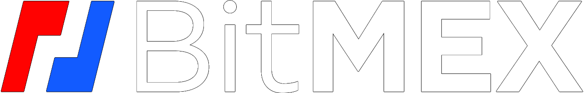
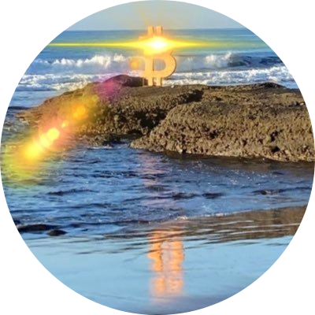

# Exonumia

**[🇦🇴 Angola](/ago/)**

[Oshiwambo](/ago/ng/)

---

**[🇨🇩 Democratic Republic of the Congo](/cod/)**

[Lingala](/cod/ln/)

---

**[🇨🇬 Republic of the Congo](/cog/)**

[Lingala](/cog/ln/)

---

**[🇪🇬 مصر](/egy/)**

[العربية](/egy/ar/)

---

**[🇪🇹 Ethopia](/eth/)**

[አማርኛ](/eth/am/)

---

**[🇰🇪 Kenya](/ken/)**

[Kiswahili](/ken/sw/)

---

**[🇲🇼 Malawi](/mwi/)**

[Chewa](/mwi/ny/)

---

**[🇳🇦 Namibia](/nam/)**

[Oshiwambo](/nam/ng/)   
[Khoekhoegowab](/nam/naq/)

---

**[🇳🇬 Nigeria](/nga/)**

[Hausa](/nga/ha/)   
[Igbo](/nga/ig/)   
[Yoruba](/nga/yo/)   

---

**[🇸🇴 Somalia](/som/)**

[Somali](/som/so/)   

---

**[🇿🇦 South Africa](/zaf/)**

[Afrikaans](/zaf/af/)  
[IsiNdebele](/zaf/nr/)  
[Sepedi](/zaf/nso/)  
[IsiTsonga](/zaf/ts/)  
[Sesotho](/zaf/st/)  
[TshiVenda](/zaf/ve/)  
[IsiXhosa](/zaf/xh/)  
[IsiZulu](/zaf/zu/)  

---

**[🇿🇼 Zimbabwe](/zwe/)**

[Shona](/zwe/sn/)  

---

[English](/int/en/)

---

### The [exonumia.africa](https://exonumia.africa/) project is partially supported by:

<figure>
  <figcaption><a href="https://bitcoinmagazine.com/business/hrf-gifts-4-bitcoin-to-bitcoin-projects">HRF</a></figcaption>
</figure>

<figure>
  <figcaption><a href="https://blog.bitmex.com/bitmex-grant-translation-of-bitcoin-content-into-african-languages/">BitMEX</a></figcaption>
</figure>

<figure>
  <figcaption><a href="https://twitter.com/GaloyMoney/status/1477375671991259139">Galoy</a></figcaption>
</figure>

<figure>
  <figcaption><a href="https://bitcoinist.com/bitcoin-for-communities-3-3-adoption-building/">Bitcoin Beach</a></figcaption>
</figure>

