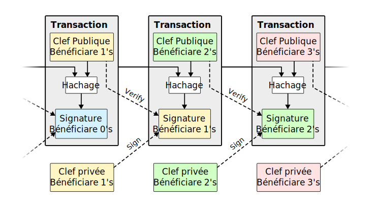

# Bitkoin: Sisteme Ya Kofutana Misolo Na Kati Baninga 

by Satoshi Nakamoto [2008/10/31](/bitcoin.pdf)

<LanguageDropdown/>

## Rezume

Kanisa lolenge ya misolo elektroniki oyo eko leka na entelneti mbala moko na kati ya banginga epai wapi bosenga ya baye babombaka misolo to pe bankeee eyali te. Ba nkoma dizitale eyali na ndambo ya solisio, kasi litomba ya monene ebungisami tango toluki moto ya misato atako ayali moto ya limemia pe ya bokonde pona kolongola libaku yako futa mbala mibale.
Tomemeli bino solisio na likamb’oyo lisanga ya opesi nagi napesi yo. Liboke ya makomi nyoso ya mimbongo nyoso tosangisi esika moko na lokola na sheni pona kolakisa mosala oyo esalami, ekomi peleve makasi, pona kobongola yango esengeli obandela mosala nyoso. Sheni ya molai koleka elaki penza ndenge misala esalemaki, pe lisusu ete ewutaki na liziba monene ya CPU ya lotiliki ya odinatele.  Soki eteni ya monene ya CPU esimbami ba mazita oyo endimi kanyaka te po na kobongola makomi pe ba sango oyo ekotaki na nzela ya inteleneti, bako sala pe kobimisa sheni ya molai oyo eko leka mbango ya banguna mosika penza. Rezo yango moko esengaka mosala ebele ebele te.  
Basango nayango epanzanaka na bompikiliki na yango, pe ba mazita bakoki kobima na rezo pe kozonga ndenge balingi, na bozongi bwa bango, bandimaka pe bazwaka ba sheni ya sango n’a makomi oyo eleki molai lokola yango nde penza basango ya solo solo na tina na nyoso oyo esamaki tango babimaki na rezo.

## Ebandeli

Na ebandeli ya mimbongo ya inteneti bateki n’a basombi nyoso batalelaka kaka ba banke neti moto ya katikati pona kofuta na nzela mashini. Sisteme oyo eza n’ango mabe te, kasi makasi n’ango efandi nde na modele n’a esaleli wana ya kala oyo tango mosusu esimbaka te. Na modele wana ba troki oyo ekoki kozonga sima to kobwangana te ezalaka te, po ba banke mosala na yango eza kokataka makambo oyo etali kolekaleka ya misolo na kati ya bato. 
Kofutaka pona lisungi ya kokataka makambo yango nde ematisaka talo ya mosala ba banke basasaka, soki ozongisi motango ya ba troki oyo esalami pe olongoli mwa ba troki ya mike mike, wana kofuta pona makambo wana ebele ebele tango ndenge ya kosala ba troki oyo babongolaka te pona mosala to lisungi oyo ebongwanaka te. Soki ndenge ya kobandela to ko zongisa ezali, wana tina kondima ekomi lisus makasi.
Esengeli ete bateki bakeba na basombi, kotuna bango mwa mituna ebele koleka oyo bakolinga kopesa bango moko. Mwa kanyaka ata ya moke kaka eko salema na yango kaka ndenge pe yako boya yango eza te. Okoki kolongala bambongo ebele ebele yako kfuta soki ofuta na mbongo na maboko (yako kawuka), soki te nzela mosusu yako futa eza te esengeli kaka oleka na ba banke po esalema.

Oyo penza mokili ezo zanga ezali ndenge yako futaka to kolekisaka misoslo na kondima kaka te, kasi na sisteme ya peleve ya kiliptogalafi, wana nde bato mibale oyo bandimi, bakoki kosala troki bango mibale kaka, tina ya banke to moto mosusu ezali te. Ba troki na nzela ya mashini ya odinatele oyo ebongwanaka te eko bomba moteki pe kobatela ye na bato ya kanyaka pe maboko milayi, ndenge yako batela mosombi na oyo babengi mekanizme ya entiercement ekoki pe kotiama. 
Na mokanda oyo, totalisi bino solusio na likambo yako futaka mbala na mbala na nzela ya lisanga ya baninga opesi nga napesi yo n’a makomi ya tango oyo ebombami malalu pona kolakisa peleve ‘te ba troki nyoso esalemaki na molongo ya esika pe moko na moko na tango na yango. Sisteme oyo eko batelama tango nyoso soki ba oyo babengi mazita ya malamu eko kengela ba CPU ya odinatele na bomoko koleka ba mazita ya bato ya maboko malayi pe kanyaka.

## Mombongo (Troki)

Oyo tobengi mabanga to mabende (jeton) ezali singa to sheni ya ba nkoma (signatire) digitale. Moteki moko akoki kotindala mosusu ebende tango ati nkoma digitale na ye na hash ya troki oyo esalemaki liboso na fungola ya wenze ya mosombi, akozwa ba numelo wana abakisi yango na suka na libanga. 



Likambo eza awa moto ba futi akoki verifier soki moko ya bateki afuti libanga naye mbala mibale. Solisio pona bato nyoso ezali ko kotisa mokambi moko na katikati, oyo ako kengela pona ko kebisa ko futa mbala na mbala.
Na sima ta troki nyoso, libanga ezongi na liziba po libanga mosusu ebima, pe lisusu, tokoki kindemela kaka mabanga oyo ebimi na liziba ‘te ekoki ko salelama mbala mibale te. Likambo ezali awa eza boye, avenir ya sisteme ya misolo oyo nyoso ekomi na maboko ya société oyo ezo kengela, ba troki nyoso elaka epana bango, kaka lokola banke. Esengeli mofutami avala na ndenge yako ‘te mokolo linganga atekaki liboso te. 

Pona biso pe makambo tozali kosalala, troki oya liboso, yango nde troki ya motuya penza, toza na tina te pona ba troki ya sima to pe soki moto alukaki ko salela libende to koin na ye mbala mibale. Pona koyeba ‘te troki esalamaki, esengeli koyeba ba troki nyoso oyo asalemaki.
Na modele ya kofuta oyo, oko yeba ba troki nyoso pe oyo wapi esalemaki liboso. Po na kosala yango, pe kolongola banke to moto ya kati kati, esengeli kosala ete ba troki nyoso ezala polele polele na miso ya bato nyoso, pe esengeli tozala na sisteme moko epai wapi bato nyoso bako ndima buku ya makomi moko wapi mimbongo nyoso esalamaki pe na molongo na yango. Moto oyo azo zwa esngeli alakisa ‘te na tango troki moko na moko esalamaki, maboke to mazita nyoso endimi ‘te ba resi emonisi été  wana nde troki ya liboso.

## Servere ya horodatage

Solusio oyo tomemi ebandi na severe ya horodatage (makomi ya mokolo pe tango likambo esalemaki).
Servere ya horodatage esalaka boye ezwi bilembo ya etuluku ya makomi ya makambo nyoso oyo elekaki
na zando pe epanzi yango bipai na bipai, lokola na lokasa ya sango to inteleneti. Horodate elongolaka
tembe ete ba sango ezalaki na tango kaka likambo ekomamaki, boye nde pona kozwa makomi numerike
na yango. Horodate nyoso ezalaka n’a horodate 2 Hachage Signature Bénéficiaire 0 Clef privée
Bénéficiaire 1 Transaction Clef Publique Bénéficiaire 1 Signe Vérifie Hachage Signature Bénéficiaire 1
Clef privée Bénéficiaire 2 Transaction Clef Publique Bénéficiaire 2 Vérifie Hachage Signature Bénéficiaire
2 Clef privée Bénéficiaire 3 Transaction Clef Publique Bénéficiaire 3 Signe ya liboso na makomi na yango,
oyo esalaka sheni, n’a horodate pona ko lendisa ba oyo ya liboso. (Ndenge omoni na bilili oyo ezali
likolo).


## Peleve ya Mosala

Po servere ya horotage esala mosala ya ko kabola na kati ya bato oyo tobengi pair-a-pair, esengeli tozala
na peleve ya mosala lokola ya Adam Back « Hashcash », n’esika ya loakasa ba sango oyo epesami pe
epanzami na nzela ya enteleneti. Pona kozwa peleve ya mosala, esengeli koluka litomba pe ko timola
yango po soki emonani, lokola SHA 256, wana nde ba nkoma numelike kobanda na motango songo ya ba
bit tii na libungutulu. Mosala ya mwa kati kati emataka kolandisama na ba bit ya libungutulu oyo
esengeli pe ekoki komonana na ndenge ya kotimola ya yango penza. 

Pona rezo na biso ya horotage, topesi nzela na peleve ya mosala na kobakisa bakisa motuya to pe valere ya bokokisi na esika na yango
tii tozwa valere ya nkoma n’a motago ya mabungutulu oyo esengeli. Soki bokasi ya CPU ekoki na
bosenga peleve ya mosala, bloki oyo ekoki kokotisa lisusu te tii mosala ekobandelama. Po ba bloki oyo
ekangama pe elendanaka lokola na sheni, mosala ya kobongola bloki ekosenga ete tobandela ba bloki
nyoso ya liboso.


Peleve ya mosala ekataka pe likambo ya mokano etuluku. Soki etuluku efandaki na addresse-IP n’a vote moko, moto nyoso n’a makoki ya tia ba IP ebele akoki ko bungisa to kokotisa kanyaka na kati na yango.
Peleve ya mosala eza penza CPU-moko-vote. Mokano ya etuluku to ya majorite etalisamaka na sheni oyo eleki molai, oyo ezwui pe peleve ya mosala yo epikami penza. Soki etuluku to pe ebele ya nguya ya CPU esimbami na mazita oya bosembo, sheni oyo ya bosembo eko kola mbango penza pe ekoleka ba
sheni nyoso oyo ezo telemela yango. Pona kobongola bloki ya kala, esengeli monguna abandela peleve
ya mosala ya bloki n’a ba bloki nyoso na sima na yango, na sima kolanda, kokanga pe koleka misala
nyoso esalema na mazita ya bosemba. Toko lakisa na sima ndenge tokoki kolanda pe kokomisa mosala
ya banguna pete tango tobakisi ba bloki ya kolandisama.

Pona kozongisa pe kokolisa biloko ya mosala kobongisa na lombangu penza bosenga ya tango pona
kosalela mazita, kokoso ya peleve ya mosala emonanaka mwa mosala oyo ekoleka leka pona kokokisa
motango ya ba bloki oyo ezwami na mbala. Soki ebimi na lombango, mikakatano pe emati lisusu koleka.

## Rezo (Netiwek)

Bitapi ya kolanda pona rezo esala ezali boye:

1. Mimbongo (kotaka pe kosomba) nyoso ya sika eleki pe epanzani na mazita nyoso.
2. Lizita moko na moko esangisi mimbongo nyoso na liboke moko.
3. Mazita moko na moko elukaka peleve ya mosala oya makasi pona bloki to liboke.
4. Tango lizita moko ezwi peleve ya mosala, eko kabola yango na mazita nyoso.
5. Mazita endimaka liboke kaka soki nyoso ezali malamu pe endimami ete esalelami nanu te.
6. Mazita elakisaka kondima ‘te eleki bloki tango ebakisaka liboke ya sika na kati ya sheni, tango esaleli
empreinte numérique ya bloki oyo endimami na empreinte oya liboso.

Ba nœud etalaka ba sheni oya
molayi lokola sheni oyo ya tina penza pe esalaka nyoso pona kokolisa yango. Soki mazita mibale epanzi
basango ya bloki ya sika na mbala moko, mazita nyoso misusu ekoki koyamba moko to mosusu. Na
ndenge wana, ekosalela oyo ekozwa liboso, kasi mingi mingi ekoki kosalela oyo mosusu tango yango
ekokoma molayi koleka. Singa eko katana tango pele ya mosala mosusu ebimi pe ekomi molayi koleka ;
mazita nyoso oyo esalaki mosala na bitapi misusu ekotaka na oyo eleki molayi. 

Kopanza ba sango ya mimbongo nyoso ya sika eza natina ya yako koma na mazita nyoso te. Soki ekomi na mwa ndambo ya
mazita, eko bakisama na na bloki moko mwa noki noki. Basango wana epesaka ndingisa na ndambo
mwa ndambo ya sango oyo ebungaka na nzela. Soki lizita moko eyambi bloki te, eko senga yango tango
ekozua bloki ya sima tango ekomona ‘te ezo zanga bloki moko.

## Matabisi

Mingi mingi, troki ya liboso na kati ya bloki ezala na tina mingi po esimba na moto oyo asalaki bloki
wana. Yango nde etindaka mazita esimba rezo, na kopesaka nzela yako panza ba sango nyoso po eloko
mosusu eza na bokonzi ya kobimisa pe kopanza misolo te.

Kobakisa motango songolo tango na tango ekokani na lolenge ba timoli wolo basalelaka bozwi mya
bango po ‘te wolo ebele pe ya kokoka ezala na bisika ya basombi pe bateki oyo tobengi zando to
comptoir. Pona biso, eza nde tango ya CPU na lotiliki oyo tosaleli. Matabisi ya litomba ekoki pe
kobakisama na talo ya troki. 

Soki motango oyo ebimi eleki oyo ekotaki, motango oyo ekotikala ezali talo
ya troki oyo ekobakisama lokola matabisi na bloki bipai wapi troki wana esalamaki. Tango motango
songolo ya bitkoin ekoti na zando, matabisi ekoki ko bongwana na talo ya troki kasi ekoki kotepatepa
soki moke te. Matabis ekoki pe ko sunga ba nœuds etikala na bosembo. Soki moto ya lokoso azali ta
makoki ya kosangisa nguya na CPU koleka mazita (nœud) ya bosembo, akopona soki akokosa bato nako
zwaka lifuta mya bango, to pe kobimisa mabanga ya sika. Esengeli amona kosala mosala na bosembo pe
alima ezali na litomba koleka, soki akofuluka na mabanga koleka mokili mobimba, na esika abebisa
sisteme na mosala pe bomengo na ye moko.

## Bosenga Ya Etando Ya Diske

Tango troki ya libanga ya suka ebombami na se ya ba bloki ebele, ba troki nyoso oyo esalamaki liboso
ekoki kobwakama pona kofungola etando ya diske. Po ‘te esalema pe emprente numerike ya bloki
ekatana te, ba troki eko bombama na oyo babengi na lopoto arbre de Merkel[7][2][5], n’a mosisa oyo
epikami na empreinte numerike ya bloki. Etuluku ya ba bloki ekofinama na kokataka batape ya nzete na
yango. Tina yako bomba ba empreinte oya kati ya nzete ezali te.


Ebandeli ya troki esengeli ezala pene pene ya 80 octets. Soki tomoni ‘te ba bloke ekoki kobima na sima
minuti zomi, 80 octets * 6 * 24 * 365 = 4,2 MOctets na mobu moko. Naba odinatele oyo etekamaka
mingimingi pe ezalaka 2 GOctets de RAM en 2008, pe mobeko ya Moore eloba ete kofuluka esengeli
ezala ya 1, 2 GOctets na mobu moko, kobomba ekozala kwokoso te atako tobombi ebandeli yaba bloke
nyoso.

## Kolandela Ndenge Yako Kofuta Ya Pete

Eza na ndenge yako landela ndenge kofutama esalemaki atako osaleli mazita nyoso ya rezo te. Oza kaka
na posa ya lokasa ya ba entete ya bloki oyo eleki molayi na sheni ya pelve ya mosala, soki otuni mazita
ya rezo oko mona nini eleki molayi pe mbala moko ozwi etape ya Merkel oyo ezo sangisa mimbongo
nyoso na horodatage. Ekoki ko tala mombongo pona yango moko te, kasi soki osangisi ya nakati ya
sheni, oko mona ‘te rezo ndima yango, na sima ya kolandela yango malamu malamu.


Na yango, kolendela nyoso ekozala sembo ka soki mazita ya bosemba nde ezali ko kengela rezo, kasi
mwa mbilinga mbilinga eko kota soki reso ebebisami na nguya ya bato ya maboko milai. Soki mazita
ekoki ko landela mombongo yango moko, ndenge yako landela pe ko kengela ya pete eko koma pe pete
po ‘te lokuta pe kanyaka ya bato ya maboko milai ekota soki nguya na bango eleki makasi. Mayele pona
komi batela ezali kondima sisteme ya ngonga to pe kelelo kouta epai na mazita ya rezo soki emoni bloki
ya mopaya, soki eko luka kokotisa mimbongo ya lokuta uta na mashini ya mosaleli na yango pona
kondimisa lokuta na yango. Ba kompanyi oyo basalaka mimbongo ya mituya minene minene, pene pene,
pe mingi mingi balukaka kobakisa mazita ebele ebele pona ko lendisa bokengeli mya bango na bonsomi
nyoso.

## Kosangisa Pe Kokabola Motuya(valeur)

Atako okoki kokotisa mwa mbilinga mbilinga na ba piece moko na moko, eza malamu te koteka sengi na
sengi nakati ya transaction moko. Pona kopesa ndingisa na ba valeurs nyoso yako sangisa to ya ko
kabola, ba transaction ezalaka zela yako kokota na ya kobima ebele ebele. Esengeli kozala na ekotiseli
moko kaka epai wapi transaction ya suka pe ya monene koleka to pe liboke ya motuya ya monene oya
ba transaction ya mike mike ebimeli to bibimeli mobale kaka : moko pona kofuta, mosusu pona mashini
ya echange, pona mofuti.


Toyeba ‘te kokabola pe ko panzapanza, to pe transaction moko etalelaka ba transacation misusu, pe
banog nyoso batalelaka makambo misusu, eza moto ya likambo na biso awa te. Bosenga ya mokanda
mobimba epai wapi ba tranction nyoso ekomama ezalaka te pe eza na tina te.

## Sekele (Vie privée)

Ba banke ya kala bazalaka na ndenge na bango yako batela to kobomba ba ssekele ya bato kaka pona
bango moko n’a mwa bato oyo ya motema na ndenge na bango. Bosenga yako panza basango yaba
transaction nyoso polele polele pona bato nyoso elongo tina ya sekele elongoli modele wana, kasi sekele
ya bsango ya moto ekoki kobombama nako kataka ba nzela kili kili yako panza sango : na ko bombaka ba
fungola nyoso ezanga kombo. Moto nyoso akoki komona nani azo tinda motsango pe motuya songo na
nani mosusu, kasi moto moko akoki komona masolo ya sekele oyoa kati te. Eza lokola ndenge esalemaka
na bourse (Zando ya misolo), epai wapi tango n’a talo, mimbongo nyoso na carnet d’ordres, eza polele
polele kasi epanzaka ba sekele te.


Lokola pare-feu (lolenge yako batela rezo) mosusu, na transction nyoso okoki pe kosalela ba fungola ya
sika po ‘te ekangama to eyabana te soki nani nde aza kolo na yango. Atako, ekoyebana kaka soki ezo
salelama mingi mingi, wana eko yebana ‘te ewuti na esika moko. Eza likama soki mokolo ya fungola
ayebani, na kolandela singa ya ba transaction nyoso asala eko yebana.

## Kalkil

Toloba ‘te monguna azo meka ko fungola sheni mosusu na lombango penza koleka sheni ya solo. Atako
soki ekokisami, eko fungola nzela te pona kobongola makambo nyoso na nko, eza lokola kosala misolo
to mbongo ex nihilo (ko uta na eloko te, kaka na pwasa) to kozwa misolo oyo etikala kozala ya monguna
te. Mzita (ba nœuds) bakondima kofutama na transaction ya lokuta soki moke te, pe lisusu mazita ya
malamu (bosembo) ekondimaka te kokota na bloki ya boye. Monguna akoki kaka komeka kobongola
moko ya ba transaction naye pona kozwa misolo oyo ye moko abimisaki. 

Momekano katikati na sheni ya bosembo na oya lokuta ekoki kobima nzela oyo babengi binomiale aleatoire (na pwasa). Oyo epesaka
elonga ezale ‘te sheni ya bosemba etandamaka na loboke moko, emi tiaka liboso +1 pe likama soki
monguna akotisi ekoki pe kozongisa sheni sima na -1. 

Ndenge ‘te monguna alonga soki azalaki na sima
tango sheni ebandaki ekokani na ko beba ya mosali na yango. Toloba moto aza na etuluku ya kredit kasi
abandi na sima pe ameki meki mbala na mbala po atelema ngwi. Tokoki koloba ‘te mokolo moko
akotelema penza penza ngwi, to pe monguna akanga sheni ya bosembo, boye [8] :

<math xmlns="http://www.w3.org/1998/Math/MathML" display="block">
  <mtable columnalign="right center left" rowspacing="3pt" columnspacing="0 thickmathspace" displaystyle="true">
    <mtr>
      <mtd>
        <mstyle mathsize="1.2em">
          <mi>p</mi>
        </mstyle>
      </mtd>
      <mtd>
        <mi></mi>
        <mo>=</mo>
      </mtd>
      <mtd>
        <mtext>&#xA0;probabilité qu’un nœud honnête trouve le prochain bloc</mtext>
      </mtd>
    </mtr>
    <mtr>
      <mtd>
        <mstyle mathsize="1.2em">
          <mi>q</mi>
        </mstyle>
      </mtd>
      <mtd>
        <mi></mi>
        <mo>=</mo>
      </mtd>
      <mtd>
        <mtext>&#xA0;probabilité que l’attaquant trouve le prochain bloc.</mtext>
      </mtd>
    </mtr>
    <mtr>
      <mtd>
        <mstyle mathsize="1.2em">
          <msub>
            <mi>q</mi>
            <mi>z</mi>
          </msub>
        </mstyle>
      </mtd>
      <mtd>
        <mi></mi>
        <mo>=</mo>
      </mtd>
      <mtd>
        <mrow>
          <mtext>&#xA0;probabilité que l’attaquant rattrape un jour en partant avec&#xA0;</mtext>
          <mrow class="MJX-TeXAtom-ORD">
            <mi>z</mi>
          </mrow>
          <mtext>&#xA0;blocs de retard</mtext>
        </mrow>
      </mtd>
    </mtr>
  </mtable>
</math>

<math xmlns="http://www.w3.org/1998/Math/MathML" display="block">
  <mstyle mathsize="1.2em">
    <msub>
      <mi>q</mi>
      <mi>z</mi>
    </msub>
    <mo>=</mo>
    <mrow>
      <mo>{</mo>
      <mtable rowspacing="4pt" columnspacing="1em">
        <mtr>
          <mtd>
            <mn>1</mn>
          </mtd>
          <mtd>
            <mrow class="MJX-TeXAtom-ORD">
              <mtext class="MJX-tex-mathit" mathvariant="italic">if</mtext>
            </mrow>
            <mspace width="thickmathspace" />
            <mi>p</mi>
            <mo>&#x2264;<!-- ≤ --></mo>
            <mi>q</mi>
          </mtd>
        </mtr>
        <mtr>
          <mtd>
            <mo stretchy="false">(</mo>
            <mi>q</mi>
            <mrow class="MJX-TeXAtom-ORD">
              <mo>/</mo>
            </mrow>
            <mi>p</mi>
            <msup>
              <mo stretchy="false">)</mo>
              <mi>z</mi>
            </msup>
          </mtd>
          <mtd>
            <mrow class="MJX-TeXAtom-ORD">
              <mtext class="MJX-tex-mathit" mathvariant="italic">if</mtext>
            </mrow>
            <mspace width="thickmathspace" />
            <mi>p</mi>
            <mo>&gt;</mo>
            <mi>q</mi>
          </mtd>
        </mtr>
      </mtable>
      <mo>}</mo>
    </mrow>
  </mstyle>
</math>

Ndenge tolobi ‘te
<math xmlns="http://www.w3.org/1998/Math/MathML">
  <mi>p</mi>
  <mo>&#x003E;<!-- > --></mo>
  <mi>q</mi>
</math>
, ekoki pe kokweya soki obakisi motango ya ba bloki oyo monguna esengeli
alanda pe akanga. Soki aza na libaku malamu te to pe atamboli na yango te uta ebandeli, ekomi silela na
yango moko, tango ako zonga sima. Totala sikoyo tango boni ekosenga pona moto oyo batindeli azela
po ayeba penza penza ‘te moto oyo atindeli ye ako bongwana te. Toloba ‘te motindi aza moto ya lokuta
pe alingi awumela po moto atindeli andima ‘te afutaki penza, na sima, soki mwa tango eleki azongisa
transaction epana ye moko. Kelelo ekobeta epaya moto atindelaki tango ekokoma, kasi motindi ako
kanisa ‘te eko simba te.

Moto batindeli ako bimisa ba fungola mibale ya sika pe akopesa yango na polele na motindi yambo ‘te
atia nkoma naye. Esalemaka boye po motindi abongisa sheni ya ba bloki po akenda mosika penza liboso
koleka, po akokisa transaction. Soki transaction etindami, motindi ya lokuta ako banda kosalela sheni na
kobatama epai wapi ndambo ya basango ya transaction naye ya mabe ebombami.

Moto atindelaki akozela tii transaction wana ebakisama na bloki moko pe bloki z esangani na sima.
Lokola ayebi malamu malamu te ‘te monguna akomi mosika liboso, kasi na kondimaka ‘te ba bloki ya
malamu ezwi tango esengeli po na yango, kokende liboso ya monguna ekolanda nzela ya mobeka ya
mbisi na motuya na yango :

<math xmlns="http://www.w3.org/1998/Math/MathML" display="block">
  <mstyle mathsize="1.2em">
    <mi>&#x03BB;<!-- λ --></mi>
    <mo>=</mo>
    <mi>z</mi>
    <mfrac>
      <mi>q</mi>
      <mi>p</mi>
    </mfrac>
  </mstyle>
</math>

Pona koyeba soki monguna akoki kokanga, to matisi makisi ya mobeko ya mbisi po na motuya moko na
moko ya avancement oyo akoki kozala n’ango, na likanisi ete asi akomaki na esika yango :

<math xmlns="http://www.w3.org/1998/Math/MathML" display="block">
  <mstyle mathsize="1.2em">
    <munderover>
      <mo>&#x2211;<!-- ∑ --></mo>
      <mrow class="MJX-TeXAtom-ORD">
        <mi>k</mi>
        <mo>=</mo>
        <mn>0</mn>
      </mrow>
      <mrow class="MJX-TeXAtom-ORD">
        <mi mathvariant="normal">&#x221E;<!-- ∞ --></mi>
      </mrow>
    </munderover>
    <mfrac>
      <mrow>
        <msup>
          <mi>&#x03BB;<!-- λ --></mi>
          <mi>k</mi>
        </msup>
        <msup>
          <mi>e</mi>
          <mrow class="MJX-TeXAtom-ORD">
            <mo>&#x2212;<!-- − --></mo>
            <mi>&#x03BB;<!-- λ --></mi>
          </mrow>
        </msup>
      </mrow>
      <mrow>
        <mi>k</mi>
        <mo>!</mo>
      </mrow>
    </mfrac>
    <mo>&#x22C5;<!-- ⋅ --></mo>
    <mrow>
      <mo>{</mo>
      <mtable rowspacing="4pt" columnspacing="1em">
        <mtr>
          <mtd>
            <mo stretchy="false">(</mo>
            <mi>q</mi>
            <mrow class="MJX-TeXAtom-ORD">
              <mo>/</mo>
            </mrow>
            <mi>p</mi>
            <msup>
              <mo stretchy="false">)</mo>
              <mrow class="MJX-TeXAtom-ORD">
                <mo stretchy="false">(</mo>
                <mi>z</mi>
                <mo>&#x2212;<!-- − --></mo>
                <mi>k</mi>
                <mo stretchy="false">)</mo>
              </mrow>
            </msup>
          </mtd>
          <mtd>
            <mrow class="MJX-TeXAtom-ORD">
              <mtext class="MJX-tex-mathit" mathvariant="italic">if</mtext>
            </mrow>
            <mspace width="thickmathspace" />
            <mi>k</mi>
            <mo>&#x2264;<!-- ≤ --></mo>
            <mi>z</mi>
          </mtd>
        </mtr>
        <mtr>
          <mtd>
            <mn>1</mn>
          </mtd>
          <mtd>
            <mrow class="MJX-TeXAtom-ORD">
              <mtext class="MJX-tex-mathit" mathvariant="italic">if</mtext>
            </mrow>
            <mspace width="thickmathspace" />
            <mi>k</mi>
            <mo>&gt;</mo>
            <mi>z</mi>
          </mtd>
        </mtr>
      </mtable>
      <mo>}</mo>
    </mrow>
  </mstyle>
</math>

Nako bongisaka noki serie ya bokaboli nyoso ebeba...

<math xmlns="http://www.w3.org/1998/Math/MathML" display="block">
  <mstyle mathsize="1.2em">
    <mn>1</mn>
    <mo>&#x2212;<!-- − --></mo>
    <munderover>
      <mo>&#x2211;<!-- ∑ --></mo>
      <mrow class="MJX-TeXAtom-ORD">
        <mi>k</mi>
        <mo>=</mo>
        <mn>0</mn>
      </mrow>
      <mrow class="MJX-TeXAtom-ORD">
        <mi>z</mi>
      </mrow>
    </munderover>
    <mfrac>
      <mrow>
        <msup>
          <mi>&#x03BB;<!-- λ --></mi>
          <mi>k</mi>
        </msup>
        <msup>
          <mi>e</mi>
          <mrow class="MJX-TeXAtom-ORD">
            <mo>&#x2212;<!-- − --></mo>
            <mi>&#x03BB;<!-- λ --></mi>
          </mrow>
        </msup>
      </mrow>
      <mrow>
        <mi>k</mi>
        <mo>!</mo>
      </mrow>
    </mfrac>
    <mrow>
      <mo>(</mo>
      <mrow>
        <mn>1</mn>
        <mo>&#x2212;<!-- − --></mo>
        <mo stretchy="false">(</mo>
        <mi>q</mi>
        <mrow class="MJX-TeXAtom-ORD">
          <mo>/</mo>
        </mrow>
        <mi>p</mi>
        <msup>
          <mo stretchy="false">)</mo>
          <mrow class="MJX-TeXAtom-ORD">
            <mo stretchy="false">(</mo>
            <mi>z</mi>
            <mo>&#x2212;<!-- − --></mo>
            <mi>k</mi>
            <mo stretchy="false">)</mo>
          </mrow>
        </msup>
      </mrow>
      <mo>)</mo>
    </mrow>
  </mstyle>
</math>

Soki tobongoli na code C...

```c
#include 
double AttackerSuccessProbability(double q, int z)
{
	double p = 1.0 - q;
	double lambda = z * (q / p);
	double sum = 1.0;
	int i, k;
	for (k = 0; k <= z; k++)
	{
		double poisson = exp(-lambda);
		for (i = 1; i <= k; i++)
			poisson *= lambda / i;
		sum -= poisson * (1 - pow(q / p, z - k));
	}
	return sum;
}
```

Soki mwa ndambo ya litomba emonani, toko mona ‘te noyoso eko bongwana makasi n’a z.

```
q=0.1
z=0    P=1.0000000
z=1    P=0.2045873
z=2    P=0.0509779
z=3    P=0.0131722
z=4    P=0.0034552
z=5    P=0.0009137
z=6    P=0.0002428
z=7    P=0.0000647
z=8    P=0.0000173
z=9    P=0.0000046
z=10   P=0.0000012

q=0.3
z=0    P=1.0000000
z=5    P=0.1773523
z=10   P=0.0416605
z=15   P=0.0101008
z=20   P=0.0024804
z=25   P=0.0006132
z=30   P=0.0001522
z=35   P=0.0000379
z=40   P=0.0000095
z=45   P=0.0000024
z=50   P=0.0000006
```

Soki tobongisi pona P na se na 0,1%...

```
P < 0.001
q=0.10   z=5
q=0.15   z=8
q=0.20   z=11
q=0.25   z=15
q=0.30   z=24
q=0.35   z=41
q=0.40   z=89
q=0.45   z=340
```

## Pona Kosukisa

Totalisi sistemi ya mombongo to pe transactions elektroniki (to pe na nzela ya lotiliki) oyo ekipaka
kotiela motema to pe confiance te. Tobandisi yango na esaleli ya se ndenge moko na lokas aya mbongo
oyo etiami na makomi to signature elektroniki, oyo ebombaka pe ebatelaka misala nyoso makasi, kasi
ekoki kopekisaka kofuta mbala mibale te. Po na kokata likambo oyo, totalisi ‘te rezo pair-a-pair (na kati
kati ya baninga) oyo ekosalela peleve ya mosala pona kokoma pe kobomba ba sango nyoso ya
mimbongo to pe ba transaction, na lombango penza eko koma matat pona monguna abongola makomi
soki mazita (nœud) ya bosembo e’ko tambwisa etuluku ya nguya ya ba CPU. Rezo atako etiami na alima
te, ezali monene pe makasi na bompondo nyoso. Mazita nyos ekosala mosala na bomoko atako
motamwisi azali te. Tina pe ‘te bayebana ezali te, po masolo nakati na bango nyoso etindamaka na esika
songolo te pe po esengeli kaka ete epesa sango na tango na yango. Mazita ekoki kobima pe kozonga na
rezo ndenge elingi, pe ekondima lokola sheni ya mosala oyo esalemaki tango bango bazalaki te.
Maponami mya bango esalemaka na nguya ya CPU na bango, pona kondima ba bloki ya solo pe kosala
nyoso pona kokutana na yang ope koboya ba bloki ya mabe pe ya lokuta. Mibeko nyoso pe lifuta
esengeli pona mosala etiamaka pe etelima na esaleli oyo na lisanaga pe boyokani.

## References

1. W. Dai, ["b-money,"](https://nakamotoinstitute.org/b-money/) [http://www.weidai.com/bmoney.txt](http://www.weidai.com/bmoney.txt), 1998.
2. H. Massias, X.S. Avila, and J.-J. Quisquater, ["Design of a secure timestamping service with minimal trust requirements,"](https://nakamotoinstitute.org/secure-timestamping-service.pdf) In 20th Symposium on Information Theory in the Benelux, May 1999.
3. S. Haber, W.S. Stornetta, ["How to time-stamp a digital document,"](https://nakamotoinstitute.org/time-stamp-digital-document.pdf) In Journal of Cryptology, vol 3, no 2, pages 99-111, 1991.
4. D. Bayer, S. Haber, W.S. Stornetta, ["Improving the efficiency and reliability of digital time-stamping,"](https://nakamotoinstitute.org/improving-time-stamping.pdf) In Sequences II: Methods in Communication, Security and Computer Science, pages 329-334, 1993.
5. S. Haber, W.S. Stornetta, ["Secure names for bit-strings,"](https://nakamotoinstitute.org/secure-names-bit-strings.pdf) In Proceedings of the 4th ACM Conference on Computer and Communications Security, pages 28-35, April 1997.
6. A. Back, ["Hashcash - a denial of service counter-measure,"](https://nakamotoinstitute.org/hashcash.pdf) ][http://www.hashcash.org/papers/hashcash.pdf](http://www.hashcash.org/papers/hashcash.pdf), 2002.
7. R.C. Merkle, ["Protocols for public key cryptosystems,"](https://nakamotoinstitute.org/public-key-cryptosystems.pdf) In Proc. 1980 Symposium on Security and Privacy, IEEE Computer Society, pages 122-133, April 1980.
8. W. Feller, ["An introduction to probability theory and its applications,"](https://nakamotoinstitute.org/introduction-probability-theory-vol-i.pdf) 1957.