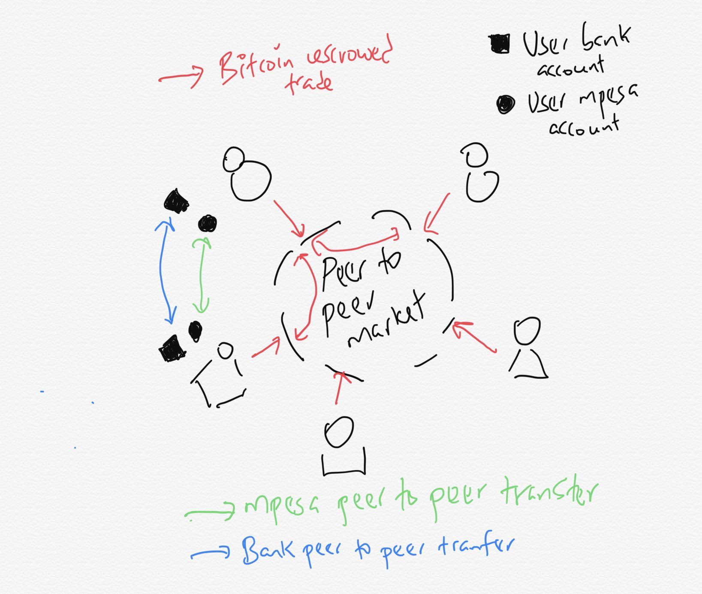

# Lisolo ya Bitcoin n’a Bulamatari ya Kenya

by Michael Kimani Kioneki [2022/01/05](https://twitter.com/pesa_africa/status/1357938874845175809)

<LanguageDropdown/>

Oyo ezali sango kouta epaya Bank Centrele ya mboka Nigeria 🇳🇬 pona kopekisa ba kompany miye misalaka misala ya misolo kolekisa misolo miye miwuti ba bourse ya kriptografia

Ya mokolo ya 5 Fevrier 2021

Ndenge moko pe, oyo mokanda ya [Banke Centrale ya Kenya 🇰🇪 kopekisa ba banke kolekisa misolo miye miwuti na ba kompani baye basalelaka misolo virtuelle](https://www.centralbank.go.ke/uploads/banking_circulars/2075994161_Banking%20Circular%20No%2014%20of%202015%20-%20Virtual%20Currencies%20-%20Bitcoin.pdf)

Lokola mwan’a mboka Kenya na mopanzi ya Afrika, nakoki kaka koseka baninga ya kripto ya mboka Nigeria. Sikoyo, ba’ako mona pasi oyo biso tomoni uta mibu 7! Yako loba eza ebele na likambo oyo botala nini ngai nazo kanisa 

### 9 Juillet 2013

“Kipochi libenga ya mboka Kenya ezalaki kompani ya yambo yakosunga bana ya Afrika kotimda pe kozwa bitcoin, pe ko bongola bitcoin na misolo ya Kenya na M-Pesa”

[Kipochi afungoli M-Pesa n’a libenga ya bitcoin awa na Afrika](https://www.coindesk.com/markets/2013/07/09/kipochi-launches-m-pesa-integrated-bitcoin-wallet-in-africa/)

Kala mingi te Banke centrale ya Kenya n’a Safaricom Mpesa balandi bango

“Na poso moko kaka konnexion na biso na M-Pesa na nzela ya esaleli ya Kopo Kopo ekatani: poso mobimba elekaki po toyeba ‘te Safaricom nde apesaki mitindo na Kopo Kopo akata biso”

### Aout 2013

“Na Aout  2013, Kipochi azwi mokanda kowuta epaya Banke Centrale ya Kenya koloba ‘te balingi bayeba soki tozali banana, tolingi nini pe soki Bitcoin nde nini.”

[Nini ekomelaki Kipochi?](https://blog.stakeventures.com/articles/what-actually-happened-at-kipochi)

Oyo nde etumba ya liboso na kati ya kompani ya Bitcoin n’a bakambi ya nkita (Banke Centrale ya Kenya) n’a batambwisi misala ya misolo miye miyebana pe endimama (Mpesa ya Safaricom). Mobu moko na sima, mgai pe nabandi misala oyo pe elongo n’a Kipochi ya Pelle n’a basusu lokola Bitpesa tokobi na mosala.

Na lisanga tosalaki nyoso po ‘te ba banke n’a bakambi ya nkita balembisa mibeko miye mipekisi biso kosalela ba compte ya banke. Tozalaki na posa ya moto to lisanga songolo pona kotambwisa likambo oyo. Basengaki mgai nafungola fondation. Email oyo ya mokolo 14 Mai 2014

Kompani ya mibale oyo ezwaki fimbu ezali Bitpesa. Bitpesa efungolaki esali ya kripto pona bai Kenya basombaka Bitcoin na nzela ya Mpesa (na sima bakotisaki pe esaleli ya koteka). Esaleli wana ekomaki kosunga bana mboka pona kotinda pe kozwa misolo (Na kati ya Kenya – UK).

Ya wana ewumelaki te   

### 18 Decembre 2015

[Circulaire ya CBK](https://www.centralbank.go.ke/uploads/banking_circulars/2075994161_Banking%20Circular%20No%2014%20of%202015%20-%20Virtual%20Currencies%20-%20Bitcoin.pdf)

“Tina ya circulaire oyo ezali pona kokebisa basali banso ya misolo pona kosalela misolo virtuelle to pe kosala misala n’a baye basalelaka misolo virtuell. Kofungola compte pona basaleli ya Bitcoin te.”

Na sima ya mwa mikolo, mokonzi ya Safaricom Mpesa Bob Collymore atelemeli misolo virtuelle na maloba miye

“Toko ndima kosalela to kopesa nzela na mimbongo ya Bitcoin na system ya M-Pesa te tii ekondimama na bakambi pe batabwisi ya misala ya ba banke.”

[Collymore alobi Safaricom eko bunda n’a CBK pona mimbongo ya  bitcoin te](https://www.businessdailyafrica.com/bd/corporate/companies/collymore-says-safaricom-will-not-risk-cbk-s-wrath-over-bitcoin-transactions-2103900)

Ezalaki kaka lokola nyoso ebongisamaki penza

Bozangi ya kompte ya banke n’a makoki ya kosalela M-Pesa ebomi misala ya Bitpesa. Bitpesa n’a Lipisha (mosungi ya kofuta) bamemi likamb’oyo na ba zuzi ya leta.

[Mbela NO. 512 of 215](http://kenyalaw.org/caselaw/cases/view/117270/)

### 28 Decembre 2015

Na komi makanisi pona mokanda ya bapanzi sango to pe journal ya monene koleka na Kenya Daily Nation, nasosoli CBK pona bolema na bango pe bozangi kotala mosika. Nalobi “Mibu 4 miye mizali koya bato bakoseka pe kotiola CBK pona mokano moye”

Na tango wana Bitcoin 1 ezalaki $450, lelo ekomi $40,000

### 26 Novembre 2015

Na mokolo ya mibale, procès ya Bitpesa kompani ya basaleli ya Bitcoin n’a baninga naye na ngambo mosusu, kompani monene Safaricom eyokani na Cour Suprême ya Kenya.

[Cour Suprme ya Kenya eyoki proces ya BitPesa n’a Safaricom](https://www.coindesk.com/markets/2015/11/26/kenyan-high-court-hears-bitpesa-case-against-safaricom/)

Bitpesa argued Safaricom “intimidated” its gateway partner, Lipisha, forcing it to suspend its services on November 12th without prior notice causing BitPesa and Lipisha significant challenges maintaining their business.

Safaricom argued that the suspension of service to Lipisha was justified because Bitpesa had failed to obtain authorisation for bitcoin transfers from Kenya’s central bank. As a result, Bitpesa’s transactions through Lipisha and its account at Safaricom contravened AML rules.

But a lawyer for the two firms said Safaricom had misunderstood the central bank’s requirements.
“[The central bank] told BitPesa that bitcoins are not regulated in Kenya but Safaricom insists that it produces a licence to that effect,”

### December 15, 2015

Bitpesa lost the case

A Kenyan High Court judge has ruled that M-Pesa operator Safaricom will not be required to grant access to bitcoin startup BitPesa amid an ongoing legal dispute.

[Cour Suprme ya Kenya eyoki proces ya BitPesa n’a Safaricom](https://www.coindesk.com/markets/2015/12/15/kenyan-court-upholds-bid-to-keep-bitcoin-startup-off-m-pesa/)

Na bozangi ya compte na banke to makoki yako salela M-Pesa, nyoso oyo esengeli pona misala na yango, Bitpesa alongolaki misala na yango moke moke na mboka Kenya.

Bitpesa ezalaki esaleli ya tina makasi pona basaleli ya Bitcoin (koteka pe kosomba), kolongwa na bango, ebongolaki lolenge yako zwa Bitcoin.

Ekomaki libaku malamu pona ba wenze ya Bitcoin pair-à-pair lokola misala na bango ezalaka na posa ya compte ya banke to M-Pesa te.

Local bitcoins ezalaki lisanga yay ambo yako yanola na bodenga wana. Tala kokola na yango na tableau oyo kobanda tango Bitpesa ekangamaki. E’ko koma na etuluku ya 150 million na poso moko.

Omoni, bakambi to ba regulateur baza na bolema pe bazangi bososoli. Soki okangi banzela ya polele po na bato kosomba pe koteka Bitcoin, nzela ya pair-à-pair ekomata po lolenge ya Bitcoin pe ba misolo ya kriptografia ezali pair-à-pair. Mimbongo ya pair-à-pair esalemaka na sekele mosika ya mibeko pe na nkuku. 

Tala tableau ya etuluku ya mimbongo na nzela ya pair-à-pair na wenze mosusu oyo babengi Paxful. Poso na poso, 178 million na poso kobanda poso elekaki.

Na esaleli lokola Bitpesa, ba regulateur to bulamatari akoki kotia mibeko na ndenge yako sala pe kotambwisa mimbongo pe kotunaka mituna pe kozwaka biyano pona koyeba ndenge misolo mikoki kokota pe konimba na Bitcoin pe misolo ya kriptografia.

Na ba wenze pair-à-pair, ndenge yako yeba pe komona mimbongo pe misolo elongwe epai ya moto moko pe ekomi na moto mosusu, na banke, na M-Pesa ezali te pe Bulamatari akoki koyeba tina misolo mizali koleka te. Nzokande ezalaki troki ya Bitcoin.

Na Local Bitcoins 150 million KES na poso moko, apei ya Paxful 178 million KES na poso moko, na Binance P2P (toyebi te), kripto ya bana mboka (toyebi te), mimbongo ya libanda ya mboka (toyebi te), na 2018 Citibank atalisaki ‘te bai Kenya babonmbi 163 milliards na Bitcoin, “mimbongo ya Bitcoin na Paxful ekomaki 6 milliards na 2020”

Omoni, ndenge yako yeba motango ya misolo miye mileki na Bitcoin n’a misolo ya kriptografia misusu na nzela oyo ezali te. Oyo nde kpokoso penza pona Bulamatari. Bakanisi bazali mayele nako kangaka banzela oyo ezali polele, kasi nde bafungoli nzela pona mimbongo ya minene kokoba na sekele pe naba nzela ya se ya mesa.

Soki napesi makanisi na ngai na bokebi penza

500 million na poso moko na Kenya, soki omatisi motango oyo na ba poso 52, wana tokomi pene pene ya 25 milliards na mobu moko.

Wana na bokebi nyoso.

Mimbongo pair-à-pair ya Bitcoin n’a misolo ya kriptografia ezali ndenge etambolaka ata soki ba banke centrale balingi te. Bokasi na yango emonani penza pona kosunga bilenge bakoka kozwa mwa limenya.

[Tala masolo oyo](https://twitter.com/pesa_africa/status/1351786081474252800)

Mimbongo pair-à-pair ya Bitcoin n’a misolo ya kriptografia misusu ebakisi kpokoso ya kimia ya cyber-sécurité na misala ya misolo na Kenya po misolo miye milekaka na Bitcoin mikoki kozonga sim ate.

### 30 Juin 2020

[Proces ya Bitcoin na Palais ya Justice Milimani ya Kenya Etiki Elembo](https://kenyanwallstreet.com/bitcoin-case-kenyas-milimani-law-courts-sets-precedence/)

Ezo sekisa ngai ‘te bakambi ya Kenya, Bulamatari and bai mayele ya “Fintech” bakanisi ‘te misolo ya kroptografia ekoki konyatama na se ya etoko kaka boye, wana nde penza kozanga koyeba na bango ebimi polele. Namonani na ebele kati na bango na mibu 7 sambo oyo eleki kasi bazali ko sosola ata moke te!

Mobu moko na moko ba’ako wumisa, motango ya mimbongo ya se ya mesa e’ekomata se komata

### 16 Decembre 2020

Mikolo eleki UGANDA abongisi mibeko mia bango na oyo etali lutte contre le blanchiment d’argent Loi ya 2013 pona kokotisa basaleli ya misolo virtuel. Oyo kaka nde mwa mosala ya tina oyo Bulamatari ya mopanzi oyo ya Afrika asali pona tina ya likamb’oyo to’oko lobela awa.

[Tala masolo oyo](https://twitter.com/pesa_africa/status/1339071354507759616)

### 5 Février 2021 (Lelo)

Po na ngai, kolandisa circulaire ya Banke Centrale ya Nigeria 🇳🇬, esengeli tomi lengela pona komona makambo ndenge kaka eselemaki awa na Kenya 🇰🇪

Kutu, na nalapi seleka, ekosalema koleka maksi po Nigeria ezali na nkita ya monene ata mbala 10 koleka nkita ya Kenya pe ekutana na mikakatano ya ndenge na ndenge na mosolo ya bango komata pe kokita, n’a mimbongo ya misolo na sekele na kala.

[Tala masolo oyo](https://twitter.com/pesa_africa/status/1304060041268539392)

Oyo nde mwa [lisolo ya ndenge banzela ya sekele ya Nigeria esalelaka nzela ya polele, ndenge bakabolaka lisolo (e-word) n’a lokumu pona kosunga mimbongo ya Bitcoin n’a misolo ya kriptografia libanda ya rezo.](https://twitter.com/pesa_africa/status/1255808792916365312)

Here is an article on the mechanics of informal trade borrowed from Somali Hawala networks. Exactly the same mechanisms at play in Bitcoin crypto peer to peer informal trades (online and offline)

[Ndenge bilenge ya Samalie oyo babengi ba Hawaladars ya Little Mogadisho bazali kobongisa ndele ya Bitcoin na Afrika](https://kioneki.com/2019/12/15/how-somali-traders-innovate-on-informal-financial-practices-using-bitcoin/)

“Basango tozwi na Coin Dance kowuta epayi ya basali minene ya kripto Paxful, etalisi ‘te Nigeria na Bitcoin P2P ezali wenze ya yambo na mokili, koleka 52% ya etuluku ya wenze mobimba. Na mibu 5 miye mileki, mimbongo 60,215 ya Bitcoin na motango ya $566 million, oyo ematisi Nigeria na esika ya mibale na sima kaka ya États-Unis”

Oyo esali kaka basango kowuta epai ya Paxful, moko kati na ba wenze pair-à-pair bayike. Baninga baye nazwami kuna balobi ‘te mimbongo ya P2P o mboka Nigeria eleki lisusu ebele koleka mimbongo miye mikomami na buku ya leta.

[Na 2020, bai mboka Nigeria basalaki mimbongo koleka motuya $400m kaka na ba wenze to zando ya bana mboka](https://techpoint.africa/2021/01/06/nigerians-traded-more-than-400m-worth-crypto-2020/)

Ba kompani ya kriptografia na Nigeria bayebisi basaleli kripto ‘te bakoki kobimisa fiat (mbongo) na bango na nzela yaba banke te.

“Bundle asalisi koleka $85 Million pe akotisi koleka 124K basaleli ya sika na mobu 2020”

Moto ata moko na mokili oyo akanisi ‘te kolongola pe kokata kripto na ba Banke Centrale ekosilisa posa ya Bitcoin n’a misolo ya kripto? Kasi ndenge talo eko mata se komata n’a libaku malamu yako bimisa matabisi, oko nyata to kofina yango ndenge nini?

Etumb’oyo ezali na kati y aba kuluna ya ba banke tosangola n’a mopepe ya kropto tobengi Bitcoin. Na mibu nyoso oyo nasali mosala, nandimisami penza penza Bitcoin n’a misolo ya kripto eko longa. Bulamatari n’a ba banke ya Afrika bazangi makasi n’a makoki.

Nzela moko kaka batikali na yango, ezali kondima misolo ya kriptografia lokola Bitcoin, awa tango ezali naino.

Nako meka kolakisa lokasa oyo na mobongisi na ngai na ndenge ya lokasa mokanda ya bapanzi sango.

/Tosuki awa

[Pona kotanga mosusu](https://twitter.com/pesa_africa/status/1357972508796977152)