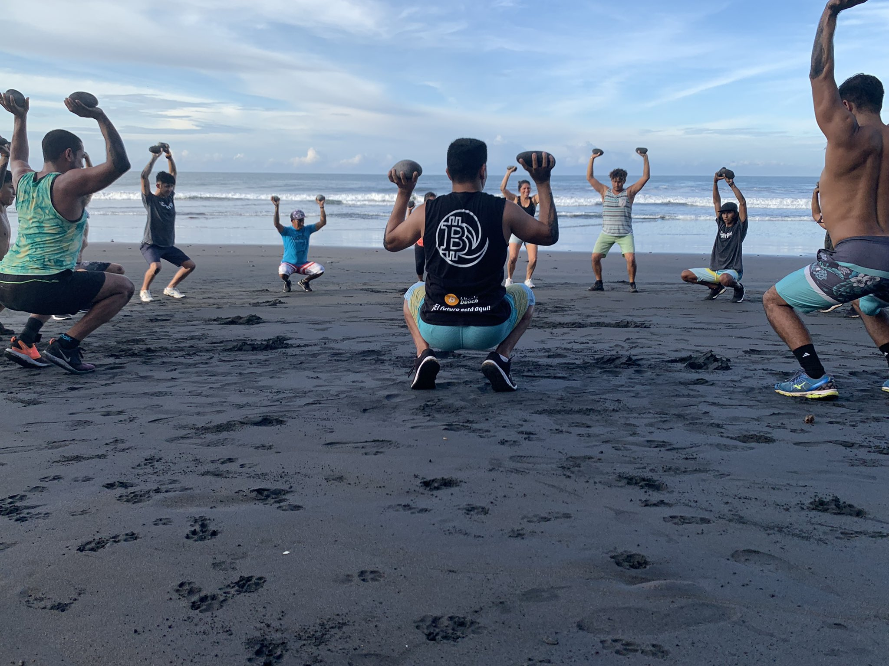

# Banke ya Bitcoin pona Lisanga ya Bato: Nyoso Toyekoli epai ya Bitcoin Beach

na Galoy Money [2021/11/10](https://galoy.io/bitcoin-banking-for-communities-lessons-learned-from-el-zonte/)

<LanguageDropdown/>

## Ebandeli

Mopepe ya mbongwana ebandisamaka na bilenge baye bazali naino na botau ya makanisi
bososoli ete botomboki mwa bango suka suka eko kweya. Ata nakoki ko batama na sima ya
bolenge te, tango Bitcoin Beach ebandaki, esengo nanga ezali ete nabandaki naino kolekisa
tango mingi na twitter te po nakanisa ‘te mokolo mosusu bato bakoki pe kosalela Bitcoin pona
kosomba kopo ya café. Soki tosalaka nduka na bokebi te to pe tobandaki na koyekola esaleli,
tolingaki tomona bolema na biso. Kasi sik’oyo bayike kati na bino bakoki kozwa boyebi ya el
Savador na etando po ete tosalaki bozoba yakoyeba mingi koleka.

Na oyo etali Bitcoin Beach, bosolo ezali mopaya koleka ndoto. Moto ata moko te akokaki ko
banza ete nkita ya nsomi na kati ya Bitcoin ekokaki kobandisama na mwa mboka ya moko ya
moke penza na El Salvador. Ekambami na mopaya moko akomela na mibu oyo asalelaka na
email ya Earthlink, na bomoko n’a elenge moko ya ekolo El Salvador, mokambi ya bana mboka
oyo asislisa ata kelasi ya 6 te.

Soki totali sima, suka ya nyoso eyebanaki: Ezalaki kaka malamu pona etuluku ya bato oyo
banyokwama na bobola pe bozangi ya makoki na oyo etali misolo ‘te bamona litomba ya Bitcoin
liboso ya bituluku misusu oyo etonda na bozwi na Singapore to na Silicon Valley. Neti
ebongisama na Nzambe penza – baye bafungolaki nzela babandaki na botau nyoso, bayebaki
ata eloko te yango elongolaki somo na baye banso bayaki na sima.

Na El Salvador, Bitcoin ezali mosolo ya babola pe baye batiam pembeni na oyo etali misolo.
Pona bai mboka El Salvador, oyo bazwami na bobola, koswana pona misolo n’a wolo ya bilili
eleki likolo, pe ezali ata na tina te. Pona baye basengeli na Bitcoin penza, eza likambo ya ndenge
bakoki kosomba lipa ya mokolo na mokolo pe kobomba mwa misolo pona lobi pendele. Pona
bango, tina ya ko pona moko to mosusu ezali te.

Na boye awa na 2021 tokoki komona na nzela ya mwa ekolo ya moke pe etondisama na bobola,
ndenge nini Bitcoin ekoki kokokanisa etando ya lisano ya nkita pona babola. Toyebi ete Bitcoin
Beach ezali kaka mwa elilingi ya moke. Tokolikia ete yango ekozala moto eye ekopela pe
kopelisa moto mosusu ya monene na molongi mobimba. Tobiangi yo o mboka Elsalvador,
mbela na biso ezali ete oya kotambola na El Zonte, po omemela biso lisungi nayo po topanza
sango oyo ya banke ya Bitcoin ya lisanga oyo ezali kosunga kokotisa bato banso na esaleli ya
misolo na molongo mobimba.

– Mike Peterson ([@bitcoinbeach](http://twitter.com/bitcoinbeach))

## Na Ebandeli ya Poloze awa tii kino na mambi ma mibeko na mibu 2.

Mabongisi pona misala ya Bitcoin Beach ebandaka na motuna ya pete kasi ya tina monene:
ndenge kosala ‘te nkita ya malonga oyo ekoki koumela etongama na nzela ya Bitcoin? 

Eyano eyali na mongongo makasi iyo. Oyo ebongisamaki kaka pona lisanga ya bato ya mwa mboka ya
moke pe mosika ebuti kino ekomi lisolo ya baike ya bato million motoba pona kolakisa na mokili
mobimba ‘te Bitcoin ezali mosolo. 

Awa toko lakisa mateya motoba oyo tomoni tango tosali
mosala yako tia Libenga ya Bitcoin Beach pe bokasi ya bisaleli oyo esimbi pe etambwisaka
yango. Posa na biso ezali kosunga bitonga ya bato epai na epai na mokili po ete koyekola na
bango esalema na lombango pe bayamba Bitcoin n’a Lightning Network (Netiwok ya Kake).

## What is Bitcoin Beach?

El Zonte ezwami na libongo ya Pacific kuna El Salvador, mwa mboka moke epai wapi motango
ya bai mboka ezali 3,000, bato basalaka masano na mbonge na mai ya monana. Bai mboka oyo
batikala sima na oyo etali lolenge ya ba bankei pe ekangama na bitumba y aba kuluna n’a
ndenge mboka etikala sima na oyo etali mayele ya misolo uta mibu ebel ebele. Na mibu zomi
oyo euti koleka, mwa bato moke babandaki kopelisa moto ya mbongwana pe pona komema
elikia ya bai El Zonte. 

Jorge Velenzuela, Roma “Chimbera” Martinez n’a Mike Peterson babandi
kolengela pe kobongisa bilenge ya El Zonte na 2009 po bana mboka bazwa libaku malamu yako
sakana, koyekola pe ko likia. Kobanda na surf “para todo” (lisano ya mbonge pona bato banso)
na kelasi ya odinatele tii na misala yakosunga mboka n’a lifuti, mabongisi miye ememi pema ya
sika n’a mabaku na esika oyo epai wapi nyoso ezalaka lokola lubwaku.

<figure>
  <figcaption>Jorge, Chimbera n’a baninga babongisi lisanga ya masano ya kotonga nzoto, koyekola n’a misala na motema ya bomoi ya bai El Zonte. (Ewuti na: <a href="https://twitter.com/romanmartinezc/status/1429081008012505091?s=20">Twitter</a>)</figcaption>
</figure>

Na 2019, moto moko boye abengaki Mike na likabo ya Bitcoin pona kosunga ba pologalame na
bango. Kasi nyoso wana n’a mobeko moko, koteka Bitcoin wana pona kozwa fiat te kasi
esengeli kosalela likabo wana na etonga mobimba. Posa ezalaki ya kosala nkita ya Bitcoin oyo
eko umela pona bato nyoso epai wapi bai mombongo n’a bai mboka bokoki kosala troki ya
biloko, misala pona sati. Jorge n’a Mike bandimaki momekano wana, pe Bitcoin Beach
ebotamaki. 

Uta ebandeli, eyebanaki polele ‘te poloze oyo eko telemela nyoso oyo eyebanaki
na kala pona Bitcoin:

1. **Pona bazwi Bitcoin ezali bomengo ya makanisi n’a masolo.** Soki okoti na chaine ya
misala n’a ba site, oko yoka bato kosolola pona talo, komata-kokita, pe momekano n’a
biloko misusu ya nkita, wolo n’a mimbongo. Oko yoka bato koloba ndenge ba banke
b’ako panza sango pona ba kiliya na bango ba bozwi pe bomengo ebele. Oko tikala
koyoka sango ya ndenge Bitcoin ezali kofungoal nzela pona nkita pe bozui na bisika oyo
bobola epikama na mokili.

2. **Bitcoin ezali ebombelo nkita ya motuya, kaka esaleli ya troki te.** Tango bolamu ya
Bitcoin lokola ebombelo ya nkita endimami epai nyoso, Bitcoin lokola esaleli ya
mimbongo ezali lisolo oyo tii lelo endimamaka soki moke te. Lisolo’ango eza boye: “soki
talo ya Bitcoin eko koba kaka komata lokola sik’oyo, moto ata moko te akolinga koteka
to kosalela yango pona kosomba to kofuta pona misala.”

Tango poloze elongwe na makinisi pe ekoti na mosala, lisanga ya Bitcoin Beach n’a bakambi na
bango n’a bayekoli ba moni ndenge Bitcoin ekoki kosunga na mikakatano ya bana mboka:

1. **Ba bankee ya minene basalaka misala na mboka ya babola te.** El Salvador esalelaka
US Dollar kobanda 2011, na boye bazali na se ya mibeko miye mitambwisaka misala ya
misolo na US. Motuya ya kotosa mibeko minso wana elongola na ba bankee posa yako
sunga babola na bato y aba mboka mike mike. Na ndakisa tango mokambi ya [Garten Hotel](https://www.gartenzonte.com/garten) alingaki kofungola konte ya bankee pona bato ya misala pona kofuta bango mbala
moko, [bayebisi](https://youtu.be/RhoiOzhuBG4?t=1438) ye akofuta $50 na sanza, pona moto moko. Mbongo wana eleki 10% ya
lifuta ya basali ya se.

2. **Kotindela bato mbongo na El Zonte eza talo mingi pe eumelaka.** Misolo ko uta na
mikili ya bapaya ezalaki [23% PIB to pe nkita ya El Salvador](https://www.cnbc.com/2021/09/09/el-salvador-bitcoin-move-could-cost-western-union-400-million-a-year.html) na mobu 2020. Po moto azwa
$10 oyo euti epai ya ndeko na ye oyo azali na mikili ya bapaya, esengeli afuta $3.
Western Union ezali na El Zonte te na yango, eza mosika pe eko umela po bai mboka
bakoma esika yako zwa mbongo. Bakisa mikolo nyoso oyo esengeli po mbongo elongwa
epai ya motindi pe ekoma na El Salvador.

3. **Ezali mwa kpokoso kobomba mbongo soki bankee ezali te.** Kozanga banke ezali kaka
kozanga compte ya banke te. Eko zangisa moto nzela ya na bomengo pe ndenge yako
batela bozwi na mata-kita ya nkita. Tango tokotusaki Bitcoin tokanaki te ndenge
kokotisa Bitcoin epusaki ebele ya bai mboka pona mbala ya yambo kobomba ndambo ya
lifuta na bango.

<figure>
  <figcaption>Lisanga ya Bitcoin Beach bamipesi na kosunga bai mboka koteka pe kosomba na kosalela Bitcoin na nzela ya lotiliki. (Ewuti na: <a href="https://twitter.com/romanmartinezc/status/1401672924092841984?s=20">Twitter</a>)</figcaption>
</figure>

Lokola tozalaki na Bitcoin pona kofuta nyoso, ekipe ebandi mosala. Babandi mosala yako kotisa
bai mboka, moko na moko na rezo ya Bitcoin. Na nzela ba yekoli, pe bami lengeli pona kozwa
boyebi. Koya ya epidemie na ebandeli ya 2020 esungaki bato bandima Bitcoin na lombango. Bai
El Zonte baye bazalaki na posa ya lisungi bazwaki makabo ya Bitcoin ko uta na poloze ya Bitcoin
Beach. 

[Lokasa moko ya Forbes](https://www.forbes.com/sites/tatianakoffman/2020/07/14/this-el-salvador-village-adopts-bitcoin-as-money/?sh=723af6ac2044) na 2020 etindiki Bitcoin Beach na mwinda pe lisungi y aba
Bitcoiners ebele babandaki koya na lisungi. Moko na bango ezali Nicolas Burtey, moko ya
bakambi ya Galoy, oyo asengaki koya na El Zonte pona kofungola libenga oyo ekokani na Bitcoin
Beach. Kala te, Libenga ya Bitcoin Beach ebotamaki pe poloze ya Bitcoin Beatch ekomi kokola
pe kokokisa ndoto na yango. 

Awa moto nyoso ayebi ndenge lisapo oyo eko suka: na mokolo ya
5 Juin, 2021 Tata Mokambi ya ekolo El Salvador Nayib Bukele azwaki mokano yako komisa
Bitcoin efuteli na mokili ya mombongo pona ekolo. Bukele alobaki na etando ya Twitter ‘te
bulamatali basepeli mingi na poloze ya Bitcoin Beach pe ete litomba ya mibeko ezali yako
zongela noyoso oyo eleki na El Zonte pona ekolo mobimba. Tata Mokambi alobaki pe lisusu ete
nyoso balingi pona babola nyoso ya ekolo El Salvador ezali ete bazwa esika na nkita pe
bomengo ya ekolo. Na 7 Septembre 2021, Mobeko ya Bitcoin endimamaki. Bitcoin Beach ekomi
na kati ya lisolo ya kondimama ya Bitcoin na molongo mobimba. Ememaki ba Bitcoiner ya
mokili mobimba balingaki komona ndenge nini kosalela sati pona kofuta pona café, kosakana na
mbonge, pe kosomba misuni. Ekomaki pe modele pona bamboka misusu. 

Oya tina monene, ezali ete Bitcoin Beach esali ‘te bana ya El Zonte bakoka kolota lisusu pona ndele ya malonga.

## Libenga ya Bitcoin Beach

Libenga ya Bitcoin Beach ezali eyano pe polele lokola bankei pona batobanso. Esalemaki pons
kokokisa ba posa ya bai mombongo n’a basombi banso na mboka El Zonte. Yango esalelaka
multisig lolenge yako bombama pona bato banso pe eyano ya bobateli oyo endimami pe
esalelama bipai binso.

<figure>
  <figcaption>Cristina asalelaka Libenga ya Bitcoin Beach pona sabuni atekaka. Ba kiliya bakoki kosalela
kombo na ye pona kofuta ye, soki ba scanner na facture na phone naye, to pe soki bakoti na <a href="https://ln.bitcoinbeach.com/Jackie_Valenzuela">etando naye</a>. (Ewuti na: <a href="https://twitter.com/romanmartinezc/status/1446661818735288320?s=20">Twitter</a>)</figcaption>
</figure>

Nakati ya libenga ya Bitcoin Beach, misolo esimbami pe ekambami na etanga mobimba.
Litomba pe matabisi na yango ezali pona bato banso:

- Lightning channels oyo tobengi na Lingala nzela to canal ya kake ekambami po bato nyoso ya ofele; kofuta pona kofungola to pona kokanga ezali te
- “Intra ledger” na mombongo pona bana mboka ezali kosalema na lombango pe ya
ofele pen a lombango
- Kosalela serveur en ligne elingi koloba motuya ekokita koleka soki moto na moto
akoluka kosalela ebombelo ya basango, ba sekele n’a nyoso esengeli pona mosala.
- Talo ekoki pe lisusu kokita soki mimbongo, koteka pe kosomba esalami na mipiko

Kobakisa bisaleli na app eko sunga posa yako mona nkita ya Bitcoin ya malonga:

- Makoki yako kofuata na nzela ya Bitcoin, facture ya Lightning to na kombo ya moto ye
moko
- Makoki ya komona nini etikali na libenga ezala dollar (USD) to ba sati, na on-chain n’a
Lightning
- Etando ya mimbongo epai wapi okomona nyoso bateki pe basombi basalaki
- Etando pona kolakisa nzela ya bateki banso baye bandimaka kofutama na Lightning 
- Etando ya web esika basaleli banso bakoki kotinda pe kozwa Bitcoin n’a libenga ya
Lightning na kati na yango (see: [ln.bitcoinbeach.com/bitcoinbeach](http://ln.bitcoinbeach.com/bitcoinbeach))

Soki olingi ozwa esaleli na telephone ya maboko lokola Libenga Bitcoin Beach kota na epemela
ya [galoy-mobile](https://github.com/GaloyMoney/galoy-mobile) na GitHub.

Totalisa na lombango penza, nini Galoy azwi lokola mateya na nzela ya mosala basalaki na El
Zonte.

## Liteya ya liboso (1): Koyekola liboso na nyoso

Ezali mwa kpokoso pona kososola Bitcoin. Elekaka na katikati ya nyoso oyo etali ba mayele ya
odinatele, masapo, kilipitogalafi, mibeko ya misolo pe makambo mingi lisusu. Libaku malamu
ezali ete, moto moko te azali na posa yako yeba nyoso pona asalela pe adondwa na Bitcoin.
Bato boni na mokili oyo baselela fiat bomoi na bango mobimba baye te ndenge mbongo
etambolaka penza penza?

<figure>
  <figcaption>Jorge n’a lisanga ya Bitcoin Beach ba’ko lakisa bai El Savador ndenge yako salela Bitcoin. (Ewuti na: <a href="https://twitter.com/romanmartinezc/status/1420951261675929601?s=20">Twitter</a>)</figcaption>
</figure>

Mateya mitano okoki kosalela pona koteya bato:

1. **Pona kobanda kokotisa bato esengeli kozala na bakambi.** Kozala n’a bato oyo bako
sunga bato babanda malamu ezali na tina mingi. Ezali na tina mingi pona ba mboka bipai
wapi kosalela Bitcoin na mombongo pona mbala ya liboso ezali libaku malamu.
2. **Kolakisa bato ndenge ya kosalela Bitcoin ezali na tina mingi koleka kobetela bango kaka masolo.** Kosunga bato kotelecharger pe kosalela libenga, bakoki pe kozwa to
kotinda ba sati ekoza malamu koleka komelisa bango makanisi lokola ba mbuma ya kisi.
3. **Teya bana. Bakosunga kokotisa baboti na bango.** Bana ya El Zonte bayekolaki
kosalela Bitcoin na lombango penza. Na ndako, basungaki baboti na bango.
4. **Ba ATM esunga kosangisa Bitcoin n’a fiat.** Emonani na sima ‘te ATM ya Bitcoin
esungaki makasi pona kokotisa bato. Tango bato bazali na makoki yako teka pe kosomba
Bitcoin na libenga na bango pona limenya ya mboka, bomoko na bango ekomi lisusu
makasi na likanisi ya kosalela Bitcoin lokola mbongo.
5. **Kosunga bato bayeba komi lengela pona komata pe kokita.** Lakisa bato nayo ndenge
ya komilengela pona kokweya na talo ya Bitcoin. Kotia mabongisi pona kosunga bai
mimbongo oyo libenga ekiti pona matakita ya talon a ebandeli tii bakozwa kimia n’a
boyebi oyo esengeli pona kosalela Bitcoin.

Na tango yako bongisa etonga nayo, zwa tango yako yebana pe koyekola epai ya bato ya [Bitcoin Beach](http://bitcoinbeach.com/). Bazali bingambe, okoki kotelema na mapeka na bango. Komipesa na bango na mosala
ezalaki liboso ya Bitcoin. Bitcoin ekomi nde nzela oyo bazali kosalela pona komema elikia n’a
lobi ya malonga na El Salvador.

## Liteya ya mibale (2): Lightning ebakisi lombango nabo saleli ya Bitcoin lokola mosolo

Lightning Network ezali esaleli oyo mokili eboya kondima koleka. Kaka mwa mibu mibale
babengaki yango ndenge yako sala mimbongo ya liboma to pe #reckless. Sik’oyo McDonalds,
Starbucks n’a Pizza Hut bazali kosalela yango na El salvador. Makoki na ba canal yako kokola
ezali kosalema na lombango oyo moto akoki kokanisa te. Rapport ya baluki-luki ya Arcane
“[L'état du réseau Lightning](https://www.research.arcane.no/the-state-of-lightning)” to pe lisusu “The State of the Lightning Network” elakisi mwa
ndambo ya nini tokoki kozela na sima.

Na ebandeli, Bitcoin Beach asalelaki sheni ya mimbongo pona kokabola Bitcoin na etonga
mobimba. Atako on-chain to pe sheni ya mimbongo ezalaki malamu pona koteya pe kokabola
ba sati na bato nyoso ya etando, kasi ekomaki na suka pona ko fandisama lokola nkita ya
malonga.

Bai El Salvador bamoni denge kosalela Bitcoin lokola efuteli yango moko ekoki te soki tolongoli
rezo ya mibale lokola Lightning:

1. **Talo ya On-chain elekaki pona kosalela pe kofutaka mikolo nyoso.** Esengeli na bana mboka El
Zonte bafuta mwa dollar moke, lokola 50 sengi pona pupusas.
2. **Kosalela on-chain ya Bitcoin pona kosomba pe koteka na putulu to pe “poussière.”** Na ebandeli Bitcoin Beach ekutanaki n’a
mikakatano to pe “[problème de transactions de poussière](https://bitcoin.stackexchange.com/questions/10986/what-is-meant-by-bitcoin-dust)” na mombongo ya putulu. Oyo
babengeli produits de transaction non dépensés (UTXOs) ebombaka ndenge nini na mwa tango
moke nyoso ya motuya elekaka na kati ya sheni. Soki eloko ya motuya na UTXO esili talo koleka
oyo ekofuta yango, Bitcoin ekomi lokola putulu bakoki kosalela te.

3. **Na esika ya bateki, soki kofutama esalemi mbala moko te tango ya mombongo, esalaka bokabwani pona moteki pe pona mosombi.** Bitcoin etongama pona kimia pe mosika ya kanyaka. Esalama te na lombangu ya mimbongo.

<figure>
  <figcaption>Lightning ezali mbango, pete nako salela pe talo moke oyo esengeli pona bai mombongo pona misala na bango. (Ewuti na: Galoy)</figcaption>
</figure>

Eteni ya mibale Lightning Network ezali technologie oyo ekoki kobongola sistemi nyoso ya
bateki pe ko kokisa elaka ete Bitcoin ezali mosolo pona mokili mobimba. Moko ya babandisi
akomaki mokanda pona yango na mobu 2020 Our co-founders wrote about this in the 2020
article “[Lightning comme système de paiement de détail?](https://galoy.io/lightning-as-a-retail-payment-system/)”

Tosalelaki Lightning Network esalelamaki pona kofungola pe komema poloze ya Bitcoin Beach.
Soki yango te, kosalela Bitcoin lokola lomenya na El Salvador ekozala kpokoso pe talo mingi;
ekoki kutu kolongola poloze na nzela to pe koumisa yango.

Kokotisa Lightning Network ekomi na motuya mingi pona ba oyo nyoso misala nyoso etongami
na Bitcoin. Efungolaka nzela pona mimbongo ya talo ya se makasi (lokola ya ofele), na
lombango ata soki ndingisa ezali te, pe na mokili mobimba.

## Liteya ya misato (3): Kokotisa bai mombongo ezali na tina monene pona kofandisa nkita ya malonga

Kotia pe kofandisa nkita ya Bitcoin ya malonga ememi mokakatanao ya “soso n’a maki.” Ban’a
mboka basengeli na bisika songolo bipai wapi bakozwa yango, pe bateki bazali na bosenga ete
bai mboka basalela yango. Kokomisa kondimama pe bosaleli ya Bitcoin pete nde eteni ya tina
monene po ete bai mboka bayamba Bitcoin na esengo.

Nyoso wana kaka po Bitcoin endimama na lombango, pe ezala na talo moke koleka misolo
nyoso mosusu oyo esalelamaka pona kofuta.

<figure>
  <figcaption>Mama Rosa (awa na bilili ye n’a mwana na ye Jorge) azalaki moteki ya yambo na El Zonte oyo andimaki Bitcoin. (Ewuti na: <a href="https://twitter.com/romanmartinezc/status/1387105142030352387?s=20">Twitter</a>)</figcaption>
</figure>

Totala mwa makambo oyo epasola nzela na lolenge yako lengela bateki:

1. **Kotika makanisi ya bateki ezala na kobongola misolo te.** Lakisa motuya na dollar (to
misolo ya ban’a mboka) esika moko n’a Bitcoin pona kongola mokumba ya kolukaluka
pe kotangatanga pe kokokanisa na ba facture.
2. **Kokotisa ba ndenge ebele ebele pona bai mombongo bafutama.** Esengeli ten a
moteki asalaka ba faktire tango nyoso akoteka eloko. Na lisungi ya Libenga ya Bitcoin
Beach, basombi bakoki kosale kombo na bango, lokasa yak ode QR, soki aponi moteki
moko na etando to pe nako pona facture oyo moko na moko asalelaki pe akoboli na
ln.Bitcoinbeach.com/[kombo].
3. **Sala ete nyoso ezala mokuse, pete nako salela pe esenga kofina fina te.** Mbongwana
pona bai mombongo ya mboka El Zonte eyaki tango Galoy apesaki nzela na basombi
pona kopona talo bako futa. Tina ‘te moteki atika mosala naye asala facture ezali lisusu
te. Pona bango etikali kaka batala na telephone soki moto afuti ya solo. Sik’oyo ekomi
pete kosalela Bitcoin koleka mbongo to pe kalati banke.
4. **Kotia makoki pona bai mombongo bayamba Bitcoin na ebandeli.** Pologalami to yako
zongisela bato mbongo oyo babengi “cash back” esalemaki na mboka El Zonte pona
mwa ba poso ndambo, bai mimbongo bafutamaki 20% ya ba Bitcoin na bango.
Mabongisi ya boye eko pesa nzela yako matisa pe kofandisa nkita ya Bitcoin.

Kobosana te motuya ya mosala ya bai mombongo pon kofandisa nkita ya Bitcoin. Bosenga pe
posa ya bateki ekeseni na mboka moko to mosusu, sala nyoso ete ofanda n’a bango na ebandeli
penza pona koyeba ndenge yakosunga bango moko na moko kolandisama posa naye.

## Liteya ya minei (4): Kotia boyebi ya basalali kolandisama ba posa ya etonga to mboka bipai bazwami.

Bitcoin Beach efandi na katikati ya kondimama ya Lightning Network. Ndenge Mike alobaka “Na
El Zonte bana mike ebele ba’ko salela Lightning mingi koleka ba oyo basalela Bitcoin uta kala
babengi bango ba Bitcoiners OG.”

Malembe malembe tango nkita ya Bitcoin ekomi kokola, lisanga ya Bitcoin Beach etiaki miso pe
matoyi na mikakatano n’a bosenga ya bisaleli misusu oyo eko sunga bai mombongo. Kokita na
se na mboka El Zonte esungaki pe efungolaki miso ya Nicolas pona bosali Libenga ya Bitcoin
Beach.

<figure>
  <figcaption>Komona bato kosalela Bitcoin epai ya bai mimbongo na El Zonte epasoli nzela pona koyeba kosala nyoso esengeli po misala miye. (Ewuti na: Galoy)</figcaption>
</figure>

Yeba: Kobosana te ‘te ezali na tina mingi yako komeka bisaleli nyoso (apps) na mboka bipai
wapi bakosalela yango. Luka pe okoyeba yo moko.

Mateya motoba tozwi nabomeki Libenga ya Bitcoin Beach na zamba:

1. **Konnexion ya inteleneti ya makasi pe lombango ezali eloko ya komona pamba te.**
Develoepement ya bisika konnexion ya malonga ezali tee zo senge kotombola pe
kondima ‘te mikakatano na to pe panne ya rezo ekosale atako ezali bongo te mboka
Etat-Unis ya Amerika.
2. **Bokotisi ya ba app ezali libaku malamu pona mateya.** Libenga ya Bitcoin Beach ezali
na mituna pe biyano oyo ememaka bato na ebandeli ya mateya na oyo etali Bitcoin.
Lifuti y aba sati ezali na sima ya motuna moko na moko pona kosunga moto na ebandeli.
3. **“Sati nde esaleli,” kasi pona moto na moto dollar to USD nde esalali ya bokokanisi.**
Na ebandeli ya Bitcoin, bato bakanisaka na mosolo ya mboka na bango, kasi na sati te.
Malembe malembe nde sati ekokota na makanisi na bango, na yango ezali malamu ete
na ebandeli ya Bitcoin esika songolo, kosalela mosolo ya mboka wana.
4. **Bakisa mabaku pona bai mimbongo n’a ba kiliya basololaka.** Esika ya etando ya
Libenga ya Bitcoin Beach e’ko sunga ba kiliya komona esika nini bakoki kosalela Bitcoin
na bango. Yango pe ekosunga ‘te mimbongo esalema malamu pena lombango pona ba
kiliya basala pe bafuta ba facture na bango.
5. **Mikanda ya kofuta ezali lisungi monene pona buku.** Bateki n’a basombi bakoki
kokoma mikanda ya mimbongo nyoso. Soki tolandi maloba ya ban’a mboka esaleli oyo
ezali lisusu yak o batama te, ekomi ya polele. Sik’oyo n’a motindi n’a mozwi bango
nyoso bakoki komona mikanda oyo e’kolakisa ndenge mombongo esalemaki.
6. **Yeba nyoso oyo etali kokola ya kofutama ya lombangu (éclair – lightning).** Ba nzela
ya kofuta ya sika ebimi ebele lokola, Lightning Address, factures statiques n’a BOLT 12
ezali koya na lombangu penza.koponama etali ndenge bolingi kosalela yango. Na
ebandeli, libenga ya Bitcoin Beach esalelaki code QR oyo ememaki na lokas aya fakture
(lokola ln.Bitcoinbeach.com/mamarosa). Bosenga ya bisaleli mibale emonani pona ko
longola bokabwani pe kobongisa nzela ete nyoso ezala na bomoko.

## Liteya ya mitano (5): Bobateli ya Etonga Mobimba ezali Nzela pona Komi-batela.

Komibatela ezali penza nini esengeli pona moto nyoso oyo azali na bomengo na Bitcoin.
Mobeko ya liboso pona kobomba Bitcoin ezali boye ”Fungola ezali ya yote, Bitcoin ezali y ate.”

Nzela moko kaka ezali komibatela te, yango kaka pe te ndenzela ya malonga pona kokotisa to
kolakisa bai mboka ndege yakosalela Bitcoin.

> “Esengeli kotambola lokola mwana moke. Soki otalisi bato mikakatano na ebandeli bato bako linga kokota te.” – Mike Peterson na[Tales from the Crypt #173](https://open.spotify.com/episode/6jyXUPu4n3nYDi4jbDFYBd?si=gSLNHJpUQk2ASevhiSBz-A)

### Moboko ya bobately Bitcoin

Lolenge ya bobateli ya Bitcoin etambwisami na penza penza na moboko ya sekele/bolamu. Epai
moko oza na UX, ndenge yako zwa misolo na lombangu pe ndenge yako kota na ba bankei ya ba
fiat. Epai mosusu, oza na ebende etiami nkoma ya loboko, biteni ya lokasa oyo esengeli na
bitapi ebele n’a bato ebele pona komema misolo esika moko to mosusu.

Esaleli moko na moko eza pena bitumba oyo ekoki kofungola nzela ya boyokani. Different use
cases have different risk scenarios that make trade-offs acceptable. Ndakisa, kobomba misolo
na bankei endimama lokola nzela ya malamu mingi koleka kotambola n’a misolo na maboko,
kasi soki mwa motango ya mbongo eza moke wana mabe te.

<figure>
  <figcaption>Libenga ya Bitcoin Beach e’ko pesa bobateli pona lisanga epai wapi misolo ekobombama esika moko.</figcaption>
</figure>

Lolenge moko na moko ezali na tina na yango soki 1) Soki eko salelama na ndenge esengeli 2)
eko kamba bato na nzela sembo tango bako bomba bomengo na bango na Bitcoin.

### Kobatela na lisanga: bozongi na ba bankei ya masanga

Lolenge ya kobatela oyo etiamaki pona Bitcoin Beach ezali oyo Galoy abengaka “bobateli ya
lisanga.” Ezali eyano n’a makomi ebele epai nini fungola ya ebombela ya misolo esimbami na ba
bakambi ya mboka. Lolenge oyo elongoli boumbu ya kotalela ba kompani ya minene miye
mizwami mosika ya mboka pe kolongola bokabwani na oyo etali kokotisa bato ya sika na rezo.

### Mwa liloba pona bankei ya lisanga

Ba banke ya lisanga ezalaka banda kala na mokili mobimba kobanda mibu mokama na mokama.
Litomba na bango ezali kosunga etonga ya bato oyo bazali bosenga moko na na bomoi pe na
nkita. Mbala mingi posa ya bato nyoso ekutanaka esika moko. Misolo miye mibombami na
banke ya etonga epasamaka na bato kolandisama bondeko na bokeseni ya ndenge ba banke ya
minene basalaka.

Ba banke ya lisanga ezali na motuya monene pona mboka lokola El Zonte po bazwaka mikano
nyoso kaka po na bolamu ya bana mboka. Mokanda ya Galoy [open source Bitcoin bankeing solution](https://galoy.io/products/) (to pe solution bancaire open source Bitcoin) esalama pona kosunga lisanga ya bato to
ba kompani na mokili pona komi sunga bango moko.

Pona koyeba mingi na tina na bosangani ya Bitcoin na banki ya mboka, tala mokanda ya Fulgur
Ventures “The role of Bitcoin for community bankeing.” (to pe "[Le rôle de Bitcoin pour les services bancaires communautaires.](https://medium.com/@fulgur.ventures/the-role-of-bitcoin-for-community-banking-623068c59882)")

### Libenga ya Bitcoin Beach lokola bankei ya Bitcoin pona mboka

Misolo ya Libenga ya Bitcoin Beach ekambami na bai mboka, eko pesa nzela pona kolongola
bokabwani pe kpokoso nyoso po ‘te bato bafutama na talo moke po bamema lisungi na bango
na nkita ya nkita ya mboka.

Botala pona nini kobatelama ya lisanga ezali malamu pona Bitcoin Beach:

1. **Kolongola bokabwani ezali na tina monene pona kosala rezo n’a nyoso oyo esengeli pona nkita oyo ezali kotambola malamu.** Bomoto ya bato etelemelaka mbongwana n’a
makanisi nyoso ya sika to kozongela bizaleli ya kala. Ndenge Mike Peterson aloba na
lisolo na ye ya Juin 2020 n’a Marty Bent: “Tambola na bitambe ya mwana. Soki okotisi
mikakatano oyo nyoso na ebandeli, bato bako kota na lisanga ya nkita te.”
2. **Ezalaka kpokoso pona kobomba mindelo ya maloba na ndenge esengeli pona ba mboka mike pe ya misika.** Pona bato nyoso oyo bafandaki na ndako ya mabele n’a
manzanza, ezali mwa matata pona kobomba makomi ya milongo ya maloba.
Mikakatano pona kosalela milongo ya maloba ezali pona bato oyo bayebi kotanga to
kokoma te, likamb’oyo ezali bisika nyoso na mokili.
3. **Bato oyo basalelaka Bitcoin moke moke bakomaka na kimia.** Sik’oyo bai mboka El
Zonte bakoki kotinda Bitcoin na nzela ya Lightning Network mokolo na mokolo.
Bamisusu babandaki kobomba ba sati, yango nde esungi bango kokolisa mwa bomengo
na lombangu koleka soki babombaki ba Dollar US. Ezali likanisi oyo Bitcoin Beach
atambwisaki na nzela ya mateya n’a kolengela bato po bami batela. Mabongisi ya UX
eko koba kosunga bato ebele na ebandeli pe komibatela na mokili mobimba.

Eyano pona kobatela etonga babengi Open source ebimi lokola lolenge ya malonga pona
kobandisa masanga ya Bitcoin. Tondimisami ete ekosala mosala monene pona komema Bitcoin
na basaleli Milliard ya yambo.

## Liteya ya motoba (6): Banda Moke, Tonga pe moke moke Oko Kola

Na mokili mobimba, ezali esengo komona ngulupa ya bato kosala nyoso pona kokotisa mboka
na bango na rezo ya Bitcoin. [Bitcoin Lake](https://twitter.com/LakeBitcoin) na Guatemala n’a [Bitcoin Beach Brasil](https://twitter.com/bitcoinbeachbr) bazali ba
ndakisa mibale. Basaleli ya Bitcoin oyo babengi ba Bitcoiners bakoma kobenga Tonga “Bitcoin
Island” (to pe nganda ya Bitcoin) na sima ya koyoka mabongisi na biteni minei pona komema
Bitcoin na mboka naye ya [Lord Fusitu’a](https://twitter.com/LordFusitua)

It is exciting to see the groundswell of communities around the world working to connect their towns and cities to the Bitcoin network. [Bitcoin Lake](https://twitter.com/LakeBitcoin) in Guatemala and [Bitcoin Beach Brasil](https://twitter.com/bitcoinbeachbr) are two early examples. Some Bitcoiners have started calling Tonga “Bitcoin Island” after hearing [Lord Fusitu’a’s](https://twitter.com/LordFusitua) four-part plan to bring Bitcoin to his country.

<figure>
  <figcaption>Mateya ya moko na moko ezali moko ya misala na tango ya bokotisi bato ya sika na etonga. (Ewuti na: <a href="https://twitter.com/romanmartinezc/status/1432898996113133570?s=20">Twitter</a>)</figcaption>
</figure>

Po na kobanda toko kabola makanisi mibale ya minene na ndenge yako kolongwa na makanisi
pe kokoma na nkita:

1. **Kobanda na esika n’a etonga songolo esungaka pona pikama malamu.** Bitcoin Beach
sangolaki na libaku ya kosalela bato 3,000 oyo bazwamaki mosika na ba mboka mosusu.
Kokangama esika moko epsaki biso makoki yako yekola pe kokokanisa mateya na
ndenge makambo ezalaki pe elengelaki biso pona ko fuluka ya Makasi.
2. **Kokola esalemaka “malembe malembe, pena pwasa.”** Tango ya komema lisanga ya
baton a Bitcoin, mibongisa pona kozwa tango pona kofandisa bato 50 ya liboso na esika
oluka kokotisa bato nkoto na nkoto. Po Bitcoin ezali rezo, mibeko miye mitambwisaka
rezo ezali pe awa. Kasi nde, batongi, bateyi, n’a basali to ba kompani oyo misala n’a
mimbongo na bango ezali na Bitcoin basalaka nyoso pona komema lisungi na bango na
bato banso oyo bakotaka na Bitcoin na mbala ya liboso.

Bato ebele bayoka kombo Bitcoin Beach na 2021, nzoka nde poloze oyo ezwaki mibu ebele po
etelema. Lisanga ya baninga ya Bitcoin Beach bamipesaki n’a ba tango na bango pona koteya
makambo ya mike mike, koyanola mituna pe ko sunga na mikakatano ya ndenge na ndenge
yango nde ezalaki likonzi esimbi poloze oyo. Soki bango te, Bitcoin Beach elingaki ezala elonga
monene ndenge ozali kotanga lelo.

### Mwa Makanisi pona Kobandisa Banke ya Bitcoin

Tia makonzi oyo epikama n’a lisanga ya malamu, taknologie n’a koyekola.

<figure>
  <figcaption>“Toza libota monene n’a ndoto ya monene.” – <a href="https://twitter.com/romanmartinezc/status/1406411850170912769?s=20">@romanmartinezc</a></figcaption>
</figure>

1. **Tia lisanga na yo.** Pona bato oyo bazali na motema, makasi n’a bolingo yako sunga baton a
mikakatano n’a mbongwana oyo eyaka n’a Bitcoin. Eza na banzela mibale ya kotala uta
ebandeli:
    - **Komipesa ya bai mboka:** Po oyeba ndenge pe nini esengeli po na kolengela bai mboka, land ape yekola [Jorge](https://twitter.com/jorgebitcoinES), [Chimbera](https://twitter.com/romanmartinezc), n'a [Mike](https://twitter.com/Bitcoinbeach).
    - **Teknologie:** Pona kopona biyano ya teknologie yako salela na botongi ya banke ya Bitcoin esengeli kotala makambo ebele. Kozala na moto oyo akosunga na mikano yako zwa pona moboko ya kobatelama ya Bitcoin, kobatela mazita ya Lightning n’a bosaleli ya misolo, kosalela mabenga ya pio to ya moto ekosunga yo opika makonzi ya kokola makasi.
2. **Luka liziba epai wapi okozwa misolo.** Kozwa esika esika misolo miko uta eyali na tina
monene pona kokotisa etonga ya bato ya sika na Bitcoin, mingi mingi soki ezali na mboka ya
moke pe bobola makasi epai wapi bato bazali bomengo ebombana te to pe misala oyo efutaka.
Kozala na misolo na maboko pona kofuta misala na eko sunga makambo nyoso etelema
malamu, pe kobola mw aba sati na kati ya lisanga ya basaleli eko pesa nzela ete nkita efanda pe
bato basepela kosalela yango.
3. **Kozwa eyano ya teknologie.** Bisaleli ya kosunga misala ya misolo ya Bitcoin ezali naino kaka
kobakisama. Esaleli ya Galoy oyo babengi [infrastructure bancaire open source Bitcoin](https://galoy.io/products/) ezali
eyano oyo posa na yango ezali ete lisungi na makambo matali misolo pona ba kompani n’a bana
mboka ekoma pete na kati ya Bitcoin n’a Lightning.
4. **Limbola ndenge nayo yako kengela pe bongisa esaleli ya makomi kilikili oyo babengi multi-signature.** Ekenge ezali na tina makasi yango wanan ezali na posa yako tala eloko moko na
moko po oye pe po na balandi na ye. Po ngulupa ya ba Bitcoiners ba oyo baye makambo etali
Bitcoin, kokengela ezali na motuya monene pe eloko yako zwa esika na yango ezali te. Tango
bokotisi bato oyo bazali na banke te, okoki kozwa mokano yako kosalela lolenge ya Bitcoin
Beach na ebandeli. Atako, ndimisama pe yeba tina yako bo bomba nkita na milongo ya maloba
kili kili.
5. **Bosala ndenge yako teya pe kosunga bai mboka.** Communaute ya Bitcoin bazali na bolingo
mingi nako pesaka biso lisungi na bango, bisaleli ya mateya n’a biloko mingi lisusu, yango talatal
naino pember liboso. Esika moko te eleki “Bitcoin Twitter” pona kotala bilili, mikanda n’a nyoso
oyo esengeli po obanda kokotisa bato nayo. Kobosana te ‘te na ba mboka bato mingi ten de
basalelaka Twitter.
6. Bobima na nzela! Kokotisa na ebandeli ezalaka moto moko na mbala, kota na mboka pe pesa
bato libaku malamu yako salea, kozwa to kotinda ba sati na bango.

<figure>
  <figcaption>Landa <a href="https://twitter.com/jorgebitcoinES">Jorge</a> (bilili), <a href="https://mobile.twitter.com/romanmartinezc">Chimbera</a> n'a Mike Peterson (<a href="https://twitter.com/Bitcoinbeach">@bitcoinbeach</a>) po olanda nyoso na oyo etali mobembo ya El Zonte.</figcaption>
</figure>

## Pona kosukisa

Ezali lokola ndoto n’a esengo komona bitonga, masanga, ba kompani bipai na bipai na mokili
kosanga lokola moto moko pona komema Bitcoin ekoma na basaleli nkoto nkoto na nkoto
(milliard). Toko likia ete mokanda oyo ezali ndakisa ya malamu pe eko pesa etingia kosunga
bato kosolola na ndenge ya malonga.

Galoy pe bazali kobongisa milulu oyo babengi [Adopter le Bitcoin : un sommet éclair au Salvador](https://adoptingbitcoin.org/)
kobanda mokolo ya 16 - 18 Novembele lokola lisunga pe kobakisa kokola ya Bitcoin n’a elonga
ya lisanga ya Bitcoin Beach. Ezali esengo monene pona biso, kozala pembeni ya bato lokola
Jorge, Chimbera, Mike n’a bayike misusu oyo basala ‘te ndoto ya nkita ya Bitcoin oyo efanda
ekoma ya solo. 

If you’d like to see and use our code, it’s free and open source on [GitHub](https://github.com/GaloyMoney/).

You can also reach out on twitter [@galoymoney](https://twitter.com/GaloyMoney) and our [public Slack](https://join.slack.com/t/galoymoney-workspace/shared_invite/zt-rvnhsdb5-72AZCD_jzw6_Q05aCs0SgA).