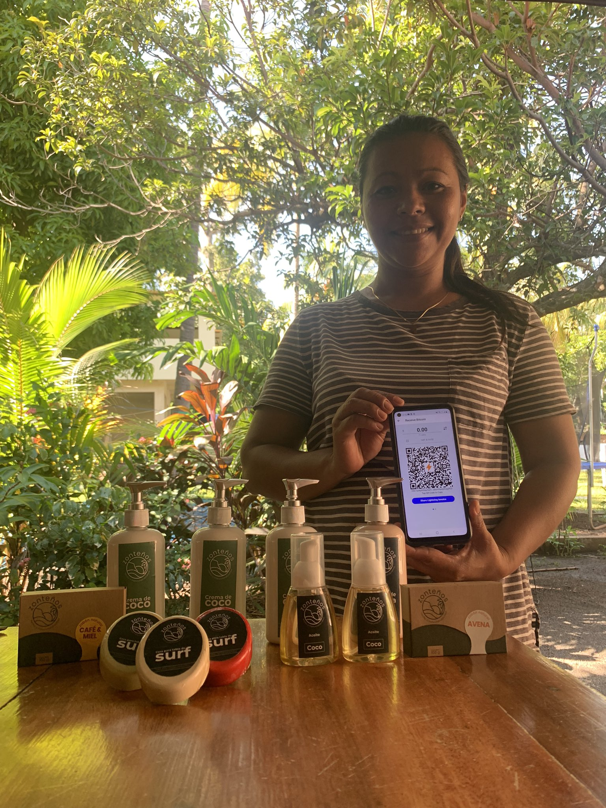
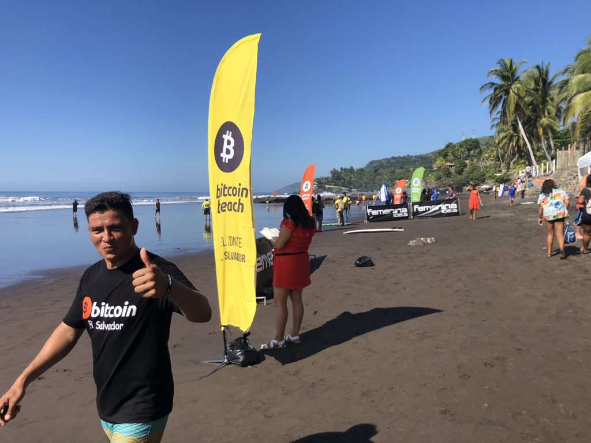

# Bitcoin Banking for Communities: Lessons Learned from Bitcoin Beach

by Galoy Money [2021/11/10](https://galoy.io/bitcoin-banking-for-communities-lessons-learned-from-el-zonte/)

<LanguageDropdown/>

## Foreword

Revolutionary change is usually sparked by those that are too young and naïve to understand that their undertaking is doomed to fail. While I cannot claim the excuse of youth, when Bitcoin Beach launched, thankfully I had not yet spent enough time on Twitter to “know” that Bitcoin would never be used by people to buy a cup of coffee. Had we done the prudent research or started with standard feasibility studies, we would have realized our folly. Thankfully most of you can now find El Salvador on a map because we were too stupid to know better.

In the case of Bitcoin Beach, truth really is often stranger than fiction. Nobody would have imagined that the first true Bitcoin economy would find its genesis in a small rural village in El Salvador. Led by a middle-aged expat that still uses Earthlink email, partnered with a young Salvadoran community leader who barely finished 6th grade.

In retrospect, the outcome was obvious: a population that struggles with poverty and lack of financial inclusion was always destined to see the value of Bitcoin before wealthy communities in Singapore or Silicon Valley. It seems divinely fitting – those who paved the first path started out so laughably unqualified that no community who follows needs to feel intimidated.

In El Salvador, Bitcoin is the money of the poor and financially excluded. For Salvadorans that are living in poverty, the debates between the digital gold and digital cash camps seem out of touch, and without practical relevance. For those who need Bitcoin most, it is both how they buy their daily bread and how they save for the future. They see no need to choose one or the other.

So here in 2021 we see a small impoverished nation showing the world how Bitcoin levels the playing field for the poor. We know Bitcoin Beach is just a glimpse. But we hope it will be the spark that sets off fires around the world. We invite you to come visit El Zonte, and help us spread this vision of community Bitcoin Banking that is enabling financial inclusion around the world.

– Mike Peterson ([@bitcoinbeach](http://twitter.com/bitcoinbeach))

## From Local Project to Legal Tender in Two Years

The Bitcoin Beach project started with a simple yet aspirational question: Can we build a sustainable circular economy on Bitcoin?

The answer is a resounding yes. What started as a community project in a remote town has evolved into a story about six million people showcasing to the world that Bitcoin is money.

In this guide we cover six lessons learned developing the Bitcoin Beach Wallet and the underlying open source infrastructure that powers it. Our aim is to help communities around the world accelerate their own learning and adoption of Bitcoin and the Lightning Network.

## What is Bitcoin Beach?

On the Pacific Coast of El Salvador sits El Zonte, a small surf town with a population of 3,000. Its residents have been left out of the traditional banking system and have grappled with gang violence and a lack of financial inclusion for decades. Over the past ten years, a small group of individuals have been working to ignite change and bring hope back to El Zonte.

Jorge Valenzuela, Roman “Chimbera” Martinez and Mike Peterson began running youth programs around 2009 to give El Zonte’s kids the opportunity to play, learn and dream. From surf “para todo” (surf for everyone) to computer classes to paid community service projects, the programs have breathed new possibilities into a place that once felt like a dead end.

<figure>
  <figcaption>Jorge, Chimbera and team have put fitness, education and community service at the center of daily life in El Zonte. (Source: <a href="https://twitter.com/romanmartinezc/status/1429081008012505091?s=20">Twitter</a>)</figcaption>
</figure>

In 2019, Mike was approached by an individual who wanted to support their programs through a bitcoin donation. There was a catch, however: the donation must be spent within the community, instead of sold into fiat. The goal would be to create a sustainable circular Bitcoin economy where merchants and community members can exchange goods, services and labor for sats. Jorge and Mike accepted the challenge, and Bitcoin Beach was born.

From the start, it was clear that this project would challenge preconceived notions about Bitcoin:

1. **Bitcoin is a speculative asset for the wealthy.** If you tune into business news channels and sites, you’ll hear constant discussion about price, volatility, and comparison to other assets and investments like gold and stocks. You’ll hear about how banks are offering exposure to their high net worth clients. What you won’t hear is how Bitcoin is enabling economic empowerment in some of the poorest parts of the world.

2. **Bitcoin is a store of value, not a medium of exchange.** While Bitcoin’s utility as a store of value is widely accepted, Bitcoin as a medium of exchange is a hotly contested topic to this day. The rationale goes; “If the price of bitcoin keeps growing at the current rate, nobody will ever want to spend it on goods and services.”

As the project turned from idea into action, the growing team of Bitcoin Beach coordinators and students took note of the problems that Bitcoin might solve for their community:

1. **Traditional banks don’t do business in the poorest communities.** El Salvador has been on the US Dollar system since 2001, which makes their financial sector subject to US regulations. The high cost of compliance imposed by these regulations disincentivizes banks from catering to people in poorer countries. For instance when the owner of [Garten Hotel](https://www.gartenzonte.com/garten) tried setting up employees with bank accounts and direct deposit, [he learned](https://youtu.be/RhoiOzhuBG4?t=1438) it would cost $50 per month, per employee. That amounts to more than 10% the monthly income of a person working on minimum wage.

2. **Getting remittance payments to people in El Zonte is expensive and time consuming.** Cross-border remittance payments into El Salvador made up [23% of the country’s GDP](https://www.cnbc.com/2021/09/09/el-salvador-bitcoin-move-could-cost-western-union-400-million-a-year.html) in 2020. It costs more than $3 in fees for somebody to receive $10 from a family member abroad. There is no Western Union in El Zonte so it can take hours and multiple bus rides for residents to get to an office where they can receive the remittance. This is in addition to the days it can take for the money to arrive in El Salvador from the person who initiated the transfer.

3. **It’s hard to save without access to the banking system.** Being “unbanked” doesn’t just prevent somebody from having a bank account. It also excludes them from accessing the type of investments and assets that can protect them against inflation. An unanticipated impact of introducing Bitcoin was the number of people who began saving a meaningful portion of their income for the first time in their lives.

<figure>
  <figcaption>The Bitcoin Beach team dedicated themselves to helping their community transact digitally using Bitcoin. (Source: <a href="https://twitter.com/romanmartinezc/status/1401672924092841984?s=20">Twitter</a>)</figcaption>
</figure>

With bitcoin to fuel the growth of their project the team got to work. They began to onboard the community one person at a time to the Bitcoin network. They learned, educated and adapted along the way. The pandemic’s arrival in early 2020 served as an accelerant for Bitcoin adoption. Residents in El Zonte who needed support were able to get bitcoin donations provided by the Bitcoin Beach project.

A 2020 [Forbes article](https://www.forbes.com/sites/tatianakoffman/2020/07/14/this-el-salvador-village-adopts-bitcoin-as-money/?sh=723af6ac2044) thrust Bitcoin Beach into the spotlight and began attracting the support of other Bitcoiners who wanted to help. One of these Bitcoiners was Nicolas Burtey, co-founder of Galoy, who offered to come to El Zonte to develop a wallet tailored to the needs of Bitcoin Beach. Before long, the Bitcoin Beach Wallet was born and the Bitcoin Beach project was picking up momentum towards realizing its vision.

By now most people know the end of the story: El Salvador President Nayib Bukele announced on June 5, 2021 that Bitcoin would become legal tender in the country. Bukele related in a Twitter Spaces that the government was inspired by the Bitcoin Beach project and that the law’s goal was to replicate what had happened in El Zonte for the entire country. He specifically mentioned that financial inclusion of the poorest members of Salvadoran society was the driving motivation. On September 7 2021, La Ley Bitcoin (the “Bitcoin Law”) went into effect. Bitcoin Beach has since become a central part of the global Bitcoin adoption story. It has attracted Bitcoiners from around the world who want to see what it’s like to spend sats on coffee, surf lessons, and steak. It has also become a model for other communities to replicate.

Most importantly, Bitcoin Beach has created a community where the kids of El Zonte can dream and build their future.

## The Bitcoin Beach Wallet

The Bitcoin Beach Wallet is an open source Bitcoin community banking solution. One that was designed to meet the needs of the merchants and community members in El Zonte. It utilizes a multisig shared custody model that offers an alternative to the standard non-custodial and custodial solutions that are most widely available today.

<figure>
  <figcaption>Cristina uses the Bitcoin Beach Wallet to sell handmade soaps. Customers can pay her via username, by scanning an invoice on her phone, or by visiting her <a href="https://ln.bitcoinbeach.com/Jackie_Valenzuela">invoice page</a>. (Source: <a href="https://twitter.com/romanmartinezc/status/1446661818735288320?s=20">Twitter</a>)</figcaption>
</figure>

Within the Bitcoin Beach Wallet, capital is pooled and managed by the community. This provides benefits to all members within the community:

- Lightning channels are managed for members; there is no cost to open/close channels
- Free and instant “intra ledger” transactions are made available within the community
- Efficient use of online servers means lower costs per user compared to the alternative of each merchant having to have their own server
- Fees can be reduced by batching on-chain transactions

Additional features in the app help support efforts towards a sustainable Bitcoin economy:

- Ability to pay via Bitcoin address, Lightning invoice or individual username
- A unified balance of on-chain and Lightning, showing the balance in USD and sats
- A transaction log displays a history of payments between users
- The mobile friendly map displays all local businesses that accept Lightning payments
- A web address users can share to receive bitcoin from anybody with a Lightning supported wallet (see: [ln.bitcoinbeach.com/bitcoinbeach](http://ln.bitcoinbeach.com/bitcoinbeach))

If you’re interested in building a front end mobile application like the Bitcoin Beach Wallet you can access the [galoy-mobile](https://github.com/GaloyMoney/galoy-mobile) repository on GitHub.

Without further ado, here are the top lessons Galoy learned from building in El Zonte.

## Lesson 1: Education is Paramount

Bitcoin is a difficult thing to understand. It cuts across computer science, economics, history, cryptography, monetary policy and more. Luckily, somebody does not need to fully grasp Bitcoin to use and benefit from it. How many people who have used fiat their entire lives actually understand how money works?

<figure>
  <figcaption>Showing Salvadorans how to use Bitcoin is an ongoing process for Jorge and the Bitcoin Beach team. (Source: <a href="https://twitter.com/romanmartinezc/status/1420951261675929601?s=20">Twitter</a>)</figcaption>
</figure>

Here are five tips to consider when educating your community:

1. **Community organizers are key to the onboarding process.** Having an in-person onboarding team ensures people start off on the right foot. This is especially important in communities where Bitcoin presents the opportunity to transact digitally for the first time.
2. **It’s more effective to show people how to use Bitcoin than to tell them about it.** Helping people download and interact with a wallet, and having them send and receive sats is more effective than trying to orange pill them with ideas.
3. **Teach the kids. They will onboard their parents.** The kids of El Zonte were quick to learn how to use Bitcoin. They in turn helped their parents on board at home.
4. **Bitcoin ATMs help connect the mental dots between Bitcoin and fiat.** A Bitcoin ATM turned out to be a helpful asset to the onboarding process. When people are able to exchange bitcoin in their mobile wallet for their local currency, they build a stronger relationship with the idea of Bitcoin as money.
5. **Help people expect and plan for short term volatility.** Set expectations so your community can be prepared for drops in the Bitcoin price. Consider a program that compensates merchants whose account balance drops due to price fluctuations for an initial onboarding period until their comfort with Bitcoin is established.

As you build your community, take the time to connect with and learn from the people of [Bitcoin Beach](http://bitcoinbeach.com/). They are giants on whose shoulders you can stand. Their dedication to service existed before Bitcoin, and it transcends Bitcoin. Bitcoin has now become a medium through which they can bring opportunity and hope for the future of El Salvador.

## Lesson 2: Lightning is an Accelerant for Bitcoin as Money

The Lightning Network is the most underestimated protocol in the world. Just two years ago it was a #reckless way to transact. Now it’s being used by McDonalds, Starbucks and Pizza Hut in El Salvador. Growth of nodes, channels and capacity is happening at a mind-blowing pace. The recent Arcane Research report “[The State of the Lightning Network](https://www.research.arcane.no/the-state-of-lightning)” provides a glimpse into some of the growth metrics and expectations.

Bitcoin Beach initially used on-chain transactions to distribute bitcoin within the community. While on-chain worked for educational settings and to transfer sats to members of the community, its limitations became a barrier to progressing towards a circular economy.

Salvadorans experienced how the utility of Bitcoin as a medium of exchange is limited without layer two networks like Lightning:

1. **On-chain fees were too expensive to facilitate daily spending.** Residents of El Zonte need to be able to spend small dollar amounts, such as 50 cents for pupusas.
2. **Using on-chain bitcoin for retail transactions creates “dust.”** Bitcoin Beach experienced the “[dust transactions problem](https://bitcoin.stackexchange.com/questions/10986/what-is-meant-by-bitcoin-dust)” firsthand. Unspent transaction outputs (UTXOs) record how value is moved on the timechain. When the value of a UTXO becomes less than the cost of spending it, the bitcoin is considered unspendable “dust.”
3. **In the retail setting, anything less than instant settlement creates friction for both the business and the consumer.** Bitcoin is built for security and incorruptibility on layer one. It is not meant for speed and transaction throughput.

<figure>
  <figcaption>Lightning enables the fast, easy-to-use and inexpensive payments that merchants require in a retail setting. (Source: Galoy)</figcaption>
</figure>

The layer two Lightning Network is the technology that could upend the legacy retail system and bring the promise of Bitcoin as money to the world. Our co-founders wrote about this in the 2020 article “[Lightning as a Retail Payment System?](https://galoy.io/lightning-as-a-retail-payment-system/)”

The Lightning Network served as an accelerant and an enabler of the vision of the Bitcoin Beach project. Without it, using Bitcoin as money in El Salvador would be more difficult and more expensive; it may have even derailed or at least delayed the project.

Lightning Network integration has become table stakes for any wallet or financial services being built on Bitcoin. It unlocks vast potential for close-to-free, global, real-time, permissionless transactions.

## Lesson 3: Merchant Onboarding is Necessary to Foster a Local Circular Economy

Standing up a circular Bitcoin economy presents a “chicken and egg” problem. Residents need places to use it, and merchants need customers who will spend it. Making it easy and desirable to accept Bitcoin is an important step in stimulating local community adoption.

The ultimate goal is to make receiving bitcoin faster, easier, and cheaper than any other currency or means of payment.

<figure>
  <figcaption>Mama Rosa (pictured with her son Jorge) was the first merchant in El Zonte to accept Bitcoin. (Source: <a href="https://twitter.com/romanmartinezc/status/1387105142030352387?s=20">Twitter</a>)</figcaption>
</figure>

Here are some experiences that shaped how we design for merchants:

1. **Don’t make merchants think about currency conversion.** Reduce the mental load required to calculate prices by showing both dollar (or local currency) amounts and bitcoin amounts across balances, invoices and transaction history screens.
2. **Enable multiple ways for merchants to get paid.** Merchants should not have to create invoices for each transaction. Using the Bitcoin Beach Wallet, customers can pay via username, printed QR code, selecting the merchant on a map, or using the invoice pages that each user can share at ln.bitcoinbeach.com/[username].
3. **Make the process require less time, attention and clicks.** The turning point for El Zonte merchants came when Galoy enabled customers to set the invoice amount. Merchants no longer have to stop what they are doing to create an invoice. They can simply look at the alert on their phone to verify a payment came in. Bitcoin is now easier to accept than cash or credit.
4. **Create merchant incentives to help encourage adoption early on.** In El Zonte, there was a “cash back” program for a few weeks, where merchants earned 20% back on their bitcoin. This type of promotion helps drive trials and stimulate early growth of the circular economy.

Don’t lose focus on the important role that merchants play in supporting a Bitcoin economy. The needs of merchants across each community will be different, so be sure to spend time understanding and designing for them early on.

## Lesson 4: User Experience Must be Developed Within the Context of the Community

Bitcoin Beach exists at the frontier of Lightning Network adoption. As Mike often says “There are little kids in El Zonte who make more Lightning transactions than most OG Bitcoiners.”

As the Bitcoin economy grew, the team took note of unmet needs and desired functionality that would help make life easier for the residents and merchants. Being on the ground in El Zonte provided invaluable insight to Nicolas as he was building the Bitcoin Beach Wallet.

<figure>
  <figcaption>Watching people use Bitcoin at merchants across El Zonte surfaced helpful insights for product and service design. (Source: Galoy)</figcaption>
</figure>

Note: Remember that it’s important to test your apps and services within the community for whom they’re intended. Do your own research.

Six user experience learnings from testing the Bitcoin Beach Wallet in the wild:

1. **Don’t take a strong internet connection for granted.** Developing for areas with spotty connectivity may require optimization and fault tolerance at the network level that would typically not be needed in the United States.
2. **App onboarding presents a perfect window for education.** The Bitcoin Beach Wallet has a built-in quiz that walks users through a brief introduction to Bitcoin. Each question rewards the user with sats to get them off zero from the very start.
3. **“Sats is the standard,” but USD is still the unit of account.** People think in their local currency, not sats, when onboarding to Bitcoin. The transition to thinking in sats is gradual, the local currency should be the unit of account when bringing a new community onto the network.
4. **Add interactions that connect customers to merchants.** The map tab in the Bitcoin Beach Wallet helps customers find places where they can spend Bitcoin. It also enables quick and easy transactions by allowing the customer to create and pay invoices.
5. **Payment notes help with record keeping.** Both customers and merchants can benefit from being able to add notes to transactions. Based on community input the feature has evolved from private (at the user level) to shared. Now the sender and receiver can both see the note attached to the transaction.
6. **Stay on top of how lightning payment formats are evolving.** New payment formats such as Lightning Address, static invoices and BOLT 12 are emerging at a rapid pace. Selecting which formats to adopt will depend on the use case. The Bitcoin Beach Wallet initially launched with a printed QR code that led to an invoice page (such as ln.bitcoinbeach.com/mamarosa). New formats are now being considered in order to reduce friction and improve interoperability.

## Lesson 5: Community Custody is a Bridge to Self-custody

Self custody is the desired end state for every person holding wealth in bitcoin. The number one rule of Bitcoin custody is “Not your keys, not your coins.”

Self custody is not the only way, nor the most appropriate way to onboard communities to the concept and practice of using Bitcoin.

> “You have to take baby steps. If you put up all these hurdles in the beginning, people will never enter the ecosystem.” – Mike Peterson on [Tales from the Crypt #173](https://open.spotify.com/episode/6jyXUPu4n3nYDi4jbDFYBd?si=gSLNHJpUQk2ASevhiSBz-A)

### The spectrum of Bitcoin custody

Bitcoin custody models sit along a spectrum not unlike the convenience/privacy spectrum. On one side, you have simple UX, easy access to funds and integration across the fiat banking ecosystem. On the other, you have hand-stamped metal, sharded seed phrases and multi-signature custody models that require multiple steps or multiple people to move funds.

Different use cases have different risk scenarios that make trade-offs acceptable. For example, storing wealth in a bank account is generally considered safer than carrying it around as cash in a wallet, but carrying around small amounts of cash for daily purchases provides convenience.

<figure>
  <figcaption>The Bitcoin Beach Wallet provides a shared custody option where funds can be stored within a community.</figcaption>
</figure>

Every model has value, so long as 1) it is used for a fitting purpose and 2) it guides people further to the right as they accumulate more of their wealth in bitcoin.

### Community custody: harkening back to the days of union banks

The custody model that we landed on for Bitcoin Beach is what Galoy refers to as “community custody.” It is a multi signature solution where the keys for the funds in cold storage are held by established members of the local community. This model reduces reliance on centralized companies outside of the community while also reducing friction of onboarding members to the network.

### A note on community banking

Community banks have existed around the world for hundreds of years. Their core purpose is to support the socio-economic needs of a group of people with a shared interest. Often the shared interest is centered around a geographic location. Funds held by community banks are sourced from and loaned to people within the community in a more relationship-driven manner than the typical universal bank.

Community banks are especially important to communities like El Zonte because they enable decisions to be made locally with the best interests of community members in mind. The Galoy [open source Bitcoin banking solution](https://galoy.io/products/) is built to enable any community or institution around the world to self organize in this manner.

For more insight into the intersection between Bitcoin and community banking, see the Fulgur Ventures article “[The role of Bitcoin for community banking.](https://medium.com/@fulgur.ventures/the-role-of-bitcoin-for-community-banking-623068c59882)”

### Bitcoin Beach Wallet as a community Bitcoin bank

Bitcoin Beach Wallet funds are managed by members within the community, providing a frictionless and cost-effective means of payment designed to support the local economy.

Here’s why community custody works for Bitcoin Beach:

1. **Removing friction is the most important step to creating the network effects required for circularity in the economy.** Humans are naturally resistant to change and quick to reject new ideas or revert to old habits. As Mike Peterson said in his June 2020 interview with Marty Bent: “You have to take baby steps. If you put up all these hurdles in the beginning, people will never enter the ecosystem.”
2. **It can be hard to securely and reliably store seed phrases in remote and emerging communities.** For people that live in houses with dirt floors and tin roofs, there are not secure places to store written seed phrases. Using seed phrases also presents issues for people who can’t read or write, which is not uncommon in many parts of the world.
3. **People who use Bitcoin become more comfortable with it over time.** Residents of El Zonte are now sending bitcoin over the Lightning Network on a daily basis. Some have begun stacking sats and have accumulated more wealth than they ever would have with US Dollars. This is an inspiring trend that Bitcoin Beach is supporting through education and training about self-custody. UX improvements will also continue to make self-custody more accessible to more users around the world.

Open source community custody solutions have emerged as a valuable model for onboarding communities to Bitcoin. We believe they will play a significant role in bringing Bitcoin to the first billion users.

## Lesson 6: Start Small and Build Momentum Before Expanding

It is exciting to see the groundswell of communities around the world working to connect their towns and cities to the Bitcoin network. [Bitcoin Lake](https://twitter.com/LakeBitcoin) in Guatemala and [Bitcoin Beach Brasil](https://twitter.com/bitcoinbeachbr) are two early examples. Some Bitcoiners have started calling Tonga “Bitcoin Island” after hearing [Lord Fusitu’a’s](https://twitter.com/LordFusitua) four-part plan to bring Bitcoin to his country.

<figure>
  <figcaption>One-on-one education is an ongoing part of the process of onboarding a community. (Source: <a href="https://twitter.com/romanmartinezc/status/1432898996113133570?s=20">Twitter</a>)</figcaption>
</figure>

To those just starting out we’d offer two main thoughts on scaling from an idea to an economy:

1. **Starting with a defined community helps to build a strong foundation.** Bitcoin Beach benefited from serving a population of 3,000 that was geographically separated from other villages. This narrow focus allowed us to capture and adapt to learnings in real time that prepared us for the exponential growth that followed.
2. **Growth happens “gradually, then suddenly.”** When bringing a community onto Bitcoin, expect to spend as much effort and time onboarding the first 50 people than the next thousand. Because Bitcoin is a network, general rules of network effects will apply. Luckily, Bitcoin developers, educators and companies around the world are making tools to help any community get started.

Many people first heard about Bitcoin Beach in 2021, but the project has been years in the making. The Bitcoin Beach team who have dedicated thousands of hours teaching the basics, answering questions and troubleshooting issues are the linchpin of this entire project. Without them, Bitcoin Beach would not be the success story you read about today.

### Considerations for Starting a Bitcoin Bank

Build a strong foundation with the right team, technology and training.

<figure>
  <figcaption>“We are a big family with a big dream.” – <a href="https://twitter.com/romanmartinezc/status/1406411850170912769?s=20">@romanmartinezc</a></figcaption>
</figure>

1. **Assemble your team.** Identify people who have the spirit, grit and passion to lead your community through the system change that Bitcoin represents. There are two primary angles to consider from the start:
    - **Community engagement:** To understand what this level of community organizing looks like, simply follow and learn from [Jorge](https://twitter.com/jorgebitcoinES), [Chimbera](https://twitter.com/romanmartinezc), and [Mike](https://twitter.com/Bitcoinbeach).
    - **Technology:** There are many factors to consider when choosing the technology solutions on which to build your Bitcoin Bank. Having access to somebody who can guide you through decisions around the spectrum of Bitcoin custody, Lightning node and liquidity management, hot and cold wallet usage and other factors will help you lay a strong foundation for growth.
2. **Find a source of funding.** Securing access to funding is an important step for onboarding a new community to Bitcoin, especially in poorer countries where residents do not have savings or disposable income. Having funds available to pay for materials and services will help to stand up operations, and distributing sats within the community at the outset will be required to stimulate circularity in the economy.
3. **Find a technological solution.** The tools for providing financial services on top of Bitcoin are still emerging. Galoy [open source Bitcoin banking infrastructure](https://galoy.io/products/) is one solution that aims to make it easy for communities and institutions to offer financial services on Bitcoin and Lightning.
4. **Define your custody model and plan for a multi-signature (multisig) setup.** Custody is a foundational topic that deserves attention to detail and understanding of your audience. For communities of experienced Bitcoiners, enabling self-custody is a must. When you’re onboarding an unbanked population, you may decide that a community custody model like the one designed for Bitcoin Beach is the appropriate starting point. Either way, be sure to plan to hold reserve funds within a multisig setup.
5. **Develop a plan for community training and support.** The Bitcoin community is incredibly generous with educational materials and other resources, so look and ask around first. There may be no place better than “Bitcoin Twitter” to be connected with the videos, articles and assets you need to begin onboarding your community. Keep in mind that the usage of Twitter may be very low in the communities for which you are building.
6. **Hit the streets!** Onboarding happens one person at a time, by getting out into the community and giving people the opportunity to receive and send their first sats.

<figure>
  <figcaption>Follow <a href="https://twitter.com/jorgebitcoinES">Jorge</a> (pictured), <a href="https://mobile.twitter.com/romanmartinezc">Chimbera</a> and Mike Peterson (<a href="https://twitter.com/Bitcoinbeach">@bitcoinbeach</a>) to stay connected to El Zonte’s journey.</figcaption>
</figure>

## Conclusion

It is inspiring to see communities and institutions around the world working alongside each other to bring Bitcoin to the first Billion people. We hope that this guide helps accelerate learning and encourage good discussion.

Galoy is also organizing [Adopting Bitcoin: A Lightning Summit in El Salvador](https://adoptingbitcoin.org/) on November 16-18 as an additional way to support Bitcoin adoption and celebrate the success of the Bitcoin Beach team. We are humbled to be in the company of people like Jorge, Chimbera, Mike and countless others who brought the vision of a circular Bitcoin economy to life.

If you’d like to see and use our code, it’s free and open source on [GitHub](https://github.com/GaloyMoney/).

You can also reach out on twitter [@galoymoney](https://twitter.com/GaloyMoney) and our [public Slack](https://join.slack.com/t/galoymoney-workspace/shared_invite/zt-rvnhsdb5-72AZCD_jzw6_Q05aCs0SgA).