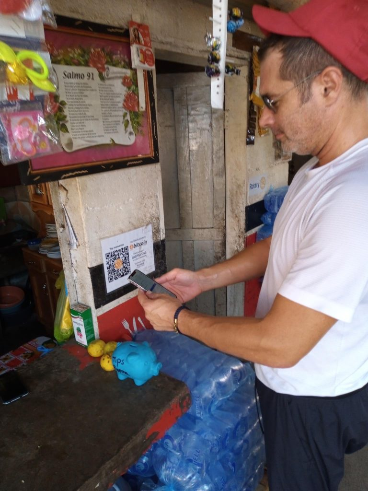

# Benki ya Bitcoin kwa Jumuiya: Masomo Yanayopatikana kutoka Bitcoin Beach

na Galoy Money [2021/11/10](https://galoy.io/bitcoin-banking-for-communities-lessons-learned-from-el-zonte/)

<LanguageDropdown/>

## Dibaji

Mabadiliko ya kimapinduzi kwa kawaida huchochewa na wale ambao ni wachanga sana na wasio
na akili kuyafanya kuelewa kwamba ahadi yao inaelekea kushindwa. Ingawa siwezi kudai udhuru
wa ujana, wakati Bitcoin Beach ilizinduliwa, nashiriki nilikuwa bado alitumia muda wa kutosha
juu ya Twitter "jua" kwamba Bitcoin haitawahi kutumiwa na watu kununua kikombe cha kahawa.
Laiti tungefanya utafiti wa busara au ulioanza na upembuzi yakinifu wa kawaida, tungegundua
yetu upumbavu. Asante wengi wenu sasa mnaweza kupata El Salvador kwenye ramani kwa
sababu tulikuwa wajinga sana kujua vizuri zaidi.

Kwa upande wa Bitcoin Beach, ukweli mara nyingi ni mgeni kuliko hadithi za uwongo. Hakuna
mtu angeweza ilifikiria kuwa uchumi wa kwanza wa kweli wa Bitcoin ungepata mwanzo wake
katika kijiji kidogo cha vijijini El Salvador. Wakiongozwa na mwananchi wa makamo ambaye bado
anatumia barua pepe ya Earthlink, akishirikiana na a kiongozi kijana wa jamii ya Salvador ambaye
alimaliza kwa shida darasa la 6.

Kwa kuangalia nyuma, matokeo yalikuwa dhahiri: idadi ya watu ambayo inapambana na umaskini
na ukosefu wa ushirikishwaji wa kifedha daima ulipangwa kuona thamani ya Bitcoin kabla ya tajiri
jamii huko Singapore au Silicon Valley. Inaonekana inafaa kimungu - wale ambao walitengeneza
barabara njia ya kwanza ilianza isiyo na sifa kiasi kwamba hakuna jumuiya inayofuata inayohitaji
kuhisi kutishwa.

Huko El Salvador, Bitcoin ni pesa za maskini na zilizotengwa kifedha. Kwa Wasalvador ambao
wanaishi katika umaskini, mijadala kati ya kambi za fedha za kidijitali na dhahabu za kidijitali
inaonekana nje ya kugusa, na bila umuhimu wa vitendo. Kwa wale wanaohitaji Bitcoin zaidi, ni
jinsi gani wananunua mkate wao wa kila siku na jinsi wanavyoweka akiba kwa ajili ya siku zijazo.
Hawaoni haja ya kuchagua moja au nyingine.

Kwa hivyo hapa mnamo 2021 tunaona taifa dogo masikini likionyesha ulimwengu jinsi viwango
vya Bitcoin uwanja wa kuchezea maskini. Tunajua Bitcoin Beach ni mtazamo tu. Lakini tunatarajia
itakuwa cheche inayowasha moto kote ulimwenguni. Tunakualika uje kutembelea El Zonte, na
usaidizi sisi kueneza maono haya ya jamii Bitcoin Banking kwamba ni kuwezesha ushirikishwaji
wa kifedha kote Dunia.

– Mike Peterson ([@bitcoinbeach](http://twitter.com/bitcoinbeach))

## Kutoka Mradi wa Ndani hadi Zabuni ya Kisheria katika Miaka Miwili

Mradi wa Bitcoin Beach ulianza kwa swali rahisi lakini la kutamani: Je, tunaweza kujenga a uchumi
endelevu wa mzunguko kwenye Bitcoin?

Jibu ni jibu ndiyo. Kilichoanza kama mradi wa jamii katika mji wa mbali kina Ilibadilika kuwa
hadithi kuhusu watu milioni sita wakionyesha ulimwengu kuwa Bitcoin ni pesa.

Katika mwongozo huu tunashughulikia masomo sita tuliyojifunza kutengeneza Bitcoin Beach
Wallet na miundombinu ya chanzo huria inayoiwezesha. Lengo letu ni kusaidia jamii
zinazotuzunguka Ulimwengu huharakisha ujifunzaji wao wenyewe na kupitishwa kwa Bitcoin na
Mtandao wa Umeme.

## Bitcoin Beach ni nini?

Kwenye Pwani ya Pasifiki ya El Salvador kuna El Zonte, mji mdogo wa kuteleza na mawimbi wenye
wakazi 3,000. Wakazi wake wameachwa nje ya mfumo wa kawaida wa benki na wamejitahidi na
vurugu za magenge na ukosefu wa ushirikishwaji wa kifedha kwa miongo kadhaa. Katika kipindi
cha miaka kumi iliyopita, a kikundi kidogo cha watu binafsi wamekuwa wakifanya kazi ya kuwasha
mabadiliko na kurudisha matumaini kwa El Zonte.

Jorge Valenzuela, Roman “Chimbera” Martinez na Mike Peterson walianza kukimbia vijana
programu karibu 2009 ili kuwapa watoto wa El Zonte fursa ya kucheza, kujifunza na kuota. Kutoka
surf "para todo" (kuteleza kwa kila mtu) kwa madarasa ya kompyuta kwa miradi ya huduma ya
jamii inayolipwa, programu zimepumua uwezekano mpya katika sehemu ambayo hapo awali
ilihisi kama mwisho mbaya.

<figure>
  <figcaption>Jorge, Chimbera na timu wameweka usawa, elimu na huduma ya jamii katikati mwa maisha ya kila siku huko El Zonte. (Chanzo: <a href="https://twitter.com/romanmartinezc/status/1429081008012505091?s=20">Twitter</a>)</figcaption>
</figure>

Mnamo 2019, Mike alifikiwa na mtu ambaye alitaka kuunga mkono programu zao kupitia
mchango wa bitcoin. Kulikuwa na samaki, hata hivyo: mchango lazima utumike ndani jamii,
badala ya kuuzwa katika fiat. Lengo litakuwa kuunda duara endelevu Uchumi wa Bitcoin ambapo
wafanyabiashara na wanajamii wanaweza kubadilishana bidhaa, huduma na kazi kwa sati. Jorge
na Mike walikubali changamoto hiyo, na Bitcoin Beach ilizaliwa.

Tangu mwanzo, ilikuwa wazi kuwa mradi huu ungepinga mawazo ya awali kuhusu Bitcoin:

1. **Bitcoin ni mali ya kubahatisha kwa matajiri.** Ukisikiliza habari za biashara njia na tovuti,
utasikia majadiliano ya mara kwa mara kuhusu bei, tete, na kulinganisha na mali nyingine
na uwekezaji kama dhahabu na hisa. Utasikia kuhusu jinsi benki zinavyotoa fursa kwa
wateja wao wenye thamani ya juu. Nini huwezi kusikia ni jinsi Bitcoin inavyowezesha
uwezo wa kiuchumi katika baadhi ya sehemu maskini zaidi za Dunia.

2. **Bitcoin ni duka la thamani, sio njia ya kubadilishana.** Wakati matumizi ya Bitcoin kama a
Hifadhi ya thamani inakubalika sana, Bitcoin kama njia ya kubadilishana ni ya moto sana
mada inayobishaniwa hadi leo. Mantiki huenda; "Ikiwa bei ya bitcoin inaendelea kukua
kwa kiwango cha sasa, hakuna mtu atakayetaka kuitumia kwa bidhaa na huduma."

Mradi ulipogeuka kutoka kwa wazo hadi hatua, timu inayokua ya waratibu wa Bitcoin Beach Na
wanafunzi walizingatia shida ambazo Bitcoin inaweza kutatua kwa jamii yao:

1. **Benki za kitamaduni hazifanyi biashara katika jamii maskini zaidi.** El Salvador imekuwa
kwenye mfumo wa Dola ya Marekani tangu 2001, ambayo inafanya sekta yao ya kifedha
chini ya kanuni za Marekani. Gharama kubwa ya kufuata iliyowekwa na kanuni hizi
inakataza benki kutoa huduma kwa watu katika nchi masikini. Kwa mfano wakati Mmiliki
wa [Hoteli ya Garten](https://www.gartenzonte.com/garten) alijaribu kuweka wafanyikazi na akaunti za benki na moja kwa moja
amana, [alijifunza](https://youtu.be/RhoiOzhuBG4?t=1438) ingegharimu $50 kwa mwezi, kwa kila mfanyakazi. Hiyo ni sawa na zaidi
ya 10% ya mapato ya kila mwezi ya mtu anayefanya kazi kwa mshahara wa chini.

2. **Kupata malipo ya kutuma pesa kwa watu wa El Zonte ni ghali na kunatumia muda.**
Malipo ya kutuma pesa kwa mipaka kwenda El Salvador yalikuwa [23% ya Pato la Taifa](https://www.cnbc.com/2021/09/09/el-salvador-bitcoin-move-could-cost-western-union-400-million-a-year.html)
katika 2020. Inagharimu zaidi ya $3 katika ada kwa mtu kupokea $10. kutoka kwa
mwanafamilia nje ya nchi. Hakuna Western Union huko El Zonte kwa hivyo inaweza
kuchukua masaa na safari nyingi za basi kwa wakazi kufika ofisini ambapo wanaweza
kupokea utumaji pesa. Hii ni pamoja na siku zinazoweza kuchukua kwa pesa kufika El
Salvador kutoka kwa mtu aliyeanzisha uhamisho.

3. **Ni vigumu kuokoa bila kupata mfumo wa benki.** Kutokuwa na "benki" haizuii tu mtu
kuwa na akaunti ya benki. Pia inawatenga kutoka kwa kupata aina ya uwekezaji na mali
inayoweza kuwalinda mfumuko wa bei. Athari isiyotarajiwa ya kuanzishwa kwa Bitcoin
ilikuwa idadi ya watu ambao walianza kuokoa sehemu ya maana ya mapato yao kwa mara
ya kwanza katika maisha yao.

<figure>
  <figcaption>Timu ya Bitcoin Beach ilijitolea kusaidia jumuiya yao kufanya shughuli za kidijitali kwa kutumia Bitcoin. (Chanzo: <a href="https://twitter.com/romanmartinezc/status/1401672924092841984?s=20">Twitter</a>)</figcaption>
</figure>

Pamoja na bitcoin kuongeza ukuaji wa mradi wao, timu ilianza kufanya kazi. Walianza kupanda
jamii mtu mmoja kwa wakati kwenye mtandao wa Bitcoin. Walijifunza, kuelimika na ilichukuliwa
njiani. Kufika kwa janga hilo mapema 2020 kulitumika kama kuongeza kasi kwa Kupitishwa kwa
Bitcoin. Wakazi wa El Zonte ambao walihitaji msaada waliweza kupata bitcoin michango
iliyotolewa na mradi wa Bitcoin Beach.

[Makala ya 2020 ya Forbes](https://www.forbes.com/sites/tatianakoffman/2020/07/14/this-el-salvador-village-adopts-bitcoin-as-money/?sh=723af6ac2044) yalielekeza Bitcoin Beach kwenye uangalizi na kuanza kuvutia usaidizi
ya Bitcoiners wengine ambao walitaka kusaidia. Mmoja wa hawa Bitcoiners alikuwa Nicolas
Burtey, mwanzilishi mwenza wa Galoy, ambaye alijitolea kuja El Zonte kutengeneza pochi
iliyoundwa kwa ajili ya mahitaji ya Bitcoin Beach. Muda si muda, Bitcoin Beach Wallet ilizaliwa,
na Bitcoin Mradi wa ufukweni ulikuwa ukishika kasi kuelekea kutimiza maono yake.

Kufikia sasa watu wengi wanajua mwisho wa hadithi: Rais wa El Salvador Nayib Bukele ilitangaza
mnamo Juni 5, 2021, kwamba Bitcoin itakuwa zabuni halali nchini. Bukele kuhusiana na Nafasi za
Twitter kwamba serikali iliongozwa na mradi wa Bitcoin Beach na kwamba lengo la sheria hiyo
lilikuwa kuiga kile kilichotokea El Zonte kwa nchi nzima. Alitaja haswa kuwa ujumuishaji wa
kifedha wa wanachama masikini zaidi wa Salvador jamii ilikuwa motisha ya kuendesha. Mnamo
Septemba 7, 2021, La Ley Bitcoin ("Sheria ya Bitcoin") ilianza kutumika. Bitcoin Beach tangu
wakati huo imekuwa sehemu kuu ya kupitishwa kwa Bitcoin kimataifa hadithi. Imevutia
Bitcoiners kutoka duniani kote ambao wanataka kuona jinsi ilivyo kutumia ameketi juu ya
kahawa, masomo surf, na steak. Pia imekuwa mfano kwa wengine jamii kuiga.

Muhimu zaidi, Bitcoin Beach imeunda jumuiya ambapo watoto wa El Zonte wanaweza ndoto na
kujenga maisha yao ya baadaye.

## Mkoba wa Bitcoin Beach

Bitcoin Beach Wallet ni suluhisho la benki ya jumuiya ya Bitcoin ya chanzo huria. Moja hiyo
iliundwa ili kukidhi mahitaji ya wafanyabiashara na wanajamii huko El Zonte. Ni hutumia muundo
wa ulezi wa pamoja wa multisig ambao hutoa mbadala kwa kiwango masuluhisho yasiyo ya ulezi
na ya ulezi ambayo yanapatikana kwa wingi leo.

<figure>
  <figcaption>Cristina anatumia Bitcoin Beach Wallet kuuza sabuni zilizotengenezwa kwa mikono. Wateja wanawezakumlipa kupitia jina la mtumiaji, kwa kuchanganua ankara kwenye simu yake, au kwa kutembelea <a href="https://ln.bitcoinbeach.com/Jackie_Valenzuela">ukurasa wake wa ankara</a>. (Chanzo: <a href="https://twitter.com/romanmartinezc/status/1446661818735288320?s=20">Twitter</a>)</figcaption>
</figure>

Ndani ya Bitcoin Beach Wallet, mtaji hukusanywa na kusimamiwa na jumuiya. Hii hutoa manufaa
kwa wanachama wote ndani ya jumuiya:

- Vituo vya umeme vinadhibiƟwa kwa wanachama; hakuna gharama ya kufungua/kufunga njia
- Malipo ya bure na ya papo hapo ya "Intra ledger" yanapatikana ndani ya jumuiya
- Matumizi bora ya seva za mtandaoni yanamaanisha gharama ya chini kwa kila mtumiaji
ikilinganishwa na Mbadala wa kila mfanyabiashara kuwa na seva yake mwenyewe
- Ada zinaweza kupunguzwa kwa kuunganisha miamala kwenye mnyororo

Vipengele vya ziada katika programu husaidia kusaidia juhudi kuelekea uchumi endelevu wa
Bitcoin:

- Uwezo wa kulipa kupiƟa anwani ya Bitcoin, ankara ya umeme au jina la mtumiaji binafsi
- Salio lililounganishwa la on-chain na Radi, inayoonyesha salio katika USD na sats
- Rekodi ya miamala huonyesha historia ya malipo kaƟ ya watumiaji
- Ramani rafiki ya vifaa vya mkononi huonyesha biashara zote za ndani zinazokubali malipo ya
Umeme
- Watumiaji wa anwani ya tovuƟ wanaweza kushiriki ili kupokea bitcoin kutoka kwa mtu yeyote
aliye na Umeme mkoba unaoungwa mkono (tazama: [ln.bitcoinbeach.com/bitcoinbeach](http://ln.bitcoinbeach.com/bitcoinbeach))

Ikiwa una nia ya kujenga programu ya simu ya mbele kama Bitcoin Beach Wallet unaweza kufikia
hazina ya [galoy-mobile](https://github.com/GaloyMoney/galoy-mobile) kwenye GitHub.

Bila kuchelewa zaidi, haya ni masomo ya juu ambayo Galoy alijifunza kutoka kwa ujenzi huko El
Zonte.

## Somo la kwanza: Elimu ni Muhimu

Bitcoin ni jambo gumu kuelewa. Inapitia sayansi ya kompyuta, uchumi, historia, cryptography,
sera ya fedha, na zaidi. Kwa bahati nzuri, mtu haitaji kufahamu kikamilifu Bitcoin kutumia na
kufaidika nayo. Ni watu wangapi ambao wametumia fiat maisha yao yote kweli unaelewa jinsi
pesa inavyofanya kazi?

<figure>
  <figcaption>Kuwaonyesha Wasalvador jinsi ya kutumia Bitcoin ni mchakato unaoendelea kwa Jorge na Bitcoin Timu ya pwani. (Chanzo: <a href="https://twitter.com/romanmartinezc/status/1420951261675929601?s=20">Twitter</a>)</figcaption>
</figure>

Hapa kuna vidokezo vitano vya kuzingatia unapoelimisha jamii yako:

1. **Waratibu wa jumuiya ni muhimu kwa mchakato wa kuabiri.** Kuwa na mtu wa ndani timu
ya wapandaji huhakikisha watu wanaanza kwa mguu wa kulia. Hii ni hasa muhimu katika
jamii ambapo Bitcoin inatoa fursa ya kufanya miamala kidijitali kwa mara ya kwanza.
2. **Inafaa zaidi kuwaonyesha watu jinsi ya kutumia Bitcoin kuliko kuwaambia kuihusu.**
Kusaidia watu kupakua na kuingiliana na pochi, na kuwafanya watume na kupokea siti ni
bora zaidi kuliko kujaribu tembe za chungwa kwa mawazo.
3. **Wafundishe watoto. Watapanda wazazi wao.** Watoto wa El Zonte walikuwa wepesi
kujifunza jinsi ya kutumia Bitcoin. Wao kwa upande wao waliwasaidia wazazi wao kwenye
bodi nyumbani.
4. **ATM za Bitcoin husaidia kuunganisha nukta za kiakili kati ya Bitcoin na fiat.** A Bitcoin
ATM imeonekana kuwa nyenzo muhimu kwa mchakato wa kuabiri. Wakati watu ni
wanaweza kubadilisha bitcoin katika pochi yao ya rununu kwa pesa zao za ndani,
wanaunda a uhusiano wenye nguvu na wazo la Bitcoin kama pesa.
5. **Saidia watu kutarajia na kupanga kwa tete ya muda mfupi.** Weka matarajio yako jumuiya
inaweza kuwa tayari kwa kushuka kwa bei ya Bitcoin. Fikiria mpango huo hulipa wauzaji
ambao salio lao la akaunti hupungua kutokana na mabadiliko ya bei kipindi cha awali cha
upandaji hadi faraja yao na Bitcoin itakapowekwa.

Unapojenga jumuiya yako, pata muda wa kuungana na kujifunza kutoka kwa watu wa [Ufukwe wa Bitcoin](http://bitcoinbeach.com/). Ni majitu ambayo unaweza kusimama kwenye mabega yao. Kujitolea kwao huduma
ilikuwepo kabla ya Bitcoin, na inapita Bitcoin. Bitcoin sasa imekuwa kati ambayo kupitia kwayo
wanaweza kuleta fursa na matumaini kwa mustakabali wa El Salvador.

## somo la pili Umeme ni Kasi ya Bitcoin kama Pesa

Mtandao wa Umeme ndio itifaki isiyokadiriwa zaidi ulimwenguni. Miaka miwili tu iliyopita ilikuwa
ni njia ya #uzembe kufanya shughuli. Sasa inatumiwa na McDonalds, Starbucks na Pizza Kibanda
huko El Salvador. Ukuaji wa nodi, mikondo, na uwezo unatokea kwa kasi ya ajabu kasi. Ripoti ya
hivi karibuni ya Utafiti wa Arcane "[Hali ya Mtandao wa Umeme](https://www.research.arcane.no/the-state-of-lightning)" hutoa angalia baadhi ya vipimo
na matarajio ya ukuaji.

Bitcoin Beach awali ilitumia shughuli za mtandaoni kusambaza bitcoin ndani ya jumuiya. Wakati
on-chain ilifanya kazi kwa mipangilio ya elimu na kuhamisha seti kwa wanachama wa jamii,
mapungufu yake yakawa kikwazo cha maendeleo kuelekea uchumi wa mzunguko.

Wasalvador walipata uzoefu jinsi matumizi ya Bitcoin kama njia ya kubadilishana yalivyo mdogo
bila safu ya mitandao miwili kama Umeme:  

1. **Ada za mtandaoni zilikuwa ghali sana kuwezesha matumizi ya kila siku.** Wakazi wa El Zonte
anahitaji kuwa na uwezo wa kutumia kiasi kidogo cha dola, kama vile senti 50 kwa pupusa.
2. **Kutumia bitcoin kwenye mnyororo kwa shughuli za rejareja hutengeneza "vumbi."**
Ufukwe wa Bitcoin alipata "[tatizo la miamala ya vumbi](https://bitcoin.stackexchange.com/questions/10986/what-is-meant-by-bitcoin-dust)" moja kwa moja. Matokeo ya
muamala ambayo hayajatumika (UTXOs) hurekodi jinsi thamani inavyosogezwa kwenye
msururu wa saa. Wakati thamani ya UTXO inakuwa chini ya gharama ya kuitumia, bitcoin
inachukuliwa kuwa haiwezi kutumika "vumbi."
3. **Katika mpangilio wa reja reja, chochote chini ya utatuzi wa papo hapo huleta msuguano kwa biashara na walaji.** Bitcoin imeundwa kwa usalama na kutoharibika kwenye safu ya
kwanza. Haikusudiwi kwa kasi na upitishaji wa shughuli.

<figure>
  <figcaption>Umeme huwezesha malipo ya haraka, rahisi kutumia na ya bei nafuu ambayo wafanyabiashara wanahitaji mpangilio wa rejareja. (Chanzo: Galoy)</figcaption>
</figure>

Safu mbili za Mtandao wa Umeme ni teknolojia ambayo inaweza kuinua mfumo wa rejareja wa
urithi na kuleta ahadi ya Bitcoin kama pesa kwa ulimwengu. Waanzilishi wenzetu waliandika juu
ya hii katika makala ya 2020 "[Umeme kama Mfumo wa Malipo ya Rejareja?](https://galoy.io/lightning-as-a-retail-payment-system/)"

Mtandao wa Umeme ulitumika kama kiongeza kasi na kuwezesha maono ya Bitcoin Mradi wa
pwani. Bila hivyo, kutumia Bitcoin kama pesa huko El Salvador itakuwa ngumu zaidi na ghali zaidi;
inaweza hata kuharibika au angalau kuchelewesha mradi.

Ujumuishaji wa Mtandao wa Umeme umekuwa vigingi vya mezani kwa pochi au huduma zozote
za kifedha inajengwa kwa Bitcoin. Inafungua uwezekano mkubwa wa karibu-bure, kimataifa,
wakati halisi, shughuli zisizo na ruhusa.

## Somo la tatu: Upandaji wa Wafanyabiashara ni Muhimu Ili Kukuza Uchumi wa Mduara wa Mitaa

Kusimama kwa uchumi wa mviringo wa Bitcoin hutoa shida ya "kuku na yai". Wakazi wanahitaji
maeneo ya kuitumia, na wafanyabiashara wanahitaji wateja ambao watatumia. Kuifanya iwe
rahisi na kuhitajika kukubali Bitcoin ni hatua muhimu katika kuchochea uasili wa jumuiya ya
wenyeji.

Lengo kuu ni kufanya kupokea bitcoin haraka, rahisi, na kwa bei nafuu kuliko nyingine yoyote
fedha au njia za malipo.

<figure>
  <figcaption>Mama Rosa (pichani akiwa na mtoto wake Jorge) alikuwa mfanyabiashara wa kwanza huko El Zonte kukubali Bitcoin. (Chanzo: <a href="https://twitter.com/romanmartinezc/status/1387105142030352387?s=20">Twitter</a>)</figcaption>
</figure>

Hapa kuna baadhi ya matukio ambayo yalichangia jinsi tunavyobuni wafanyabiashara:

1. **Usiwafanye wafanyabiashara kufikiria kuhusu ubadilishaji wa sarafu.** Kupunguza mzigo
wa akili inahitajika kukokotoa bei kwa kuonyesha kiasi cha dola (au sarafu ya ndani) na
bitcoin kiasi kwenye salio, ankara na skrini za historia ya muamala.
2. **Washa njia nyingi za wauzaji kulipwa. Wafanyabiashara hawapaswi kufanya hivyo kuunda ankara kwa kila shughuli.** Kwa kutumia Bitcoin Beach Wallet, wateja wanaweza
lipa kupitia jina la mtumiaji, msimbo wa QR uliochapishwa, ukichagua mfanyabiashara
kwenye ramani, au kutumia kurasa za ankara ambazo kila mtumiaji anaweza kushiriki
katika ln.bitcoinbeach.com/[jina la mtumiaji].
3. **Fanya mchakato unahitaji muda kidogo, umakini, na kubofya.** Hatua ya mageuzi ya El
Wafanyabiashara wa Zonte walikuja wakati Galoy aliwawezesha wateja kuweka kiasi cha
ankara. Wafanyabiashara hawahitaji tena kuacha kile wanachofanya ili kuunda ankara.
Wanaweza angalia tu tahadhari kwenye simu zao ili kuthibitisha malipo yameingia. Bitcoin
ni sasa rahisi kukubalika kuliko pesa taslimu au mkopo.
4. **Unda vivutio vya mfanyabiashara ili kusaidia kuhimiza uasili mapema.** Huko El Zonte.
kulikuwa na mpango wa "kurejesha pesa" kwa wiki chache, ambapo wafanyabiashara
walipata 20% kurudi kwenye bitcoin yao. Aina hii ya ofa husaidia kuendesha majaribio na
kuchangamsha mapema ukuaji wa uchumi wa mzunguko.

Usiache kuzingatia jukumu muhimu ambalo wafanyabiashara wanacheza katika kusaidia uchumi
wa Bitcoin. Mahitaji ya wafanyabiashara katika kila jumuiya yatakuwa tofauti, kwa hivyo
hakikisha kuwa umetumia muda kuelewa na kubuni kwa ajili yao mapema.

## Somo la nne: Uzoefu wa Mtumiaji Lazima Uendelezwe Ndani Muktadha wa Jumuiya

Bitcoin Beach ipo kwenye mpaka wa kupitishwa kwa Mtandao wa Umeme. Kama vile Mike
anavyosema mara nyingi "Hapo ni watoto wadogo huko El Zonte ambao hufanya miamala mingi
ya Umeme kuliko OG Bitcoiners wengi."

Kadiri uchumi wa Bitcoin unavyokua, timu ilizingatia mahitaji ambayo hayajafikiwa na utendaji
unaotarajiwa ambayo ingesaidia kurahisisha maisha kwa wakazi na wafanyabiashara. Kuwa chini
huko El Zonte alitoa ufahamu wa thamani kwa Nicolas alipokuwa akitengeneza Bitcoin Beach
Wallet.

<figure>
  <figcaption>Kutazama watu wakitumia Bitcoin kwa wafanyabiashara kote El Zonte kumetoa maarifa muhimu kwa muundo wa bidhaa na huduma. (Chanzo: Galoy)</figcaption>
</figure>

Kumbuka: Kumbuka kwamba ni muhimu kufanyia majaribio programu na huduma zako ndani ya
jumuiya ambao wamekusudiwa. Fanya utafiti wako mwenyewe.

Mafunzo sita ya uzoefu wa mtumiaji kutokana na kujaribu Bitcoin Beach Wallet porini:

1. **Usichukulie kuwa muunganisho thabiti wa intaneti kirahisi.** Kuendeleza kwa maeneo
yenye muunganisho wa doa unaweza kuhitaji uboreshaji na uvumilivu wa makosa katika
kiwango cha mtandao hiyo kwa kawaida isingehitajika nchini Marekani.
2. **Uwekaji wa programu unatoa fursa nzuri ya elimu.** Pwani ya Bitcoin Wallet ina chemsha
bongo iliyojengewa ndani ambayo huwasaidia watumiaji kupitia utangulizi mfupi wa
Bitcoin. Kila moja swali humtuza mtumiaji kwa viti ili kuziondoa sifuri tangu mwanzo.
3. **"Sats ni kiwango," lakini USD bado ni kitengo cha akaunti.** Watu wanafikiri katika zao
fedha za ndani, si anakaa, wakati onboarding kwa Bitcoin. mpito kwa kufikiri katika anakaa
ni taratibu, fedha za ndani zinapaswa kuwa kitengo cha akaunti wakati wa kuleta mpya
jamii kwenye mtandao.
4. **Ongeza mwingiliano unaounganisha wateja na wafanyabiashara.** Kichupo cha ramani
katika Bitcoin Beach Wallet huwasaidia wateja kupata maeneo ambayo wanaweza
kutumia Bitcoin. Ni pia huwezesha miamala ya haraka na rahisi kwa kumruhusu mteja
kuunda na kulipa ankara.
5. **Hati za malipo husaidia kuhifadhi kumbukumbu.** Wateja na wafanyabiashara wanaweza
kufaidika kwa kuweza kuongeza madokezo kwenye miamala. Kulingana na maoni ya jamii
kipengele kimebadilika kutoka kwa faragha (katika kiwango cha mtumiaji) hadi
kushirikiwa. Sasa mtumaji na mpokeaji anaweza kuona noti iliyoambatishwa kwenye
muamala.
6. **Stay on top of how lightning payment formats are evolving.** New payment formats such as Lightning Address, static invoices and BOLT 12 are emerging at a rapid pace. Selecting which formats to adopt will depend on the use case. The Bitcoin Beach Wallet initially launched with a printed QR code that led to an invoice page (such as ln.bitcoinbeach.com/mamarosa). New formats are now being considered in order to reduce friction and improve interoperability.

## Somo la tano: Utunzaji wa Jamii ni Daraja la Kujitunza

Kujitunza ni hali ya mwisho inayotarajiwa kwa kila mtu aliye na mali kwenye bitcoin. Nambari
sheria moja ya uhifadhi wa Bitcoin ni "Sio funguo zako, sio sarafu zako."

Kujitunza sio njia pekee, wala njia mwafaka zaidi kwa jumuiya za ndani dhana na mazoezi ya
kutumia Bitcoin.

> "Lazima uchukue hatua za mtoto. Ikiwa uliweka vikwazo hivi vyote, hapo mwanzo, watu
hawatawahi kuingia katika mfumo wa ikolojia." – Mike Peterson kwenye [Tales from the Crypt #173](https://open.spotify.com/episode/6jyXUPu4n3nYDi4jbDFYBd?si=gSLNHJpUQk2ASevhiSBz-A)

### Wigo wa ulinzi wa Bitcoin

Aina za uhifadhi wa Bitcoin hukaa kando ya wigo, sio tofauti na wigo wa urahisi/faragha. Kwa
upande mmoja, una UX rahisi, ufikiaji rahisi wa pesa, na ujumuishaji kwenye fiat mfumo ikolojia
wa benki. Kwa upande mwingine, una chuma kilichopigwa kwa mkono, misemo ya mbegu
iliyokatwa, na miundo ya kuhifadhi sahihi nyingi ambayo inahitaji hatua nyingi au watu wengi
kuhamisha fedha.

Kesi tofauti za utumiaji zina hali tofauti za hatari ambazo hufanya biashara kukubalika. Kwa kwa
mfano, kuhifadhi mali katika akaunti ya benki kwa ujumla huonwa kuwa salama zaidi kuliko
kubeba kama pesa taslimu kwenye pochi, lakini ukibeba kiasi kidogo cha pesa kwa ununuzi wa
kila siku hutoa urahisi.

<figure>
  <figcaption>Bitcoin Beach Wallet hutoa chaguo la ulinzi la pamoja ambapo fedha zinaweza kuhifadhiwa ndani jamii.</figcaption>
</figure>

Kila modeli ina thamani, mradi tu 1) inatumika kwa kusudi linalofaa na 2) inaongoza watu zaidi
upande wa kulia wanapokusanya utajiri wao zaidi katika bitcoin.

### Utunzaji wa jamii: kurejea enzi za benki za muungano

Mtindo wa ulinzi ambao tulitua kwa Bitcoin Beach ndio Galloy inarejelea "Uhifadhi wa jamii." Ni
suluhisho la saini nyingi ambapo funguo za pesa kwenye baridi uhifadhi unashikiliwa na
wanajamii imara. Mfano huu unapunguza kutegemea makampuni ya serikali kuu nje ya jumuiya
huku pia kupunguza msuguano wa kuwaingiza wanachama kwenye mtandao.

### Ujumbe juu ya benki ya jamii

Benki za jumuiya zimekuwepo duniani kote kwa mamia ya miaka. Kusudi lao kuu ni kusaidia
mahitaji ya kijamii na kiuchumi ya kikundi cha watu wenye nia ya pamoja. Zaidi ya maslahi ya
pamoja yanajikita katika eneo la kijiografia. Fedha zinazomilikiwa na benki za jamii hutolewa na
kukopeshwa kwa watu ndani ya jamii kwa kuendeshwa zaidi na uhusiano njia kuliko kawaida ya
benki ya ulimwengu.

Benki za jumuiya ni muhimu hasa kwa jumuiya kama El Zonte kwa sababu wao kuwezesha
maamuzi kufanywa ndani ya nchi kwa kuzingatia maslahi ya wanajamii.

[Ufumbuzi wa benki ya Bitcoin wa chanzo huria](https://galoy.io/products/) wa Galoy umejengwa ili kuwezesha jumuiya
yoyote au taasisi duniani kote kujipanga kwa namna hii. 

Kwa ufahamu zaidi juu ya makutano kati
ya Bitcoin na benki ya jamii, angalia Makala ya Fulgur Ventures "[Jukumu la Bitcoin kwa benki za
jamii.](https://medium.com/@fulgur.ventures/the-role-of-bitcoin-for-community-banking-623068c59882)"

### Bitcoin Beach Wallet kama benki ya Bitcoin ya jamii

Fedha za Bitcoin Beach Wallet zinasimamiwa na wanachama ndani ya jumuiya, zikitoa njia ya malipo isiyo na msuguano na ya gharama nafuu iliyoundwa kusaidia uchumi wa ndani.

Hii ndio sababu ulinzi wa jamii hufanya kazi kwa Bitcoin Beach:

1. **Kuondoa msuguano ni hatua muhimu zaidi ya kuunda athari za mtandao inahitajika kwa mzunguko katika uchumi.** Binadamu kwa asili ni sugu kwa mabadiliko na wepesi wa
kukataa mawazo mapya au kurejea mazoea ya zamani. Kama Mike Peterson alisema
katika yake Juni 2020 mahojiano na Marty Bent: "Lazima uchukue hatua za mtoto. Ikiwa
utaweka yote vikwazo hivi, hapo mwanzo, watu hawatawahi kuingia katika mfumo wa
ikolojia.”
2. **Inaweza kuwa ngumu kuhifadhi vifungu vya mbegu kwa usalama na kwa uhakika katika kijijini na jumuiya zinazoibuka.** Kwa watu wanaoishi katika nyumba zilizo na sakafu ya
udongo na paa za bati, hakuna sehemu salama za kuhifadhi vifungu vya maandishi vya
mbegu. Kutumia maneno ya mbegu pia inatoa masuala kwa watu wasiojua kusoma na
kuandika, jambo ambalo si la kawaida kwa wengi sehemu za dunia.
3. **Watu wanaotumia Bitcoin hustareheshwa nayo baada ya muda.** Wakazi ya El Zonte sasa
wanatuma bitcoin kupitia Mtandao wa Umeme kila siku. Wengine wameanza kuweka sati
na kujikusanyia mali nyingi zaidi kuliko hapo awali ingekuwa na Dola za Marekani. Huu ni
mwenendo wa msukumo ambao Bitcoin Beach ni kusaidia kupitia elimu na mafunzo
kuhusu kujitunza. Maboresho ya UX yatafanyika pia kuendelea kufanya ulinzi binafsi
kufikiwa zaidi na watumiaji zaidi duniani kote.

Suluhu za uhifadhi wa jamii huria zimeibuka kama kielelezo muhimu cha kuelekeza jumuiya
kwa Bitcoin. Tunaamini watakuwa na jukumu kubwa katika kuleta Bitcoin kwa watumiaji
bilioni wa kwanza.

## Somo la sita: Anza Kidogo na Jenga Kasi Kabla Kupanua

Inafurahisha kuona msingi wa jumuiya kote ulimwenguni zikifanya kazi kuungana miji na miji
yao kwa mtandao wa Bitcoin. [Ziwa la Bitcoin](https://twitter.com/LakeBitcoin) huko Guatemala na Ufukwe wa [Bitcoin Brasil](https://twitter.com/bitcoinbeachbr) ni
mifano miwili ya mapema. Wafanyabiashara wengine wa Bitcoin wameanza kuita Tonga
"Bitcoin Island" baada ya kusikia mpango wa [Lord Fusitu’a](https://twitter.com/LordFusitua)  wenye sehemu nne wa kuleta
Bitcoin nchini mwake.

<figure>
  <figcaption>Elimu ya mtu mmoja-mmoja ni sehemu inayoendelea ya mchakato wa kuingiza jumuiya. (Chanzo: <a href="https://twitter.com/romanmartinezc/status/1432898996113133570?s=20">Twitter</a>)</figcaption>
</figure>

Kwa wale wanaoanza tu, tungetoa mawazo makuu mawili juu ya kuongeza kutoka kwa wazo
hadi kwa uchumi:

1. **Kuanzia na jumuiya iliyoainishwa husaidia kujenga msingi imara.** Bitcoin Pwani ilinufaika
kwa kuhudumia idadi ya watu 3,000 ambayo ilikuwa kijiografia kutengwa na vijiji vingine.
Mtazamo huu finyu ulituruhusu kunasa na kuzoea mafunzo kwa wakati halisi ambayo
yalitutayarisha kwa ukuaji mkubwa uliofuata.
2. **Ukuaji hutokea “hatua kwa hatua, kisha ghafla.”** Wakati wa kuleta jumuiya Bitcoin, tarajia
kutumia bidii na wakati mwingi kuabiri watu 50 wa kwanza kuliko elfu ijayo. Kwa sababu
Bitcoin ni mtandao, sheria za jumla za athari za mtandao zitafanya kuomba. Kwa bahati
nzuri, watengenezaji wa Bitcoin, waelimishaji, na makampuni duniani kote wako
kutengeneza zana za kusaidia jumuiya yoyote kuanza.

Watu wengi walisikia kwa mara ya kwanza kuhusu Bitcoin Beach mnamo 2021, lakini mradi huo
umekuwa miaka mingi kutengeneza. Timu ya Bitcoin Beach ambao wamejitolea maelfu ya masaa
kufundisha misingi, kujibu maswali, na masuala ya utatuzi ndio msingi wa mradi huu mzima. Bila
wao, Bitcoin Beach haingekuwa hadithi ya mafanikio unayosoma kuhusu leo.

### Mazingatio ya Kuanzisha Benki ya Bitcoin

Jenga msingi thabiti ukitumia timu, teknolojia na mafunzo sahihi.

<figure>
  <figcaption>"Sisi ni familia kubwa yenye ndoto kubwa." – <a href="https://twitter.com/romanmartinezc/status/1406411850170912769?s=20">@romanmartinezc</a></figcaption>
</figure>

1. **Kusanya timu yako.** Tambua watu ambao wana roho, uchoyo, na shauku ya kuongoza
jumuiya yako kupitia mabadiliko ya mfumo ambayo Bitcoin inawakilisha. Kuna mbili
pembe za msingi za kuzingatia tangu mwanzo:
  - **Ushirikiano wa jumuiya:** Ili kuelewa kiwango hiki cha jumuiya kupanga kunaonekana
kama, fuata tu na ujifunze kutoka kwa [Jorge](https://twitter.com/jorgebitcoinES), [Chimbera](https://twitter.com/romanmartinezc), na [Mike](https://twitter.com/Bitcoinbeach).
    - **Teknolojia:** Kuna mambo mengi ya kuzingaƟa wakaƟ wa kuchagua ufumbuzi wa
teknolojia ambayo unaweza kujenga Bitcoin Bank yako. Kuwa na ufikiaji mtu ambaye
anaweza kukuongoza kupitia maamuzi katika wigo wa Uhifadhi wa Bitcoin, nodi ya
umeme, na usimamizi wa ukwasi, pochi ya joto na baridi matumizi na mambo mengine
yatakusaidia kuweka msingi imara wa ukuaji.
2. **Tafuta chanzo cha ufadhili.** Kupata upatikanaji wa fedha ni hatua muhimu kwa kuanzisha
jumuiya mpya kwa Bitcoin, hasa katika nchi maskini ambako wakazi hawana akiba au
mapato ya ziada. Kuwa na pesa za kulipa kwa ajili ya vifaa na huduma itasaidia kusimama
shughuli, na kusambaza anakaa ndani jamii mwanzoni itahitajika kuchochea mzunguko
katika uchumi
3. **Tafuta suluhisho la kiteknolojia.** Zana za kutoa huduma za kifedha juu ya Bitcoin bado
zinaibuka. [Miundombinu ya benki ya Bitcoin ya chanzo huria](https://galoy.io/products/) ni moja suluhisho ambalo
linalenga kurahisisha jumuiya na taasisi kutoa fedha huduma kwenye Bitcoin na Umeme.
4. **Bainisha muundo wako wa ulinzi na upange usanidi wa saini nyingi (sig nyingi)**. Utunzaji
ni mada ya msingi ambayo inastahili kuzingatiwa kwa undani na kuelewa watazamaji
wako. Kwa jumuiya za Bitcoiners wenye uzoefu, kuwezesha kujitunza ni a lazima.
Unapopanda idadi ya watu wasio na benki, unaweza kuamua kwamba a mfano wa ulinzi
wa jamii kama ule ulioundwa kwa ajili ya Bitcoin Beach ndio unafaa pa kuanzia. Kwa njia
yoyote, hakikisha kuwa unapanga kushikilia pesa za akiba ndani ya sig nyingi kuanzisha.
5. **Tengeneza mpango wa mafunzo na usaidizi wa jamii.** Jumuiya ya Bitcoin ni mkarimu sana
na nyenzo za kielimu na rasilimali zingine, kwa hivyo angalia na uulize karibu kwanza.
Kunaweza kuwa hakuna mahali bora zaidi kuliko "Bitcoin Twitter" kuunganishwa nayo
video, makala, na vipengee unavyohitaji ili kuanza kuabiri jumuiya yako. Weka kumbuka
kuwa utumizi wa Twitter unaweza kuwa mdogo sana katika jumuiya unazozitumia
wanajenga.
6. **Piga mitaa!** Onboarding hutokea mtu mmoja kwa wakati, kwa kupata nje katika jamii na
kuwapa watu fursa ya kupokea na kutuma sati zao za kwanza.

<figure>
  <figcaption>Fuata <a href="https://twitter.com/jorgebitcoinES">Jorge</a> (pictured), <a href="https://mobile.twitter.com/romanmartinezc">Chimbera</a> and Mike Peterson (<a href="https://twitter.com/Bitcoinbeach">@bitcoinbeach</a>) ili uendelee kuwasiliana Safari ya El Zonte.</figcaption>
</figure>

## Hitimisho

Inatia moyo kuona jumuiya na taasisi kote ulimwenguni zikifanya kazi pamoja kila moja nyingine
kuleta Bitcoin kwa watu Bilioni wa kwanza. Tunatumahi kuwa mwongozo huu utasaidia kuongeza
kasi kujifunza na kuhimiza majadiliano mazuri.

Galoy pia anaandaa [Kupitisha Bitcoin: Mkutano wa Umeme huko El Salvador](https://adoptingbitcoin.org/) mnamo Novemba
16-18 kama njia ya ziada ya kuunga mkono kupitishwa kwa Bitcoin na kusherehekea mafanikio
ya Timu ya Bitcoin Beach. Tunanyenyekea kuwa pamoja na watu kama Jorge, Chimbera, Mike na
wengine wengi ambao walileta maono ya uchumi wa mzunguko wa Bitcoin kuwa hai.

Ikiwa ungependa kuona na kutumia msimbo wetu, ni chanzo huria na huria kwenye [GitHub](https://github.com/GaloyMoney/).

Unaweza pia kuwasiliana na twitter [@galoymoney](https://twitter.com/GaloyMoney) na [Slack yetu ya umma]https://join.slack.com/t/galoymoney-workspace/shared_invite/zt-rvnhsdb5-72AZCD_jzw6_Q05aCs0SgA).
