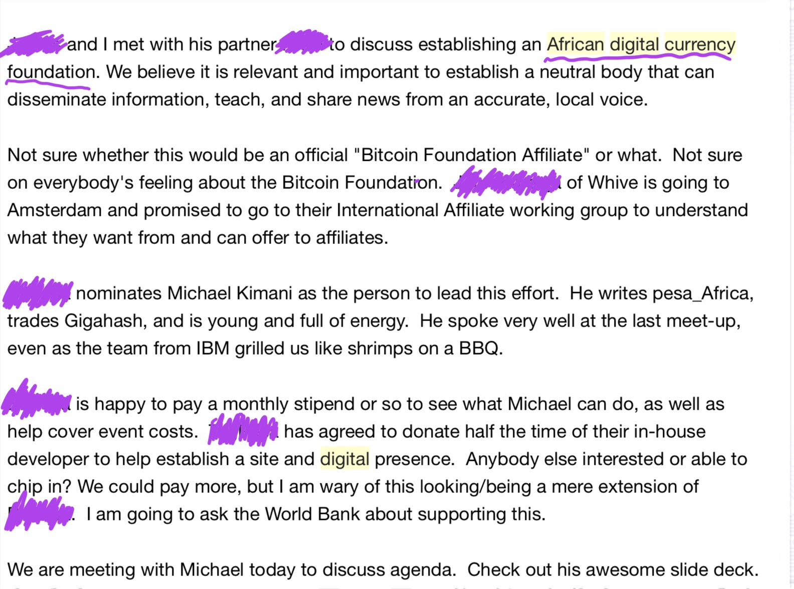

# Bítíkọìnì àti ìtàn àkọọ́lẹ̀ ti ìjọba Kẹ́nyà

Nípasẹ̀ Michael Kimani Kioneki [2022/01/05](https://twitter.com/pesa_africa/status/1357938874845175809)

<LanguageDropdown/>

èyí jẹ́ ìfilọ̀ nípasẹ̀ ilé ìfowópamọ́ tó ńṣàkoso gbogbo ilé ìfowópamọ́ ní ìlú Nàìjíríà, tí ó ńṣe ìdíwọ́ fún àwọn ilé ìgbékalẹ̀ ọ̀rọ̀ owó tí ó wà lábẹ́ òfin láti ṣe ìrọ̀rùn àwọn ìsanwó nínú àwọn pàṣípàrọ̀ owó-kírípútò
 

ójẹ́ oṣù Kejì, ọjọ́ 5, 2021

èyí jọmọ́ ìfilọ̀ tí ó wáyé nípa [àwọn ilé ìfowópamọ́ tó ńṣàkoso gbogbo ilé ìfowópamọ́ ti ìlú Kẹ́nyà 🇰🇪 tí kò gbá àwọn ilé ìfowópamọ́ ìlú Kẹ́nyà láyè láti ṣe ìlànà ìsanwó fún àwọn ìṣọ̀wọ̀ owó oní fáṣúà](https://www.centralbank.go.ke/uploads/banking_circulars/2075994161_Banking%20Circular%20No%2014%20of%202015%20-%20Virtual%20Currencies%20-%20Bitcoin.pdf)

gẹ́gẹ́ bí ọmọ ìlú Kẹ́nyà láti ìlà-óòrùn áfíríkà, mo ní láti fi àwọn ọ̀rẹ́ mi oní kírípútò láti ìlú Nàìjíríà rẹ́rìn. Níparí, wọ́n ní ìrírí ìrora wa láti ọdún keje 7 sẹ́yìn! Ohun púpọ̀ wà látí kó sílẹ̀ níbí, níyìn ni okùn ọ̀rọ̀ kan lórí àwọn èrò alájọṣepọ̀ mi

### oṣù kéje, ọjọ́ 9, 2013

"àpò owó kipochi tí àwọn ará Kẹ́nyà jẹ́ ilé iṣẹ́ kírípútò bítkọìnì tí ó kọ́kọ́ ṣe ìfilọ́lẹ̀ ọjà tí o gba àwọn èèyàn ní Áfíríkà láyè láti ṣe ìfiránṣẹ́ àti ìgbàwọlé ti àwọn Bítkọìnì, pẹ̀lú ṣíṣe ìyípadà wọn sí àti láti owó ìlú Kẹ́nyà M-pesa"

[Kipochi ṣe ìfilọ́lẹ̀ àpò owó Bítkọìnì alámuṣepò ti M-pesa ní Áfíríkà](https://www.coindesk.com/markets/2013/07/09/kipochi-launches-m-pesa-integrated-bitcoin-wallet-in-africa/)

kò ju ìgbà díẹ̀ lọ tí ilé ìfowópamọ́ tó ńṣàkoso gbogbo ilé ìfowópamọ́ ti ìlú Kẹ́nyà àti Safaricom Mpesa fi ìyà jẹ wọ́n

"Nínú ọ̀sẹ̀ kan, àsopọ̀ wa pẹlú M-pesa nípasẹ̀ oníṣọ̀wọ̀ Kopo Kopo di pípadé. Ó gbà wá ju ọ̀sẹ̀ kan lọ fún wa láti wádì pé Safaricom ti fi ipá jẹ́ kí  Kopo Kopo pawádé"

### oṣù kẹ́jọ 2013

Ní oṣù kẹ́jọ, ọdún 2013, Kipochi gba ìfilọ̀ alábẹ́ àṣẹ láti ọ̀dọ̀ ilé ìfowópamọ́ tó ńṣàkoso gbogbo ilé ìfowópamọ́ ti ìlú Kẹ́nyà, wípé wọ́n ní láti mọ ẹni tí a jẹ́, ǹkan tí a fẹ́ ṣe, kí gan ni  Bítkọìnì jẹ́."

[ Kí ló ṣẹlẹ̀ pàtó ní Kipochi?](https://blog.stakeventures.com/articles/what-actually-happened-at-kipochi)

Èyí jẹ́ ìṣẹ̀lẹ̀ ìkíní tí iléṣẹ́ Bítkọìnì kan ní ìlú Kẹ́nyà tí ó pa owó tí ò bamu nípa alábẹ́ òfin (ilé ìfowópamọ́ tó ńṣàkoso gbogbo ilé ìfowópamọ́ ti ìlú Kẹ́nyà) àti àwọn tó ńṣiṣẹ́ ọ̀rọ̀ owó alábẹ́ òfin (Safaricom's Mpesa).  lẹ́yìn ọdún kan sí, mo darapọ̀ mọ́ ilé iṣẹ́ náà mo sì ṣe ìrántí pé mo gbìyànjú láti ṣiṣẹ́ pẹ̀lú Pelle's Kipochi àti àwọn ilé iṣẹ́ òmíràn bi ti Bitpesa

gbogbo wa la ṣiṣẹ́ papọ̀ lórí bí a ṣe lè jẹ́ kí àwọn ilé ìfowópamọ́ àti àwọn tó ńmú ọ̀rọ̀ owó wá sábẹ́ òfin láti ṣe ìrọ̀rùn ìhámọ́ tó wà lórí ìráyè wọlé sí àwọn àkántì ilé ìfowópamọ́. A nílò ìgbìmọ̀ aláyìlẹ́gbẹ́ láti ṣe àtìlẹ́yìn iṣẹ́ èyí

wọ́n fún mi ní ojú ìṣe láti ṣètò ìpínlẹ̀ aláìjèrè. èyí jẹ́ ímeèlì tí ọjọ́ ẹ̀ jẹ́ 14th oṣù kárùn 2014

ilé iṣẹ́ tó kàn tí wọ́n fẹ́ parẹ́ ni Bitpesa. Bitpesa ṣe ìfilọ́lẹ̀ ọjà kírípútò kan tí o gba àwọn ará ìlú Kẹ́nyà láyè láti ra Bítkọìnì nípa lílo Mpesa (Nígbà tó yá, wọ́n ṣe àgbékalẹ̀ tó ta Bítkọìnì). ọjà náà sì ṣe ìpolongo fún ìgbówóránṣẹ́ dé òkèèrè (Kẹ́nyà- ọ̀dẹ̀dẹ̀ UK)

èyí nà ò pẹ́jù 

### oṣù kéjìlá ọjọ́ 18, 2015

[ìkéde CBK](https://www.centralbank.go.ke/uploads/banking_circulars/2075994161_Banking%20Circular%20No%2014%20of%202015%20-%20Virtual%20Currencies%20-%20Bitcoin.pdf)

"ìdí ìkéde yi ni láti ṣe ìkìlọ̀ fún gbogbo àwọn ilé-iṣẹ́ ìgbékalẹ̀ ti ọ̀rọ̀ owó lòdì sí ní ṣiṣẹ́ pẹ̀lú ohunkóhun tó ní ṣe pẹ̀lú àwọn owó fáṣúà. Má ṣe ṣí àwọn àkántì fún ẹni tó bá ní ǹkanṣe nínu Bítkọìnì"

lẹ́yìn ọjọ́ méjì si, CEO Safaricom Bob Collymore sọ̀rọ̀ síta lòdì sí àwọn owó fáṣúà wípé,

"a ò ní ní àdéhùn láti ní àwọn ìdúnàdúrà tó ní ṣe pẹ̀lú Bítkọìnì lórí ìgbékalẹ̀ M-pesa ẹ̀, àyàfi tí owó faṣúà náà bá gba àṣẹ lọ́wọ́ olùtọ́sọ́nà ẹ̀ka ilé ìfowópamọ́

[Collymore sọ pé Safaricom ò ní ri eewu ìbínú ti CBK lórí àwọn ìdúnàdúrà ti Bítkọìnì](https://www.businessdailyafrica.com/bd/corporate/companies/collymore-says-safaricom-will-not-risk-cbk-s-wrath-over-bitcoin-transactions-2103900)

o dàbí ohun tó létò

à ì sí àyè ìbáwọlé sí àkántì ilé ìfowópamọ́  àti ẹnu ọ̀nà agbaṣẹ́ wọlé ti M-pesa ṣe ìparun fún iṣẹ́  Bitpesa. Bitpesa ati Lipisha (Alábaṣepọ̀ ti ẹnu ọ̀nà ìsanwó) gbé ẹjọ́ náà lọ sí ilé ẹjọ́.

[nọ́mbà ìwé ẹ̀bẹ̀ 512 ti 215](http://kenyalaw.org/caselaw/cases/view/117270/)

### oṣù kejìlá, ọjọ́ 28, 2015

Mo fi àkọọ́lẹ̀ ìpinnu ọ̀rọ̀ kan fún ìwé ìròyìn tó ṣíwájú ní ìlú Kẹ́nyà ' The Daily Nation' ṣíṣe ìkọlù fún CBK fún èrò aṣiwèrè ònígbà kúkurú. Mo sọ pé " ọdún mẹ́rin (4) láti ìsinsìnyí àwọn èèyàn máa fi CBK ṣe yẹ̀yẹ́ nítorí ìkéde òní yẹ̀yẹ́ yìí"

Bítkọìnì kan (1) nígbà yẹn jẹ́ $450, ní èní, ó jẹ́ $40,000

oṣù ìkọ́kànlá ọjọ́ 26, 2015

ẹ̀sùn ẹjọ́ tí ilé-iṣẹ́ oní bẹ̀rẹ̀ ti ìsanwó Bítkọìnì Bitpesa àti alábaṣepọ̀ ẹ̀ lòdì sí òmìrán nínú ọ̀rọ̀ owó àgbéká 'Safaricom' ti di o ní gbígbọ́ ní ilé ẹjọ́ gíga ti ìlú Kẹ́nyà ní ọjọ́ ìṣẹ́gun

[ilé ẹjọ́ gíga ti ìlú Kẹ́nyà ṣe gbígbọ́ ẹ̀sùn Bitpesa lòdì sí Safaricom](https://www.coindesk.com/markets/2015/11/26/kenyan-high-court-hears-bitpesa-case-against-safaricom/)

Bitpesa jiyàn pé Safaricom "dẹ́rùba" ẹnu ọ̀nà alábaṣepọ̀ wọn 'Lipisha' nípa fífi agbára mú wọn láti ṣe ìdádúró ṣíṣe wọn ní oṣù ìkọ́kànlá ọjọ́ ìkejìlá 12th láì sọ fún wọn tẹ́lẹ̀, èyí tó ńfún Bitpesa àti Lipisha ní ìpèníjà pàtàkì láti lè ṣètọ́jú iṣẹ́ wọn

Safaricom jiyàn pé ìdádúró iṣẹ́ sí Lipisha jẹ́ ohun tó jàre nítorípé Bitpesa ti kùnà láti gba àṣẹ láti ilé ìfowópamọ́ tó ńṣàkoso gbogbo ilé ìfowópamọ́ ti ìlú Kẹ́nyà nípa gbígbé Bítkọìnì.   Àbájáde ẹ̀ ni pé, àwọn ìdúnàdúrà ti Bitpesa nípasẹ̀ Lipisha àti àkántì ẹ̀ ní Safaricom ṣe ìlòdì sí àwọn òfin AML

Ṣùgbọ́n agbẹjọ́rọ̀ fún ilé iṣẹ́ méjéjì sọ pé Safaricom ti ṣe àìgbọ́yé ohun tí ilé ìfowópamọ́ tó ńṣàkoso gbogbo ilé ìfowópamọ́ fẹ́
[ilé ìfowópamọ́ tó ńṣàkoso gbogbo ilé ìfowópamọ́] sọ fún Bitpesa pé Bítkọìnì kòsí lábẹ́ ìṣàkóso ní ìlú Kẹ́nyà ṣùgbọ́n Safaricom tẹnumọ pé òhun pèsè  ìwé àṣẹ sí ipa yẹn

### oṣù Kejìlá ọjọ́ 15, 2015

Bitpesa pàdánù ẹjọ́ náà

adájọ́ ilé ẹjọ́ gíga ti ìlú Kẹ́nyà ti pàṣẹ pé òṣìṣẹ́ M-pesa 'Safaricom' kòní ní àyè láti fún oníbẹ̀rẹ̀ Bítkọìnì 'Bitpesa' láyè láàrín àríyànjiyàn olófin tó ńlọ lọ́wọ́

[ilé ẹjọ́ ti ìlú Kẹ́nyà fọwọ́sí ìgbèrò láti yọ oníbẹ̀rẹ̀ Bítkọìnì kúrò ní M-pesa](https://www.coindesk.com/markets/2015/12/15/kenyan-court-upholds-bid-to-keep-bitcoin-startup-off-m-pesa/)

Nípa pé kòsí ìráyè sí àkántì ilé ìfowópamọ́  àti àwọn ṣíṣe ti olójú ọ̀nà  tí Mpesa tó ṣe pàtàkì fún àwọn ìmúṣe, Bitpesa yí díẹ̀díẹ̀ kúrò nínú ìṣòwò ní ìlú Kẹ́nyà

Bitpesa jẹ́ ojú ọ̀nà tó ṣe pàtàkì láti ráyè wọlé sí Bítkọìnì (rà àti tà). Nítoríbẹ̀, ìlọkúrò wọn  ní ipa lórí ìwà bí àwọn olùmúlò ṣe ráyè wọ àwọn Bítkọìnì.

Ajànfàní tó tóbi jù lọ ni àwọn ọjà Bítkọìnì  ẹlẹ́gbẹ́ sí ẹgbẹ́ tí kò nílò agbedeméjì pẹ̀lú àwọn ṣíṣe ti ilé ìfowópamọ́ àti ti Mpesa.

Àwọn Bítkọìnì ti àgbègbè jẹ́ àkọ́kọ́ láti ṣé ìpèsè sí ńkan tó gbà. Wo àwòrán atọ́ka ti àwọn ìwọ̀n ìdàgbàsókè yìí láti ìgbà tí Bitpesa ti wà ní ìpadé. Àwọn ìwọ̀n lọ́wọ́lọ́wọ́ millionu 150 ní ọ̀sẹ̀ kan

ẹ wòó, aṣiwèrè ni àwọn olùtọ́sọ́nà wọn ò sì  mọ̀. Nígbà tí o bá pa ojú ọ̀nà àìgbẹ̀fẹ̀ fún rírà àti títà Bítkọìnì dé, ìṣòwò ẹlẹ́gbẹ́ sí ẹgbẹ́ á gbérí sókè nítorí ìwà Bítkọìnì àti owó-kírípútò jẹ́ ẹlẹ́gbẹ́ sí ẹgbẹ́. Àwọn ìdúnàdúrà ti ẹlẹ́gbẹ́ sí ẹgbẹ́ jẹ́ èyí tó gbẹ̀fẹ̀ àti èyí tó wà ní ìpamọ́.

Èyí jẹ́ àwòrán atọ́ka ìwọ̀n ẹlẹ́gbẹ́ sí ẹgbẹ́ ti ìlú Kẹ́nyà sí ọjà ẹlẹ́gbẹ́ sí ẹgbẹ́ òmíràn 'Paxful'. Àwọn ìwọ̀n ọlọ́sọ́sẹ̀, Mílíọ̀nù 178 ní ọ̀sẹ̀ kan láti ọ̀sẹ̀ tí ó kọjá

pẹ̀lú ìdásílẹ̀ bi ti Bitpesa, olùtọ́sọ́nà lé fi ipá ṣe gbígbà nípa ìfi ẹjọ́ sùn onípá àti láti lè ṣe àtẹ̀lé owó tó ńwọlé sínú àti jáde kúrò nínú Bítkọìnì àti àwọn owó-kírípútò

Pẹ̀lú àwọn ọjà ẹlẹ́gbẹ́ sí ẹgbẹ́, ìwà ti ìdúnàdúrà náà jẹ́ aláìṣeńrí nítorí owó lọ kúrò ní àkántì olùmúlò ẹnìkan sí àkántì olùmúlò ẹni òmíràn, ilé ìfowópamọ́, Mpesa àti olùtọ́sọ́nà ò lè sọ ìdí iye owó tó gbé kúrò láti ibì kan lọ sí ibì Kejì. Bótilẹ̀ jẹ́ pé ìṣòwò Bítkọìnì ni

Àwọn Bítkọìnì agbègbè mílíọ̀nù 150 KES ní ọ̀sẹ̀ kan
Paxful Mílíọ̀nù 178 KES ní ọ̀sẹ̀ kan.
Binance P2P (àìmọ̀)
Àwọn kírípútò agbègbè (àìmọ̀)
Àwọn ìṣòwò tí kòsí lórí ayélujára (àìmọ̀)
àwọn ìṣòwò sí ìlú míràn (àìmọ̀) 
Citibank 2018 dábà pé àwọn ọmọ ìlú Kẹ́nyà ní Bítkọìnì oní iye bílíọ̀nù 163 
Paxful "àwọn ọmọ ìlú Kẹ́nyà ṣe ìṣòwò bílíọ̀nù 6 ní 2020"

wòó, kòsí ọ̀nà bí a ṣe lè sọ pàtó iye owó tí o gbà wọlé sínú àti jáde kúrò nínú Bítkọìnì àti àwọn owó-kírípútò. Èyí ní ìdàmú fún àwọn onítọ̀sọ́nà. Wọ́n rò pé àwọn gbọ́n nípa pípa àwọn ojú ọ̀nà àìgbẹ̀fẹ̀ dé. Ṣùgbọ́n ó wá ṣiṣẹ́ fún àtìlẹ́yìn àwọn ìwọ̀n tó gbẹ̀fẹ̀ tó wà ní ìpamọ́

Àwọn ìṣirò aláìsọdùn mi ni

mílíọ̀nù 500 ní ọ̀sọ̀sẹ̀ ní  ìlú Kẹ́nyà 🇰🇪 ìsọdipúpọ̀ nípasẹ̀ àwọn ọ̀sẹ̀ 52, a fẹ́ tó bílíọ̀nù 25 nínú ọdún kan

àwọn ìṣirò aláìsọdùn

ìṣòwò ẹlẹ́gbẹ́ sí ẹgbẹ́ ti Bítkọìnì àti àwọn owó-kírípútò jẹ́ àwòṣe nìkan tó ṣiṣẹ́ pẹ̀lú gbogbo ipò ti àwọn ilé ìfowópamọ́ tó ńṣàkoso gbogbo ilé ìfowópamọ́. Ó ti di ńlá fún ṣíṣẹ̀dá àwọn ànfàní èrè jíjẹ fún àwọn ọ̀dọ́

wo èyí [okùn ọ̀rọ̀](https://twitter.com/pesa_africa/status/1351786081474252800)

ìṣòwò ẹlẹ́gbẹ́ sí ẹgbẹ́ àti ìṣòwò tó gbẹ̀fẹ̀ ti àwọn owó-kírípútò bi ti Bítkọìnì jẹ́ àfikún ewu ààbò ti ayélujára sí ètò owó ti ìlú Kẹ́nyà nítorí pé owó tó wọlé sí inú Bítkọìnì kò ṣe ń gbà padà.

oṣù kẹfà, ọjọ́ 30, 2020

[ẹjọ́ Bítkọìnì ní ilé ẹjọ́ òfin tí Milimani ní ìlú Kẹ́nyà ṣètò sílẹ̀ tó ṣáájú](https://kenyanwallstreet.com/bitcoin-case-kenyas-milimani-law-courts-sets-precedence/)

mo ri bí ǹkan tó panilẹ́rìn pé àwọn olùtọ́sọ́nà ti ìlú Kẹ́nyà àwọn òṣìṣẹ́ lábẹ́ àṣẹ àti àwọn amọ̀ye Fintech rò pé àwọn owó-kírípútò lè di ohun tí èèyàn ò ní rí mọ́, èyí kàn fi ìwà aṣiwèrè wọn hàn ni. Mo ti pàdé ọ̀pọ̀lọpọ̀ wọn nínú ọdún méje mi ṣùgbọ́n kò yé wọn

ọdọdún wọ́n ṣé ìdádúró, àwọn ìwọ̀n tó gbẹ̀fẹ̀ dàgbà sókè

### Oṣù Kejìlá, ọjọ́ 16, 2020

ìlú Ùgándà ṣẹ̀ṣẹ̀ ṣe àwọn àtúnṣe sí òfin tó lódì sí gbígbówó sálọ ti 2013 láti ṣe àfikún àwọn olùpèsè ìṣe ti dúkìá oní fáṣúà. Bóyá ipa kan pàtó tí a lè rí láti ọ̀dọ̀ ìjọba ní agbègbè yẹn láti dásí àwọn ohun tí a sọ lókè

[okùn ọ̀rọ̀](https://twitter.com/pesa_africa/status/1339071354507759616)

oṣù Kejì, ọjọ́ 5, 2020  (báyìí) ọjọ́

nínú èrò mi, nítorí ìkéde nípa ilé ìfowópamọ́ tó ńṣàkoso gbogbo ilé ìfowópamọ́ ti ìlú Nàìjíríà 🇳🇬, agbọ́dọ̀ retí àwọn àwòṣe kan náà tó ṣẹlẹ̀ ní ìlú Kẹ́nyà 🇰🇪

Ní pàtó, mo ṣe ìpèníjà,  àwa ní ọ̀pọ̀ ìgbà títóbi nítorí ìlú Nàìjíríà fi ìgbà mẹ́wàá (10) tóbi ju ìlú Kẹ́nyà 🇰🇪 àti wọ́n ní ìtàn àkọọ́lẹ̀ tó gùn pẹ̀lú ìmúwálẹ̀ owó àti ìṣòwò owó tó gbẹ̀fẹ̀

wo èyí [òkùn ọ̀rọ̀](https://twitter.com/pesa_africa/status/1304060041268539392)

èyí jẹ́ [ìtàn bí àwọn nẹ́tíwọkì tó gbẹ̀fẹ̀ ti ìlú Nàìjíríà lo àwọn  nẹ́tíwọkì tó ní ìgbẹ́kẹ̀lé, ọ̀rọ̀ ẹnu ti orí ayẹ́lujára (e-word) àti orúkọ wọn ṣe àtìlẹ́yìn ìṣòwò Bítkọìnì àti owó-kírípútò tí kò sí lórí ayélujára](https://twitter.com/pesa_africa/status/1255808792916365312)

èyí ni àròkọ lórí ṣíṣétò ti ìṣòwò tó gbẹ̀fẹ̀, ti a yá láti ọwọ́ àwọn nẹ́tíwọkì Somalia Hawala. bẹ́ẹ̀ gẹ́gẹ́ ni ìṣètò tó wáyé nínú àwọn ìṣòwò tó gbẹ̀fẹ̀ ti kírípútò bítkọìnì oní ẹlẹ́gbẹ́ sí ẹgbẹ́ (lórí ayélujára àti tí kòsí lórí ayélujára)

[bí àwọn ọ̀dọ́ Hawaladar ti ìlú Somalia ti Mogadishu ṣe ńkó ipa sí ọjọ́ iwájú Bítkọìnì ní áfíríkà] (https://kioneki.com/2019/12/15/how-somali-traders-innovate-on-informal-financial-practices-using-bitcoin/)

"dátà tí àkójọpọ̀ láti 'Coin Dance' nípa pẹpẹ kírípútò àgbáyé 'Paxful' fi hàn pé Nàìjíríà jẹ́ ibi ọjà P2P ti Bítkọìnì tó tóbi jù ní àgbáyé, ó ju 52% ìpín ọjà náà. Ní ọdún márùn (5) tó kọjá, 60,215 ti àwọn ìdúnàdúrà Bítkọìnì jẹ́ iye mílíọ̀nù $566, èyí tó gbe sí ipò kejì lẹ́yìn  ìlú Amẹ́ríkà."

Èyí jẹ́ dátà láti ọ̀dọ̀ Paxful nìkan, ìkan nínú àwọn pẹpẹ ìṣòwò ẹlẹ́gbẹ́ sí ẹgbẹ́ Bítkọìnì. Àwọn ọ̀rẹ́ mi ní ìlú Nàìjíríà sọ fún mi pé ọ̀pọ̀lọpọ̀ àṣàyàn iṣẹ́ ṣíṣe ìṣòwò ti P2P ló wà, tó ju ìṣirò àìgbẹ̀fẹ̀ tó wà ní àkọsílẹ̀

[ní ọdún 2020, àwọn ọmọ ìlú Nàìjíríà ṣe ìṣòwò tó ju iye kírípútò $400m lori àwọn pẹpẹ pàṣípàrọ̀ ti kírípútò àgbègbè](https://techpoint.africa/2021/01/06/nigerians-traded-more-than-400m-worth-crypto-2020/)

Àwọn ìṣòwò kírípútò ní ìlú Nàìjíríà 🇳🇬 ti sàlàyé fún àwọn olùmúlò pé wọn ò lè ráyè sí àwọn yíyọ kúrò owó Fíátì nípasẹ̀ àwọn ojú ọ̀nà tó ní ìlànà àìgbẹ̀fẹ̀

"Bundle ṣè ètò Mílíọ̀nù $85, ó tún ṣe ìforúkọsílẹ̀ àwọn olùmúlò tó ju  124k ní ọdún 2020"

Ǹjẹ́ ẹnikẹ́ni rò ní tòótọ́ pé ìgbẹ́sẹ̀lé lórí àwọn ojú ọ̀nà ìsanwó  àìgbẹ̀fẹ̀ nípasẹ̀ àwọn ilé ìfowópamọ́ tó ńṣàkoso gbogbo ilé ìfowópamọ́ lè gé ànfàní nínu Bítkọìnì àti àwọn owó kírípútò kúrú? Bi ti báwo, pẹ̀lú iye owó tó ńlọ sókè, àti gbogbo àwọn ànfàní owó pípa  tí ó yọ jáde láti ara owó-kírípútò, Dapps àti àwọn ìwúlò òmíràn?

Èyí jẹ́ ogun ti òṣèlú láàárín àwọn Kátẹ́lì ogún ọ̀rọ̀ ilé ìfowópamọ́ ti àtijọ́ àti ẹ̀yà ara onípalára ti Bítkọìnì àti àwọn owó-kírípútò.  Ní gbogbo àwọn ọdún ìrírí mi, ó dámilójú pé Bítkọìnì àti àwọn owó-kírípútò máa borí. Àwọn ìjọba áfíríkà àti àwọn ilé ìfowópamọ́ wọn kòní agbára àti ipá

Àṣàyàn kan ṣoṣo tí wọ́n ní ni láti fọwọ́sowọ́pọ̀ mọ́ àwọn owó-kírípútò bi ti Bítkọìnì kí ó tó pẹ́ jù

mo ma gbìyànjú láti ṣe ìpolongo fún olóòtú mi nípa okùn ọ̀rọ̀ yìí gẹgẹ bí àròkọ

/Òpin

fún púpọ̀ si, [ka](https://twitter.com/pesa_africa/status/1357972508796977152)