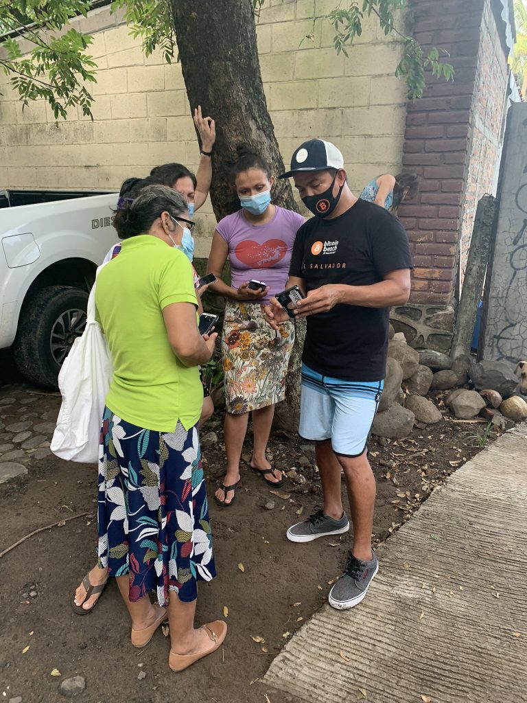

# Lílo Bitkoini Fún Àwùjọ: Àwọn Ẹ̀kọ́ Tí A Kọ́ Ní Ẹ̀tò Bitkoini Etí Òkun

by Galoy Money [2021/11/10](https://galoy.io/bitcoin-banking-for-communities-lessons-learned-from-el-zonte/)

<LanguageDropdown/>

## Foreword

Ìyípadá tó rinlẹ̀ ma ń sábà ṣelẹ̀ láti orí àwọn ọmọ tí ọjọ́ orí wọn ṣì kéré tí ò tí gbọ́ n láti mọ̀ pé
ìdáwọ́ lé wọn yí ó foríṣọ́ pọ́ n. Mi ò lè wá àwáwí pé ọ̀ dọ́ ni mí, nígbàtí wọ́ n ṣe ìfilọ́ lẹ̀ ètò bitkoini etí
òkun, a dúpẹ́ pé mí ò tí pẹ́ lóri Twitter láti mọ̀ pé bitkoini kò ní ṣe é fi ra ife kofí. Tó bá jẹ́ pé ati
ṣe ìwádi tí óyẹ tàbí ṣe àyẹ̀wò fíní fíní ni, à bá ti rí agọ̀ wa. A dúpẹ́ pé gbogbo yín lè rí El Salvador
lórí máápù torí agọ̀ wa.

Ní orí ọ̀ rọ̀ ètò bitkoini etí òkun, Lódodo òtítọ ma ń ṣe àjèjì ju àròso lọ. Kò sí ẹni tí ó ma rò ó pé
ọrọ̀ ajé bitkoini àkọ́ kọ́ ma bẹ̀ rẹ̀ láti abúlé kéréje bí El Salvador. Adarí e jẹ́ arákùnrin ìlú òkèèrè tí ó
ṣì ǹ lo ìmeèlì Earthlink, ló fọwọ́ sowọ́ pọ̀ pẹ̀ lú ọ̀ dọ́ olórí agbègbè El Salvador tí ò kà ju ìwé mẹ́ fà.

Ká wò látẹ̀yìn, àbájáde ẹ̀ dájú: agbègbè àwọn tí ǹkan kù díẹ̀ káàtó fun ma fẹ́ ẹ̀ mọ iyì bitkoini ju
àwọn agbègbè olówó bí Singapore àti Silicon Valley lọ. Àfi bí tàtọ̀ runwá- àwọn tí ó kọ́ kọ́ lànà wa
bẹ̀rẹ̀ bí wípé wọn ò yẹ tí ó fi jẹ́ pé àwọn agbègbè tó ń bọ̀ lẹ́yìn ò nílò láti bẹ̀rù.

Ní El Salvador, bitkoini ni owó àwọn tí ǹkan kù díẹ̀ káàtó fun. Fún àwọn ará El Salvador tí ó gbé
nínú ìṣẹ́, Àwọn tó n ṣe àríyànjiyàn ní àárín wúrà àti owó orí kọ̀mpútà dàbí pé wọn ò mọ ohun tó
n lọ. Fún àwọn tó nílò jùlọ, bí wọ́ n ṣe ma rí oùnjẹ òjọ́ wọn àti bí wọ́ n ṣe ma fipamọ́ fún ọjọ́ iwájú.
Wọn ò ní ìdí láti mú ìkan tàbí ìkejì.

Ní odún 2021 a ri bí ìlú kéréje tó kù díẹ̀ káàtó fun ṣe fihan gbogbo àgbáyé bí ṣé le mú àwọn
tálákà bẹ́gbẹ́pé. A mọ̀ pé díẹ̀ ni a ṣì rí ní ètò bitkoini etí òkun. Ṣùgbọ́n ìrètí wa ní pé èyí ma mu
tàn kàákiri gbogbo àgbáyé. À ń pè ẹ́ kí o wá sí El Zonte, kí o bá wa tan ìwòye lílo bitkoini tó n
gba gbogbo ènìyàn láyè káàkiri.

– Mike Peterson ([@bitcoinbeach](http://twitter.com/bitcoinbeach))

## Láti Iṣẹ́ Àgbéṣe Si Ohun Ìtẹ́ wọ́ gbà Ní Àrín Odún Méjì

̣̀Ẹ̀tò bitkoini etí òkun bẹ̀rẹ̀ pẹ̀lú ìbéèrè tí ó rọrùn síbẹ̀ tí ó tú fi ìrètí hán: ṣé a lè kọ́ ọrọ̀ ajé tó pe ní
orí bitkoini? Ìdáhùn ẹ̀ rinlẹ̀ dada bẹ́ẹ̀ni. Ǹkan tí ó bẹ̀rẹ̀ bí iṣẹ́ àgbéṣe àdúgbò nínú ìlú látọ̀nà jíjìn
ló wá di ìtàn ọ̀ pọ̀ èyàn bí mílíónù mẹ́ fà tí wọ́ n ṣe àfihàn fún gbogbo àgbáyé pé owó ni bitkoini.

Nínú ìtọ́sónà yí a wo ẹ̀kọ́ mẹ́fà tí a kọ́ nípa ṣíṣe àpò bitkoini etí òkun àti amáyédẹrùn ìlanà ètò to
 wà ní àrọ́ wọ́ tọ́ gbogbo ènìyàn tí ó mu ṣiṣẹ́ . Èrò wa ni láti ṣe ìrànlówọ́ fún àwọn agbègbè ní àyíká
 àgbáyé mú ẹ̀kọ́ wọn àti ìtẹ́wọ́gbà bitkoini yára.
 

## Kíni Bitkoini Etí Òkun?

Etí òkun pàsífíkì El Salvador ni El Zonte wa, ó jẹ́ ìlú kéréje tí wọ́ n ṣeré ìdárayá orí omi pẹ̀ lú àwọn
olùgbé ẹgbẹ̀rún mẹ́ta. Èto ilé ìfowópamọ́ ti kọ àwọn olùgbé ibẹ̀ sílẹ̀ bẹ́ẹ̀ni wọ́n di ìjàkadì pẹ̀lú
àwọn ọmọ oníwà jàgídíjàgun àti kí wọ́ n lè ma jẹ ànfàní lílo ilé ìfowópamọ́ . Láti bí odún mẹ́ wá
sẹ́ yìn, ẹgbẹ́ kékeré àwọn èyàn méló kan ni wọ́ n ti ń ṣiṣẹ́ láti mú ìyípadá àti ìrètí padà wá sí ìlú El
Zonte.

Jorge Valenzuela, Roman “Chimbera” Martinez àti Mike Peterson bẹ̀rẹ sí ń ṣe àwọn ètò fún àwọn
ọ̀ dọ́ ní ọdún 2009 láti fún àwọn ọmọdé El Zonte ní ànfàní àti ṣeré, kọ́ ẹ̀ kọ́ kí wọ́ n dẹ̀ tú lè gbèrò.
Láti eré “para todo” (eré ìdárayá orí omi fún gbogbo ènìyàn) sí ẹ̀kọ́ kọ̀mpútà sí iṣẹ́ àgbéṣe ti
agbègbè tí wọ́n gba owó fún, àwọn ètò náà ti mú ohun ọ̀tun wá sí ibi tí ó ti fìgbàkan jẹ́ aṣálẹ̀.

<figure>
  <figcaption>Jorge, Chimbera àti ẹgbẹ́ ti mú ìlera ara, ètò ẹ̀kọ àti iṣé agbègbè ní òkúkúndùn fún ìgbé ayé ojoojúmọ́ ni El Zonte (Orísun: <a href="https://twitter.com/romanmartinezc/status/1429081008012505091?s=20">Twitter</a>)</figcaption>
</figure>

Ní odún 2019, ẹnìkan wá bá Mike tó fẹ́ ṣe àtìlẹyìn ètò wọn pẹ̀lu ìtọrẹ bitkoini. Síbẹ̀síbẹ̀, òfin kan
wà, wọ́ n gbọ́ dọ̀ ná ìtọrẹ ọ̀ hún nínú agbègbè náà, dípò kán ná bí owó gangan. Ìpinu wọn ni láti
ṣe àgbéró ọrọ́ ajé bitkoini níbi tí àwọn oníṣòwò àti àwọn ará ìlú ma lè ṣe pàṣípàrọ̀ ẹrù àti iṣẹ́ ọwọ́
fún sátì. Jorge àti Mike gba ìpèníjà náà, bí a ṣe bí Bitkoini Etí Òkun nìyẹn. 

Láti ìbẹ̀rẹ̀, ó ti hùn pé iṣẹ́ àgbéṣe yí ma yí àwọn èrò tí wọ́ n ní sí bitkoini padà:

1. **Bitkoini jẹ́ dúkìá tó n níye si fún àwọn ọlọ́ rọ̀.** Tí o bá lọ sí orí ayélujára àti ìkànnì ìròyìn
ìṣòwọ̀ , Tí o bá lọ sí orí ayélujára àti ìkànì ìròyìn ìṣòwọ̀ , o ma gbọ́ ìjíròrò tí ò dúró nípa oye
owó, bí ó ṣe ma ń tètè yípadà àti àfiwé pẹ̀lu àwọn dúkìá àti ìdókò-òwò míràn bí wúrà àti
ìṣura. O ma gbọ́ bí ìlé ìfowópamọ́ ṣe ń ìfilọ̀ àfihùn àwọn oníbàrà tí dúkìá pọ̀ . Ǹkan tí ó ní
gbọ́ ni bí bitkoini ṣe ń mú ìdàgbàsókè ọrọ̀ ajé àwọn ìlú tó tálákà jùlọ ní àgbáyé gbòrò si.

2. **Bitkoini jẹ́ ìpamọ́ iyí, kò kí n ṣe ohun èlò fún pàṣípàrọ̀.** Nígbàtí ọ̀ pọ̀ lọpọ̀ ti gba pé
ìpamọ́ iyí ni bitkoini jẹ́, wípé ò jẹ́ ohun èlò fún pàṣípàrọ̀ ṣì jẹ́ ohun tí wọ́n jiyàn lé lórí títí
di èní. Ọ̀ rọ̀ náà lọ pé; “tí oye bá ṣì ń lọ bí ó ṣe ń lọ, kò sí ẹni tí ó ma fẹ́ fi ra ọjà tàbí ṣanwó iṣẹ́.”

Bi iṣẹ́ àgbéṣe náà ṣe ń kúrò ní èrò tí ó n di ìgbésẹ̀, ẹgbẹ́ àwọn alákóso àti akẹ́kọ̀ tó n gbòrò si ṣe
 àkíyèsí àwọn ìṣòro tí bitkoini lè yanjú ní agbègbè wọn:

1. **Àwọn ilé ìfowópamọ́ ò kí n fẹ́ ṣòwò ní àwọn agbègbè tó tálákà jùlọ.** Owó Dollar
Amẹ́ríkà ni El Salvador ná láti ọdún 2001, tí ó mú ẹ̀ka t’ìnáwo wọn wà lábẹ́ òfin ti ilẹ̀
Amẹ́ ríkà. Wíwán tí àti tèlé àwọn òfin wọ̀ nyí wán ni kò jẹ kí àwọn ilé ìfowópamọ́ ráyè ti
àwọn ènìyàn tó wà ní àwọn orílẹ̀ èdè tó tálákà. Fún àpẹrẹ nígbàtí ẹni tí ó ni ilé ìtura
[Grand Hotel](https://www.gartenzonte.com/garten) gbìyànjú àti jẹ́ kí àwọn òṣìṣẹ́ ẹ̀ ma fi owó sí ilé ìfowópamọ́, [ó gbọ́ pé àádọ́](https://youtu.be/RhoiOzhuBG4?t=1438) ta
dọ́ là ni wọ́ n ma san fún oṣùn kan, lórí òṣìṣẹ́ kan. Oye yẹn ju ìdámẹ́ wá owó oṣùn ẹni tó
ṣiṣẹ́ lọ.

2. **Láti fi owó ránṣẹ́ láti òkè òkun sí El Zonte wọ́ n ó dẹ̀ tú gba àsìkò.** Owó tó n fi ránṣẹ́
wọlé láti òkè òkun sí inú El Salvador [tó ká fi mẹ́ tà-lé-lógún pín ọgọ́ run nínú gbogbo oye tí ìlú náà pa wọlé ní](https://www.cnbc.com/2021/09/09/el-salvador-bitcoin-move-could-cost-western-union-400-million-a-year.html) ọdún 2020. Èyàn á san ju dólà méta lọ kí ó tó lè gba dólà méwá láti
ọwọ́ ẹbí tó wà ní òkè òkun. Kò sí Western Union ní El Zonte nítorí náà ó ní oye wákàtí àti
oye ọkọ̀ tí ará ìlú ma gùn kí ó tó dé ọ́físì ibi tí wọ́n ti ma gba owó tí wọ́n fi ránṣẹ́ sí wọn.
Láìsọoyeọjọ́ tíógbàkíowótódéElZontelátiọwọ́ ẹnitíófiránṣẹ́.

3. **Ó ṣòro láti fi owó pamọ́ láìsí ètò ilé ìfowópamọ́.** Láì lè lo ilé ìfowópamọ́ ju kí èyàn má
kọ̀ lè dòwòpọ̀ pẹ̀lu ilé ìfowópamọ́ lọ. Ó tún yọ wọ́n kúro ní àyè àti ní irú àwọn ìdókòwò
àti àwọn dúkìa tí ó lè dábòbò wọ́ n lọ́ wọ́ kí owó má ní iyì mọ́ . Ipa àìròtẹ́ lẹ̀ tí ìfilọ́ lẹ̀ mú wá
ni oye àwọn ènìyàn tí wọ́ n bẹ̀ rẹ̀ sí ní fi oye tó nítunmọ̀ pamọ nínú owó tó n wolé fún wọn
ní ìgbà àkọ́ kọ́ ní ayé wọn.

<figure>
  <figcaption>Àwọn ẹgbẹ́ Bitkoini Etí Òkun fi ara wọn jì láti ran ará agbègbè wọn lọ́ wó àti lè lo bitkoini fi dúnà dúrà ní orí kọ̀ mpútà. (Orísun: <a href="https://twitter.com/romanmartinezc/status/1401672924092841984?s=20">Twitter</a>)</figcaption>
</figure>

Pẹ̀lu láti lè lò bitkoini fún ìdàgbàsókè iṣẹ́ àgbéṣe wọn àwọn ẹgbẹ́ náà bẹ̀rè iṣẹ́. Wọ́n bẹ̀rẹ̀ sí ní
mú àwọn agbègbè náà ní ẹyọ kàn kan mọ bitkoini. Wọ́n kọ́ ẹ̀kọ́, ó ṣì bá wọn lára mu bi ẹ̀kọ́ náà
ṣe ń lọ. Àjàkálẹ àrùn tókárí-ayé ní ìbẹ̀rẹ̀ ọdún 2020 ló dàbí ìyárasáré fún àgbàwọlé bitkoini. Àwọn
olùgbé El Zonte tí wọ́ n nílò àtìlẹ́ yìn ni wọ́ n rí ìtọrẹ bitkoini gbà tí ètò Bitkoini Etí Òkun pèsè.

[Ìròyìn Forbes](https://www.forbes.com/sites/tatianakoffman/2020/07/14/this-el-salvador-village-adopts-bitcoin-as-money/?sh=723af6ac2044) ti ọdún 2020 kan ni ó mú Bitkoini Etí Òkun di gbajúmọ̀ tí ó ṣì ń fa àtìlẹ́yìn àwọn tí ó
gbàgbọ̀ nínú bitkoini tí wọ́ n fẹ́ láti ṣe ìrànlọ́ wọ́ mọ́ ra. Ọ̀ kan nínú àwọn tí ó gbàgbọ̀ nínú bitkoini
tí orúkọ ẹ̀ jẹ́ Nicolas Burtey, tí ó jẹ́ ọkan nínú àwọn olùdásílẹ̀ ilé iṣẹ́ Galoy, tí ó wá sí El Zonte láti
ṣe àkànṣe àpò fún èlò Bitkoini Etí Òkun. Láìpẹ́, abí àpò Bitkoini Etí Òkun bẹ́ẹ̀ni ètò náà ti ń mú
ìran ẹ̀ ṣẹ.

Ní báyí gbogbo ènìyàn ló ti mọ òpin ìtàn náà: Àarẹ orílẹ̀ èdè El Salvador Nayib Bukele kéde ní
ọjọ́ karùń osùn kẹfà, odún 2021 pé bitkoini ma di owó tó ní òùntẹ̀ ìjọba. Bukele sọ ọ́ lóri Twitter
Spaces pé ìjọba wo ẹ̀ sẹ ètò Bitkoini Etí Òkun àti pé ìdi tí wọ́ n fi ṣe òfin yí ni láti tún ǹkan tó ṣẹlẹ̀
ní El Zonte ṣe ní gbogbo orílẹ̀ èdè náà. Pàtàkì ọ̀ rọ̀ ẹ̀ ni wípé kí àwọn ará ìlú El Salvador tí ó tálákà
jù lè jẹ ànfàní lílo ilé ìfowópamọ́ gan ni ìwúrí òhun. Ní ọjọ́ keje tí oṣùn kẹsán ọdún 2021, La Ley
Bitcoin (Òfin Bitkọini) fi ẹsẹ̀ mú lẹ̀. Àtì ìgbà yẹn ni Bitkoini Etí Òkun ti wà lára ìtàn àgbàwọlé
bitkoini ní àgbáyé. Ó ti fa ojú àwọn tí ó gbàgbọ̀ nínú bitkoini láti kákìri àgbáyé tí ó fẹ́ ri bí ó ti rí
 láti ná sats lórí kọfí, fún ẹ̀kọ́ eré ìdárayá ti orí òkun àti fi ra àsun. Ó tí tun di àwòṣe fún àwọn
 agbègbè míràn láti tún ṣe.

Pàtàkì jùlọ, Bitkoini Etí Òkun ti dá àwùjọ ibi tí àwọn ọmọ wẹ́wẹ́ El Zonte lè lá àlá àti kọ́ ọjọ́ iwájú
wọn.

## Àpò Bitkoini Etí Òkun

Àpò Bitkoini Etí Òkun jẹ́ ọ̀ nà àbáyọ ti ìlanà ètò Bitkoini to wà ní àrọ́ wọ́ tọ́ gbogbo ènìyàn. Èyí tí a
ṣe láti pèsè àwọn ǹkan tí àwọn oníṣòwò àti ará agbègbè El Zonte nílò. Ó ń lo ìlànà tí ó gba
gbogbo èyàn tó wá nínú ẹgbẹ kan náà láti jọ gbà kí ìdúnàdúrà kan kan kí ó tó lè ṣẹlẹ̀ nínú àpò
bitkoini wọn. Tí ó yàtọ̀ sí ìlànà tí ẹyọ èyàn kan ní àṣẹ lórí àti ti èyí tí ẹtí kẹta láṣẹ lé lórí tí ó wà
káàkiri lóòní.

<figure>
  <figcaption>Cristina ń lo Àpò Bitkoini Etí Òkun láti ta ọṣẹ àtọwọ́ dá. Àwọn oníbàárà ẹ̀ lè sanwó pẹ̀ lú orúkọ ìdánimọ̀ ẹ̀ , nípa yíyẹ ojú ìwé iye-owó ọjà tí ó wà ní orí ẹ̀ rọ ìbánisọ̀ rọ̀ ẹ̀ wò, tàbi lọ sí <a href="https://ln.bitcoinbeach.com/Jackie_Valenzuela">invoice page</a>. (Orísun: <a href="https://twitter.com/romanmartinezc/status/1446661818735288320?s=20">Twitter</a>)</figcaption>
</figure>

Nínú Àpò Bitkoini Etí Òkun ìlú ló ń wá owó ìdókòwò bẹ́ẹ̀ni àwọn ni wọ́n ṣe ìṣàkóso ẹ̀. Èyí ló n
 pàsè àwọn ànfàní fún àwọn ará ẹgbẹ́ wọn tí ó wà ní agbègbè náà:

- Àwọn ọmọ ẹgbẹ́ ni wọn ṣe ìsàkóso àyè tó n mú ìdúnádúrà yára, ọ̀ fẹ́ ni láti ṣí tàbí ti àyè náà
- Ìdúnàdúrà ti àkọsílẹ̀ ìnáwó tinú ilé wà tí ó jẹ́ ọ̀fé tí ó tún wà ní ẹsẹ̀kẹsẹ̀
- Lílo ajíṣẹ́ ayélujára dáradára túnmọ̀ sí sí sanwó pọ́ ọ́ kú tí a bá ṣi lóri èyàn kan kan tí ó yàtọ̀ sí kí oníṣòwò kan kan ni ajíṣẹ́ ayélujára ti ẹ̀
- Owó tó yẹ láti san ma dínkù tí a bá fi ìdúnádúrà inu búlọ́ kúsenì kan sí ìpele

Àfikún àwọn ẹ̀yà ara ohun èlò ó n ṣe àtìlẹ́yìn fún akitiyan àti ní gbé ọrọ̀ ajé bitkoini ró:

- Àyè láti sanwó pèlú àdírẹ́sì bitkoini, tábi àyè iye owó ojà tábi lo orúkọ ìdánimọ̀
- Ìṣọ̀ kan oye tó ku ní ìdúnádúrà inu búlọ́ kúsenì kan tí ó ṣe àfihàn oye tí ó ku ní owó dọ́ là àti sats
- Máàpú alágbéká náà ń ṣe àfihàn gbogbo àwọn ilé iṣé agbègbè tí ó gba àyè tó n mú
ìdúnádúrà yára
- The mobile friendly map displays all local businesses that accept Lightning payments
- Aṣàmúlò àdírẹ́sì ayélujára lè pín àti gbà bitkoini wọlé láti ọwọ́ ẹnikẹ́ni pẹ̀lú àpò tí ó ní
àtìlẹ́yìn àyè tó n mú ìdúnádúrà yára (Lọ sí: [ln.bitcoinbeach.com/bitcoinbeach](http://ln.bitcoinbeach.com/bitcoinbeach))

Tí o bá ní ìfẹ́ sí ṣíṣe ibi ojúrí nínú ohun èlò alágbèká bí Àpò Bitkoini Etí Òkun o lè lọ sí ibi ìpamọ́ [galoy-mobile](https://github.com/GaloyMoney/galoy-mobile) lórí GitHub.

Láìyì fi àkókò ṣòfò, àwọn ẹ̀ kọ́ tí ó ṣe kókó jùlọ tí Galoy kọ́ nípa sí ṣe iṣẹ́ ní El Zonte ní àwọn wọ̀ nyí.

## Ẹ̀kọ Kíní: Ètò Ẹ̀kọ́ Ṣe Kókó

Láti ní òye ó jẹ́ ǹkan tó ṣòro,ó wọnú ẹ̀kọ́ ìmọ̀ kọ̀mpútà, ẹ̀kọ́ ọrọ̀ ajé, ẹ̀kọ́ ìtàn àkọsílẹ̀, ẹ̀kọ́ ìfipamọ́
ìbánisọ̀rọ̀, ẹ̀kọ́ ètò ìmúlò owó àti bẹ́ẹ̀bẹ́ẹ̀ lọ. Èyàn ò ní láti ní òye ní kíkún kí ó tó lè lò ó tàbí jẹ
ànfàní ẹ̀. Èyàn méló ni ó ná owó gangan ní gbogbo ọjọ́ ayé wọn tí ó mọ bí owó ṣe ǹ ṣiṣẹ́ gaan?

<figure>
  <figcaption>Fífi bí a ṣé n lo bitkoini han àwọn ará El Salvador jẹ́ ìlànà tí ó lọ lọ́ wọ́ lọ́ wọ́ fún Jorge àti àwọn ẹgbẹ Bitkoini. (Orísun: <a href="https://twitter.com/romanmartinezc/status/1420951261675929601?s=20">Twitter</a>)</figcaption>
</figure>

Àwọn ohun márùún wọ̀nyí ni o gbọ́dọ̀ rò tí o bá fẹ́ kọ́ agbègbè ẹ ní ẹ̀kọ́:

1. **Àwọn olùṣètò agbègbè ṣe kókó nínú ìlànà àti gbaniwọlé.** Níní ẹgbẹ́ tó ń gbaniwọlè ní ara
ma ń jẹ́ àwọn èyàn bẹ̀rẹ̀ dáradára. Èyí ṣe pàtàkì pàápà ní agbègbè tí bitkọini mú ànfàní
àti dúnàdúrà lórí ayélujára ní ìgbà àkọ́ kọ́.
2. **Tí a bá fihan àwọn èyàn bí wọ́n ṣe ń lo bitkọini ó ṣiṣẹ́ dáradára ju kí á sọ fún wọn nípa ẹ̀ lọ.** Ríran àwọn èyàn lọ́ wọ́ láti ṣe àgbàsílẹ̀ àti lílo àpò, àti lí lò ó láti fi sats ránṣẹ́ àti lè gbà á
wọlé dára ju kí a sọ àsọdùn lọ.
3. **Ẹ kọ́ àwọn ọmọdé, wọ́ n ma fa àwọn òbí wọn wọlé.** Àwọn ọmọdé El Zonte wọ́ n tètè mọ bí
wọ́n ṣe ń lo bitkọini, wọ́n ó sì tún kọ àwọn òbí wọn tí wọ́n bá dé ilé.
4. **Ẹ̀rọ aládàáṣiṣẹ́ bitkọini ma ń jẹ kí àwọn èyàn rí ìbáṣepọ̀ bitkọini àti owó gangan.** Ẹ̀rọ
aládàáṣiṣẹ́ bitkọini padà wá jẹ́ dúkìá tó wúlò fún ìlànà àti gba ni wọlé. Tí àwọn èyàn bá tí
lè pàrọ̀ bitkọini wọn nínú àpò àgbéká sí owó ìlú wọn, wọ́ n ma gba àbá wípé bitkọini dàbí
owó gangan wọlé.
5. **Ran àwọn èyàn lọ́ wọ́ láti retí àti ki wọn ṣètò sílẹ̀ fún ìyípadà ìgbà kúkurú.** Jẹ́ kí agbègbè ẹ
mọ̀ sílẹ kí wọn lè ba gbáradì fún ìgbà tí ìdíyelé bitkọini bá já wá sílẹ̀. Ní àkókò ìgbà tí
àwọn oníṣòwò ṣè n darapọ̀, ró ètò tí o lè fi ṣe ìsanpadà fún wọn tí owó wọn bá já wá lẹ̀
nítorí ìyípadà iye owó dí ìgbà tí ọkàn wọn bá ti balẹ̀ pẹ̀lú bitkọini.

Bí o ṣe ǹ to agbègbè ẹ, fi ojú sílẹ̀ láti darapọ̀ kí o dẹ̀ tún kọ́ ẹ̀kọ́ láti ọwọ́ ará [Bitkoini Etí Òkun](http://bitcoinbeach.com/).
Àwọn ni òmìrán tí o lè dúró lori èjìká wọn. Àwọn ni òmìrán tí o lè dúró lori èjìká wọn. Ṣíwájú
bitkọini ní ìfarasìn wọn, ó ṣì tún kọjá bitkọini. Bitkọini ti wá di ọ̀ nà tí wọn lè fi mú ànfàní àti ìrèti
fún ọjọ́ ọ̀la El Salvador.

## Ẹ̀kọ Kejì: Àyè Tó n Mú Ìdúnádúrà Bitkọini Yára Sáré Bí Owó

Àyè tó n mú ìdúnádúrà yára jẹ́ ìlànà tí a má n fi ojú tẹ́ nbẹ́ lẹ́ jùlọ ní àgbáyé. Níwọ̀ n ọdún bí méjì
sẹ́yìn ó jẹ́ ọ̀nà àìbíkítà láti dúnàá dúrà. Ní báyí McDonalds, Starbucks àti Pizza Hut ní ìlú El
Salvador ti ń lò ó. Ìdàgbàsókè àwọn ìkoríta, ìlànà àti agbára ń ṣelẹ kíákíá ní ọ̀ nà tó wúnilórí. Ìròyìn
ìwádì Arcane tí wọ́ n ṣe láìpẹ́ tí àkòrí ẹ̀ jẹ́ “[Ipò tí àyè tó n mú ìdúnádúrà yára wà](https://www.research.arcane.no/the-state-of-lightning)” fún wa rí díẹ̀
nínú àwọn òṣùwàn ìdàgbàsókè àti ìrètí.

Bitkoini Etí Òkun kọ́ kọ́ bẹ̀ rẹ̀ pẹ̀ lú ìdúnàdúrà tí inú búlọ́ kúṣenì kan náà láti pín bitkọini nínú
agbègbè náà. Nígbàtí ṣí ṣe ìdúnàdúrà nínú búlọ́ kúṣenì kan náà lè ṣiṣẹ́ ní ètò ẹ̀ kọ́ àti láti fi sats
ránṣé sí àwọn ará agbègbè náà, àwọn ìhámọ́ ẹ di ìdènà sí ìlọsíwájú sí ọ̀ nà ọrọ̀ ajé tó yípo.

Àwọn ará El Salvador ti ní ìrírí bí a ṣé ń lo bitkọini gẹ́gẹ́bí ọ̀nà àtiṣe pàṣípàrọ̀ kò tó láì lo ìtàkùn
 ìpele kejì bí àyè tó n mú ìdúnádúrà yára:

1. **On-chain fees were too expensive to facilitate daily spending.** Residents of El Zonte need to be able to spend small dollar amounts, such as 50 cents for pupusas.
2. **Lílo ìdúnàdúrà tí inú búlọ́kúṣenì kan náà láti fi sanwó ọjà àti iṣẹ́ pẹ́pẹ̀pẹ́ ma ń fa "èérún."** Bitkoini Etí Òkun náà la
“[àwọn ìṣòro ìdúnádúrà](https://bitcoin.stackexchange.com/questions/10986/what-is-meant-by-bitcoin-dust)“ kọjá. Àbájáde ìdúnádúrà iye tí aìríná (UTXOs) ló n ṣe àgbàsílẹ̀ bí a ṣé n
gbé iyì káàkiri lórí okùn bí ǹkan ṣe ṣẹlẹ̀. Tí iyì ta fi sí orí àbájáde ìdúnádúrà iye tí aìríná, bá ti kéré
 sí oye tí a ma fi na, àá pe irú bitkọini yí ní ‘èérún’ tí ò ṣe é ná.
3. **Fún àwọn tó t’ajà ní ìsọ̀ , ǹkan tó bá tí yàtọ̀ sí ká sanwó lẹ́ sẹ̀ kẹsẹ̀ ma ń fa ìkọlura l’àárín iléiṣẹ́ àti olùmúlò.** A ṣe bitkọini fún ààbò àti àidíbàjẹ́ lórí ìpele kíní. A ò ṣe é fún ìyára àti òṣùwọ̀ n
 iṣẹ́ ìdúnádúrà.

<figure>
  <figcaption>Àyè tó n mú ìdúnádúrà yára mu ìsanwó yára, rọrùn láti lò, kò dẹ̀ tún wọ́ n ní ìyí tí àwọn oníṣòwò
 fẹ́ ní ìsọ̀ wọn. (Orísun: Galoy)</figcaption>
</figure>

Àyè tó n mú ìdúnádúrà yára oní ìpele kejì ni ìmọ̀ èrọ tí a lè lò láti fi sojú ogún ojà títà dé, kí a mú
 ìlérí pé bitkọini jẹ́ owó wá sí ayé. Alábàdásílẹ̀ wa kọ nípa èyí ní ọdún 2020 nínu àkọsílẹ̀ ẹ̀ tí àkòrí
 ẹ̀ jẹ́ “[Àyè tó n mú ìdúnádúrà yára bí ètò ìsanwó ọjà?](https://galoy.io/lightning-as-a-retail-payment-system/)”

Àyè tó n mú ìdúnádúrà yára jẹ́ ọkọ̀ àti olùṣètò láti mú ìran ètò Bitkoini Etí Òkun ṣẹ. Láìsí òhun,
 lílo bitkọini bí owó ní ìlú El Zonte ma nira si àti wọ́n si pẹ̀lú; ó ti ẹ̀ tún dàáru tàbi ó kéré jù kó dá
 ètò náà dúró díẹ̀.

Fífi àyè tó n mú ìdúnádúrà yára sí inú ètò ti wá di kòseémání fún èyíkéyí àpò tàbi ètò ìnáwó tí a
 kọ́ bitkọini lé lóri. Ó ṣí ọ̀pọ̀lọpọ̀ ọ̀nà fún ìdúnádúrà tó fẹ́ ẹ̀ jẹ́ ọ̀fẹ́, tó kárí ayé, tó lè ṣelẹ̀ lẹ́sẹ̀kẹsẹ̀, tí
 ò sí pé èyàn gba àyè.

## Ẹ̀kọ́ kẹta: Mímú Àwọn Oníṣòwò Wọlé Ṣe Pàtàkì Fún Ìwúrí Ìdàgbàsókè Ètò Ọrọ̀ Ajé

Ìgbédìde ọrọ ajé bitkọini ṣe àfihàn ìṣòro “adìẹ àti ẹyin”. Àwọn olùgbé nílò àwọn ibi tí wọ́ n á ti lò
 ó, bẹ́ẹ̀ni oníṣòwò nílò olùmúlò tí ó ma na. Èyí mú u rọrùn bẹ́ẹ̀ni wuni láti gba bitkọini jẹ ìgbésẹ̀ tí
 ó ṣe kókó fún ìgbàwọlé ni agbègbè.

Ìlépa ìkẹyìn ni kí a mú gbígba bitkọini yára si, rọrùn si, dín owó ju èyíkéyí owó míràn lọ.

<figure>
  <figcaption>Mama Rosa (pẹ̀ lu ọmọ ẹ̀ Jorge) ni oníṣòwò àkọ́ kọ́ ní ìlú El Zonte tí ó kọ́ kọ́ gba. (Orísun: <a href="https://twitter.com/romanmartinezc/status/1387105142030352387?s=20">Twitter</a>)</figcaption>
</figure>

Àwọn wọ̀ nyí ni díẹ̀ nínú àwọn ìrírí tí a fi ṣe ètò náà bí a ṣe ṣé fún àwọn oníṣòwò:

1. **Má jẹ́ kí àwọn oníṣòwò ronú nípa owó ṣíṣẹ́.** Bá wọn dín wàhálà à ń fi orí ṣí owó kù nípa
fífi oye owó dọ́là (tàbí owó tí orílẹ̀ èdè) àti oye ni bitkọini káàkiri ní iye owó tó ṣẹ́kù, ni
ìwé iye owó ọjà àti ìtàn ìdúnádúrà wọn.
2. **Jẹ́ kí ọ̀ nà púpọ̀ wa fún àwọn oníṣòwò láti lè gba owó ọjà wọn.** Àwọn oníṣòwò ò ní láti
ṣe ìwé owó ọjà fún ìdúnádúrà kàn kan. Lílo Àpò Bitkoini Etí Òkun, àwọn oníbárà wọn lè
sanwó pẹ̀lú orúkọ ìdánimọ̀, àtẹ̀jáde kóódù èsì ní kíákíá, mímú máápù oníṣòwò tàbí lílo
àwọn ìwé owó ọjà tí olùmúlò kàn kan lè pín ní orí in.bitcoinbeach.com/[username].
3. **Má jẹ́kí ìlànà náà gba àkókò, àkíyèsí àti títẹ̀ ẹ̀rọ jù.** Ibi tó ṣe pàtàkì jù fún àwọn
oníṣòwò ìlú El Zonte ni ìgbà tí Galoy gba àwọn oníbárà láyè láti lè ṣètò iye owó lori ìwé
owó ọjá. Àwọn oníṣòwò ò ní láti fi ǹkan tí wọ́n bá ń ṣe sílẹ̀ láti ṣe ìwé owó ọjà. Wọ́n á kọ̀
wo ìtanijí orí ẹ̀ rọ ìbánisọ̀ rọ̀ wọn láti rí àrídájú pé owó ti wọlé. Bitkọini ti wá rọrùn láti gbà
ju owó tàbí àwìn.
4. **Ṣètò ìmóríyá fun oníṣòwò tó ma jẹ́ ìwúri wọn kí wọ́ n ba lè tètè ma lò ó.** Ní ìlú El
Zonte, wọ́ n ṣe ètò “ìfúnni ní owó ẹni padà” fún ọ̀ sẹ̀ díẹ̀ , níbi tí àwọn oníṣòwò gba ogún
nínú ọgọ́ rún padà ní orí bitkọini wọn. Irú ìpolówó yí ma ń ṣe ìrànwọ̀ ìdánwò àti kí ó tètè
mú ìdàgbàsókè ìpín ọrọ̀ ajé wá.

Máṣe gbàgbé ipa pàtàkì tí àwọn oníṣòwò kó nínú ṣíṣe àtìlẹ́yìn fún ọrọ̀ ajé bitkọini. Àwọn ǹkan tí
 àwọn oníṣowo nílò káàkiri agbègbè kàn kan ma yàtọ̀ , nítorí náà ri dájú pé o ní òye àti kí o ṣètò ní
 kíákíá.

## Ẹ̀kọ́ Kẹ́rin: Àgbékalẹ̀ Ìrírí Olùmúlò Gbọ́ dọ̀ Bá Ti Agbègbè Náà Mu

Bitkoini Etí Òkun wáyé bí ààlà ní ìgbà ìgbàwolé àyè tó n mú ìdúnádúrà yára. Bí Mike ṣe sábà maá
 sọ “àwọn ọmọdé kan wà nínú ìlú El Zonte tó ma ń lo àyè tó n mú ìdúnádúrà yára ju àwọn
 àgbàgbà nínú bitkọini lọ.”

Bí ọrọ̀ ajé bitkọini ṣe gbòrò si, ẹgbẹ́ náà ṣe àkíyèsí àwọn àìní tí wọn ò lè gbọ́ àti irú iṣẹ́ tí wọ́ n fẹ́
 kó ṣe tó ma mú ayé rọrùn fún àwọn olùgbé àti àwọn oníṣòwò. Wíwà nílè ní ìlú El Zonte fún
 Nicolas ní òye púpọ bí ó ṣe ǹ ṣètò Àpò Bitkoini Etí Òkun.
 

<figure>
  <figcaption>Wíwo àwọn èyàn bí wọ́ n ṣe ǹ lo bitkọini ní ọ̀ dọ̀ àwọn oníṣòwò káàkiri El Zonte fún wọn ni ìjìnlẹ
 òyeìṣètòọjààtiiṣẹ́. (Orísun: Galoy)</figcaption>
</figure>

Àkíyèsí: Rántí pé ó ṣe kókó kí o dán ohun èlò àti iṣẹ́ wò nínú agbègbè tí a gbèrò láti lò ó. Ṣe
 ìwádí tì ẹ.

Ẹ̀kọ́ ìrírí olùmúlò mẹ́fà tí a kọ́ nípa ìdánwọ̀ Àpò Bitkoini Etí Òkun:

1. **̣̀ má fojú kéré ayélujára tó yára.** Àwọn agbègbè tí ó ṣẹ̀ ń dàgbàsókè tí wọ́ n ní ayélujára
tí kò yára nílò ìṣàpéye àti ìfaradà àṣìṣe ní ìpele ìtàkùn tí a ò ní nílò tó bá jẹ ìlú Amẹ́ríkà ní a wà.
2. **Àti gba àwọn wọlé sí orí ètò ohun èlò fi àyè tó pé sílẹ̀ fún ẹ̀ kọ́ kíkọ́** Àpò Bitkoini Etí
Òkun ní ìdánwò kékeré tí ó n ṣe ìfihàn ránpẹ́ fún àwọn olùmúlò nípa bitkọini. Ìbéèrè kàn
kan ma san èrè fún olùmúlò pẹ̀lú sats láti ìbẹ̀rẹ̀ kúrò ní òdo.
3. **“Sats ni àmì ìdáyàtọ̀,” ṣùgbọ́n dọ́là ti Amẹ́ríkà ni a ṣì ń lò lójú ọjá.** Owó tọ́ n na ní ìlú
àwọn èyàn ni wọ́n ma ń fi ronú, kò kí n ṣe sats, tí wọ́n bá bẹ̀rẹ̀ sí ní lo bitkọini. Ìyípadà sí
ríronú ní sats jẹ́ díẹ̀díẹ̀. Owó tí wọ́n ná ní orílẹ̀ èdè èyàn ni ó yẹ kówà ní ojú ọjà tí èyàn bá
fẹ́ mú agbègbè titun wọ inú ètò náà.
4. **Ṣe àfikún ìbáraṣepọ̀ tí ó ma so àwọn oníbárà àti oníṣòwò papọ̀.** Àyè máápù tó wà
nínú Àpò Bitkoini Etí Òkun ma ń ran àwọn oníbárà lọ́ wọ́ láti lè rí ibi tí wọ́ n tí lè ná
bitkọini. Ó tún ma jẹ́kí ìdúnádúrà yára àti kí ó rọrùn nípa gbígba àwọn oníbárà láyè láti ṣe
ìwé owó ọjà tí wọn ma fi sanwó.
5. **Àkíyèsí tí ó wà lórí owó tí wọ́ n san wọlé ma ń ṣe ìrànwọ́ fún ìgbàsílẹ̀ gbogbo ìdúnádúrà.** Àti àwọn oníbárà ti oníṣòwò ni ó ní ànfàní láti fi àkíyèsí sí àwọn ìdúnádúrà wọn. Lórí àgbéwọlé ti agbègbè ẹ̀yà ara ètò náà ti kúrò ní àdálò (ní ìpele olùmúlò) sì ti bọ́sí
àjọlò. Níbáyí olùránṣẹ́ àti olùgbà lè jọ rí àkíyèsí tó somọ́ ìdúnádúrà náà.
6. **Ma ṣe àkíyèsí nígbàgbogbo bí àyè tó n mú ìdúnádúrà yára ṣe ń yí.** Ètò ìsanwó titun bí
àdírẹ́sì àyè tó n mú ìdúnádúrà yára, ìwé owó ọjà tí ò mì àti BOLT ẹ̀yà kejìlá ń yára jáde. Bí
ǹkan bá ṣe rí ni a ṣe ma mọ irú ètò tí a ma lò. Àpò Bitkoini Etí Òkun kọ́kọ́ jáde pẹ̀lú
àtẹ̀jáde kóódù èsì ní kíákíá tí ó ma lọ sí ojú-ìwe ìwé owó ọjà (bí
in.bitcoinbeach.com/mamarosa). A ti ń gbèrò àwọn ètò titun míràn láti dẹ́kun ìkọlura, kí a
tún ṣe àtúnṣe àjọṣiṣẹ́pọ̀.

## Ẹ̀kó Karùún: Àrọ́ wọ́ tó Ti Agbègbè Nìkan Ni Afárá Sí Àrọ́ wọ́ tó Ti Ara Ẹni Nìkan

Àrọ́ wọ́ tó ti ara ẹni nìkan ni ipò ìparí tí gbogbo ènìyàn tí ó ní ọrọ̀ nínú bitkọini. Òfin àkọ́ kọ́ nínú
 àrọ́wọ́tó bitkọini ti ara ẹni nìkan ni "Kò kí n ṣe kọ́kọ́rọ́ ẹ, Kò kí n ṣe ẹyọ owó ẹ.”

Àrọ́wọ́tó ti ara ẹni nìkan kò kí n ṣe ọ̀nà kan ṣoṣo tí ó wà, tàbí ọ̀nà tí ó yẹ jùlọ láti mú àwọn
 agbègbè mọ àti kí wọ́n ma bẹ̀rẹ̀ sí ní lo bitkọini

> “O ní láti gbé ìgbésẹ̀ díẹ̀díẹ̀. Tí o bá kó gbogbo ìdojúkọ kà wọ́n láyà láti ìbẹ̀rẹ̀, àwọn èyàn ò ní láíláí wọnú ètò náà.” – Mike Peterson nínú [Tales from the Crypt #173](https://open.spotify.com/episode/6jyXUPu4n3nYDi4jbDFYBd?si=gSLNHJpUQk2ASevhiSBz-A)

### Abalatiàrọ́wọ́tóBitkọini tiaraẹninìkan

Àwòṣe àrọ́ wọ́ tó bitkọini ti ara ẹni nìkan ó wà pẹ̀ lú abala kàn kò kí n ṣe bí abala ìrọ̀ rùn/àdálò. Ní
apá kan, a ní ìrírí olùmúlò tó rọrùn, ọ̀ nà àti lo owó rọrùn àti ṣe ìṣọ̀ kan pẹ̀ lú ètò ìfowópamọ́ . Ní
apá míràn, irin òùntẹ̀ àfọwọ́ tẹ̀ , ọ̀ rọ̀ ìgbaniwọlé àti ìbuwọ́ lù púpọ̀ tí ó gba àwọn ìgbésẹ̀ púpọ̀ àti
ènìyàn púpọ̀ láti lè mú owó.

Oríṣiríṣi ipò lílò ni ó ní ìṣẹ̀lẹ̀ ewu tí ó yàtọ̀ tí ó jẹ́ kí fífi ohun ǹkan fún ǹkan jẹ́ ìtẹ́wọ́gbà. Fún àpẹrẹ,
 fífi ọrọ̀ sí ilé ìfowópamọ kò léwu bí ká ma gbe kiri nínú àpò owó lọ, ṣùgbón ká mú owó díẹ̀ tí a fẹ́
 fi ra ǹkan lójúmọ́ fún ni ní ìrọ̀ rùn.

<figure>
  <figcaption>Àpò Bitkoini Etí Òkun pèsè àṣàyàn àrọ́ wọ́ tó àjọlò níbi tí a lè tọ́ jú owó sí láàrín agbègbè kan.</figcaption>
</figure>

Gbogbo àwòṣe ló ní iyì, tó bá ti jẹ́ wípé 1) a lò ó fún ìdí tó bamu àti 2) ó ń darí àwọn ènìyàn
 síwájú si lọ síbi tó tọ́ bí wọ́ n ṣe ń ṣe àkójo ọrọ̀ wọn si nínú bitkọini

### Àrọ́wọ́ tó Ti Agbègbè Nìkan: ká ṣèrántí ayé ìgbà àwọn ilé ìfowópamọ ẹgbẹ́

Gbogbo àwòṣe àrọ́ wọ́ tó tí a dúró lé lórí fún Bitkoini Etí Òkun òhun ni Galoy pè ní "àrọ́ wọ́ tó
agbègbè.” Ó jẹ́ ọ̀ nà àbáyọ tó ní ìbuwọ́ lù púpọ̀ tí kọ́ kọ́ rọ́ síbi tí owó wà lọ́ wọ́ àwọn ọmọ ẹgbẹ́ tí
ẹṣẹ̀ wọn ti múlẹ ní inú agbègbè náà. Àwòṣe yí ma ń dẹ́kun ìgbáralé àwọn ilé iṣẹ́ tó n ṣe ìṣàkóso tí
wọ́ n wà ní ìta agbègbè nígbàtí wọ́ n dẹ́ kun ìkọlura ti àwọn ọmọ ẹgbẹ́ tí wọn ṣe n gbà wọlé sínú
ìtàkùn náà.

### Àkíyèsí lórí lílo ilé ìfowópamọ́ agbègbè

Àwọn ilé ìfowópamọ́ agbègbè ti wà kákiri àgbáyé fún ọgọgọ́ rún ọdún. Ìdí tí wọ́ n fi wà gangan ni
kí wọ́ n ṣe àtìlẹ́ yìn fún ìgbé ayé ìrọ̀ rùn àti ọrọ ajé àkójọ àwọn èyàn tí wọ́ n jọ nífẹ́ sí àwọn ohun
kan náà. Nígbàgbogbo àwọn ohun tí wọ́n jọ ní ìfẹ́sí dá lórí ibi tí wọ́n jọ ń gbé. Owó tí ó wà ní
ìkáwọ́ àwọn ilé ìfowópamọ́ agbègbè wọ̀ nyí ni wọ́ n rí láti ọwọ àwọn olùgbé agbègbè náà bẹ́ ẹ̀ ni
àwọn náà ni wọ́n ń yá ni ọ̀nà tó níṣe pẹ̀lú ìbáṣepọ̀ ju bí wọ́n ṣe ń ṣe ní ilé ìfowópamọ́ déédé lọ.

Àwọn ilé ìfowópamọ́ agbègbè ṣe pàtàkì pàápàá sí àwọn agbègbè bí El Zonte nítorí pé wọ́ n jẹ́ kí
 àwọn ìpinu ṣe é ṣe ní agbègbè pẹ̀ lú èrò àwọn ará agbègbè náà lọ́kàn.
 [ìlanà ètò ọ̀ nà àbáyọ lílo bitkọini to wà ní àrọ́ wọ́ tọ́ gbogbo ènìyàn](https://galoy.io/products/) ti Galoy tí ó ṣe láti jẹ́ kí èyíkéyí
  agbègbè tábi ìgbékalẹ̀ káàkiri àgbáyé lè ṣètò ara ẹ̀ ní ọ̀ nà yí.

Fún òye ìjìnlẹ̀ díẹ̀ si sínú ìkoríta tó wà láàrín lílo bitkọini àti ilé ìfowópamọ́ agbègbè, wo àkọsílẹ̀ tí
 Fulgur Ventures kọ “[Ipa bitkọini ní ilé ìfowópamọ́ agbègbè.](https://medium.com/@fulgur.ventures/the-role-of-bitcoin-for-community-banking-623068c59882)”

### Àpò Bitkoini Etí Òkun Bí Ilé ìfowópamọ́ Agbègbè Ti Bitkoini

Àwọn ọmọ ẹgbẹ́ tọ́ n wà nínú agbègbè ni wọ́ n ṣe àkóso owó tí ó wà nínú Bitkoini Etí Òkun, tí
 wọn ń pèsè ọ̀nà tí a lè gbà sanwò tí kò ní ìkọlura tí owó ẹ̀ kò dẹ̀ panilára tí wọ́n ṣètò fún àtìlẹ́yìn
 ọrọ ajé agbègbè.

Àwọn ìdí nì yí tí àrọ́ wọ́ tó agbègbè ṣe ṣiṣẹ́ fún Bitkoini Etí Òkun:

1. **Yíyọ ìkọlura ni ìgbésẹ̀ tí ó ṣe kókó jùlọ láti ní ipa ìtàkùn tí a nílò fún ìyíká nínú ọrọ̀ ajé.** Àwa ẹ̀dá ènìyàn láti ayédáyé ni a sòro láti gba ìyípadà bẹ́ẹ̀ni a yára láti kọ èrò titun
tàbí padà sí ìwà àtijọ̀ . Bí Mike Peterson ṣe sọ nínú ìfọ̀ rọ̀ wánilẹ́ nuwò pẹ̀ lú Marty Bent tó
wáyé ní oṣùn kẹfà ọdún 2020, ó ní "O ní láti gbé ìgbésẹ̀ díẹ̀díẹ̀. Tí o bá kó gbogbo
ìdojúkọ kà wọ́n láyà láti ìbẹ̀rẹ̀, àwọn èyàn ò ní láíláí wọnú ètò náà.”
2. **Ó lè nira díẹ̀ láti rí ibi tó ní ààbò tí a lè gbọ́ kànlé àti tọ́ jú ọ̀ rọ̀ ìgbaniwọlé ní àwọn ìlú jínjìn tí wọ́n ṣẹ̀ ń dìde.** Fún àwọn èyàn tó ń gbé ní ilé tí ilẹ̀ ẹ̀ dọ̀tí àti tó ní páànù, kò sí
àwọn ibi tó ní ààbo tí èyàn lè tọ́ jú ọ̀ rọ̀ ìgbaniwọlé sí. Lílo ọ̀ rọ̀ ìgbaniwọlé jẹ́ ìṣòro fún
àwọn tí wọn ò lè kà tàbí kọ, èyí tí kò kí n ṣe ǹkan tí kò wọ́ pọ̀ káàkiri gbogbo àgbéyé.
3. **Àwọn èyàn tó n lo bitkọini ma ń ni ìtura pẹ̀lú ẹ bí wọ́n bá ṣe ǹ lò ó.** Àwọn olùgbé ìlú
El Zonte ti ń fi bitkọini ránṣé lórí àyè tó n mú ìdúnádúrà yára ní ojojúmọ́ . Àwọn kan ti ń ṣe
àkópọ̀ sats, wọ́n dẹ̀ ti tún kó ọrọ̀ jọ si ju ti èyí tí wọ́n lè ní pẹ̀lú owó dọ́là ti amẹ́ríkà lo. Èyí
jẹ́ àṣà tí ó móríyá wípé Bitkoini Etí Òkun ń ṣe àtìlẹ́yìn nípa ètò ẹ̀kọ́ àti ìdánilẹ́kọ́ nípa ń ṣe
àtìlẹ́yìn nípa ètò ẹ̀kọ́ àti ìdánilẹ́kọ́ nípa àrọ́wọ́tó ti ara ẹni nìkan. Àwọn ìlọsíwájú ìrírí
olùmúlò á tún tẹ̀síwájú láti mú àrọ́wọ́tó ti ara ẹni nìkan túbọ ṣe é lò fún àwọn olùmúlò
púpọ̀ si káàkiri àgbáyé.

ìlanà ètò ọ̀ nà àbáyọ àrọ́ wọ́ tọ́ ti agbègbè nìkan gbogbo ènìyàn lò ti farahàn bí àwòṣe tó níyì fún
 àwọn agbègbè tó gba bitkọini. A gbàgbọ́ wípé wọ́ n ma kó ipa pàtàkì láti mú bitkọini lọ fún
 àwọn olùmúlò bílíọ́ nù akọ́ kọ́.

## Ẹ̀kọ́ Kẹfà: Mu Láti Ibi Kékeré, Ma Ṣé Lọ Kí o Tó Fẹ̀ ẹ Lójú

Ó móríwú láti rí àwọn agbègbè káàkiri agbáyé tí wọ́ n ṣiṣẹ́ láti so abúlé àti ìlú wọn pọ̀ mọ́ ìtàkùn
bitkọini. [Bitkọini Omi Adágún](https://twitter.com/LakeBitcoin) ní ìlú Guatemala àti [Bitkọini Etí Òkun Ti Ìlu Brazil](https://twitter.com/bitcoinbeachbr) ní àpẹrẹ àkọ́ kọ́
bẹ̀rẹ̀. Àwọn olólùfẹ́ bitkọini kan tí ẹ̀ ti ń pe Tonga ní “Erekúṣù Bitkọini” lẹ́yìn ìgbà tí wọ́n gbọ́ nípa
ètò alábala-mẹ́rin ti [Lord Fisitu’a](https://twitter.com/LordFusitua) láti mú bitkọini wọ inú orílẹ̀ èdè ẹ̀.

<figure>
  <figcaption>Ìdánilẹ́kọ́ ojúkojú wà lára ìlànà àti gba agbègbè wọlé tó ń lọ lọ́wọ́lọ́wọ́. (Orísun: <a href="https://twitter.com/romanmartinezc/status/1432898996113133570?s=20">Twitter</a>)</figcaption>
</figure>

Fún àwọn tí ó ṣẹ̀ ń bẹ̀ rè a fún n yín ní ìmọ̀ ràn méjì lórí ṣíṣe ìgbésókè láti èrò sí ọrọ̀ ajé:

1. **Ká bẹ̀ rẹ̀ pẹ̀ lú agbègbè kan pàtó ma ń ṣèrànwọ́ láti ní ìpìnlẹ̀ tó da.** Bitkoini Etí Òkun rí
ànfàní nínú fífi arasin iye ènìyàn tí wọ́ n tó ẹgbẹ̀ rún mẹ́ ta tí wọ́ n wà lọ́ tọ̀ sí àwọn abúlé
míràn. Ibi díè tí a kanjú mọ ló jẹ́ ka mú bẹ́ẹ̀ni fi ẹ̀kọ́ kọ́ra lẹ́sẹ̀kẹsẹ̀ ló mú wa gbáradì fún
ìdàgbàsókè tí ó yára.
2. **Ìdàgbàsókè ma ń ṣẹlẹ̀ “díẹ̀díẹ̀, lẹ́yìn náà lẹ́ẹ̀ka náà.”** Tí o bá fẹ́ mú agbègbè kan sínú
bitkọini retí láti ná akitiyan àti àkókò lórí múmú èyàn àádọ́ ta àkọ́ kọ́ wọlé ju ti ẹgbẹ̀ rún tó
ń bọ̀ lọ. Nítorí pé ìtàkùn ni bitkọini jẹ́, òfin gbogboògbò ti ipa ìtàkùn yí ó wáyé. Ìròyìn ayọ̀
ni wípé, àwọn olùgbéjáde bitkọini, àwọn olùkọ́ ni àti àwọn ilé-iṣẹ́ káàkiri àgbáyé wọ́ n ṣe
àwọn irinṣé láti ran èyíkéyí agbègbè lọ́wọ́ àti bẹ̀rè.

Ọ̀pọ̀ ènìyàn kọ́ kọ́ gbọ́ nípa Bitkoini Etí Òkun ní ọdùn 2021, ṣùgbọ́n ó tó ọdún díẹ̀ sẹ́yìn tí wọ́n ti
ń bá ètò náà bọ̀. Ẹgbẹ́ Bitkoini Etí Òkun tí wọ́ n tí ya ẹgbẹ̀rún wákàtí sọ́tọ̀ nkọ́ àwọn ìpìnlẹ̀, dí
dáhùn àwọn ìbéèrè, yí yanjú àwọn ìṣòro ni pàtàkì gbogbo iṣé àgbéṣe yí. Láìsí wọn, Bitkoini Etí
Òkun kò ní jẹ́ ìtàn àṣeyọrí tí ò ń kà lóní.

### Àwọn Èrò Fún Àti Bẹ̀ rẹ̀ Ilé Ìfowópamọ́ Bitkọini

Ṣètò ìpìnlẹ̀ tó dára pẹ̀lú ẹgbẹ́ tó yẹ, ìmọ̀ ẹ̀rọ àti ìdánilẹ́kọ́.

<figure>
  <figcaption>“Ẹbí tó tóbi tó ní èròngbà ńlá ni wá.” – <a href="https://twitter.com/romanmartinezc/status/1406411850170912769?s=20">@romanmartinezc</a></figcaption>
</figure>

1. **Kó ẹgbẹ́ ẹ jọ.** Mọ àwọn èyàn tí ó ní ẹ̀mí, ìgboyà àti ìfẹ́ àti mú agbègbè ẹ mọ ìyípadà ètò
tí bitkọini dúró fún. Igun pàtàkì méjì lówà tí o gbọ́dò rò láti ìbẹ̀rẹ̀:
    - **Dídásí Ní Agbègbè:** Kí o tó lè ní òye ǹkan tí ìpele ìṣètò agbègbè yí jọ, rọra teḷ̀é [Jorge](https://twitter.com/jorgebitcoinES), [Chimbera](https://twitter.com/romanmartinezc), àti [Mike](https://twitter.com/Bitcoinbeach) kí o ṣì kọ̣́ ẹ̀kọ̣́ lọ̣́wọ́́ wọn.
    - **Ìmọ̀ Ẹ̀rọ:** Àìmọye okùnfà tí a ma wò tí èyàn bá fẹ́ mú ọ̀nà àbáyọ ti ìmò ẹ̀rọ lórí èyí
tí a ma kọ́ ilé ìfowopamọ́ bitkọini lé lórí. Níní àyè sí èyàn kan tó lè ṣe atọ́ nà fún
ìyíka abala ti àrọ́ wọ́ tó Bitkọini ti ara ẹni nìkan, ìkoríta àyè tó n mú ìdúnádúrà yára
àti ìṣàkóso ìrówóná, lílo àpò tó ń lo ayélujára àti èyí tí kò lo àti àwọn okùnfà míràn
tí ó ma ràn ẹ́ lọ́ wọ́ láti ṣe ìpìnlẹ̀ tó da fún ìdàgbàsókè.
2. **Ṣe àwárí orísun fún ìgbówósílẹ̀.** Níní àyè láti rí owó jẹ́ ìgbésẹ̀ tó ṣe kókó fún gbígba
agbègbè titun wọlé láti ma lo bitkọini, pàápà ní àwọn orílẹ̀ èdè tó tálákà tí àwọn olùgbé
inú ẹ̀ kò rí owó fipamọ́ tàbí àjẹṣẹ́ kù. Níní owó lọ́ wọ́ láti lé sanwó ọjà àti iṣẹ́ ma mú iṣẹ́ ṣíṣe
yára àti pínpín sats nínú àwùjọ láti ìbẹ̀rẹ̀ pẹ̀pẹ̀ yí ó nílò láti ṣe àgbéga ìyípo ètò ọrọ̀ ajé.
3. **Ṣe àwárí ọ̀ nà àbáyọ ti ìmọ ẹ̀ rọ.** [Ìlànà ètò lílo ẹ̀ rọ amáyédẹrùn bitkọini to wà ní àrọ́ wọ́ tọ́
gbogbo ènìyàn](https://galoy.io/products/) ti Galoy jẹ́ ọ̀ nà àbáyọ kan tí ó ní èrò láti jẹ́ kí ǹkan kí ó rọrùn fún àwọn
agbègbè àti àwọn ìgbékalẹ̀ lè fúnni ni iṣẹ́ t'ìnáwó lóri bitkọini àti àyè tó n mú ìdúnádúrà
yára.
4. **Mọ àwòṣe àrọ́wọ́tó ẹ kí o sì ṣètò fún àyè ìbiwọ́lù púpọ̀.** Ọ̀ rọ̀ àrọ́wọ́tó jẹ́ àkọ́lé ìpìlẹ̀ tí ó
gba ìfojúsí àwọn ohun tó ṣe kókó àti òye àwọn tí ètò wà fún. Ní agbègbè àwọn tó ti mọ
bitkọini tẹ́lẹ̀, ká gba àrọ́wọ́tó ti ara ẹni nìkan jẹ́ dandan. Tí a bá fẹ́ mú àwọn tí ò tíì lò ó
tẹ́ lẹ̀ wọlé, o lè pinnu pé àwòṣe àrọ́ wọ́ tó agbègbè bí èyí tí a ṣètò fún Bitkoini Etí Òkun jẹ́
àyè ìbẹ̀rẹ̀ tí ó yẹ.
5. **Ṣe àgbékalẹ̀ ètò fún ìkẹ́kọ́ agbègbè àti àtìlẹ́yìn.** Agbègbè bitkọini jẹ́ èyí tí ó ṣetán àti
pín àwọn ohun èlò ẹ̀ kọ́ àti àwọn ǹkan míràn tí èyàn nílò, nítorínà kọ́ kọ́ wò ó kí o tún bèrè
ní àyíká. A lè má rí ibòmí tí ó dára ju “Bitkọini Twitter” tí a lè sopọ̀ mọ́ fídíò náà, àwọn
àkọsílẹ̀ àti àwọn dúkìá tí o nílò láti lè gba agbègbè wọlé. Fi sọ́ kàn pé lílo Twitter lè lọlẹ̀
ju ̣̀ní agbègbè tí ò tí n ṣètò.
6. **Bọ́ sí ìgboro!** Ị̀̀gbaniwọlé ma ń ṣẹlẹ̀ pẹ̀lú èyàn kàn kan, nípa jíjáde wọ inú agbègbè láti
fún àwọn èyàn ní ànfàní àti gba bẹ́ẹ̀ni àti fi sats àkọ́kọ́ wọn ránṣẹ́.

<figure>
  <figcaption>Má a bá <a href="https://twitter.com/jorgebitcoinES">Jorge</a> (tó wà nínú àwòrán yi), <a href="https://mobile.twitter.com/romanmartinezc">Chimbera</a> àti Mike Peterson (<a href="https://twitter.com/Bitcoinbeach">@bitcoinbeach</a>) lọ láti mọ bí ìrìn àjò El Zonte ṣe ń lọ.</figcaption>
</figure>

## Ìparí

Ó jẹ́ ìmóríyá láti rí àwọn agbègbè àti àwọn ìgbékalẹ̀ káàkiri gbogbo àgbáyé tí wọ́ n bá ara wọn ṣe
 láti mú bitkọini lọ fún àwọn èyàn bílíọ́ nù àkọ́ kọ́ . A ní èrò wípé ìtọ́ sọ́ nà yí ma ṣe ìrànlọ́ wọ́ láti mú
 ìkẹ́kọ́ yára àti kí ó jẹ́ ìmóríyá fún ìjíròrò tí o’ dára.

Galoy náà fẹ́ ṣe ètò [Gbígba Bitkọini: Ìpàdé Fún Ìyára Ìdúnádúrà Ni El Salvador](https://adoptingbitcoin.org/) ní oṣùn kọkànlá
ọjọ́ kẹrìndínlógún sí ìkejìdínlógún gẹ́gẹ́ bí ọ̀nà àfikún àtìlẹ́yìn fún gbígba bitkọini wọlé àti gbígbé
oríyìn fún àṣeyọrí ẹgbẹ́ Bitkoini Etí Òkun. Inú wa dùn láti wà ní àwùjọ àwọn èyàn bí Jorge,
Chimbera, Mike àti àìníye àwọn míràn tí ó mú ìran ìyípo ọrọ̀ ajé bitkọini ṣiṣẹ́.

Tí o bá fẹ́ mọ̀ àti tí o bá lo kóódù wa, ọ̀fẹ́ ni, ó dẹ wà ní àrọ́wọ́tọ́ gbogbo ènìyàn ní orí [GitHub](https://github.com/GaloyMoney/).

O tún lè kàn sí wa ní orí twitter ní [@galoymoney](https://twitter.com/GaloyMoney) àti [Slack gbangba](https://join.slack.com/t/galoymoney-workspace/shared_invite/zt-rvnhsdb5-72AZCD_jzw6_Q05aCs0SgA) wa.