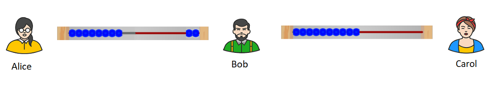

# ÀLÀYÉ LIGHTNING NETWORK PẸLÚ PÁTÁKÓ ÌṢÈṢIRÒ

látọwọ Roy Sheinfeld [2018/03/25](https://medium.com/breez-technology/understanding-lightning-network-using-an-abacus-daad8dc4cf4bs)

<LanguageDropdown/>

Mo ti gba ìdáhùn ìwúrí nítorí àyọkà mi tẹlẹ, [Lighting Network ni Ọjọọla Bítkọìnì](https://medium.com/@kingonly/the-future-of-bitcoin-3187aefe2746). Sùgbọn bí
mò ṣe ún ka ọpọ nínú àwọn ìdáhùn náà, ó hàn sí mi kedere pé ọpọ ènìyàn ni kò ní òye bí
Lightning Network (LN) se ún ṣiṣẹ gangan. Nínú àyọkà yìí, un ó gbìyànjú láti ṣe ojúùtú ìtumọ
LN àti àwọn ọnà ajara ìsanwó wọn nípa àfiwé pátákó ìṣèṣirò, láì fàsìkò sòfò pẹlú àlàyé ọrọ
onígbàjámú ìṣiṣẹ LN.

Pátákó ìṣèṣirò nìyí:

Óyá, ẹ fojú [wo ọnà àjàrà ìsanwó LN](https://cointelegraph.com/explained/lightning-network-explained#block-5) bíi wáyà pátákó ìṣèṣirò, bíi pé àwọn ìlẹ̀kẹ̀ dúró fún àwọn
bítkọìnì nínú ọnà àjàrà. Nígbàtí Alice àti Bob bá dá ọnà àjàrà ìsanwó sílẹ láàrin ara wọn,
Alice ó kó àwọn bítkọìnì láti ori Blockchain sí nú ọnà àjàrà. Níbẹrẹ àwọn bítkọìnì yìí (f.a. 10
bits tàbí 0.00001 BTC) jẹ ti Alice. Nínú àpẹrẹ yìí, ìlẹ̀kẹ̀ kọọkan dọgba mọ bit ẹyọọkan:

Wáyà pátákó ìṣèṣirò àti ọnà àjàrà ìsanwó ní àwọn ẹyà tó báramu wọnyí:   

- **Ọnà-àlọbọ (Bidirectional):** bó ṣe jẹ pé bí àwọn ìlẹ̀kẹ̀ orí pátákó ìṣèṣirò ṣe le fọwọ sún láti ósì sí ọtún àti padà, bẹẹ náà ni bítkọìnì ṣe é sún látọdọ Alice sí Bob àti padà.
- **Ohun-ìní:** lórí pátákó ìṣeṣirò, àwọn ìlẹ̀kẹ̀ le wà ní apá òsi tàbí ní apá ọtún, wọn kò lè sí ní ààrin wáyà. Bíi báakan náà, àwọn bítkọìnì nínú ọnà àjàrà ìsanwó le jẹ ti Alice tàbí Bob. Kò lè jẹ ti àwọn méjéèjì lẹẹkan náà.
- **Iye kan náà:** boṣe jẹ pé àwọn ìlẹ̀kẹ̀ orí wáyà pátákó ìṣèṣirò kò ṣe é fikún tàbí yọkúrò, bẹẹ náà ni Alice àti Bob le ṣe pasípàrọ bìtkọìnì láàrin ara wọn títí dé iye nọmbà tí wọn ti pèsè sílẹ láti bẹrẹ nígbà tí wọn sí ọnà àjàrà ìsanwó. Tí wọn bá fẹ ṣe pàsípàrọ iye bítkọìnì tó pọ ju èyun lọ wọn gbọdọ sí ọna àjàrà ìsanwó míràn.

Báyìí ni bí ọnà àjàrà ìsanwó yíò ṣe tí lẹyìn tí Alice fi 2 bits ránṣẹ sí Bob:

Lẹyìn náà iyè ìlẹ̀kẹ̀ tó kù fún Alice jẹ 8, Bob sí ní méjì. Káwá sọ pé Bob tún ní ìbásepọ mọ
Carol nínú LN pẹlú ọnà àjàrà ìsanwó 10 bit:

Pẹlú LN, Alice le sanwó fún Carol látọdọ Bob. Nínú àpẹrẹ pátákó ìṣèṣirò, tí Alice bá fẹ fi 2
bits ránṣẹ sí Carol, yíò sún ìlẹ̀kẹ̀ 2 lórí wáyà Alice-Bob sí ọtún (sí Bob), bẹẹ sì ni Bob yíò sún
ìlẹ̀kẹ̀ 2 lórí wáyà Bob-Carol sí ọtún (sí Carol). Báàyí ni yíò ṣe rí lẹyìn tí Alice bá fi 2 bits ránṣẹ
sí Carol:

Ó ṣe pàtàkì kí á tẹnú mọ pé tí Bob bá gbà láti ṣe ìnádúrà yìí, kọ gbọdọ gba ìlẹ̀kẹ̀ lọwọ Alice
láì fí ìye ìlẹ̀kẹ̀ kan náà ránṣẹ sí Carol.

Nípa lílo àpẹrẹ pátákó ìṣeṣirò, ó rọrùn láti ṣe àlàyé ìdúnádúrà orí LN ní gbogbogbòò, àti ní
pàtó àwọn ohun tó gbọdọ̀ wà kí ọ̀nà àjàrà ìsanwó ó tó kópa nínú ìdúnádúrà lórí LN. Fún
àpẹrẹ, ó rọrùn láti ri pé Alice kò le fi iye ìlẹ̀kẹ̀ ránṣẹ sí Bob ju iye tí ó ti pètò sílẹ lọ. Bóyá ní
ọjọ iwájú Alice yíò le ṣe èyí tó bá lo [AMPs](https://bitcoinist.com/atomic-multi-path-help-bitcoin-become-formidable-payment-instrument/), sùgbọn ọrọ ọjọ míràn lè yun...

**Tí àyọkà yìí bá ṣe ìrànlọ́wọ́ fún yín, ẹ jọwọ́ ẹ mọ́ gbàgbé láti fún ní àtẹ́wọ́ (ẹ tẹ̀ẹ́ pípẹ́ láti fún ní àtẹ́wọ́ púpọ̀) kí ẹ sì pin kiri.**