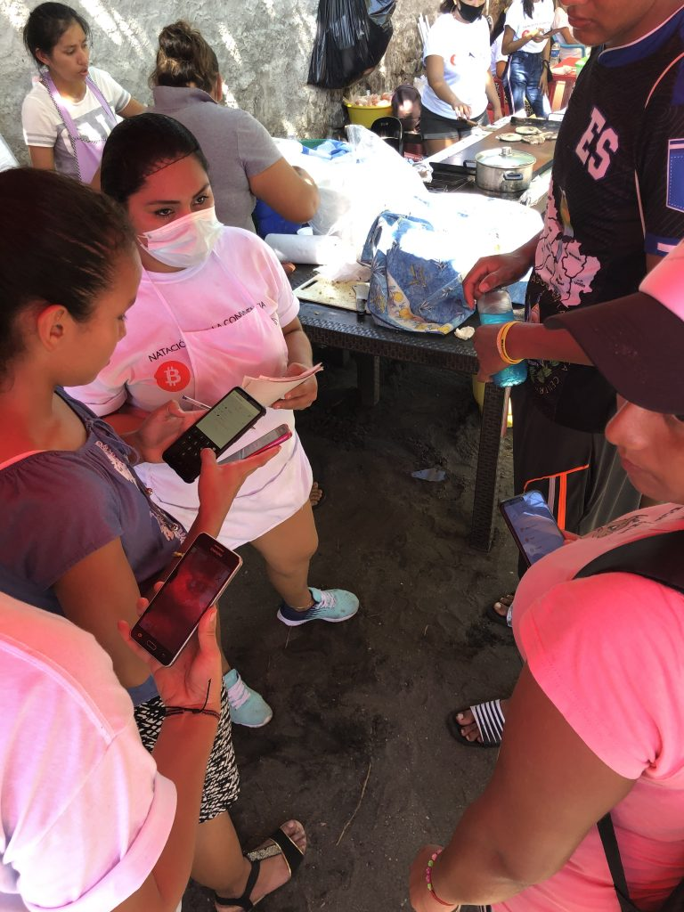
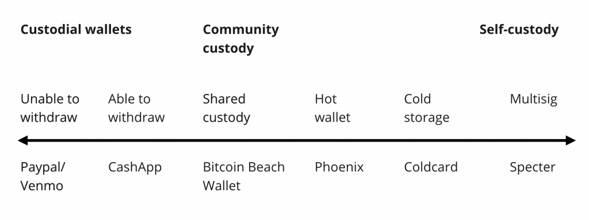

# Ukubhanga kwe-Bitcoin koMphakathi: Iimfundo ezifundwe ku-Bitcoin Beach

ngo Galoy Money [2021/11/10](https://galoy.io/bitcoin-banking-for-communities-lessons-learned-from-el-zonte/)

<LanguageDropdown/>

## Amagama wokuthokoza

Itjhuguluko yomvukelambuso kanengi ivuswa ngilabo abancane khulu nobutlhogalemuko yokuzwisisa
ukuthi iinthembiso ebafuna ukuzenza zizokubhala. Noma ngingekhe ngwazi ukubiza isilandulo setja,
ngesikhathi i-Bitcoin Beach ihloma, ngithokoza ukuthi bengingakahlali isikhathi esaneleko ku-Twitter
“ukwazi” ukuthi i-Bitcoin ngeze yasetjenziswa ngabantu ukuthenga ikomitji yekofi. Ngathane senza
irhubhululo ehlakanphileko namkha sathoma ngeemfundo zokwenzeka ezivamileko, besizolemuka
ubudlhadlha bethu. Sesithokoza ukuthi inengi lenu manjesi lingathola i-EI Salvador emebheni ngoba
besizindlhayela ezingazi ngcono.

Mayelana ne-Bitcoin Beach, kwamambhala esikhathini esinengi iqiniso aliziwa ukufana nenganekwane.
Akekho obekangacabanga ukuthi umnotho wokuthoma we-Bitcoin weqiniso ungathola indabuko
endaweni yemakhaya encance ese-EI Salvador. Irholwa ngumkhambi omdala osasebenzisa i-imeyili ye-
Earthlink, ubambisane nomrholi womphakathi osesemncani wase-Salvador ongakaqedi ibanga lesi-6.

Nasiqala emva, umphumela bewusobala: inani labantu elisogola ngomtlhago nelitlhoga ukufakwa
phakathi kweemali belivele linqophelwe ukubona ukubaluleka kwe-Bitcoin ngaphambi kwemiphakathi
enjingileko e-Singapore namkha e-Silicon Valley. Kubonisa kufaneleka ngokungaphezulu – labo abavule
indlela yokuthoma bathome bayihlekisa engakafaneleki ngangokuthi awukho umphakathi olandelako
udinga ukuzizwa onokwesaba.

E-El Salvador, i-Bitcoin yimali yabatlhagileko nabakhitjhwe emalini. Ebantwini be-Salvador abaphila
emtlhagweni, iinkulumopikiswano hlangana neenkampa zegolide ledigithali nekhetjhi yedigithali
ziqaleka zingatholakali, begodu ziswela ukukhambelana kwamambala. Kilabo abatlhoga i-Bitcoin
khulukhulu, kungendlela abathenga ngayo uburotho bamalanga woke nangokuthi balibulungela njani
ikusasa. Ababoni isidingo sokukhetha kunye namkha okunye

Manjesi la ngo-2021 sibona isitjhaba esincani esisemtlhagweni sibonisa umhlaba indlela i-Bitcoin
ilinganisa ngakhona ummango wabatlhagako. Siyazi ukuthi i-Bitcoin Beach imbono nje kwaphela.
Kodwana sithemba ukuthi izoba bukhazimulo obuvuthisa umlilo iphasi loke. Siyakumema ukuthi uze
uzovakatjha e-EI Zonte, bese usirhelebhe sisabalalise umbono lo womphakathi we-Bitcoin
Banking(ukubhanga kwe-Bitcoin) okghonisa ukufakwa kweemali iphasi mazombe.

– Mike Peterson ([@bitcoinbeach](http://twitter.com/bitcoinbeach))

## Kusuka Kumtlamo Wendawo Ukuya Kwithenda Yomthetho Emnyakeni Embili

Umtlamo we-Bitcoin Beach uthome ngombuzo olula kodwana okhuthazelako: Singakghona ukwakha
umnotho ogegako nogcinileko ku-Bitcoin?

Ipendulo ngu iye omkhulukhulu. Okuthome njengomtlamo womphakathi edorobheni ekude nendawo
sekutjhuguluke kwaba yindaba emayelana nabantu abaziingidi eziyisithandathu abakhombisa umhlaba
ukuthi i-Bitcoin yimali.

Emhlahlandleleni lo sileka iimfundo eziyisithandathu ezifundwe kuthuthukiswa isikhwama se-Bitcoin
Beach (Bitcoin Beach Wallet) kunye netuthuko yomthombo okulevileko owufakela amandla. Umnqopho
wethu ukusiza imiphakathi iphasi loke ukuthi irhabe ngefundo yazo nokwamukela i-Bitcoin ne-Lightning
Network (ithungelelwano erhabako)

## Khuyini i-Bitcoin Beach?

Eligwini lase-Pacific lase-EI Salvador kuhleli i-EI Zonte, idorobha elinicani aliselwandle elihlala abantu
abayi-3000. Abahlali bakhona batjhiywe ngaphandle ehlelweni lokubhanga elijwayekileko begodu
balwisane nobugebengu beenqhema seenlelesi kunye nokukhitjhwa kwezemali amatjhumi weminyaka.
Ngaphezu kweminyaka elitjhumi edlulileko, isiqhema esincani sabantu sesiberegile ukuvusa itjhuguluko
nokubuyisa ithemba e-EI Zonte.

U-Jorge Valenzuela, u-Roman “Chimbera” Martinez noMike Peterson bathome ukuraga amahlelo wentja
ngabo-2009 ukuze banikele abentwana be-El Zonte ithuba lokudlala, lokufunda nokubhudanga. Ukusuka
ekusefeni “para todo" (ukusefa kwawo woke umuntu) ukuya ekilasini lamakhompyutha ukuya
kumaphrojekthi wesevisi yomphakathi abhadalwako, amahlelo aphefumule amathuba amatjha
endaweni eke yavalwa ngehlahla.

<figure>
  <figcaption>UJorge, uChimbera kunye nesiqhema babeke ukuqina, ifundo kunye nomsebenzi womphakathi esentha
yepilo yamalanga woke e-El Zonte. (Umthombo: <a href="https://twitter.com/romanmartinezc/status/1429081008012505091?s=20">Twitter</a>)</figcaption>
</figure>

Ngo-2019, u-Mike utjhidelwe mumuntu obekafuna ukusekela amahlelo wabo ngomnikelo we-Bitcoin.
Kodwana bekunehloso kulokhu: umnikelo ufanele usetjenziswe emphakathini, esikhundleni
sokuthengisa kwi-fiat (imali yombuso). Umnqopho ungaba ukuthi kwakhiwe umnotho ogegako
nogcinileko we-Bitcoin lapho abarhwebi namalunga womphakathi batjhentjhelana khona ipahla,
iinsetjenziswa kunye nomsebenzi ngama-sats. U-Jorge no-Mike bamukele iselele, bese i-Bitcoin Beach
yabelethwa.

Kusuka ekuthomeni, kubonakele ukuthi omtlamo lo uzokuqeda iimbono engasingiyo ebikade icatjangwa
nge-Bitcoin:

1. **I-Bitcoin yipahla yokufunisela yabanothileko.** Nawunga lalela ihlelo leendaba
zamabhizinisi namasayithi, uzokuzwa ikulumiswano ngaso soke isikhathi mayelana
nentengo, ukuguquguquka, nokumadanisa nenye ipahla nokufakwa kwemali
njengegolide neentoko. Uzokuzwa ngamabhanga ukuthi abolekanjani abathengi babo
abanenani eliphezulu. Engeke wakuzwa ukuthi i-Bitcoin inikela ngamandla womnotho
kwezinye iindawo ezitlhage khulu emhlabeni.

2. I-Bitcoin yisitolo esithathela phezulu, ingasi indlela yokutjhintjhelana. Njengoba
ukusetjenziswa kwe-Bitcoin njengesitolo esithathela phezulu kwamukelwa kabanzi, i-
Bitcoin njengendlela yokutjhintjhelana iyisihloko esitjhisako esiphikisana khulu kuze
kube namhlanje. Isizathu sikhamba; "Nakibe intengo ye-Bitcoin iragela phambili
ngokukhula ngesilinganiso sanje, akekho oyofuna ukuyisebenzisa epahleni
nensentjenzisweni."

Njengombana umbono womtlamo ujike waba yisenzo, isiqhema esikhulako sabalinganisi nabafundi be-
Bitcoin Beach siqaphele iinkinga i-Bitcoin engakwazi ukuzitlharulula emphakathi yayo:

1. **Amabhanga ajayelekileko akenzi ibhizinisi emiphakathi etlhage khulukhulu.** I-El Salvador solo yaba
sehlelweni le-US Dollar ukusukela ngo-2001, lokhu kwenza isigaba sabo sezemali sibe ngaphasi
kwemithetho ye-US. Iindleko eziphezulu zokuvumela ezibekwe yimithetho le zenza amabhanga angaphi
abantu bemaphasini atlhagileko. Isibonelo, umphathi we-[Garten Hotel](https://www.gartenzonte.com/garten) wathi nakazama ukulungisela
abasebenzi ngama-akhawundi asebhanga nangesibambiso esinqophileko, [wathola ukuthi](https://youtu.be/RhoiOzhuBG4?t=1438) izobiza i-$50
ngenyanga, isisebenzi ngasinye. Lokhu kulinganisa ngaphezu kwe-10% yemali engenako yeenyanga
zonke yomuntu osebenza ngomrholo omncani.

2. **Ukuthumela inani loke lembhadelo kebantwini be-El Zonte kuyabiza begodu kudla nesikhathi.**
Iimbhadelo ezithunyelwa kwamanye amaphasi nge-El Salvador zenze i-[23% ye-GDP yenarha ngo-2020](https://www.cnbc.com/2021/09/09/el-salvador-bitcoin-move-could-cost-western-union-400-million-a-year.html).
Kubiza ngaphezu kwe-$3 yembhadalo ukuze umuntu athole i-$10 ebuya elungeni lomndeni
ngaphetjheya. Ayikho i-Western Union e-El Zonte manjesi kungathatha ama-awara nokukhwela
amabhesi amanengi bona abahlali bafike esikhundleni lapho bangathola khona imali ethunyelweko.
Lokhu kuhlangene namalanga engawathatha ukuthi imali ifike e-El Salvador ebuya emntwini othome
ukutjhidisela imali.

3. **Kunzima ukubulunga imali ngaphandle kokufinyelela ihlelo lamabhanga.** “Ukungabi nebhanga"
akuvimbeli nje ukuthi umuntu abe ne-akhawundi yasebhanga kwaphela. Begodu kubavimbela
bangafinyeleli umhlobo wokufakwa kwemali ebhanga kunye nepahla engabavikela ekuphakameni
kweentengo. Umphumela obewungakalindeleki wokwethulwa kwe-Bitcoin kwakuyinani labantu
abathoma ukubulunga ingcenye yomrholo wabo obonakalayo kokuthoma empilweni zabo.

<figure>
  <figcaption>TIsiqhema se-Bitcoin Beach sizinikele ekusizeni umphakathi waso ukuthi uthengiselane ngedijithali
ngokusebenzisa i-Bitcoin. (Umthombo: <a href="https://twitter.com/romanmartinezc/status/1401672924092841984?s=20">Twitter</a>)</figcaption>
</figure>

Ukuze i- Bitcoin ivuthise ukukhula komtlamo wabo, isiqhema kose sisebenze. Bathome ngokungenisa
umphakathi umuntu ngamunye enethiwegini ye-Bitcoin. Bafunda, bafundisa bese bajayela
ngokukhamba kwesikhathi. Ukufika kobulwele oburhatjhekako ekuthomeni kuka-2020 kwasebenza
njengefutha lomodere ekwamukeleni i-Bitcoin. Abahlali base-El Zonte ebebatlhoga ukuthekghwa
bakghona ukuthola iminikelo ye-Bitcoin bayiphwa ngumtlamo we-Bitcoin Beach.

[Umtlo-ndaba omfitjhani we-Forbes wango-2020](https://www.forbes.com/sites/tatianakoffman/2020/07/14/this-el-salvador-village-adopts-bitcoin-as-money/?sh=723af6ac2044) wafaka i-Bitcoin Beach emehlweni wabantu
bewathoma ukudosa isisekelo sabanye abasebenzisi be-Bitcoin abafune ukusiza. Omunye wabo
bekungu-Nicolas Burtey, umsunguli we-Galoy, ozinikele ukuza e-El Zonte ukuze athuthukise isikhwama
semali esifanele iindingo ze-Bitcoin Beach. Kungakabi isikhathi eside, i-Bitcoin Beach Wallet yabelethwa
begodu umtlamo we-Bitcoin Beach wawukhula ngamandla ekufezeni umbono wayo.

Njenganje inengi labantu selazi ukuthi indaba igcinaphi: UMongameli wase-El Salvador u-Nayib Bukele
ubeke umbiko ngo-Juni 5, 2021 ukuthi i-Bitcoin izokuba yithenda esemthethweni enarheni. U-Bukele
ulandise ku-Twitter Spaces ukuthi umbuso ukhuthazwe mtlamo we-Bitcoin Beach nokuthi ihloso
yomthetho bekukubuyelela okwenzeke e-El Zonte inarha yoke. Utjhwile ngokunqophileko ukuthi
ukufaka amalunga womphakathi wase-Salvador atlhage khulu kwezeemali kube yisekela esikhamba
phambili. Ngo-Septemba 7 2021, i-La Ley Bitcoin (“uMthetho weBitcoin”) yathoma ukusebenza. I-Bitcoin
Beach soloko yaba yingcenye ebalulekileko kwephasi loke l-Bitcoin. Seyidose abantu abasebenzisa i-
Bitcoin abavela ephasini loke abafuna ukubona ukuthi kunjani ukusebenzisa ama-sat ukuthenga ikofi,
iimfundo zoku-sefa (surf), kunye nenyama yekomo. Seyiphinde yaba yisifaniso seminye imiphakathi
ukuthi yenze ngokufanako.

Okubaluleke khulu, i-Bitcoin Beach yakhe umphakathi lapho abantwana base-El Zonte bangabhudanga
bebakhe nekusasa labo.

## I-Bitcoin Beach Wallet (Umgodla we-Bitcoin Beach)

I-Bitcoin Beach Wallet mthombo ovulekileko womphumela webhanga yomphakathi we-Bitcoin.
Eyakhelwe ukuhlangabe iindingo zabarhwebi namalunga womphakathi e-El Zonte. Isebenzisa isifaniso
semitlikitlo embili eyabelanako yelungelo lokutlhogomela enikela enye indlela yomphumela unelungelo
nongenalungelo lokutlhogomela ovamileko ezitholakalako kabanzi namhlanje.

<figure>
  <figcaption>U-Cristina usebenzisa i-Bitcoin Beach Wallet ukuze athengise iinsibha ezenzwe ngezandla. Abathengi
bangakwazi ukumbhadala ngegama lomsebenzisi, ngokuskena i-invoyisi emtatweni wakhe, namkha
ngokuvakatjhela <a href="https://ln.bitcoinbeach.com/Jackie_Valenzuela">ikhasi lakhe le-invoyisi</a>. (Umthombo: <a href="https://twitter.com/romanmartinezc/status/1446661818735288320?s=20">Twitter</a>)</figcaption>
</figure>

Ngaphakathi kwe-Bitcoin Beach Wallet, imali yokusikimisa ihlanganiswa bese iphathwe ngumphakathi.
Lokhu kunikela iinzuzo kuwo woke amalunga angaphakathi komphakathi:

- Iimsele erhabako iphethwe malunga; azikho iindleko zokuvula namkha ukuvala amatjhanele
- Ama-intra ledger wokuthengiselana (ileja yangaphakathi) wamahala namsinyana enzwe
atholakale ngaphakathi komphakathi
- Ikghono lokusebenzisa amahlelo wekhompyutha kwi-inthanethi kutjho ukwehla kweendleko umsebenzisi ngamunye nawumadanisa nalokha umrhwebi ngamunye abe nehlelo lekhompyutha ekungelakhe
- Iindleko zingancitjhiswa ngokuhlanganisa imisebenzi ye-on-chain

Amajamo angeziweko ehlelweni asiza ukuthekgha imizamo eyokugcina umnotho we-Bitcoin:

- Ikghono lokubhadala ngesiphande se-Bitcoin, i-invoyisi erhabako namkha igama lomsebenzisi
- Ibhalansi ehlanganisiweko ye-on-chain kunye nokurhaba, ebonisa ibhalansi ngama-Dola nama-sats
- Ilogi yokuthengiselana ibonisa umlando weembhadalo hlangana nabasebenzisi
- Umebhe olula kamaliledinini ubonisa woke amabhizinisi wendawo amukela iimbhadalo erhabako
- Abasebenzisi bempande yewebhu bangabelana ukuze bathole i-Bitcoin kunoma ngubani
onesikhwama semali esirhabako (bona [ln.bitcoinbeach.com/bitcoinbeach](http://ln.bitcoinbeach.com/bitcoinbeach))

Nakibe unekareko ekwakheni ihlelo lokusebenza likamaliledinini elingaphambili njenge-Bitcoin Beach
Wallet ungathola indawo ye-[galoy-mobile](https://github.com/GaloyMoney/galoy-mobile) ku-GitHub.

Ngaphandle kokumutjha isikhathi, nazi iinfundo eziphezulu u-Galoy azifunde ngokwakha e-El Zonte.

## Isifundo 1: Ifundo Ibalulekile

I-Bitcoin yinto enzima ukuyizwisisa. Isika isayensi yekhompyutha, ezomnotho, umlando, i-
khriphuthographi, umgomo wemali nokunye. Ngetjhudu, umuntu akatlhogi ukuzwisisa i-Bitcoin
ngokuzeleko ukuze ayisebenzise bekazuze kiyo. Bangaki abantu abasebenzise i-fiat iimpilo zabo zoke
abaziko ukuthi imali isebenza njani?

<figure>
  <figcaption>Ukubonisa abantu be-El-Salvador ukuthi isetjenziswa njani i-Bitcoin kuyindlela yekambiso eragela
phambili ku-Jorge kunye nesiqhema se-Bitcoin Beach. (Umthombo: <a href="https://twitter.com/romanmartinezc/status/1420951261675929601?s=20">Twitter</a>)</figcaption>
</figure>

Naka amathiphu amahlanu okufanele uwacabange nakufundisa umphakathi wakho:

1. **Abahleli bomphakathi basikhiya endleleni yekambiso yokwazisa.** Ukuba nesiqhema sokwazisa
phambikwako kuqinisekisa abantu bathome ngendlela elungileko. Loku kubaluleke khulu
emphakathini lapho i-Bitcoin iletha khona ithuba lokusebenzisa idijithali kokuthoma
2. **Kusebenza ngcono khulu ukukhombisa abantu indlela yokusebenzisa i-Bitcoin kunokuthi ubatjele ngayo.** Ukusiza abantu ukuthi badawunilode begodu basebenzisane nomgodla wemali,
nokuthi bathumele bese bamukele ama-sat kusebenza ngcono kunokuzama ukubaphaye
ngeembono
3. **Fundisa abantwana. Bazokufundisa ababelethi babo.** Abantwana be-El Zonte babemsinya
ukufunda ukusebenzisa i-Bitcoin. Nabo basiza ababelethi babo ukuthi bafunde ekhaya.
4. **Ama-ATM we-Bitcoin asiza ukuhlanganisa amaqatjhazi wengqondo phakathi kwe-Bitcoin ne-fiat.** I-ATM ye-Bitcoin iqine iyipahla esizako ukufundisa. Lokha abantu bekghona ukutjhintjelana
i-Bitcoin emgodleni wabo wemali kamaliledinini ngemali yabo yasendaweni, bakha ubuhlobo
obuqinileko ngombono we-Bitcoin njengemali.
5. **Siza abantu balinde begodu baplanele itjhuguluko yesikhatjhana.** Beka okulindelweko ukuze
umphakathi wakho uzilungiselele ukwehla kwenani le-Bitcoin. Cabangela ihlelo elililisa
abarhwebi abane-akhawundi yebhalansi eyehlako ngebanga lokuya emva ngaphambili
kwentengo ngesikhathi sokuthoma sokukhwela baze bafikelele lapho bazigedla khona nge-
Bitcoin.

Nawusakha umphakathi wakho, ziphe isikathi sokuzihlanganisa nokufunda ebantwini base-[Bitcoin
Beach](http://bitcoinbeach.com/). Ziinkakaramba ezizokukhomba indlela. Ukuzinikela kwabo ekusizeni abantu bekukhona phambi
kwe-Bitcoin, begodu kudlula i-Bitcoin. I-Bitcoin kwanjesi iphenduke indlela abangaletha ngayo ithuba
nethemba ngekusasa lase-El Salvador.

## Isifundo 2: Umbani uyifutha lomodere ye-Bitcoin njengeMali

I-Lightning Network (Inethiweki Erhabako) mthetho wekambiso othathelwa phasi khulu ephasini.
Eminyakeni embili edlulileko bekuyindlela #ebudedengu yokwenza. Nje isisetjenziswa ngebakwa-
McDonalds, bakwa-Starbucks nase-Pizza Hut e-El Salvador. Ukukhula kwamanodi, namandla
wokuphatha kwenzeka ngokukhulu ukurhaba. Umbiko wamva nje we-Arcane Research "[Isimo
Senethiwekhi Yombani](https://www.research.arcane.no/the-state-of-lightning)" unikela iso nyana lokukhula kwezinye zamamethrikhi (metrics) nokulindelweko.

Ekuthomeni i-Bitcoin Beach beyiberegisa ukuthengiselana kwe-on-chain ukwabela i-Bitcoin
emphakathini. Ngesikhathi i-on-chain isebenzela amalungiselelo weemfundo nokudlulisela ama-sats
kumalunga womphakathi, ukukhawuliswa kwayo kwaba yisivimbelo ekuthuthukiseni umnotho ogegako

Abantu base-Salvador balemukile ukuthi ukusetjenziswa kwe-Bitcoin njengendlela yokutjhentjhelana
kunomkhawulo ngaphandle kwamanethiwekhi amabili afana nombani:

1. **Iindleko ze-on-chain bezibiza khulu ukusetjenziswa malanga woke.** Abahlali base-El Zonte
batlhoga ukusebenzisa amadola amancani, njengamasende (cents) ayi-50 wama-pupusa
(pupusas).
2. **Ukusebenzisa i-Bitcoin ye-on-chain ekuthengiseni kwentolo kubanga “ithuli”.** I-Bitcoin Beach
izilemukele “ikinga yokuthengiselana ithuli”. Iimphumela yokwenziwa engakaberegiswa (ama-
UTXO) irekhoda ukuthi inani likhanjiswa njani ngokuyakwesikhathi (timechain).
Lapho inani le-UTXO liba phasi khona kuneendleko zokuyisebenzisa, i-Bitcoin ibonwa njenge
"thuli" elingaberegiseki.
3. **Endaweni ethengisako, noma yini engaphasi kokubhadala okumsinya kwakha ukungezwani kokubili kwebhizinisi nomthengi.** I-Bitcoin yakhelwe ukuvikeleka nokungonakali kwilarha
yokuthoma. Ayenzelwa ibelo nokuphuma kokwenziwayo.

<figure>
  <figcaption>Umbani uvumela amandla iimbhadalo erhabako, eberegiseka lula nengabizi etlhogwa
barhwebi endaweni yokuthengisa. (Umthombo: Galoy)</figcaption>
</figure>

Ilarha lesibili le-Lightning Network liyitheknoloji esezingeni eliphezulu elingaphakamisa ifa lehlelo
lokuthengisa beyilethe isithembiso se-Bitcoin njengemali ephasi. Abasunguli bethu batlole ngakho lokhu
emtlolweni omfitjhzana waka-2020 othi "[Umbani Njengehlelo Lokubhadala Lokuthengisa?](https://galoy.io/lightning-as-a-retail-payment-system/)"

I-Lightning Network isebenze njengefutha lomodere godu ikgonisa umbono womtlamowye-Bitcoin
Beach. Ngaphandle kwayo, ukusebenzisa i-Bitcoin njengemali e-El Salvador kungababudisi khulu
bekubize khulu; kungenzeka ukuthi iphazamiseke namkha okungenani ibambezele umtlamo.

Ukuhlanganiswa kwe-Lightning Network sekuphenduke isamba semali sazanoma ngimuphi umgodla
wemali namkha amasevisi wezeemali ezakhiwe ku-Bitcoin. Ivula amathuba amakhulu okuthenga
okuseduze-ukuya-mahhala, iphasi loke, kwesikhathi samambala, nokuthengiselana okunganamvume.

## Isifundo 3: Ukufundiswa Komthengisi Kuyadingeka Ukuze Kuthuthukiswe Umnotho Wasendaweni Oyindilinga

Ukujama komnotho we-Bitcoin ozombako kuveza ikinga "yekukhu neqanda". Abahlali batlhoga iindawo
zokuyisebenzisa, bese abarhwebi batlhoga abathengi abazoyisebenzisa. Ukwenza kube lula begodu kube
netjhisakalo yokuwamukela i-Bitcoin kuyisinyathelo esibalulekile ehlahlambiseni ukutholwa
komphakathi wendawo.

Umgomo omkhulu ukwenza ukuthola i-Bitcoin kubemsinya, kube lula, begodu kungabizi khulu kunezinye
iimali noma iindlela zokubhadala.

<figure>
  <figcaption>UMama Rosa (osesithombeni nendodana yakhe u-Jorge) bekangumrhwebi wokuthoma e-El Zonte
ukwamukela i-Bitcoin. (Umthombo: <a href="https://twitter.com/romanmartinezc/status/1387105142030352387?s=20">Twitter</a>)</figcaption>
</figure>

Nazi ezinye izinto ezibumbe indlela esakhelengayo abarhwebi:

1. **Ungenzi abarhwebi bacabange ngokutjhugulula imali yenarha.** Yehlisa umthwalo wengqondo
otlhogekako ukuze ubale intengo ngokubonisa kokubili imali yedola (noma imali yendawo)
kunye namanani we-Bitcoin kuwo woke amabhalansi, ama-invoyisi neenkrini zomlando
wokwenziwa
2. **Vumela iindlela ezinengi zokuthi abathengisi babhadalwe.** Abathengisi akukafanele benze ama-
invoyisi yokuthengiselana ngayinye. Ngokusebenzisa i-Bitcoin Beach Wallet, abathengi
bayakghona ukubhadala ngegama lomsebenzisi, ikhowudi ye-QR yokugadangiswa, ukukhetha
umthengisi emebheni, namkha basebenzise amakhasi we-invoyisi umsebenzisi ngamunye
bebabelana ngawo e-ln.bitcoinbeach.com/[igama lomsebenzisi].
3. **Yenza indlela yekambiso itlhoge isikhathi esincani, ukunakwa nokuchofoza.** Ukutjhuguluka
kwezinto zabarhwebi be-El Zonte kufike lapho i-Galoy iphi abathengi imvumo yokubeka inani le-
invoyisi. Abarhwebi abasatlhogi bona balise into abayenzako kuze benze i-invoyisi. Bangavele
baqale umkhosi kumaliledinini wabo ukuqinisekisa ukuthi imbhadalo ingenile. I-Bitcoin nje ilula
ukwamukela kunekhetjhi namkha isikweletu
4. **Yenza iinhlohlomezelo zabarhwebi ukusiza ukukhuthaza bamukele kusenesikhathi.** E-El
Zonte, bekukhona ihlelo le-“cash back" iimveke ezimbalwa, lapho abathengisi bathola isiphulelo
se-20% kwi-Bitcoin yabo. Ihlobo leli lokukhutjhulwa lirhelebha ukutjhayela iimzamo
nokuhlahlambisa ukukhula zisasuka komnotho ogegako.

Ungalahlekelwa mnqopho endimeni ebalulekileko edlalwa barhwebi ekuthekgheni umnotho we-Bitcoin.
Iindingo zabarhwebisi umphakathi ngamunye zizokuhluka, manjesi qinisekisa ukuthi uzipha isikhathi
uzwisise bewutlame kusenesikhathi.

## Isifundo 4: Ilwazi Lomsebenzisi Kufanele Lithuthukiswe Ngaphakathi Kobujamo Bomphakathi

I-Bitcoin Beach ihlala emkhawuleni wokwaukela i-Lightning Network. Njengoba u-Mike ajwayele ukuthi
"Kunabatwana abancani e-El Zonte abenza ukuthengiselana okunengi ukudlula labo abanelwazi elinengi
lwe-Bitcoin (OG Bitcoiners)."

Njengoba umnotho we-Bitcoin bewukhula, isiqhema sitjheje iindingo ezingahlangabezwa nokusebenza
okufiswako okungasiza ukwenza ukuphila kube lula kubahlali nabarhwebi. Ukuba semphakathini e-El
Zonte kunikeze ukubonela phambili ku-Nicolas njengoba bekakha i-Bitcoin Beach Wallet.

<figure>
  <figcaption>Ukuqala abantu baberegisa i-Bitcoin kubathengisi i-El Zonte mazombe kuvele imininingwane elisizo
yokwakhiwa komkhiqizo nesevisi. (Umthombo: Galoy)</figcaption>
</figure>

Tjheja: Khumbula ukuthi kuqakathekile ukuhlolwa kwamhlelo namasevisi wakho ngaphakathi
komphakathi ezihloselwe wona. Zenzele irhubhululo lakho.

Iimfundo ezisithandathu ezilemukwe basebenzisi ezibuya kwi-Bitcoin Beach Wallet emangweni:

1. **Ungathathi ihlanganiso ye-inthanethi eqinileko phasi.** Ukuthuthukisa iindawo ezinehlangano
ye-inthanethi kungafuna ukuthuthukiswa nokubekezelelwa kwamaphutha ezingeni lenethiwekhi
evamile engeke itlhogeke e-Amerika
2. **Ukungena kwehlelo lokusebenza kuveza ithuba elifanele lefundiso.** I-Bitcoin Beach Wallet
inombuzo owakhelwe ngaphakathi okhambisa abasebenzisi ngesingeniso esifitjhani se-Bitcoin.
Umbuzo ngamunye uklomelisa umsebenzisi ngama-sats ukuze athome kuhle ekuthomeni.
3. **“I-Sats siyizinga,” kodwana i-USD iseseyiyunithi ye-akhawundi.** Abantu bacabanga ngemali
yabo yendawo, ingasi ama-sats, nabangena kwi-Bitcoin. Itjhuguluko yokucabanga ngama-sats
ikhamba kancani, imali yasendaweni kufanele kube iyunithi ye-akhawundi lapho iletha
umphakathi omutjha kunethiwekhi.
4. **Wongeza ukusebenzisana okuhlanganisa abathengi nabarhwebi.** Ithebhu yomebhe kwi-Bitcoin
Beach Wallet irhelebha abathengi ukuthi bathole iindawo lapho bangasebenzisa khona i-Bitcoin.
Iphinde inikele ukuthengiselana okumsinya nokurhabako ngokuvumela umthengi ukuthi ache
bekabhadale ama-invoyisi
5. **Amanothi wokubhadala arhelebha ngokugcina amarekhodi.** Abathengi nabarhwebi bangazuza
ngokwazi ukongeza amanothi wokuthengiselana. Nasiqala isekelo efakwa mphakathi ubujamo
butjhugulukile ukusuka ngasese (kuleveli yomsebenzisi) ukuya esabelweni. Nje umthumeli
nomamukeli bayakghona ukubona inothi elinamathiselwe kumsebenzi.
6. **Hlala unelwazi lokuthi ubujamo bembhadelo erhabako butjhuguluka njani.** Amajamo amatjha
wembhadelo afana nombani wempande (Lightning Address), ama-invoyisi ajamileko kunye ne-
BOLT 12 avela ngegadango emsinya. Ukukhetha ukuthi ngimaphi amajamo azokwamukelwa
azokuya ngokuthi aberegiselwani. I-Bitcoin Beach Wallet ekuthomeni yethulwe ngekhodi ye-QR
egadangisilweko erholele ekhasini le-invoyisi (njenge-ln.bitcoinbeach.com/mamarosa).
Amafomethi amatjha kwanjesi ayacabangwa ukuze kwehliswe ukurhuhlana bese kuthuthukiswe
ukusebenzisana.

## Isifundo 5: Ukugcinwa Komphakathi Kuyibhlorho lokuzigcina wena ngokwakho

Ukuzigcina kuyisimo esifiselekayo sawo woke umuntu ophethe ubunjinga be-Bitcoin. Umthetho
wokuthoma wokugcinwa kwe-Bitcoin uthi "Akusiziinkhiya zakho, akusiziinhlamvu zemali zakho."

Ukuzigcina ngokwakho akusiyo indlela yodwa, begodu akusiyo indlela efanele eya emiphakathini
esendleleni eya ecabangweni nasekwenzeni ukusebenzisa i-Bitcoin.

> Kufanele unyathele ngenyawo lenwabo. Nakibe ubeka boke ubunzima ekuthomeni, abantu ngeze bangena emphakathi. " – UMike Peterson kwi-[Tales from the Crypt #173](https://open.spotify.com/episode/6jyXUPu4n3nYDi4jbDFYBd?si=gSLNHJpUQk2ASevhiSBz-A)

### Isifanekiso sokugcinwa se-Bitcoin

Iinfaniso zokugcinwa ze-Bitcoin zihlala eduze komfanekiso ingasi ongafani nomfanekiso
olula/ongasese. Ngehlangothi linye, une-UX elula, uthola iimali zakho ngobulula
nokuhlanganiswa kiyo yoke i-fiat yasebhanga. Ngehlangothi elinye, unesimbi estenjwe ngesandla,
imitjhwana yembewu ehlukanisiweko kunye namamodeli okugcinwa mitlikitlo eminengi atlhoga
amagadango amanengi namtjhana abantu abanengi bakhambise iimgodla yeemali.

Izehlakalo ezihlukileko zinezimo eziyingozi ezihlukeneko ezenza ukurhwebelana okwamukelekako.
Isibonelo, ukubulunga umnotho kwi-akhawundi yebhanga kuvamise ukubonwa kuphephile kunokuthi
ukhambe uyiphethe njengekhetjhi ngesikhwameni semali, kodwana ukuphatha amanani amancani
wekhetjhi ukuthenga ngamalanga kunikela ubulula

<figure>
  <figcaption>I-Bitcoin Beach Wallet inikela ithuba lokukhetha ilungelo lokwabelana lapho iimali zibulungwa khona emphakathini.</figcaption>
</figure>

Yoke imodeli inosizo, kwaphela nje 1) isetjenziselwa umnqopho ofaneleko begodu 2) irhola abantu
phambili ngesidleni nababuthelela umnotho ondluleleko kwi-Bitcoin.

### Ukugcinwa komphakathi: ukukhumbula emandulo ngesikhathi samabhanga wehlangano

Umhlobo wokugcinwa esifikele kuwo nge-Bitcoin Beach ngilokhu u-Galoy akubiza ngokuthi "ukugcinwa
komphakathi." Kuyisisombululo semitlikitlo eminengi lapho amakhiya weemali ezibekwe endaweni
emakhaza (cold storage) abephethwe ngamalunga womphakathi wendawo. Imodeli le yehlisa
ukuthembela emakampanini aphezulu ngaphandle komphakathi ngesikhathi godu yehlisa ukurhuhlana
kwamalunga angena kwinethiwekhi.

### Inothi ekubhangeni komphakathi

Amabhanga omphakathi sekabekhona ephasini loke amakhulu weminyaka. Ihloso yazo ekhamba
phambili ukuthekgha iindingo zamahlalo-mnotho zeenqhema zabantu abanekareko efanayo. Esikhathi
esinengi ikareko efanaka ibekwa phakathi kwendawo. Iimali eziphethwe mabhanga omphakathi zitholwa
begodu zibolekwe abantu bemphakathini ngendlela esunduza ubudlelwano kunebhanga elijwayekileko
lomhlaba woke.

Amabhanga omphakathi aqakathekile khulu emiphakathini efana ne-El Zonte ngombana enza ukuthi
iinqumo zithathwe endaweni kucabangwe ngamalunga womphakathi.
[Isambululo sebhanga se-Galoy se-Bitcoin](https://galoy.io/products/) sakhelwe ukupha noma ngimuphi umphakathi namkha
ihlangano ephasini loke ukuthi sihlele ngendlela le.

Ukuthola ilwazi elipheleleko mayelana nokuhlangana phakathi kwe-Bitcoin namabhanga omphakathi,
qala umtlolo-ndaba omfitjhani we-Fulgur Ventures othi “[Indima yeBitcoin yamabhanga omphakathi](https://medium.com/@fulgur.ventures/the-role-of-bitcoin-for-community-banking-623068c59882)” (The role of Bitcoin community banking)

### I-Bitcoin Beach Wallet njengebhanga yomphakathi ye-Bitcoin

Iimali ze-Bitcoin Beach Wallet ziphathwa amalunga phakathi komphakathi, zinikela iindlela zokubhadala
ezingarhuhlani nezingaduriko ezenzelwe ukuthekgha umnotho wendawo.

Nakhu kuyini ukugcinwa komphakathi kusebenzela i-Bitcoin Beach:

1. **Ukususa ukurhuhlana kuligadango eliqakatheke khulu ukwakha imiphumela yenethiwekhi etlhogekako ngomnotho ogegako.** Abantu bayalwa ngemvelo ukutjhuguluka begodu bamsinya
ukwala iimbono emitjha namkha babuyele emikhubeni emidala. Njengoba uMike Peterson
watjho ekulunweni yakhe noMarty Bent ngoJuni 2020: “Kufanele ugadange kancani. Nakibe
ubeka boke ubunzima ekuthomeni, abantu angeze bangena emphakathi. "
2. **Kungaba nzima ukubulunga ngokuvikelekile nangokuthembekile imitjhwana yembewu emiphakathini ekude nesakhulako.** Abantu abahlala ngeendlini ezifeyila phasi nezifulelwe
ngamasenke, azikho iindawo ezivikelekile zokugcina imitjhwana yembewu etloliweko.
Ukusebenzisa imitjhwana yembewu nakho kuveza iinkinga ebantwini abangakwazi ukufunda
namkha ukutlola, okuyinto evamileko ezingcenyeni ezinengi zephasini.
3. **Abantu abasebenzisa i-Bitcoin bagcina bayijwayela ngokukhamba kwesikhathi.** Abahlali base-
El Zonte sebathumela i-Bitcoin nge-Lightning Network malanga woke. Abanye sebathomile
ukupaka ama-sats begodu babuthelele umnotho ongaphezulu kunalo ebabazowuthola ngama-
Dola waseAmerika. Lona mkhuba okhuthazako i-Bitcoin Beach ewusekelayo ngefundo
nokubandula mayelana ngokuzigcina. Ukuthuthukiswa kwe-UX kuzoragela phambili kwenze
ukuzigcina kutholakale ngobulula khulukhulu kubasebenzisi abanengi ephasini jikelele

Iimphumela yothombo ovulekileko wokugcinwa komphakathi seyivele njengemodeli ebalulekileko
yokufaka imiphakathi ku-Bitcoin. Sikholelwa ukuthi bazodlala indima ebalulekileko ekuletheni i-Bitcoin
kubasebenzisi abayisigidi sezigidi zokuthoma.

## Isifundo 6: Thoma Kancani Bese Wakhe Umfutho Ngaphambi Kokukhukhumala

Kuyakarisa ukubona ukwanda kwemiphakathi ephasini loke isebenza ukuhlanganisa amadorobho
namadorobho amakhulu kunethiwekhi ye-Bitcoin. I-[Bitcoin Lake](https://twitter.com/LakeBitcoin) e-Guatemala kunye ne-[Bitcoin Beach Brasil](https://twitter.com/bitcoinbeachbr) ziimbonelo ezimbili zokuthoma. Abanye abasebenzisi be-Bitcoin bake bathoma ukubiza iTonga
ngokuthi "Isihlengele saseBitcoin" emva kokuzwa ihlelo u-[Lord Fusitu'a](https://twitter.com/LordFusitua) eliyingcenye ezine lokuletha i-
Bitcoin enarheni yakhe.

<figure>
  <figcaption>Ifundiso yomuntu ngamunye yindlela yekambiso eyiyingcenye yeragelo phambili yokufaka umphakathi
ku-Bitcoin. (Umthombo: <a href="https://twitter.com/romanmartinezc/status/1432898996113133570?s=20">Twitter</a>)</figcaption>
</figure>

Kulabo abasanda ukuthoma sizoninikela iimbono embili ebalulekileko ekukhuphuleni ukusukela
embonweni ukuya emnothweni:

1. **Ukuthoma nomphakathi ohlathululweko kurhelebha ukwakha isisekelo esiqinile.** I-Bitcoin
Beach izuzile ngokusebenzela umphakathi ozinkulungwane ezintathu owawuhlukaniswe
ngokwendawo kwamanye amaplasi. Umnqopho lo omncani usivumele ukuthi sithumbe begodu
sizijwayele ukufunda ngesikhathi samambala okusilungiselele ngokukhula okunamandla
okwalandelako.
2. **Ukukhula kwenzeka “kancani kancani, bese ngokungakalindeleki.”** Nawuletha umphakathi kwi-
Bitcoin, lindela ukunikela ngesikhathi sakho nemizamo yakho ukufaka abantu abayi-50
bokuthoma kunenkulungwane elandelako. Ngombana i-Bitcoin mtlamo, imithetho evamileko
yemphumela womtlamo izoberegiswa. Ngenhlanhla, abathuthukisi be-Bitcoin, abafundisi
namakhamphani iphasi loke benza amathulusi ukurhelebha noma ngimuphi umphakathi ukuthi
uthome.

Abantu abanengi bathome ukuzwa nge-Bitcoin Beach ngo-2021, kodwana umtlamo sewuneminyaka
eminingi ukhona. Iqhema se-Bitcoin Beach esinikele iinkulungwane zama-awara sifundisa izinto
ezisisekelo, siphendula iimbuzo begodu sirarulula iinkinga okuzizinto eziqakathekileko zomtlamo lo.
Ngaphandle kwabo, i-Bitcoin Beach beyingekhe ibe yindaba yepumelelo oyifundako namhlanje.

### Ukuqalelela Kokuthoma Ibhanga le-Bitcoin

Yakha isisekelo esiqinileko nesiqhema, itheknoloji nokubandulula okulungileko.

<figure>
  <figcaption>"Singumndeni omkhulu onebhudango elikhulu." – <a href="https://twitter.com/romanmartinezc/status/1406411850170912769?s=20">@romanmartinezc</a></figcaption>
</figure>

1. **Hlanganisa isqhema sakho.** Fanisa abantu abanomoya, isibindi nothando lokurhola umphakathi
wakho ngetjhuguluko yehlelo ejamele i-Bitcoin. Kunama-engeli amabili adosa phambili ofanele
uwacabange zisasuka:
    - Ukuvumelana komphakathi: Ukuzwisiza ukuthi izinga leli lokuhlela umphakathi liqaleke njani,
vele ulandele bewufunde ku-[Jorge](https://twitter.com/jorgebitcoinES), [Chimbera](https://twitter.com/romanmartinezc), kunye no[Mike](https://twitter.com/Bitcoinbeach).
    - **Itheknoloji:** Kunamafektha amanengi okufanele uwacabange nawukhetha iimphumela
yetheknoloji ongakhela kiyo i-Bitcoin Bank. Ukuba nomuntu ongakubonisa ngeenqunto
eziphathelene nokugcinwa kwe-Bitcoin, indawo yombani kunye nokuphathwa komnotho,
ukuberegiswa komgodla wemali otjhisako nomakhaza namafektha amanye azokusiza undlale
isisekelo esinamandla sethuthuko.
2. **Thola umthombo wemali.** Ukuvikela ukutholakala kweemali kuligadango eliqakathekileko
ukufaka umphakathi omutjha kwi-Bitcoin, khulukhulu iinarha zabatlhage khulu lapho abahlal
abanganayo imali ebulungweko namkha imali engenako. Ukuba nemali yokubhadalela izinto
zokwakha kunye nezokusetjenziswa kuzorhelebha ngezomsebenzi, nokwabelana kwama-sats
phakathi komphakathi zisathomba kuzotlhoga ukuhlahlambisa omnotho ogegako.
3. **Thola umphumela wetheknoloji.** Amathulusi owunikela ngeensetjenziswa seemali phezu kwe-
Bitcoin ayavela. [Umthombo ovulekileko wezomakhiwo webhanga le-Bitcoin](https://galoy.io/products/) ka-Galoy mphumela
munye ohlose ukwenza izinto zibelula zomphakathini nezehlangano ukuthi zinikele
ngeensetjenziswa zeemali nge-Bitcoin kunye nombani.
4. **Hlathulula imodeli yakho yokugcina bese uhlele ukuplana imitlikitlo eminengi (multisig).**
Ukugcinwa kusihloko sesisekelo esifanele sinakwe ngemininingwane nokuzwisisa kwababukeli
bakho. Imiphakathini enabasebenzisi be-Bitcoin abanolwazi, ukuvumela ukuzigcina
kuyatlhogeka. Nawufaka abantu abanganamabhanga, ungagcina ukhetha imodeli yokugcina
umphakathi njengale eyenzelwe i-Bitcoin Beach ifanelekile ukubayisithomo. Noma kungaba
ngiyiphi indlela, qinisekisa ukuthi uhlela ukubamba iimali ezibekiweko ngaphakathi kokusethwa
kwama-multisig.
5. **Yakha ihlelo lokubandula nokuthekgha umphakathi.** Umphakathi we-Bitcoin unomusa
ngokuphana ngendlela ebabazekako ngezinto zokufundisa nezokurhelebha, Manjesi qala bese
ubuze maqange. Kungenzeka kungabi khona indawo engcono kune- "Bitcoin Twitter" ezoku
hlanganisa namavidiyo, imitlolo-ndaba efutjhani kunye nepahla ozoyitlhoga nawuthoma ukufaka
umphakathi wakho. Ukhumbula ukuthi ukuberegiswa kwe-Twitter kungaba phasi khulu
emphakathini oyakhelako.
6. **Tjhinga endleni!** Ukufaka umphakathi kwenzeka umuntu ngamunye, ngokuphumela ngaphandle
emphakathini bese unikele abantu ithuba lokwamukela nokuthumela ama-sats wabo
wokuthoma

<figure>
  <figcaption>Landela <a href="https://twitter.com/jorgebitcoinES">u-Jorge</a> (pictured), <a href="https://mobile.twitter.com/romanmartinezc">u-Chimbera</a> noMike Peterson (<a href="https://twitter.com/Bitcoinbeach">@bitcoinbeach</a>) uhlale uhlangene nekhambo le-El Zonte..</figcaption>
</figure>

## Isiphetho

Kuyakhuthaza ukubona iimphakathi neenhlango iphasi loke zisebenza ndawonye ukuletha i-Bitcoin
ebantwini bokuthuma abasigidi sezigidi. Sithemba ukuthi mhlahlandlela lo uzokurhelebha ukurhabisa
ifundo bese ikhuthaze ikulumo ehle.

UGaloy uhlela i-[Adopting Bitcoin: A Lightning Summit e-El Salvador](https://adoptingbitcoin.org/)  ngoNovemba 16 ukuya ku 18
njengendlela engeziweko yokuthekgha ukwamukelwa kwe-Bitcoin gidinga ipumelelo yesiqhema se-
Bitcoin Beach. Sizithobile ukuba sekhamphanini yabantu abafana no-Jorge, u-Chimbera, u- Mike kunye
nabanye abangakabalwa abavuse umbono womnotho ogegako we-Bitcoin

Nakibe ungathanda ukubona nokusebenzisa ikhodi yethu, imahhala begodu mthombo ovulekileko ku-[GitHub](https://github.com/GaloyMoney/).

Ungakwazi godu ukusithola ku-Twitter [@galoymoney](https://twitter.com/GaloyMoney) kunye ne-[Slack yethu yomphakathi](https://join.slack.com/t/galoymoney-workspace/shared_invite/zt-rvnhsdb5-72AZCD_jzw6_Q05aCs0SgA).