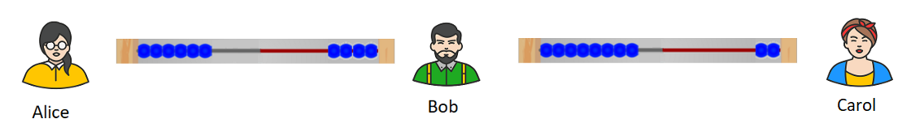

# Go kwešiša Lightning Network go šomišwa sedirišwa sa go hlakantšha sa dipheta (Abacus)

Mongwadi ke Roy Sheinfeld [2018/03/25](https://medium.com/breez-technology/understanding-lightning-network-using-an-abacus-daad8dc4cf4bs)

<LanguageDropdown/>

Ke hweditše dipoelo tša go kgahliša ka morago ga go phosta athikele ya go feta, [Lightning Network 
ke Bokamoso bja Bitcoin](https://medium.com/@kingonly/the-future-of-bitcoin-3187aefe2746). Eupša, ge ke be ke bala dipoelo tše dingwe, go molaleng gore batho ba 
bangwe ga ba kwešiše gabotse ka moo Lightning Network (LN) e šomago ka gona. Mo athikeleng ye, 
ke tlile go leka go hlaloša  kgopolo yeo e hlotšego LN le ditšhanele tša go lefa ka go šomiša sedirišwa 
sa seswantšho sa go hlakantšha sa dipheta (abacus anology), gabonolo fela le ka tsela yeo e 
kwešišago ka gona kantle ga go tsenelela sethekeniking sa go diriša LN.

Se ke sedirišwa sa go hlakantšha sa dipheta (abacus): 

Bjale, nagana ka [tšhanele ya go lefa ya LN](https://cointelegraph.com/explained/lightning-network-explained#block-5) bjalo ka thapo ya sedirišwa sa go hlakantšha sa dipheta 
(abacus), moo dipheta di emelago bitcoin ka gare ga tšhanele. Ge Alice le Bob ba dira tšhanele ya go 
lefa magareng ga bona, Alice o lokela di-bitcoin go tšwa go Blockchain ka gare ga tšhanele. Gabjale, 
di-bitcoin tše (mohl. 10 bits or 0.00001 BTC) ke tša Alice. Mo mohaleng yo, phetha ye tee e lekana le 
bit ye tee:

Thapo ya sedirišwa sa go hlakantšha sa dipheta (abacus wire) le tšhanele ya go lefa di na le dika tša 
go swana:

- **Ya hlakorepedi (Bidirectional):** bjale ka dipheta mo thapong ya sedirišwa sa go hlakantšha sa 
dipheta (abacus) di kgona go tloga ka lehlakoreng la nngele go ya ka lehlakoreng la go ja le go tloga 
lehlakoreng la go ja go ya ka lehlakoreng la nngele, di-bitcoin e ka tšwa matsogong a Alice gomme ya 
ya go Bob le go tloga go Bob go ya go Alice.  
- **Ya mong (Ownership):** ka go šomiša sedirišwa sa go hlakatšha sa dipheta (abacus), dipheta di ka 
kgona go tloga lehlakoreng la nngele goba la go ja, kantle le go ba mo magareng a thapo. Ka tsela 
yona yeo, di-bitcoin mo tšhaneleng ya go lefa di ka tloga go Alice goba Bob.   
- **Ya tekanyo (Fixed):** go swana le ka moo dipheta di ka se kgonego gore di oketšwe goba di tlošwe 
thapong, Alice le Bob ba ka fana di-bitcoin magareng ga bona, go fihla go palo yeo e bego e beilwe ge 
tšhanele ya go lefa e bulwa. Ge ba nyaka go rekišetšana palo ye godimo ya di-bitcoin, ba tlile go 
hloka gore ba dire thekišetšano ye nngwe ya mohuta wo.   

Tšhanele ya go lefa e ba ka mokgwa wo ka morago ga gore Alice a romele Bob di bit tše 2: 

Gonabjale Alice o na le dipheta tše 8 gomme Bob yena o na le dipheta tše 2. Bjale ge, ga re re Bob le 
yena o na le kamano go LN le Carol a šomiša tšhanele ya go lefa ya di-bit tše 10:  

Ka LN, Alice o kgona go lefa Carol ka Bob. Ka sedirišwa sa seswantšho sa go hlakantšha (abacus 
analogy), ge Alice  nyaka go romela di-bit tše 2 go Carol, o tlile go iša dipheta tše 2 go thapo ya 
Alice-Bob ka letsogong la go ja (go Bob), gomme Bob o tlile go iša dipheta tše 2 ka go thapo ya 
Bob-Carol ka letsogong a go ja (go Carol). Ke ka mokgwa wo e lebelegago ka gona ka morago ga gore 
Alice a romele Carol di-bit tše 2: 

Go bohlokwa go bolela gore ge Bob a ka dumela go tšea karolo go thekišetšano ye, a ka se kgone go 
amogela dipheta tša Alice kantle ga gore a iše palo ya go lekana le yeo go Carol.  

Go bonolo go hlaloša hlago ya dithekišetšano tša LN tše oof-chain kakaretšo le gore ke eng seo 
hlomamego ya dinyakwa tša tšhanele  ya go lefa ge e se hlokago gore e kgone go sepediša 
dithekišetšano, ge o šomiša sedirišwa sa seswantšho sa go hlakantšha. Mohlala, go bonolo gore 
gobaneng Alice a sa kgone go romela Carol dipheta tše dintšhi go feta tšeo Bob a ka kgonago go di 
hlokomela. Gape, mohlomongwe mo nakong ye etlago a ka kgona a šomiša [AMPs](https://bitcoinist.com/atomic-multi-path-help-bitcoin-become-formidable-payment-instrument/), eupša yeo re tla 
šogana le yo mo athikeleng yeo e latelago... 

**Ge eba o nagana gore athikele ye e go thušitše, hle o se ke wa lebala go lokela seswantšho sa go betha matsogo (kgotla sebaka gore o lokela seswantšho sa go betha matsogo) gomme o abelane le ba bangwe. **