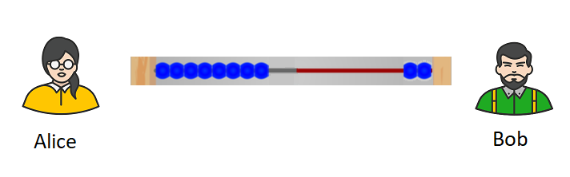

# Ukucacisa i-Lightning Network sisebenzisa isiBali 

NguRoy Sheinfeld [2018/03/25](https://medium.com/breez-technology/understanding-lightning-network-using-an-abacus-daad8dc4cf4bs)

<LanguageDropdown/>

Abantu abaninzi bayithandile into ebendiyibhale kwinqaku elingaphambili elinesihloko esithi: 
[Lighting Network is the Future of Bitcoin](https://medium.com/@kingonly/the-future-of-bitcoin-3187aefe2746). Kodwa ngethuba ndifunda izimvo zabanye abantu, 
ndiye ndacacelwa ukuba abanye abantu abayazi kakuhle eyona ndlela isebenza ngayo 
i-Lightning Network. Kweli nqaku, ndiza kunika ingcaciso etyebileyo malunga ne-LN kunye 
namajelo ayo asetyenziswayo okuhlawula ndisebenzisa umzekelo wesibali (i-abacus), 
ndingakhange ndinike ubucukubhede obuntsokothileyo malunga nendlela esetyenziswa 
ngayo i-LN.

Esi sisibali: 

Ke ngoku, [ijelo lokuhlawula le-LN](https://cointelegraph.com/explained/lightning-network-explained#block-5) khawulifanise necingo elinye lesibali, apho amaso eza 
kumela ii-bitcoins ezingaphakathi kwijelo lokuhlawula. Ngethuba u-Alice noBob beyila ijelo 
lokuhlawulana, u-Alice ebebhatala ii-bitcoins kwi-Blockchain phakathi kweli jelo. 
Okwangoku, ezi bitcoins (umz., ii-bitcoins eziyi-10 okanye 0.00001 BTC) zezika-Alice. Kulo 
mzekelo, intloko nganye ilingane ne-bitcoin enye: 

Ucingo lesibali kunye nejelo lokuhlawula zineempawu ezifanayo:

- **Ziya macala onke:** njengoko amaso akwicingo lesibali enokuhanjiswa asuke 
ekhohlo aye ekunene, nangasekunene aye ekhohlo, ii-bitcoins zingathathwa ku-Alice 
ziye kuBob, nakuBob ngokunjalo. 
- **Ubunini:** kwisibali, amaso abangasekhohlo okanye abengasekunene, awafani eme 
ecingweni phakathi. Kuyafana ke nakwii-bitcoins kwijelo lokuhlawula 
ingazezika-Alice okanye zibe zezikaBob. 
- **Azitshintshi:** njengoko namaso engenokongezwa okanye akhutshwe ecingweni 
lesibali, u-Alice noBob banganikana ii-bitcoins bona, kodwa zingadluli kwela nani 
belibekwe ekuqaleni ngethuba kuvulwa ijelo lokuhlawula. Ukuba bafuna ukunikana 
ii-bitcoins ezininzi kakhulu, kufuneka bavule enye i-akhawunti yokuhlawulana. 

I-akhawunti yokuhlawula ijongeka ngolu hlobo emva kokuba u-Alice ethumele i-bitcoin 
ezimbini ku-Bob:

Ngoku u-Alice unamaso asi-8 aze uBob yena abe nama-2. Masithi ke ngoku u-Bob naye 
uku-LN njengo-Carol apho asebenzisa ijelo lokuhlawula elinee-bitcoins ezili-10:

Nge-LN, u-Alice angabhatala uCarol esebenzisa u-Bob. Kulo mzekelo wesibali, ukuba 
u-Alice ufuna ukuthumela ii-bitcoins ezimbini kuCarol, ususa amaso ama-2 kweli cingo 
lesibali linaye noBob awase ngasekunene (ngakuBob) aze yena uBob aqhube amaso 
ama-2 aye kweli cingo lesibali linaye noCarol ngasekunene (aye kuCarol). Iza kubonakala 
ngolu hlobo emva kokuba u-Alice ethumele u-Carol ii-bitcoins ezi-2. 

Kubalulekulekile ukuba sikhankanye ukuba u-Bob ebevumile ukuba kuhlawulwane, 
akanakuwathatha amaso ka-Alice engakhange naye akhuphe alinganayo nala 
awafumeneyo awathumele kuCarol. 

Sisebenzisa lo mzekelo wesibali, kulula ukucacisa indlela esetyenziswa ngayo i-LN xa 
kusenziwa iintlawulo ezingeyonxalenye ye-blockchain, ingakumbi izinto ezifunekayo 
ekufuneka ijelo lokuhlawula linazo ukuze likwazi ukwenza iintlawulo. Umzekelo, kulula 
ukubona indlela ekulula ngayo ku-Alice ukuba athumelele uCarol amaso amaninzi 
ngaphezulu kula uBob anokukwazi ukuwagqithisa. Kodwa mhlawumbi kwixa elizayo uza 
kukwazi ukwenza oku esebenzisa [ii-AMP](https://bitcoinist.com/atomic-multi-path-help-bitcoin-become-formidable-payment-instrument/), kodwa lo ngumba ofuna ixesha lawo wodwa 
lowo… 

**Ukuba eli nqaku libe lincedo kuwe, ungalibali ukufaka imifanekiswana yokuqhwaba 
izandla (xa ufuna izandla ezininzi eziqhwabayo, cofa umzuzwana ungayeki) 
uyithumele.**