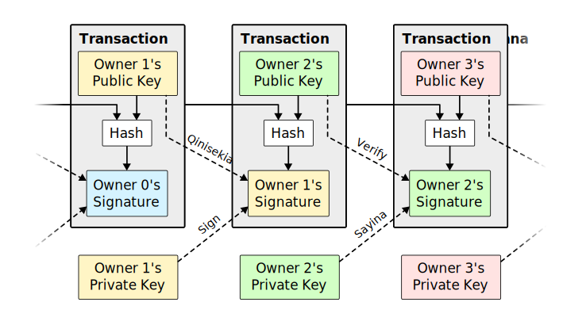

# I-Bitcoin: Uhlelo lwe-mali ye-elektronikhi lontanga

ngo Satoshi Nakamoto [2008/10/31](/bitcoin.pdf)

<LanguageDropdown/>

## Isifinyezo

Uhlobo olulinganiselwe lontanga lwemali kagesi oluzovumela izinkokhelo ezenziwa nge-inthanethi ukuthi zithunyelwe ngqo zisuka komunye ziye komunye ngaphandle kokuya esikhungweni sezezimali. Amasiginesha edijithali ahlinzeka ngengxenye yesisombululo, kepha izinzuzo ezinkulu ziyalahleka uma umuntu wesithathu othembekile kusadingeka avikele ukusetshenziswa kwemali kabili. Siphakamisa isisombululo senkinga yokusebenzisa imali kabili kusetshenziswa inethiwekhi yontanga. Izitembu zesikhathi zenethiwekhi ziyasebenza ngokuzifaka ochungechungeni oluqhubekayo lobufakazi bokusebenza obususelwa ku-hashi, kwakheka irekhodi elingenakuguqulwa ngaphandle kokwenza kabusha ubufakazi bokusebenza. Iketanga elide kakhulu alisebenzi kuphela njengobufakazi bokulandelana kwemicimbi efakazelwe, kepha ubufakazi bokuthi livela echibini elikhulu lamandla we-CPU. Inqobo nje uma iningi lamandla we-CPU lilawulwa ama-node angasebenzisani ukuhlasela inethiwekhi, azokhiqiza abahlaseli abade kakhulu nabangaphandle. Inethiwekhi uqobo idinga ukwakheka okuncane. Imilayezo isakazwa ngomzamo ongcono kakhulu, futhi ama-node angashiya futhi ajoyine inethiwekhi ngokuthanda, amukele uchungechunge lobufakazi bomsebenzi omude kakhulu njengobufakazi balokho okwenzekile ngenkathi bengasekho.

## Isingeniso

Ezentengiselwano kwi-Intanethi sezithembele cishe kuphela ezikhungweni zezezimali ezisebenza njengabantu abathembekile besithathu ukucubungula izinkokhelo zikagesi. Ngenkathi uhlelo lusebenza kahle ngokwanele kokuthengiselana okuningi, luyaqhubeka lukhahlamezeke libe nobuthaka elibuthole kwimodeli ethembekile. Ukuthengiselana okungaguquguquki ngokuphelele akunakwenzeka ngempela, ngoba izikhungo zezezimali azikwazi ukugwema ukulamula izingxabano. Izindleko zokulamula zikhuphula izindleko zokuthengiselana, zinciphisa usayizi wokuthengiselana osetshenziswayo futhi zinciphise amathuba okuthengiselana okuncane okujwayelekile, futhi kunezindleko ezibanzi ekulahlekelweni kwamandla okwenza izinkokhelo ezingabuyiseleki  emumva zezinsizakalo ezingabuyiseki emumva. Ngethuba lokuguqulwa, isidingo sokwethembana siyasakazeka. Abathengisi kumele bawaxwaye amakhasimende abo, bawahluphe ukuthola eminye imininingwane kunalokho abebengakudinga. Amaphesenti athile enkohliso amukelwa njengangenakugwenywa. Lezi zindleko nokungaqiniseki kokukhokha kungagwenywa mathupha ngokusebenzisa imali ebonakalayo, kepha ayikho inqubo ekhona yokukhokha ngaphezulu kwesiteshi sokuxhumana ngaphandle kweqembu elithembekile.

Okudingekayo uhlelo lokukhokha lwe-elekthronikhi olususelwa kubufakazi be-cryptographic esikhundleni sethemba, okuvumela noma yimaphi amaqembu amabili azimisele ukusebenzisana ngqo ngaphandle kokudinga umuntu wesithathu othembekile. Ukuthengiselana okungenzeki ngekhompuyutha ukubuyisela emuva kuzovikela abathengisi enkohlisweni, futhi izindlela ezijwayelekile zokungena zingasetshenziswa kalula ukuvikela abathengi. Kuleli phepha, siphakamisa isixazululo senkinga yokusebenzisa imali kabili sisebenzisa iseva yesitembu sesikhathi esasatshalaliswa kontanga ukukhiqiza ubufakazi bokubala ngokulandelana kokuthengiselana. Isistimu ivikelekile uma nje ama-node athembekile ngokuhlanganyela elawula amandla we-CPU amaningi kunanoma yiliphi iqembu elibambisanayo lama-node wabahlaseli.

## Ukuthengiselana

Sichaza uhlamvu lwemali lwe-elekthronikhi njengeqoqo lamasiginesha edijithali. Umnikazi ngamunye udlulisela uhlamvu lwemali kolunye ngokusayina ngokwedijithali i-hash yokuthengiselana kwangaphambilini nokhiye womphakathi womnikazi olandelayo bese engeza lokhu ekugcineni kohlamvu lwemali. Okhokhelwayo angaqinisekisa amasiginesha ukuqinisekisa uchungechunge lobunikazi.



Inkinga impela okhokhelwayo akakwazi ukuqinisekisa ukuthi omunye wabanikazi akazange asebenzise imali kabili. Isixazululo esijwayelekile ukwethula igunya eliphakathi elithembekile, noma i-mint, elihlola konke okwenziwayo ukusetshenziswa kwemali kabili. Ngemuva kokuthengiselana ngakunye, uhlamvu lwemali kufanele lubuyiselwe ku-mint ukukhipha imali entsha, futhi kuphela izinhlamvu zemali ezikhishwe ngqo ku-mint ezethembekile ukuthi zingasetshenziswa kabili. Inkinga yalesi sixazululo ukuthi isiphetho salo lonke uhlelo lwemali sincike enkampanini eqhuba i-mint, ngakho konke ukuthengiselana okufanele kudlule kubo, njengebhange.

Sidinga indlela yokuthi okhokhelwayo azi ukuthi abanikazi bangaphambilini bebengasayini noma yiziphi izinkokhelo zangaphambilini. Ngezinhloso zethu, ukuthengiselana kokuqala kakhulu okubalulekile, ngakho-ke asinandaba nemizamo yakamuva yokusebenzisa kabili. Ukuphela kwendlela yokuqinisekisa ukungabikho kokuthengiselana ukwazi konke okwenziwayo. Kumodeli esekwe ku-mint, i-mint yayazi konke ukuthengiselana futhi yanquma ukuthi yikuphi okufike kuqala. Ukufeza lokhu ngaphandle kweqembu elithembekile, okwenziwayo kufanele kumenyezelwe esidlangalaleni [1], futhi sidinga uhlelo lokuthi ababambiqhaza bavumelane ngomlando owodwa we-oda abemukelwe ngalo. Okhokhelayo udinga ubufakazi bokuthi ngesikhathi sokuthengiselana ngakunye, iningi lama-node livumile ukuthi bekutholwa okokuqala.

## Iseva yesikhathi

Isixazululo esisiphakamisayo siqala ngeseva yesitembu sesikhathi. Iseva yesitembu sesikhathi isebenza ngokuthatha i-hash yebhlokhi lezinto ezizogxivizwa kanye nokushicilela kabanzi i-hash, efana nephephandaba noma okuthunyelwe kwe-Usenet [2-5]. Isitembu sesikhathi sifakazela ukuthi idatha kufanele ngabe yayikhona ngaleso sikhathi, ngokusobala, ukuze ungene ku-hashi. Isitembu sesikhathi ngasinye sifaka isitembu sesikhathi sangaphambilini ku-hash yaso, sakhe uchungechunge, isitembu sesikhathi ngasinye esengeziwe siqinisa lezo eziphambi kwaso.


## Ubufakazi Bomsebenzi

Ukwenza iseva yesitembu sesikhathi esatshalaliswa ngokulingana, kuzodingeka sisebenzise uhlelo lokuqinisekisa umsebenzi olufana ne-Adam Back's Hashcash [6], kunokuba okuthunyelwe kwephephandaba noma kwe-Usenet. Ubufakazi bomsebenzi buhilela ukuskena inani lapho kusheshe, njenge-SHA-256, i-hash iqala ngenani lama-zero bits. Umsebenzi ojwayelekile odingekayo uyachazwa kwinani lama-zero bits adingekayo futhi ungaqinisekiswa ngokwenza i-hashi eyodwa.

Kwinethiwekhi yethu yesitembu sesikhathi, sisebenzisa ubufakazi bokusebenza ngokwengeza i-nonce ebhlokini kuze kutholakale inani elinikeza i-hash yebhlokhi ama-zero bits adingekayo. Lapho nje umzamo we-CPU ususetshenzisiwe ukuwenza wanelise ubufakazi bokusebenza, ibhlokhi ngeke lishintshwe ngaphandle kokwenza umsebenzi kabusha. Njengoba amabhlogo wakamuva eboshwe ngemuva kwawo, umsebenzi wokushintsha ibhulokhi ungafaka phakathi ukwenza kabusha wonke amabhlogo ngemuva kwawo.


Ubufakazi bomsebenzi buxazulula inkinga yokunquma ukumelwa ekuthathweni kwezinqumo eziningi. Ukube iningi belincike ekhethweni elilodwa le-IP-ikheli-elilodwa, lingachithwa yinoma ngubani okwazi ukwaba ama-IP amaningi. Ubufakazi bomsebenzi empeleni yi-CPU eyodwa-ivoti. Isinqumo seningi simelelwa ngexhaxha elide kunawo wonke, elinomzamo omkhulu kakhulu wobufakazi obusetshenziswe kulo. Uma iningi lamandla we-CPU lilawulwa ama-node athembekile, iketanga elithembekile lizokhula ngokushesha okukhulu futhi lidlule noma yimaphi amaketanga ancintisanayo. Ukuguqula ibhulokhi edlule, umhlaseli kuzofanela enze kabusha ubufakazi bokusebenza kwebhulokhi nawo wonke amabhulokhi ngemuva kwawo bese ehlangabezana futhi edlula umsebenzi wezindawo ezithembekile. Sizokhombisa ngokuhamba kwesikhathi ukuthi amathuba okuhlasela kancane ahlasele ancipha kakhulu njengoba amabhlogo alandelayo engezwa.

Ukunxephezela ukwanda kwejubane le-Hardware kanye nentshisekelo eyehlukile ekusebenzeni kwama-node ngokuhamba kwesikhathi, ubunzima bokufakazelwa komsebenzi bunqunywa isilinganiso esihambayo esikhomba inani elijwayelekile lamabhulokhi ngehora. Uma zikhiqizwa ngokushesha okukhulu, ubunzima buyanda.

## Inethiwekhi

Izinyathelo zokusebenzisa inethiwekhi zimi ngale ndlela elandelayo:
1. Ukuthengiselana okusha kusakazwa kuwo wonke ama-node.
2. I-node ngayinye iqoqa ukuthengiselana okusha kubhlokhi.
3. I-node ngayinye isebenza ekutholeni ubufakazi bokusebenza obunzima be-block yayo.
4. Lapho i-node ithola ubufakazi bokusebenza, isakaza ibhulokhi kuwo wonke ama-node.
5. AmaNode amukela ibhlokhi kuphela uma konke okwenziwayo okukuyo kusebenza futhi kungasetshenziswanga.
6. AmaNode aveza ukwamukelwa kwawo ngebhulokhi ngokusebenzela ukwakha ibhulokhi elandelayo kuketanga, kusetshenziswa i-hashi yebhulokhi eyamukelwe njenge-hashi edlule.

AmaNode ngaso sonke isikhathi abheka iketanga elide kunawo wonke njengelifanele futhi lizoqhubeka nokusebenza ekunwebeni. Uma ama-node amabili esakaza izinhlobo ezahlukahlukene zebhulokhi ngasikhathi sinye, amanye ama-node angathola eyodwa noma enye kuqala. Kuleso simo, basebenza kwelokuqala abalitholile, kepha gcina elinye igatsha uma kwenzeka liba lide. Ithayi izokwephuka lapho kutholakala ubufakazi bokusebenza obulandelayo negatsha elilodwa liba lide; ama-node abesebenza kwelinye igatsha azobe eseshintshela kwelide.

Ukusakazwa okusha kokuthengiselana akudingeki ukuthi kufinyelele kuwo wonke ama-node. Inqobo nje uma befinyelela ama-node amaningi, bazongena kubhlokhi kungekudala. Ukusakazwa kwebhulokhi nakho kubekezelela imilayezo eyehlisiwe. Uma i-node ingatholi ibhulokhi, izoyicela lapho ithola ibhulokhi elandelayo futhi ibone ukuthi ilahlekile eyodwa.

## Isikhuthazo

Ngomhlangano, ukuthengiselana kokuqala ebhlokini kungukuthengiselana okukhethekile okuqala uhlamvu lwemali olusha lomnikazi webhulokhi. Lokhu kungeza isisusa sama-node ukusekela inethiwekhi, futhi kunikeza indlela yokuqala yokusabalalisa izinhlamvu zemali ekusakazeni, ngoba alikho igunya eliphakathi lokuzikhipha. Ukwengezwa okungaguquguquki kwenani lezinhlamvu zemali ezintsha kufana nokuthi abavukuzi begolide basebenzisa izinsiza zokwengeza igolide ekusakazeni. Esimweni sethu, yisikhathi se-CPU nogesi okusetshenziswayo.

Isikhuthazo singabuye sixhaswe ngemali yokuthengiselana. Uma inani lokukhishwayo lokuthengiselana lingaphansi kwenani lalo lokufaka, umehluko yimali yokwenziwayo engezwa kunani lesikhuthazo sebhulokhi eliqukethe okwenziwayo. Lapho isibalo semali esinqunyelwe kusengaphambili sesingenile ekusakazweni, isisusa singashintsha ngokuphelele sibe yimali ekhokhwayo yokuthengiselana futhi singabi nokwehla kwamandla emali ngokuphelele.

Isikhuthazo singasiza ukukhuthaza ama-node ukuthi ahlale ethembekile. Uma umhlaseli ohahayo ekwazi ukuhlanganisa amandla we-CPU amaningi kunawo wonke ama-node athembekile, kuzofanele akhethe phakathi kokukusebenzisa ukukhwabanisa abantu ngokuntshontsha izinkokhelo zakhe, noma ukuzisebenzisela ukukhiqiza izinhlamvu zemali ezintsha. Kufanele akuthole kunenzuzo enkulu ukudlala ngemithetho, imithetho enjalo emvumela ngezinhlamvu zemali ezintsha ngaphezu kwabo bonke abanye abahlanganisiwe, kunokucekela phansi uhlelo nokuba semthethweni kwengcebo yakhe.

## Ukubuyisa isikhala sediski

Lapho ukuthengiselana kwakamuva kohlamvu lwemali kungcwatshwe ngaphansi kwamabhulokhi anele, okwenziwe okusetshenzisiwe ngaphambi kokuthi kulahlwe ukugcina isikhala sediski. Ukwenza lokhu kalula ngaphandle kokwephula i-hashi yebhulokhi, ukuthengiselana kugijinyelwa esihlahleni seMerkle [7] [2] [5], kuphela izimpande ezifakiwe ku-hashi yebhulokhi. Amabhulokhi amadala angabe esehlanganiswa ngokugawulwa kwamagatsha esihlahla. Ama-hashes angaphakathi awadingi ukugcinwa.


Unhlokweni webhulokhi ngaphandle kokuthengiselana angaba ngamabhayithi angama-80. Uma sicabanga ukuthi amabhlogo akhiqizwa njalo emizuzwini eyi-10, ama-byte angama-80 * 6 * 24 * 365 = 4.2MB ngonyaka. Ngamasistimu wamakhompiyutha athengisa kakhulu nge-2GB ye-RAM kusukela ngo-2008, noMthetho kaMorey obikezela ukukhula kwamanje kwe-1.2GB ngonyaka, ukugcinwa akufanele kube yinkinga noma ngabe izihloko ze-block kufanele zigcinwe enkumbulweni.

## Ukuqinisekiswa Kwenkokhelo Okulula

Kungenzeka uqinisekise izinkokhelo ngaphandle kokusebenzisa i-node ephelele yenethiwekhi. Umsebenzisi udinga kuphela ukugcina ikhophi yamaheda ezihloko zebhulokhi elide kakhulu lobufakazi bokusebenza, angalithola ngokubuza ama-node wenethiwekhi aze aqiniseke ukuthi unochungechunge olude kakhulu, futhi athole igatsha laseMerkle elixhumanisa okwenziwayo nebhulokhi ine-timestamp in. Akakwazi ukuzihlolela okwenziwayo, kepha ngokuyixhumanisa nendawo eseketangeni, uyabona ukuthi i-node yenethiwekhi iyamukele, futhi amabhulokhi afakwe ngemuva kokuthi aqinisekise ukuthi inethiwekhi iyakwamukela.


Kanjalo, ukuqinisekiswa kunokwethenjelwa inqobo nje uma ama-node athembekile alawula inethiwekhi, kepha iba sengozini enkulu uma inethiwekhi inikwa amandla ngumhlaseli. Ngenkathi ama-node wenethiwekhi engaziqinisekisa ukuthengiselana kwawo, indlela eyenziwe lula ingakhohliswa yimisebenzi eyenziwe yomhlaseli inqobo nje uma umhlaseli engaqhubeka nokuhlula inethiwekhi. Isu elilodwa lokuvikela kulokhu kungaba ukwamukela izexwayiso ezivela kuma-node wenethiwekhi lapho bethola ibhlokhi engavumelekile, okwenza isoftware yomsebenzisi ilande ibhulokhi ephelele futhi ixwayise ukuthengiselana ukuqinisekisa ukungahambelani. Amabhizinisi athola izinkokhelo ezijwayelekile cishe azobe esafuna ukwenza ama-node awo ukuthola ukuphepha okuzimele nokuqinisekisa okusheshayo.

## Kuhlanganiswa futhi Kuhlukaniswa Inani

Yize bekuzokwenzeka ukuphatha izinhlamvu zemali ngazodwana, bekungaba nzima ukwenza ukuthengiselana okwehlukile kusenti ngalinye ngokudluliswa. Ukuvumela inani lihlukaniswe futhi lihlanganiswe, ukuthengiselana kuqukethe okokufaka kanye nemiphumela eminingi. Imvamisa kuzoba nokufaka okukodwa okuvela kuthengiselwano olukhulu lwangaphambilini noma okokufaka okuningi okuhlanganisa amanani amancane, futhi okungenani kokukhipha okubili: eyodwa yokukhokha, kanti eyodwa ibuyisela ushintsho, uma lukhona, lubuyele kumthumeli.


Kumele kuqashelwe ukuthi ukuphuma kwe-fan, lapho ukuthengiselana kuncike kokwenziwayo okuningana, futhi lokho kuthengiselana kuncike kokunye okuningi, akuyona inkinga lapha. Asikho isidingo sokukhipha ikhophi ephelele ezimele yomlando wokuthengiselana.

## Ubumfihlo

Imodeli yendabuko yasebhange ifinyelela izinga lobumfihlo ngokunciphisa ukufinyelela kulwazi kulabo abathintekayo nakubantu besithathu abathembekile. Isidingo sokumemezela konke okwenziwe esidlangalaleni siyayinqabela le ndlela, kepha ubumfihlo busengagcinwa ngokuphula ukuhamba kolwazi kwenye indawo: ngokugcina okhiye bomphakathi bengaziwa. Umphakathi ungabona ukuthi othile uthumela inani komunye umuntu, kepha ngaphandle kwemininingwane yokuxhumanisa okwenziwayo nanoma ubani. Lokhu kufana nezinga lemininingwane ekhishwe ngokuhwebelana kwamasheya, lapho isikhathi nobukhulu bokuhweba ngakunye, "iteyipu", kwenziwa umphakathi, kepha ngaphandle kokutshela ukuthi obani amaqembu.


Njenge-firewall eyengeziwe, kufanele kusetshenziswe umbhangqwana omusha wokhiye ngokuthengiselana ngakunye ukuwagcina exhumene nomnikazi ojwayelekile. Okunye ukuxhumanisa akukwazi ukugwemeka ngokuthengiselana okufaka izinto eziningi, okuveza ukuthi okokufaka kwabo bekungumnikazi ofanayo. Ingozi ukuthi uma umnikazi wokhiye embulwa, ukuxhumanisa kungaveza okunye okwenziwe okwakungumnikazi ofanayo.

## Izibalo

Sibheka isimo somhlaseli ozama ukukhiqiza enye iketanga ngokushesha kunechungechunge elithembekile. Noma lokhu kufezekile, akulwenzi uhlelo luvulekele ekushintsheni okungafanele, njengokudala inani lomoya omncane noma ukuthatha imali okungeyona eyomhlaseli. Ama-node ngeke amukele ukuthengiselana okungavumelekile njengenkokhelo, futhi ama-node aqotho awasoze amukela ibhulokhi eliqukethe. Umhlaseli angazama kuphela ukuguqula okunye akwenzile ukuze abuyise imali asanda kuyisebenzisa.

Umjaho ophakathi kochungechunge oluqotho nochungechunge lwabahlaseli ungabonakala njenge-Binomial Random Walk. Umcimbi wempumelelo uchungechunge oluqotho olunwetshwa ngebhulokhi elilodwa, lukhulisa ukuhola kwalo nge +1, futhi umcimbi wokwehluleka uchungechunge lomhlaseli lunwetshwa ngebhulokhi elilodwa, ukunciphisa igebe ngo -1.

Amathuba okuba umhlaseli aqhamuke kokushodayo okunikeziwe afana nenkinga yeRumler's Ruin. Ake sithi umgembuli onekhredithi engenamkhawulo uqala lapho kusilela khona futhi adlale inani elingenamkhawulo lezilingo ukuzama ukufinyelela ekuphambaneni. Singabala ukuthi kungenzeka yini ukuthi afinyelele ekuqhekekeni, noma ukuthi umhlaseli uke ahlangane nochungechunge oluqotho, ngokulandelayo [8] :

<math xmlns="http://www.w3.org/1998/Math/MathML" display="block">
  <mtable columnalign="right center left" rowspacing="3pt" columnspacing="0 thickmathspace" displaystyle="true">
    <mtr>
      <mtd>
        <mstyle mathsize="1.2em">
          <mi>p</mi>
        </mstyle>
      </mtd>
      <mtd>
        <mi></mi>
        <mo>=</mo>
      </mtd>
      <mtd>
        <mtext>&#xA0;amathuba wokuthi i-node eqotho ithole ibhulokhi elandelayo</mtext>
      </mtd>
    </mtr>
    <mtr>
      <mtd>
        <mstyle mathsize="1.2em">
          <mi>q</mi>
        </mstyle>
      </mtd>
      <mtd>
        <mi></mi>
        <mo>=</mo>
      </mtd>
      <mtd>
        <mtext>&#xA0;amathuba wukuthi umhlaseli athole ibhlokhi elilandelayo</mtext>
      </mtd>
    </mtr>
    <mtr>
      <mtd>
        <mstyle mathsize="1.2em">
          <msub>
            <mi>q</mi>
            <mi>z</mi>
          </msub>
        </mstyle>
      </mtd>
      <mtd>
        <mi></mi>
        <mo>=</mo>
      </mtd>
      <mtd>
        <mrow>
          <mtext>&#xA0;amathuba wokuthi umhlaseli uyoke afinyelele kusuka kumabhulokhi angemuva ama&#xA0;</mtext>
          <mrow class="MJX-TeXAtom-ORD">
            <mi>z</mi>
          </mrow>
        </mrow>
      </mtd>
    </mtr>
  </mtable>
</math>

<math xmlns="http://www.w3.org/1998/Math/MathML" display="block">
  <mstyle mathsize="1.2em">
    <msub>
      <mi>q</mi>
      <mi>z</mi>
    </msub>
    <mo>=</mo>
    <mrow>
      <mo>{</mo>
      <mtable rowspacing="4pt" columnspacing="1em">
        <mtr>
          <mtd>
            <mn>1</mn>
          </mtd>
          <mtd>
            <mrow class="MJX-TeXAtom-ORD">
              <mtext class="MJX-tex-mathit" mathvariant="italic">if</mtext>
            </mrow>
            <mspace width="thickmathspace" />
            <mi>p</mi>
            <mo>&#x2264;<!-- ≤ --></mo>
            <mi>q</mi>
          </mtd>
        </mtr>
        <mtr>
          <mtd>
            <mo stretchy="false">(</mo>
            <mi>q</mi>
            <mrow class="MJX-TeXAtom-ORD">
              <mo>/</mo>
            </mrow>
            <mi>p</mi>
            <msup>
              <mo stretchy="false">)</mo>
              <mi>z</mi>
            </msup>
          </mtd>
          <mtd>
            <mrow class="MJX-TeXAtom-ORD">
              <mtext class="MJX-tex-mathit" mathvariant="italic">if</mtext>
            </mrow>
            <mspace width="thickmathspace" />
            <mi>p</mi>
            <mo>&gt;</mo>
            <mi>q</mi>
          </mtd>
        </mtr>
      </mtable>
      <mo>}</mo>
    </mrow>
  </mstyle>
</math>

Ngokunikezwa kokucabanga kwethu ukuthi
<math xmlns="http://www.w3.org/1998/Math/MathML">
  <mi>p</mi>
  <mo>&#x003E;<!-- > --></mo>
  <mi>q</mi>
</math>

, amathuba ehla ngokusobala njengoba inani lamabhulokhi umhlaseli kufanele athole ukwanda. Ngokumelana naye, uma engenzi inhlanhla eya phambili kusenesikhathi, amathuba akhe aba mancane ngokushabalala njengoba ewela emuva ngemuva.

Manje sibheka ukuthi umamukeli wentengo entsha udinga ukulinda isikhathi esingakanani ngaphambi kokuqiniseka ngokwanele ukuthi umthumeli akakwazi ukuguqula okwenziwayo. Sicabanga ukuthi umthumeli ungumhlaseli ofuna ukwenza umamukeli akholelwe ukuthi umkhokhele isikhashana, bese eyishintsha ukuze azibuyisele kuye ngemuva kwesikhathi esithile. Umamukeli uzokwaziswa uma lokho kwenzeka, kepha umthumeli unethemba lokuthi kuzobe sekwephuze kakhulu.

Umamukeli udala ukhiye omusha omusha bese unikeza ukhiye womphakathi kumthumeli ngaphambi nje kokusayina. Lokhu kuvimbela umthumeli ekulungiseleleni uchungechunge lwamabhulokhi ngaphambi kwesikhathi ngokusebenza kuwo ngokuqhubekayo aze abe nenhlanhla yokufika phambili ngokwanele, bese enza okwenziwayo ngaleso sikhathi. Lapho umsebenzi usuthunyelwe, umthumeli ongathembekile uqala ukusebenza ngasese kuketanga elifanayo eliqukethe enye indlela yokuthengiselana.

Umamukeli ulinda kuze kube ukuthengiselana kufakiwe kubhlokhi futhi amabhlokhi z axhunywe ngemuva kwawo. Akazi inani eliqondile lenqubekela phambili elenziwe ngumhlaseli, kepha uma ecabanga ukuthi amabhulokhi athembekile athathe isikhathi esilindelekile ngebhulokhi ngayinye, inqubekela phambili engaba khona yomhlaseli kuzoba ukusatshalaliswa kwePoisson ngenani elilindelekile:

<math xmlns="http://www.w3.org/1998/Math/MathML" display="block">
  <mstyle mathsize="1.2em">
    <mi>&#x03BB;<!-- λ --></mi>
    <mo>=</mo>
    <mi>z</mi>
    <mfrac>
      <mi>q</mi>
      <mi>p</mi>
    </mfrac>
  </mstyle>
</math>

Ukuthola ukuthi kungenzeka yini ukuthi umhlaseli asabambe manje, siphindaphindeka ukuminyana kwePoisson ngenani ngalinye lenqubekela phambili abengalenza ngamathuba abengathola kuwo kusukela lapho:

<math xmlns="http://www.w3.org/1998/Math/MathML" display="block">
  <mstyle mathsize="1.2em">
    <munderover>
      <mo>&#x2211;<!-- ∑ --></mo>
      <mrow class="MJX-TeXAtom-ORD">
        <mi>k</mi>
        <mo>=</mo>
        <mn>0</mn>
      </mrow>
      <mrow class="MJX-TeXAtom-ORD">
        <mi mathvariant="normal">&#x221E;<!-- ∞ --></mi>
      </mrow>
    </munderover>
    <mfrac>
      <mrow>
        <msup>
          <mi>&#x03BB;<!-- λ --></mi>
          <mi>k</mi>
        </msup>
        <msup>
          <mi>e</mi>
          <mrow class="MJX-TeXAtom-ORD">
            <mo>&#x2212;<!-- − --></mo>
            <mi>&#x03BB;<!-- λ --></mi>
          </mrow>
        </msup>
      </mrow>
      <mrow>
        <mi>k</mi>
        <mo>!</mo>
      </mrow>
    </mfrac>
    <mo>&#x22C5;<!-- ⋅ --></mo>
    <mrow>
      <mo>{</mo>
      <mtable rowspacing="4pt" columnspacing="1em">
        <mtr>
          <mtd>
            <mo stretchy="false">(</mo>
            <mi>q</mi>
            <mrow class="MJX-TeXAtom-ORD">
              <mo>/</mo>
            </mrow>
            <mi>p</mi>
            <msup>
              <mo stretchy="false">)</mo>
              <mrow class="MJX-TeXAtom-ORD">
                <mo stretchy="false">(</mo>
                <mi>z</mi>
                <mo>&#x2212;<!-- − --></mo>
                <mi>k</mi>
                <mo stretchy="false">)</mo>
              </mrow>
            </msup>
          </mtd>
          <mtd>
            <mrow class="MJX-TeXAtom-ORD">
              <mtext class="MJX-tex-mathit" mathvariant="italic">if</mtext>
            </mrow>
            <mspace width="thickmathspace" />
            <mi>k</mi>
            <mo>&#x2264;<!-- ≤ --></mo>
            <mi>z</mi>
          </mtd>
        </mtr>
        <mtr>
          <mtd>
            <mn>1</mn>
          </mtd>
          <mtd>
            <mrow class="MJX-TeXAtom-ORD">
              <mtext class="MJX-tex-mathit" mathvariant="italic">if</mtext>
            </mrow>
            <mspace width="thickmathspace" />
            <mi>k</mi>
            <mo>&gt;</mo>
            <mi>z</mi>
          </mtd>
        </mtr>
      </mtable>
      <mo>}</mo>
    </mrow>
  </mstyle>
</math>

Ihlela kabusha ukugwema ukufingqa umsila ongapheli wokusabalalisa...

<math xmlns="http://www.w3.org/1998/Math/MathML" display="block">
  <mstyle mathsize="1.2em">
    <mn>1</mn>
    <mo>&#x2212;<!-- − --></mo>
    <munderover>
      <mo>&#x2211;<!-- ∑ --></mo>
      <mrow class="MJX-TeXAtom-ORD">
        <mi>k</mi>
        <mo>=</mo>
        <mn>0</mn>
      </mrow>
      <mrow class="MJX-TeXAtom-ORD">
        <mi>z</mi>
      </mrow>
    </munderover>
    <mfrac>
      <mrow>
        <msup>
          <mi>&#x03BB;<!-- λ --></mi>
          <mi>k</mi>
        </msup>
        <msup>
          <mi>e</mi>
          <mrow class="MJX-TeXAtom-ORD">
            <mo>&#x2212;<!-- − --></mo>
            <mi>&#x03BB;<!-- λ --></mi>
          </mrow>
        </msup>
      </mrow>
      <mrow>
        <mi>k</mi>
        <mo>!</mo>
      </mrow>
    </mfrac>
    <mrow>
      <mo>(</mo>
      <mrow>
        <mn>1</mn>
        <mo>&#x2212;<!-- − --></mo>
        <mo stretchy="false">(</mo>
        <mi>q</mi>
        <mrow class="MJX-TeXAtom-ORD">
          <mo>/</mo>
        </mrow>
        <mi>p</mi>
        <msup>
          <mo stretchy="false">)</mo>
          <mrow class="MJX-TeXAtom-ORD">
            <mo stretchy="false">(</mo>
            <mi>z</mi>
            <mo>&#x2212;<!-- − --></mo>
            <mi>k</mi>
            <mo stretchy="false">)</mo>
          </mrow>
        </msup>
      </mrow>
      <mo>)</mo>
    </mrow>
  </mstyle>
</math>

Iguqulela ikhodi ye-C ...

```c
#include 
double AttackerSuccessProbability(double q, int z)
{
	double p = 1.0 - q;
	double lambda = z * (q / p);
	double sum = 1.0;
	int i, k;
	for (k = 0; k <= z; k++)
	{
		double poisson = exp(-lambda);
		for (i = 1; i <= k; i++)
			poisson *= lambda / i;
		sum -= poisson * (1 - pow(q / p, z - k));
	}
	return sum;
}
```

Ukuqalisa imiphumela ethile, singabona ukuthi kungenzeka ukuthi kwehle kakhulu nge-z.

```
q=0.1
z=0    P=1.0000000
z=1    P=0.2045873
z=2    P=0.0509779
z=3    P=0.0131722
z=4    P=0.0034552
z=5    P=0.0009137
z=6    P=0.0002428
z=7    P=0.0000647
z=8    P=0.0000173
z=9    P=0.0000046
z=10   P=0.0000012

q=0.3
z=0    P=1.0000000
z=5    P=0.1773523
z=10   P=0.0416605
z=15   P=0.0101008
z=20   P=0.0024804
z=25   P=0.0006132
z=30   P=0.0001522
z=35   P=0.0000379
z=40   P=0.0000095
z=45   P=0.0000024
z=50   P=0.0000006
```

Ukuxazulula i-P ngaphansi kuka-0.1%...

```
P < 0.001
q=0.10   z=5
q=0.15   z=8
q=0.20   z=11
q=0.25   z=15
q=0.30   z=24
q=0.35   z=41
q=0.40   z=89
q=0.45   z=340
```

## Isiphetho

Siphakamise uhlelo lokuthengiselana ngogesi ngaphandle kokuthembela ekuthembekeni. Siqale ngohlaka olujwayelekile lwezinhlamvu zemali ezenziwe ngamasiginesha edijithali, okunikeza ukulawula okuqinile kobunikazi, kepha akuphelele ngaphandle kwendlela yokuvimba ukusetshenziswa kwemali kabili. Ukuxazulula lokhu, siphakamise inethiwekhi yontanga sisebenzisa ubufakazi bokusebenza ukuqopha umlando womphakathi wokuthengiselana okwenzeka ngokushesha ukuthi kungasebenzi ngekhompuyutha ukuthi umhlaseli ashintshe uma ama-node athembekile elawula iningi lamandla we-CPU. Inethiwekhi inamandla ngokulula kwayo okungahleliwe. AmaNode asebenza ngasikhathi sinye ngokuhlangana okuncane. Akudingeki ukuthi zivezwe, ngoba imilayezo ayihanjiswa kwenye indawo futhi idinga ukuhanjiswa ngomzamo ongcono kakhulu. AmaNode angashiya futhi ajoyine inethiwekhi ngokuthanda, amukele uchungechunge lobufakazi bokusebenza njengobufakazi balokho okwenzekile ngenkathi bengasekho. Bavota ngamandla abo we-CPU, bezwakalisa ukwamukela kwabo amabhlokhi avumelekile ngokusebenzela ukubanweba nokwenqaba amabhlokhi angavumelekile ngokwenqaba ukuwasebenza. Noma imiphi imithetho edingekayo kanye nezikhuthazo zingaphoqelelwa ngale ndlela yokuvumelana.

## References

1. W. Dai, ["b-money,"](https://nakamotoinstitute.org/b-money/) [http://www.weidai.com/bmoney.txt](http://www.weidai.com/bmoney.txt), 1998.
2. H. Massias, X.S. Avila, and J.-J. Quisquater, ["Design of a secure timestamping service with minimal trust requirements,"](https://nakamotoinstitute.org/secure-timestamping-service.pdf) In 20th Symposium on Information Theory in the Benelux, May 1999.
3. S. Haber, W.S. Stornetta, ["How to time-stamp a digital document,"](https://nakamotoinstitute.org/time-stamp-digital-document.pdf) In Journal of Cryptology, vol 3, no 2, pages 99-111, 1991.
4. D. Bayer, S. Haber, W.S. Stornetta, ["Improving the efficiency and reliability of digital time-stamping,"](https://nakamotoinstitute.org/improving-time-stamping.pdf) In Sequences II: Methods in Communication, Security and Computer Science, pages 329-334, 1993.
5. S. Haber, W.S. Stornetta, ["Secure names for bit-strings,"](https://nakamotoinstitute.org/secure-names-bit-strings.pdf) In Proceedings of the 4th ACM Conference on Computer and Communications Security, pages 28-35, April 1997.
6. A. Back, ["Hashcash - a denial of service counter-measure,"](https://nakamotoinstitute.org/hashcash.pdf) ][http://www.hashcash.org/papers/hashcash.pdf](http://www.hashcash.org/papers/hashcash.pdf), 2002.
7. R.C. Merkle, ["Protocols for public key cryptosystems,"](https://nakamotoinstitute.org/public-key-cryptosystems.pdf) In Proc. 1980 Symposium on Security and Privacy, IEEE Computer Society, pages 122-133, April 1980.
8. W. Feller, ["An introduction to probability theory and its applications,"](https://nakamotoinstitute.org/introduction-probability-theory-vol-i.pdf) 1957.