# Hudunganidzwa hwe Mari: Kubva kugoridhe nema dhorazi kuenda ku Bitcoin nemari dzekuchengetera muma bhengi emumhepo

na Nik Bhatia [2021/01/18](https://www.amazon.com/dp/1736110527/)

<LanguageDropdown/>

---

Iri bhuku rakatsaurirwa kumudzimai wangu uye shamwari yangu yehupenyu Chandni uye mwanasikana wedu mudiwa Ria Tara

---

**Contents**

[[toc]]

<!-- Nhanganyaya

Chapter 1: Fiorino d’Oro

Chapter 2: Mavambo enzira dzokuchengetera mari mumhepo Chapter 3: Ruzivo rwezvemabhengi epakati

Chapter 4: Maitiro ekuchengetedza mari zviri pamutemo Chapter 5: Kuregera Goridhe

Chapter 6: Dhora riri Mukusagadzikana

Chapter 7: Kumutsiridzwa Kwemari

Chapter 8: Kuchengetedza Bitcoin

Chapter 9: Kuchengetedza mari muma bhengi emumhepo Chapter 10: Rusununguko pamari yakasangana Vabvumiri

Mabhuku akanyoreswa -->

## Nhanganyaya

Semamiriro azvakaita mazuvaano maititiro emari pasi rose ari pamateru ekupindirwa, zvisati zvakamboitika. Bhuku rino rakanyorwa kupa ruzivo rwemamiriro akaita mari panguva ino yekusava nechokwadi nesarudzo. Mamepu anotibatsira kufamba munzvimbo nemamiro akaita nzvimbo, asi kusvika parizvino haasati akabatanidza neruzivo rwezve mari. Nokudaro bhuku rino rinopa mepu yemaitiro ezvemari, kubvira pakutanga, nepfupiso emamiro achange akaita mari yemumhepo mumazuva anoteera Rinopa muverengi muwono mutsva unova wekuchengetedza mari nekutsanangura shanduko dzemamiriro emari, nekutibatisira kufamba mumavambo ezvemari, nekutasanangura kupindirana kwenzira dzemari dzakasiyana siyana.

Mukuoongorora mavambo enzira dzekuchengeta mari, takaita muono unofadza pamusoro pekuti vanhu vanodyidzana sei nemari dzesarudzo yavo. Pamwe chete nokupatsanura kuita kwemari, bhuku rino rinobata mubvunzo mukuru wekuti, “Mari ichange yakamira sei mumazuva anoteera?” Vazhinji vanoti ichange iri mumhepo, asi kuvazhinji vedu mari yavakutoita kunge iri mumhepo. Tinoshandisa nzira dzepama foni echizvino zvino kuchengetedza nekutarisa mari dzedu zvese nokubhadhara pasina kusangana zvinova zvirikukonzera huhwandu hwekushandisira mari mumhepo. Asi iyezvino Bitcoin yabata muono wepasi rese panyaya dzemari, mari yemumhepo yavakutora chirevo.

Chimwe chezvikonzero zvekusagadzikana kwechirevo chemari yemumhepo yemazuvaano ndochekuti ruzivo ruripo rwezvemari haruna tsanangudzo mumutauro emamwe marudzi pamusoro pe Bitcoin, chinodiwa chaizvo zvibodzwa zvitsva zvinosanganisira nhau dzemhando itsva iyi yemari (Bitcoin). Shanduko dzinoitika panhau yemari hadziwanze kuziviswa veruzhinji, kuti Bitcoin inonyatsotsanagurika panoda kusanganisirwa mashandiro ayo munzvimbo dzakasiyana siyana kuti vanhu vazive zvayakanakira nezvayakaipira mune ramangwana ravo. Kuzivisa veruzhinji shanduko dzirikuitika kumari chinhu chakakosha, Bitcoin nezvinhu zvakaikomberedza zvinotipa kutanga zvitsva mukuita zvinhu pachena nekusarudza zvinova zvinodiwa nepasi rose mukushanda nemari mazuva anoteera.

Bhuku rino rinozama kunzwisisa nekutsanangura mufambiro uchaita shanduko yekutanga kushandisa Bitcoin, nekuti ichachinja sei mumiriro wemashandisirwo emari. Kuti izvi zviitike, panoda nzira dzakachena dzekunzwisisa mushandisirwo wemari wacho, izvi zvinova zvagara zvinowanika muzivo dzaana mazvikokota vezve ikonomi\_ vashoma vanekunzwisisa kwekuti mari inoba kupi, uye nezvemashandisirwo nemachengeterwo emari. Chinagwa chebhuku rino ndechekushandura mashandisirwo nemachangeterwo emari uye nekutsanangura zvese kubva kumavambo.

Mushure mekuverenga bhuku rino, vaverengi vachave neruzivo rwekuti mari inochengeteka sei. Tichishandisa ruzivo rwekare pamusoro peizwi rekuti layered, bhuku rino richatsanangura zvikonzero zvakaita kuti vanhu vatange kushandisa mari zvemazuvaano vachisya ma kioni, nekuti zvakafamba sei kuti pave neshanduko, uyezve nekutsanagura nzira dzakawanda dzekuchengetedza mari mazuvaano. Vaverengi vanofanira kushandisa bhuku rino kunzwisisa kuti inzira ipi yekuchengeta nayo mari inopindirana nenezviwanikwa zvavo uye nekuongoroora nzira dzekuchengeta nadzo mari. Munguva inotevera yekusarudza mari yekushandisa, kugona kuongoroora mepu yezvemari kunenge kwakanaka.

### Kuchengetedza mari kwakaratidzirwa

Tisati tatanga nhau dzekuchengetedzwa kwemari mumhepo, zvakanaka kupa muverengi muenzaniso wemufambisirwo wazvinoitwa. Muenzaniso wakachipa wenhau yekuchengetedza mari iyi unokwanisa kuratidzika nekuongoroora hukama huripo pakati pekoini regoridhe ne mapepa egoridhe kubva 1928 ku United States of America. Mumuenzaniso uyu, mapepa egoridhe ane zvakanyorwa paari:

Izvi zvinoratidza kuti zvakaiswa mubazi rekuchengetedza mari re United States of America madhora magumi egoridhe anobhadharika kumuridzi kana oida.

Tichatsanamgura zvinoreva mutsara uyu tichishandisa mashoko eruchengetedzo. Chekutanga chekuchengeta, ikoini regoridhe, rakachengetwa pakavanzika. Chechipiri, mapepa egoridhe, aka printwa aka tenderedzwa semari pachinzvimbo che koini regoridhe. Bepa iri rakakosha kunaani nani zvake akaribata, anova ndiye muridzi. Zvese koini nebepa imari, asi zvine musiano. Hukama huripo panzira dzemari idzi (Mufananidzo 2) ndeimwe nzira yekutsanangura kubalanciswa kwemazvinhu zvinobatika nezvisisngabatike zviripo (Mufananidzo 1).

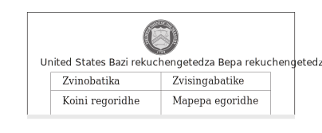

Mufananidzo 1


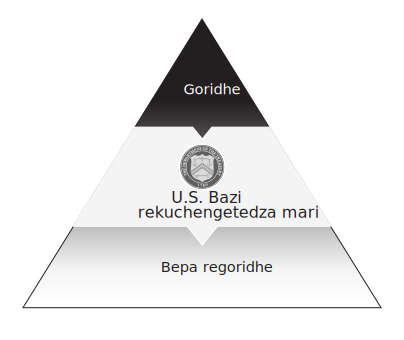

Mufananidzo 2

<!-- United States Bazi rekuchengetedza Bepa rekuchengetedza mari 

(rakagadzirwa sepyramid yekuchengetedza)  -->


Tikanyatso shandisa nekubatanidza nzira itsva iyi kumashandisirwo emari nekutarisa matangiro ayakaita, nhau inobuda ipapo ndeye makare kare ezvemari. Sezvo vatambi vakuru vezvemari kumhiri kwemangungwa vatanga kushambadza zvekushandisa mari mumhepo, panoda nzira yakachena kwazvo yekutarisa shanduko ichauya nenzira idzi dzekuchengeta mari, asi izvi hazvikwanisike tichishandisa mashoko ezvemari anoshanda mazuvaano. Bhuku rino rinoburitsa mari seinochengetwa zvakaturikidzana nekuti ndiyo nzira yakachena yekutarisa shanduko irikuuya kumashandisirwo nemachengeterwe edu emari, nzira inokonzeramhirizhonga kwemakore mashoma yozonyaradzwa nekupindira kwehurumende nemabhanga makuru.

Pane nzira yekugadzirira ramangwana rakanaka, bhuku rino rinobuditsa nzira inenge yakarerekera kunezvitsva zvakauya nekuda kwetekinoroji izvo zvakasangana nemashandisirwo emari nedzimwe nzira dzisina hukama nazvo dzinova dze crypto. Nekupararira kurikuita nhau dze crypto mupfungwa dzevanhu nemumana munoshandiswa mari pasi rese kubvira 2009, zviri kuita kuti nzira dzemashandisirwo emari dzekudhara dziite kakusiiwa pachishandiswa dzitsva, sezvakaitwa ne internet kumashandiro ave kuitwa mazuvaano. Nzira itsva idzi dzinoda kunyatsoongororwa, bhuku rino richashandisa nzira yekuchengeta mari zvakaturikidzana kutsanangura kuti zvinogona kufamba sei. Basa remari dzehurumende richange riri rei pamberi apo? Bitcoin ichafambidzana here nemari dzehurumende kana kuti ichadzishaisa simba? Mhinduro kumibvunzo ndiyo inounza kuti pave nebhuku rino. Zvinotanga ne koin regoridhe rakagadzirwa muna 1952.


## Chitsauko 1: Fiorino d’Oro (Florin of Gold)

> Ini neshamwari dazngu tinorwara nechirwere chemoyo chinorapika negoridhe
> — Hernán Cortés

Pasati pauya nhau yekuchengetedza mari zvakaturikidzana, paingova nemari. Kuvanhu vakaita sesu, mari ingori mudziyo inoshandiswa kugarisana nevamwe zvakanaka, sezvinoita mhuka dzichichinjana kuitirana zvakanaka, senge tsoko dzichirerana. Vamwe vanosarudza kuona mari sechinhu chinogovanwa mupfungwa, kunyangwe hazvo izwi rekuti kugovana mupfungwa richibuditsa mari sechinhu chisiri chechokwadi. Zvirinani kutidzimwe nzira dzemari dzinogoveka nekutenderera muvanhu, asi dzimwe dzinozooneka nekubatika nenguva refu.

Vanhu vaishandisa mashero emhuka dzemumakungwa, mazino emhuka, zvuma, zvipfuyo, nesimbi dzavo dzakanaka semari uye kuchinjisa kuti vawane zvimwe kwemakore akawanda, asi pekupedzisira vakasarudza sirivheri ne goridhe mumakore mashoma apfuura aya semari. Kunaka kwegoridhe nesirivha kwakaita kuti vanhu vaone semari yakanaka chaizvo kushandisa. Kuzodzwa kwazvakaitwa semari yakanaka chaizvo kwakaita kuti zvisimudzirwe pasi rose uye kuti vanhu vadzidziswe mashandisiro ane hungwaru, sezvo goridhe nesirivha zvakanga zvashandura nzira dzekuchengetedza hupfumi nekuita kuti kuchinjana kwezvinhu pakati pevanhu vasingazivane kuendeke.

Kusarudza kuti chii choshandiswa semari yainge isiri nyore. Mashero emumugungwa aigona kuita pakuchinjanisa zvinhu kubva kune nzvimbo dziri kure asi zvainge zvakawanda kumahombe kombe kwemakungwa saka kumakoshesa munzvimbo kwakaita kushoma. Nekune rimwe divi, simbi dzakakosha dzainyanya kukosheswa pakuvhima nekugadzira midziyo uye zvaikwanisa kushoseswa kwemakore akawanda asi dzisakwanisa kushandisika semari sezvaiita mashero emumagungwa. Sirivheri negoridhe zvakashanda zvakanaka chaizvo kusvika pasi rese rabvumirana kuzvishandisa semari.

Mari haingoshandiswe cgete senzira yekutenga nekuchengetedzwa, inoshandiswa zvekare pakuverenga nokubatanidza zvinhu. Inzira yekuisa mitengo, kuona zvinenge zvakohwewa mumabasa, kubatanidza zviwanikwa, nekuunza mafambiro ezvinhu mundzinyika pamwe chete nenzira yakarongeka uye mumapoka aksiyana siyana. Sezvinoitika mumkunamata, pane nzira dzakwanda dzinobatanidza vanhu vechitendero chimwe chete uye kuti munhu azive chitendero chake, kubatanidzwa kwemari mumapoka inzira yekuti panokwanisa kuoneka zvikohwewa, zvavanotarisira kubhadhara, nezvavawana. Vanhu vakabatana vosarudza nzira imwe chete yemari, kuisa mitengo pazvinhu zvinotengswa kunoita nyore nekuti munhu wese anenge ari pamwe nevamwe mukuti chii chinonzi mari. Kana munhu wese akakwanisa kuisa mitengo mumwe chete munzira imwe chete nevamwe vese, zvinhu zvinofamba zvakanaka.

Kusarudza nekushandisa goridhe chete zvainge zvisina kukwana. Kuchinjana pachishandiswa zvuma zvegoridhe, mabha egoridhe uye iro goridhe pacharo kwaunza nhau yekuongoroora uremu nekuchena kwegoridhe, zvinova zvakashaisa goridhe rese rese hukoshwa. Chikamu chino chicharatidza kuti makoini akagadzirisa dambudziko iri sei nekuunza huremu, kuchena uye kuvimbika.

### Makoini ekutanga

Baba vekuongorora zvechinyakare, Greek Historian Herodotus, vakaongoroora kutanga kwakaita makoini egoridhe nesirivheri muLydia inova ndiyo yavakunzi Turkey mazuvaano, munguva ye 700 BC. Humbowo hwezvuma zvegoridhe ne sirivha zvichishandiswa semari hunodzokera kumakore mazhinji apfuura, asi kuuya kwemakoini kwakashandura sirivha negoridhe kuenda kunzira dzemari dzakarongeka. Makoini eLydia ainge aine mufananidzo weshumba ichidzvova uye airema 126 grains, inoita iyo 8 grams. Nekuti ose makoini aive negoridhe maari, aikwanisa kushandisika senzira

yekuchinjana hupfumi.Nhasi, munezvakaenderana makoini anehuremu anogona kuita kunge goridhe chairo uye nekuita kunge mari yesirivha, asi masimbi aya akanaka akatakura basa rekushanda semari pasi rose pasati paane Lydia koini. Nehuremu hwakateedzana zvakavimbika, makoini akaunza mashandisrwe emari akareruka uye izvi zvakachinja mari zvachose. Zvakabvisa zvekumboongorora huremu nekuchena kwegoridhe nesirivha pasati patengwa, izvi zvinova zvakashundura nzira dzekuchinjana zvinhu pasi rose.

Ndezvipi zvinhu zvaakanga zvaikosha zvikurusa pamari yesimbi, uye neiko iwo akanga ane chinjo zvikuru sorudzi rwemari? Chekutanga uye chinonyanya kukosha, mari dzesimbi dzakagadzirwa nesimbi dzaionekwa sedzakakosha, dzinogara, uye dzisingawanzo. Ndarama nesirivha zvakanga zvine rekodhi yezviuru zvemakore semari, saka kuva nemari yaibaiwa kubva mumasimbi maviri aya kwakavimbisa kuti yaizongodiwa. Kana mari yacho yakaitwa nematombo, somuenzaniso, ingadai isina chido chakadaro, nokuti matombo akajairika haasi anokosha kana mashoma.

Hunhu hunotevera hwemari hwakaunza kusvetukira mberi muzvose zviri zviviri mari nebudiriro yavanhu yakanga iri pfungwa yefungidziro, kana kuti inochinjika, mari. Kana zvinhu zviviri zvichigoneka, zvine kukosha kwakaenzana uye kusingaverengeki pakati pazvo, semafungiro atinoita dhora rimwe chete senge rakaenzana nechero imwe dhora. Mari dzesimbi dzaiuya kubva kumindi imwechete dzese dzaive dzakafanana, zvichibvisa chiyero chinorema kubva mukutengesa kwemazuva ese. Mari yainge iri budiriro huru mukuyerwa kwemari, kunyanya kana ichienzaniswa nezvidhinha zvegoridhe zvehuremu husina kufanana uye zvishongo zvegoridhe zvine hutsanana husina kutaurwa. Kufanana kwemari uye fungibility kwakaita kuti vave masangano eakaunzi akakwana, zvichibvumira nzanga chishandiso chine simba chekugona kuyera zvese muchikamu chimwe.

Mari inofanirawo kupatsanurwa: semuenzaniso, zvipfuyo zviri kushandiswa semari zvakatanga zviuru zvemakore, asi mombe hadzisi kupatsanurwa uye saka hadzina basa mukutengesa kudiki. Mari dzesimbi dzaive dzakakwana pakugovanisa: imwe neimwe yaimiririra hushoma hwekukosha uye yaigona kushandiswa mukutengesa kudiki uku ichiunganidzirwa nyore kune makuru.

Chekupedzisira, mari dzemhando yepamusoro ndidzo dzainetsa kugadzira. Kuita zvekunyepedzera kwaigona kukanganisa zvakanyanya kukosha kwemari, saka minti yaifanira kugadzira mari ine zvinyorwa zvakaoma kutevedzera. Kana mari yesimbi yaitenderera yaifungidzirwa kuti ndeyechokwadi, uye vanhu vaitenda kuti manyepo angadai asina kuvepo, izvi zvaizoita kuti vanhu vatengeserane pasina mutoro wekuongorora mari yese kuti ndeyechokwadi

### Kupindira kweHurumende Pamusoro Pemari

Pasi rose kudiwa kwemari kwakawedzera nekuda kwekufambira mberi kwehupfumi hwavo, uye hurumende dzakava mutengesi mukuru. Vatongi vakakuwana kusingabviri kudzivisa kusafa, vachigadzira mari mumazita avo akanyorwa nezviso zvavo kuti atenderere semari mukati memiganhu yavo. Zvisinei, iyi yakanga isiri nzira yehutongi husina maturo. Coin mint yakapa hurumende simba rekushandisa mari kuzvinatsiridza, zvichiita kuti magariro evanhu agare uye kusimuka nekudonha kwehumambo.

Umambo hweRoma hunotipa muenzaniso wakakwana wekuti mari dzesimbi dzakakonzera sei kupindira kwehurumende pamusoro pemari. Muzana ramakore rekutanga AD, hushe hweRoma huchangotanga, mari yesimbi inonzi dhinari (yakawanda yedhinari) yakaitwa nehurumende yeRoma, uye nekuda kwehushe hwepasi rose hwakashandiswa muEurope, Asia, neAfrica. Kekutanga, zviyero zvemari zvepasi rose zvakashanduka zvichibva pamari yesimbi yakakosha inogadzirwa nechinhu chimwe chete. Kupindira kwesangano remari yeHumambo hweRoma hune simba yakabva pakutonga kwahwo uye yakatekeshera pasi rose. Mari yainzi dinar yaibva kuIndia ichienda kuEgypt ichienda kuSpain kwemazana emakore akatevera.

Muzana remakore rechipiri pasi pehutongi hwaMarcus Aurelius, mari yedhinari yairema magiramu 3,4 uye yaive nesirivha inosvika 80%, yaive yatove kuderedzwa kubva pakuchena kwayo ne98% apo Augustus Caesar akazvizivisa kuti ndiye Mambo wekutanga weRoma mazana matatu emakore apfuura. Mumazera ese, mari dzakarega kuvapo nekuda kwechinhu chimwe chete chisingazikanwi: hurumende hadzigone kuramba muedzo wekuzvigadzirira mari yemahara. Nyaya yekuderedzwa kwemari yeRoma yakanga isiri iyo. Apo Umambo hweRoma hwakaderedza simbi inokosha yedhenari apo huchisiya zita rahwo noukoshi zvisina kuchinjwa, chaizvoizvo hwakanga hwazviitira mari; dhinari rimwe nerimwe rakanga rine utsvene hwakakwirira kupfuura mutsivi waro. Ichi chiito chekudzikisa mari nehurumende

chinoderedza kuvimba mumari uye zvinotungamira kumitengo isina kugadzikana uye kusagadzikana kwevanhu. Pakupera kwezana ramakore rechitatu, dhinari rakanga raderedzwa kazhinji zvekuti kuchena kwaro kwaingosvika pa5% yesirivha, inoenderana neCrisis ye Third Century, nguva umo Madzimambo akati wandei akapondwa uye Humambo hweRoma hwakapotsa hwaparara. Kudzikisirwa kwemari yaive tsika yakaramba iripo pasirese, zvichiita kuti zvakaitika muzana ramakore regumi nematatu Florence zvishamise.

### The Florin

Maguta ekuchamhembe kweItaly eFlorence, Venice, Genoa, nePisa akazvimisikidza semarepublic eguta mushure mekusununguka kubva kumadzishe awo aive neutsinye muzana ramakore regumi nerimwe, uye rusununguko rwavo rutsva rwakazoteverwa nemari yavo. Mugore ra1252, apo iyo Florentine mint yakarova yekutanga Fiorino d'Oro, kana goridhe florin, hapana chinyorwa chakaitwa. Yaingovawo imwe mari. Zvisinei, sezvo makumi nemazana emakore akapfuura pasina kuchinja kurema kwegoridhe uye kuchena kwemari yacho, florin yakawana mukurumbira wakazoita kuti vose vakanga vakaipoteredza vapinde muboka rayo. Kubva kare, mari dzesimbi dzakakosha dzaigara, dzaipatsanurika, uye dzichitakurika, asi nehurumende dzichiramba dzichideredza kuchena kwemari yadzo, hapana mari yaivepo ine kuvimbika kwemarudzi akawanda. Iyo Florentine mint yakachinja iyo. Florin yakaramba iine huremu husingachinji uye kuchena, anenge magiramu 3,5 egoridhe chairo, yakatora mazana mana emakore anoshamisa. Pakazosvika nguva iyo florin denomination yaive nezana ramakore rekuzvarwa, yakange yave muyero wezvemari wepasi rose wepan-European finance. Mihoro yakakwira, zvishongo, zvivakwa, uye mari yekudyara zvese zvaive nemitengo muflorin. Yakawanawo mukurumbira pakati pevanhu vanoshanda senzira yekutakura mari yavo yese yehupenyu muhomwe yavo. Florins yakaratidza kuva chibatiso chemuenzaniso uye yaigona kukweretwa nyore nyore kukwereta mari yesirivha yekutengeserana kudiki. Iyo florin sechikamu cheakaundi chakaparadzirwa muEurope mose uye mhiri sesangano rezvemari rinovimbwa uye rakagadzikana pasi rose. Kugadzikana kunoshamisa kweflorin chete hakuna kufambisa hunyanzvi hwemari panguva yeRenaissance, asi mukurumbira wayo wemazana emakore akawanda wakabatana nekufambira mberi kwepanguva imwe chete yemasvomhu, accounting, uye kubhengi zvakakonzera shanduko inoshamisa yeruzivo rwemunhu nemari. Tisati tatsanangura mafambiro aya, tinofanira kutanga tanzwisisa kukanganisa mumari-mari yavakagadzirisa.

### Kuwanda kwemakoini

Coinage chete haina kuita hurongwa hwemari. Koini-mari yakapa matambudziko maviri makuru ehupfumi hwenyika, iyo panguva iyoyo yaive nemaguta muEurope, kuchamhembe kweAfrica, uye Middle East akabatana neGungwa reMediterranean. Paingova nemari dzakawanda dzakasiyana, uye dambudziko iri rekuwanda kwemari raikanganisa zvakanyanya kumhanya kwemari.

Kukurumidza kwemari kunoyera kuti mari inochinja sei maoko nekukurumidza. Ndiko kumhanya uko mari inofamba ichibva kune mumwe muridzi ichienda kune inotevera, uye chete nekumhanya kwakakwana ndiko kunogona kubatsira vanhu kutengeserana kusvika pakugona kwavo kuzere. Mari dzegoridhe nesirivheri dzakawedzera kumhanya kwemari kune mamwe mazera echinyakare apo masimbi akakosha masimbi uye zvigure zvezviremu zvisina mwero zvaishandiswa senzira dzekutsinhana. Asi kuwanda kwemari uko kwaishandiswa zviuru zvemakoini zvaireva kuti shanduko yakaenzana yaifanira kuitika pamwe chete nekutengeserana kumwe chete pakati pevanhu venzvimbo dzakasiyana. Izvi zvakapa matambudziko makuru ekuvhura nhanho dzinotevera dzekumhanya kwemari uye kutengeserana kwenyika, nekuti zviyero zvehuremu uye kucheneswa kwakasiyana zvakanyanya pasirese.

Vanochinja mari vakanyanya kutendeuka uku uye vakave chinhu chakakosha pakutengeserana kwese. Vakapiwa basa rekutengesa pakati pemazana kana kunyange zviuru zvemakoini akasiyana kuitira kufambisa rudzi rwese rwekuchinjana kwenyika. Kushaikwa kwekufanana kwemari munyika yose kwakabvumira vanochinja mari kuita purofiti chero nguva iyo mutengesi kana mutengi aida shanduko kubva kune imwe mari kuenda kune imwe. Iri basa richiripo nanhasi nenzira yevatengesi vekunze, kana avo vanoshandura peso yeMexico kuenda kuBrazil chaiyo, semuenzaniso.

Kuwedzera dambudziko rekuwanda kwemari yaive nyaya yebimetallism, iyo inobvumira kuti simbi mbiri dzakasiyana dzishandiswe semari. Sirivha isimbi yakawandisa muPasi pasi kupfuura goridhe uye yakamboshanda semari yevanhuwo zvavo uye kutengeserana kwemazuva ese. Ndarama, pane zvinopesana, ndiyo inonyanya kudiwa yesimbi yakakosha uye yakatsvakwa yehupfumi, asi haina kukwana kushandiswa kwezuva nezuva: imwe florin yaikosha kupfuura kwevhiki

yekushanda kubva kune avhareji mushandi. Dichotomy yegoridhe nesirivha yakaomesa kuumbwa kwehurongwa hwemari hwakabatana kusvika pakupera kwezana ramakore rechigumi nemapfumbamwe.

### Njodzi dzeKutambidzana mari Kwenyama

Dambudziko rechipiri guru remari yemakoini kana mapepa raive njodzi yekubatana nekutambidzana kwemari panyama. Kutumira mari pasi negungwa kwaive nenjodzi uye chinhu chinotyisa panguva yepakati. Kuputsikirwa kwengarava kwaiwanzova kukuvadzwa kusiri kwoushamwari kwechibatiso kwokuedza kubhadhara zvikwereti zvenyika dzakawanda. Chikamu chechikonzero chakaita kuti simbi dzinokosha dzionekwe sedzakakosha kwaive kusaparara kwadzo, saka zvaizoita sezvinei kuti indasitiri yese yekuvhima ngarava yakaputsika iripo nhasi kuti vawane mari yegoridhe neyesirivha iyo yakarasika panguva ino.

Mhinduro kumatambudziko aya yaive pfungwa yekuverengera kugadzirisa. Seimwe nzira yekuchinjisa simbi yemuviri, kudzoreredzwa kwekugadzirisa kunoitika apo rimwe bato rinovimbisa kubhadhara rimwe munguva inotevera. Panguva iyoyo, kugadzirisa kwekupedzisira kunoitika, uye ane chikwereti anowana mubhadharo wekupedzisira, wekare goridhe nesirivha. Zvipikirwa izvi, kana zvikwereti, zvakaitwa senzira yekuti vatengesi vaderedze njodzi yekuendesa mari yepasi rose. Aya marudzi ekugadzirisa kwakamisikidzwa kwakavepo kare muzana ramakore regumi nenhatu risati rasvika asi akange asina hunhu hwehurongwa. Zvipikirwa zvemari zvakashaya kufanana, uye nzira yepamutemo yezvikwereti yakanga isati yavapo. A florin yakatsiga chaive chivakwa chikuru, asi kugadzira hurongwa hwemari kwaive kwakasungirwa pane zvinopfuura kungoita kuchena kusingachinjike. Zvaida tsika yezvipikirwa.

## Chitsauko 2: Kutanga kwekuchengetedza Mari

> Nguva dzose uye kwese kwese, masisitimu emari ane nzira dzakawanda dzekutanga nadzo.
> - Perry Mehrling, Professor of Economics, Boston University

Muna 1202, mumwe mutengesi aifamba ainzi Leonardo da Pisa, anozivikanwa zvikuru saFibonacci, akabudisa bhuku rinonzi Liber abaci (Bhuku Rekuverenga) iro rakapfumisa ndima yesvomhu muEurope. Fibonacci akakurira mumisika yeAlgeria kwaakadzidza nezvezviwanikwa zvekare zvemasvomhu, uye akazobudisa bhuku rakaunza hurongwa hwenhamba dzechiHindu-Arabic kuEurope, richiisa hwaro hwekutsakatika kwegadziriro yenhamba dzeRoma shoma. Akatsanangudza kufambira mberi kwemasvomhu izvo zvaive zvekunze kune vekuEurope panguva iyoyo, pamwe nemaitiro eakaunzi ayo egirazi nzira dzaishandiswa nevatengesi vanobva kuIndia nemayunivhesiti kubva kuIslam Spain. Aya maitiro e accounting ndiwo aive hwaro hwezvatinofunga kaviri-yekupinda accounting nhasi, iyo ubiquitous system yezvinhu, zvikwereti, equity, uye purofiti. Nhaka yaLiber abaci yaizonzwikwa ipapo muItari sezvo pfungwa dzaFibonacci dzakaburitsa rudzi rutsva rwekirasi yevatengesi, imwe ine simba rayo risingabvi muchigadzirwa kana sevhisi asi kubva pabhangi: mubhangi.

Bhuku raFibonacci rekuwanikwa kwemasvomhu chaive chiridzwa chemari chinonzi bhiri rekutsinhana. Mabhiri yaive nzira yekutumira mari kubva kune imwe nzvimbo kuenda kune imwe uye panguva imwe chete ichichinjisa kune yaidiwa mari yemugamuchiri. Aive matsamba ainyorwa nemabhanga achivimbisa kubhadhara. Mabhiri acho aisagara achibhadharwa kumberi uye saka yaive nzira yekukweretesa uye yekuwedzera kiredhiti nemupi, kuita mabhiri ekutsinhana iyo yekutanga-yakashandiswa-yakashandiswa kiredhiti chiridzwa chenyika. Mabviro avo akaoma kuti vanyori venhoroondo vataure, asi tinoziva kuti vaivepo munyika dzechiArab mazana emakore vasati vasvika kuEurope. Pakazosvika zana remakore rechigumi nembiri, mabhiri akave akajairika kuchamhembe kweItaly. Pakazosvika zana remakore rechigumi nemana, mari yevatsinhanisi yakange yave chikamu chimwe chete chezvese zvekutengeserana mugoridhe florin. Neflorin yakabatanidzwa mukutengeserana kukuru kwekondinendi, hurongwa hwemari hwakatanga kubuda mukati mesangano iri. Kunyange zvazvo mazana emari akanga achitenderera muEurope yose, munhu wose aiva muflorin. Yakanga iri yepasirese bhizinesi remari pepa resarudzo uye yekutanga pasirese mari yekuchengetedza. Pakati peflorin nemabhiri ekutsinhana, pamwe chete neakakosha magadzirirwo aFibonacci, hurongwa hwemari huviri hwakatanga kubuda.

Muzana ramakore rechigumi neshanu, hurongwa hwemari hwepasi rose hwakanga hwave kusununguka kubva kumacheni ayo (anokosha) esimbi. Nyanzvi yemasvomhu Luca Pacioli akamhanyisa kuita uku. Pacioli akadzidzisa masvomhu kuna Leonardo da Vinci uye akagadzira bhuku naye rainzi Divina proportione (Divine proportione) pamusoro pemasvomhu ekuvaka, asi uku kwaisava kutaura kwaPacioli mukurumbira. Pamberi paDivina proportione, akaburitsa Summa de arithmetica, geometria, proportioni et proportionalita (Pfupiso ye arithmetic, geometry, proportions and proportionality) muna 1494 izvo zvakapa Pacioli zita remadunhurirwa rokuti "baba veakaundendi nekuchengetedza mabhuku." Sisitimu yemari yaingove imwe chete yedzidziso kubva kuhunyanzvi hwake hwekupfupisa arithmetic, algebra, geometry, kutengeserana, uye mabhiri ekutsinhana, asi yakaisa hwaro hweiyo chiyero chemazuva ano. Akanyora mugwaro iro raive rave "Venetian Way" yekaviri-yekupinda sisitimu yemari, sisitimu ichiri kushandiswa nevese mabhizinesi makuru epasirese nhasi. Mukati meiyo sisitimu yekuchengeta mari zvakaturikidzana maive zvakavanzika zvekuti vemabhanga vaigona kugadzira mari kwete nekugadzira mari, asi kubva pabhuku ravo rekuera mari. Kubva Summa, nyika yedu yezvemari inoonekwa kuburikidza nelenzi yemashizha, asi bhuku rino rine chinangwa chekurimisazve nema layer.

### Hutongi hweMari

Ngatitangei kutsanangura zviri pamutemo akaturikidzana mari. Tichifunga nezvemuenzaniso wemari yegoridhe nechitupa chegoridhe kubva munhanganyaya, ngatitarisei muenzaniso kubva kuRenaissance Florence uye yakakurumbira Medici banking dzinza. Tinotanga kuita izvi nekufunga nezvemusiyano uripo pakati pemari yegoridhe nebepa rinoti, “Mhuri yekubhanga yeMedici ichabhadhara mari yegoridhe imwe chete kumutakuri kana ichidiwa.” Mari yegoridhe ndiyo yekutanga-layer mari uye chimiro chekupedzisira kugadzirisa. Bepa rinongovapo chete nekuda kwegoridhe rinomiririra;

imari yechipiri, yakagadzirwa semutoro pabalance sheet yomumwe munhu. Yese yechipiri-layer mari iOUs (I-iwe-iwe) kana kuvimbisa kubhadhara yekutanga-layer mari. Vese vane chinhu chinonzi counterparty risk, kana njodzi inouya nekubata chivimbiso chakaitwa nemumwe. Rimwe divi rinoratidza njodzi ipfungwa yakakosha musainzi yemari, kunyanya nekuti marudzi ese emari ari muhurongwa hwemari hwanhasi ane dhigirii rayo. Kuvimba nevemapato kunodiwa kuti hurongwa hwedu hwemari hushande, kana zvikasadaro tese tinenge tichiri kushandisa mari yegoridhe nesirivheri pane chimwe chinhu. Matanho emari akavapo nekuti vanhu vaivimba nemhando dzemari dzaitakura njodzi yeaipa. Iyo inzira yekuratidza kuti midziyo yemari inodyidzana sei kune mumwe nemumwe zvichienderana nehukama pakati pemasarashi emasangano emari. Tarisa uone Mufananidzo 3 ne4, iyo inonyatso ratidza muenzaniso wemavambo emari yakaturikidzana.

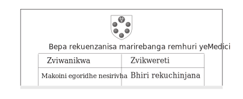

Mufananidzo 3

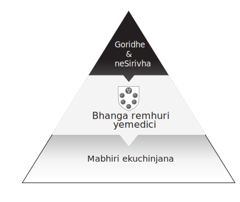

Mufananidzo 4

Iwo mataira anova nzira yekufunga nezve hutongi hwemari hwechisikigo apo midziyo yemari inoiswa muhurongwa hwehukuru kubva kumusoro kusvika pasi, pachinzvimbo chekuiswa padivi peumwe neumwe pamatafura eakaunzi. Nheyo yega yega inomiririra chikamu chebhari yemumwe munhu, uye nekudaro tinofanirawo kuona vatambi varipo pakati pematanho emari. Mumufananidzo 4, iro bhanga remhuri yaMedici ndiye mutambi pakati pekutanga neyechipiri layer. Inoburitsa mari-yechipiri-mari-mabhiri ekutsinhana, ayo anovimbisa kubhadhara mari yekutanga-yegoridhe nesirivheri. Izwi rakakosha: zvivimbiso, zvine njodzi yekuputswa.

Mabhiri aitakura njodzi yekusagadzika nemupi nekuti yaive nzira yekumisikidzwa kugadzirisa. Njodzi injodzi iyo mutambi pakati pemari akaturikidzana haagone kana kusazadzisa pavimbiso yekubhadhara. Chero api anobvisa bhiri anogona kusamira, achisiya muridzi wemari yechipiri nebepa risina basa. Pasinei nenjodzi yekusagadzikana, mabhiri akashanda sechishandiso chekuchinjana mari uye chinosimudzira kumhanyisa kwemari. Mabhiri zvakare akawedzera zvakanyanya kusimba kwemari; mari haigone kugadzirwa kubva mumhepo yakatetepa, asi mabhiri anogona. Ndandi dzinotatamuka: anogona kuwedzera kana akatambanudzwa. Mari inogona zvakare kutatamuka: inogona kuwedzerwa asi chete kana isinga nyatso chengeterwa nemari yegoridhe muvhavha. Kune vatengesi uye mabhanga avo, kusimba kwakaunza njodzi yekusagadzikana, uye mabhiri akave chiridzwa chemari chinodiwa kune makoini. Vaya vanoda kubvuma mabhiri uye dzimwe nzira dzekugadzirisa dzakamisikidzwa dzinoratidza kwatiri kuti mari ine hurongwa hwepamusoro. Kana mushambadzi aida kubhadharwa kwegoridhe pachine nguva kuti aendese zvinhu, yaiva kodzero yake kuita kudaro. Asi kana mumwe mutengesi akabvuma bhiri raimiririra vimbiso yekubhadhara goridhe gare gare, kuda kwake kumisa kugadzikiswa kwekupedzisira humbowo hwega hwekuti zvidimbu zvemari hazvisi zvekuvakwa kwevemabhanga asi zviri nyore mutsika yevanhu yekugarisana. Takatanga kuona hurongwa umo mari dzakasiyana-siyana dzakashandiswa munzvimbo dzakasiyana. Layer rekutanga rakabuda senzira iri nani yekuchengetedza kukosha kwenguva yakareba, uye rechipiri mari yakabuda senzira iri nani yekutengeserana nokuti yainyanya kushanduka kushandisa pane mari.

### Chirango chezvimhinganidzo

Chinonyanya kukosha chechikamu chekutanga chemari ndiyo chirango chechirango chinoshanda kune zvikamu zviri pasi payo. Heino muenzaniso. Vapfuri vegoridhe muzana remakore rechigumi neshanu England vakanga vasiri mhizha shoma. Vakazadzisawo basa rekubhenga nekuda kwekugona kwavo kuchengetedza simbi dzakakosha zvirinani kupfuura chero ani zvake. Ngatitii mugadziri wegoridhe wechiRungu anoburitsa bepa rinonzi deposit pamari yegoridhe yega yega yaanobvuma kuchengeta. Kana vese vanochengeta mari vakangoerekana vakumbira kuti vadzoserwe mari yavo yegoridhe, anogutsa zvikumbiro zvekudzikinura nekuti madhipoziti ake akachengetwa zvakakwana, zvichireva kuti pane hukama pakati pemari yegoridhe nemadhipoziti egoridhe.

Ngatitorei mukana uyu kusuma izwi rekuti cash. Zviridzwa zvemari zvakaita semari yegoridhe yaipihwa nevapfuri vegoridhe vanovimbwa navo uye vanoremekedzwa zvaiwanzoshanda semari. Mari inotsanangurwa nechero chinhu chatinoshandisa semhando yemari inogamuchirwa nevamwe pamutengo wakatarisana, kunyangwe iri bepa rakashama rine njodzi uye pasina vimbiso yekubhadhara kwekupedzisira. Kuti chimwe chinhu chishande semari, vanhu vanofanira kuvimba neanopa, kana kuti ani naani akaita vimbiso yokubhadhara.

Dzokera kumupfuri wegoridhe. Ngatiti madhipoziti ake anowana kuvimbika uye otanga kutenderera semari nekuti vanhu vanovimba kuti anogona kuregererwa negoridhe. Anova nemakaro uye anosarudza kushandisa kuvimbika kwake kutsva. Anoburitsa madhipoziti egoridhe kwaari asina kunyatsochengeta goridhe rinoenderana muvharobe yake uye anoshandisa madhipoziti aya semari mukutenderera. Mupfuri wegoridhe anobva atadza kana akatarisana nechikumbiro cherudzikinuro chakazara. Iyi mhando yechiitiko inodaidzwa kunzi fractional reserve banking, kusiyana kwechiitiko cherudzikinuro kana madhipoziti ese aine goridhe rinoenderana muvhavha. Ndarama iripo sechirango chemupfuri wegoridhe, chinoshanda sechinokurudzira kusashandisa simba rekugadzira mari kunouya nekuvimba kweveruzhinji mumadhipoziti ake semhando yemari. Chechipiri-chikamu mari saka hunhu husina kugadzikana, sezvo simba rekuigadzira richagara riri pasi pekushungurudzwa kwevanhu, zvakafanana nemuenzaniso wedu weChirungu mupfuri wegoridhe uyo akashandisa zvisizvo kuvimba kwevanhu mukukweretwa kwake.

Hurongwa hwemari hune simba, zvichireva kuti mubatanidzwa wehukama hunogara huchichinja. Kana chikwereti chiri kuwedzera, piramidhi yemari inowedzera sezvo chikamu chechipiri chinokura muhukuru. Kana chivimbo chichikwira, mari yegoridhe nedhipoziti yegoridhe zvinenge zvisina musiyano unooneka. Vanhu vanogamuchira pachena zvitupa zvegoridhe semari nekuti vanovimba nekugona kweanopa kugutsa rudzikinuro. Zvitupa zvinoguma nekureruka, sezvo kugadzirisa kwekupedzisira kwemari nebhuru kunogona kunetsa, kunetsa, uye kuve nengozi. Izvi zvinodzokera kumashure apo piramidhi yemari inopinda muchibvumirano uye mutsauko wechinangwa pakati pemari nemari-sezviridzwa unongoerekana waziviswa. Zviridzwa zvaimbove nedanho repamusoro rekuvimbwa kwazvinoitwa hazvichadiwi, uye varidzi vazvo vanozvirasira kune zviridzwa zvakakwirira muhukuru, semari yegoridhe. Makondirakiti anogona kukonzera zvikumbiro zvekudzikinura, zvinonzi mabhanga anomhanya, uye pakupedzisira matambudziko emari. Matambudziko aya anogona kurangarirwa zviri nyore sekuedza kukwira piramidhi remari, sezvo vane mari yepasi-pasi vachipopota kuti vawane mari yepamusoro, yepamusoro-soro.

### Dambudziko Rokubvisa

Sezvo mari yakarongeka yakashanduka kugadzirisa matambudziko nemari yesimbi, matambudziko matsva akamuka. Mafomu emari yechikamu chechipiri aive akasiyana kubva kune mumwe nemumwe. Zvakadaro, zvakaitika muzana ramakore rechigumi nematanhatu muAntwerp zvakachinja izvi zvachose: musika wakatsaurirwa kutengeserana yechipiri-layer mari yakazvarwa. Mari yakasungirirwa yakawedzera kukurumidza kwayo nekuunza budiriro huru mukuchengetedzeka kwekutamiswa kwayo: mari yaisagona kurasika kana kubiwa kana yaendeswa kuburikidza netiweki yebhangi. Kubiridzira uye kusabhadhara mari zvisinei, kudzikiswa kukuru kwekutengeswa kwemari kwaiva kukunda kukuru kwekutengeserana kwenyika dzakawanda. Vatengesi vemabhangi vakatumira mari kutenderera kondinendi zvisina simba nekushandisa masaradhi avo uye network yehunyanzvi pane kutumira mari dzegoridhe nesirivheri. Huwandu hwenjodzi chaiyo yakatorwa nemuridzi webhizinesi mukutumira simbi yemuviri panguva ino haigone kuderedzwa. Kupambara kwakanga kwatekeshera, uye midziyo yeinishuwarenzi yomugungwa yakanga ichiri mucheche. Kuwedzera kushandiswa kwekugadzirisa kwakamisikidzwa kwakawedzera kukurumidza kwemari, sezvo kupedzwa kwekupedzisira kwaikwanisa kumisikidzwa nekusingaperi nekuenzaniswa kwemadhibhiti nemakiredhiti.

Mafashamo ezvikwereti zvitsva zvebhangi uye yechipiri-chikamu mari yakaunza nyaya yemvumo, maitiro ekugadzirisa kutengeserana. Hapasati pave nehurongwa hwekubvisa mabhiri ekuchinjana. Mabhiri haana kubatwa semari nekuda kwekushaikwa kwekumisikidzwa. Vaive zvipikirwa zvekubhadhara goridhe nesirivheri, asi vaive vasina zvekuchinjanisa

kune mumwe nemumwe. Mari dzakagadziridzwa uye mazuva ekukura zvakaita kuti bhiri rega rega rive chiridzwa chisingaenzaniswi nemari; hapana mabhiri maviri akafanana. Vanhu vakanga vasingadi kuchinjanisa mabhii echinangwa nekuti mashoko emabhii acho akanga asingaenderani. Tsika yekuvimba nemumwe yanga isati yashanduka.

Zvishoma nezvishoma asi chokwadi, mazuva ekutanga ekuchinjana akatanga kuwana kufanana muzana ramakore rechigumi neshanu. Mazuva anofambirana nekarenda yeEuropean akasarudzwa nekuti vemabhanga vaitevera vatengesi kuti vavape mabasa emari. Mitambo iyi yakaitika muEurope yose—kubva kuFrance kusvika kuFlanders. Vatengesi vemachira nesirika, mhiripiri nezvinonhuhwira, nemari yesimbi nemabhiri vakaungana pamwechete mwaka nemwaka kuti vatengese. Mafaro aya ndiwo waive mukana wakakwana wevatengesi vebhanga kubva kumativi ese eEurope kuti vauye kuzodzima matabo nemumwe nemumwe, kana kujekesa (sekubvisa) kubvisa mabhengi nemakiredhiti. Iyo fairs 'yemwaka maitiro, zvisinei, yakaganhurwa bhiri rekutsinhana kubvumidzwa kusvika kumasesheni mana pagore. Izvi zvaireva chikamu chechipiri chemari inotengeswa kanenge kana pagore, chiyero chisingawanzoitiki chemari.

Pakupedzisira, chikamu chechipiri chemari chakashaya mvura: yaisakwanisa kupihwa mari nyore uye nyore. Mukati menguva iyi, mari nesimbi zvakanga zvakafanana, zvichireva kuti rudzi bedzi rwemari yainzi inoshanda semari imari yesimbi inokosha pachayo. Mabhiri ekutsinhana haana kuchinjika kuita simbi yakakosha kunze kwekunge akaunzwa kune vanyoreri vakakodzera pazuva ravo rekukura. Musika umo mabhiri aigona kushandura maoko pamitengo inotarwa nevatengi nevatengesi panzvimbo yakanga isipo. Izvi zvese zvaizochinja apo musika wemari-yechipiri wakasiya hupenyu hwekubvumidzwa kwekota pamitambo yekufambisa yeimba yayo yekutanga gore rose muAntwerp.

### Kuenderera kwekungana kwemari

Kusikwa kweAntwerp Bourse muna 1531 kwakashandura mari nekuti kwakabereka musika wemari. Panguva iyoyo, musika wemari waitsanangura musika wezvechipiri-layer zvemari zviridzwa senge mabhiri ekutsinhana, madhipoziti egoridhe, uye zvimwe zvipikirwa zvekubhadhara simbi yakakosha. Izwi rekuti bourse rakabva kuBruges iri pedyo, iyo yakamboshanda senzvimbo yekutengeserana kwekuchamhembe kweEurope isati yarasikirwa nekorona yayo apo vatengesi vemachira echiRungu vakasarudza kuisa nzvimbo yavo yekutengeserana muAntwerp muna 1421. Bruges Bourse yaive nzvimbo yakanyarara yekusangana yemvumo yemari, asi iyo Antwerp Bourse yaive nzvimbo yevatengesi vane ruzha uye yakave yekutanga pasi rose kuchinjana kwemari kwemazuva ano. Bourse akaenderera mberi achifanana nekutsinhana kwemari pasi rose; Izwi rekuti "stock exchange" ndiro bourse muchiFrench uye börse muchiGerman.

Kuchinjana kwemari, seyekutanga Antwerp Bourse, inzvimbo dzekutengesa uko kunowanikwa mutengo. Kuwanikwa kwemitengo ndizvo chaizvo zvazvinonzwika se: maitiro ayo zviwanikwa zvinowana mutengo wayo nekutengwa uye kutengeswa pamusika. Mutengo wezviwanikwa unobuda, kana kuti unowanikwa, pakuona kutengeserana pakati pevatengi nevatengesi. Kana kutengeserana kuchibvumirwa kuitika zvakasununguka, mutengo wechinhu chero chipi zvacho unogona kuwanikwa. Antwerp yaizvitutumadza munzvimbo yayo isina mutemo, umo kutengeserana pakati pemari yekutanga uye yechipiri-yechipiri mabhiri, uye pakati pemabhiri pachayo, yaisada marezinesi uye isingabvisirwe mutero. Yakanga iri nzvimbo yevatengesi kubva kunyika dzese muEurope uye yaionekwa sepakati pehupfumi hwepasirese muzana ramakore rechigumi nematanhatu. Vatengesi vanobva kuPortugal, Spain, England, neGermany vakasvika panzvimbo yekutengeserana nedzimwe nyika. Mitambo yeAntwerp yechirimo nematsutso yairatidza machira echiRungu, mhiripiri yekuEast Indian yaitengeswa nemaPutukezi, sirivha yekuAmerica inotengeswa nevaSpanish, uye mamwe maGerman, Italian, neFrench. Kutengeserana kwese uku kwakakwezva vatengesi vemabhangi uye litany yekuburitsa mari yechipiri-layer. Pakavhurwa iyo Antwerp Bourse, yaizivikanwa se nzvimbo "yekuunganidza mari zvakaenderera," inoratidza shanduko yekubvumidzwa kwemari kubva mumwaka kuenda kunguva chaiyo.

Mukati mehoro dzeAntwerp Bourse musika wemari wakatangwa, musika wakachinja manzwisisiro edu emari kubva kusimbi kuenda kubepa. Vemabhangi vakazadzisa izvi nekugadzira maviri makuru magadzirirwo mukushanduka kwemari yakaturikidzana: kuderedzwa uye kuburitswa kwenoti. Vemabhangi muBourse nyowani havana kufamba vachitenderedza mazana emari-mari zuva rese. Mari yesimbi yaikanganisa kumhanyisa kwemari, uye musanganiswa chete wekumisikidzwa kugadzirisa, accounting, uye bepa ndiwo waive nemukana wekusimbisa. Pakutanga, kutengeserana kwemusika wemari muAntwerp Bourse kwakaitika chete mumabhiri ekutsinhana. Vatengesi vemusika wemari vakapa mabhiri ekutsinhana liquidity, chimwe chinhu chavasina kumbobvira vamboita. Izvi zvakawedzera kukurumidza kwemari. Pamberi pekuvhurwa kweBourse, yechipiri-layer mari yakapihwa mumakota ekuwedzera uye yakagadzirirwa kuvhara zvikwereti kusvika kune inotevera fairi. Asi muAntwerp, yechipiri-layer mari yakatanga kukudziridza hunhu hwemari.

### Kukosha Kwenguva yemari

Vatengesi vemabhangi veAntwerp vakakurumidza kuona mashandisiro emari akaturikidzana, uye nehunyanzvi pane izvozvo, kwaigona kuvandudza mari sehunyanzvi hwekufambira mberi kwevanhu. Chakavanzika chavo chaiva chei chaizvo? Mhinduro iri mune imwe yenheyo dzekutanga dzemari yemazuva ano: kuderedzwa. Ngatifambei nemuenzaniso wekutanga wekudzikisa kuti tiratidze kukosha kwenguva uye kuona chaizvo izvo vemabhanga muAntwerp vakawedzera kuhurongwa hwedu hwemari.

Iwe unotenga bhiri kubva kubhengi nhasi kune $98 iyo inogona kuchinjana nemadhora zana mumwedzi. Iwe unoita izvi nekuti iyo $2 yaunowana mukati memwedzi yakakodzera nguva yaunofanirwa kumirira. Izvi zvinowanzonzi kukosha kwenguva yemari nekuti nguva yaunomirira ine kukosha kwakabatana nayo: unobhadharwa kumirira. Pamberi pekutanga kwemusika wemari muzana ramakore regumi nematanhatu Antwerp, wakamanikidzwa kumirira mwedzi usati waunza bhiri kuti utore mari yako. Munguva iyi, une bepa rine chiyero chikuru uye zuva rekukura. Kunyangwe iine zuva rekukura mune ramangwana, bepa iri richine kukosha kwakabatana naro. Kana, mushure memavhiki maviri, iwe uchida mari kubva kubhiri iri uye uchifanira kuishandura kuita mari, unoendepi? Unoda mubhangi anoda kutenga bhiri racho nemari risati rakura. Mubhengi aizopatsanura mutsauko pakati pemutengo wako wekutenga ($98) uye kukosha kwechiso ($100) okubhadhara iwe $99. Maitiro emubhanga anotenga bhiri nemutengo we$99, iyo "inoderedzwa" kubva pa100 par value pakukura, inonzi discounting. Iwe unofamba nemari nhasi, uye mubhengi achatora $100 kupera kwemwedzi. Iyi mhando yekuderedzwa nevatengesi vemusika wemari muAntwerp yakaunza mhenyu kukosha kwemari zuva nezuva. Mari yemapepa pakupedzisira yakava nemutengo wekuti nyika ione. Kutaura zvazviri, kuberekwa kwekambani yezvemari yakaitika muAntwerp panguva ino, kwete nekuda kwemisika yemasheya kana yehurumende, asi kutsanangura kuchinja kwemitengo yezuva nezuva yezvinhu zvinotengeswa nevatengesi uye yechipiri-chikamu mari inotengeswa nemabhangi.

Chikamu chekupedzisira chemutambo uyu kubudirira kweAntwerp mukutanga musika wemari wemazuva ano kwaive kugadzirwa kwemanotsi ekuvimbisa. Promissory manotsi akaunza denderedzwa rakazara shanduko yemusika wemari kubva kune haphazard uye quarterly smorgasbord kuenda kune inoenderera. KuBourse, kuitira kuti vagadzirise masaramusi asara pakupera kwezuva, vemabhanga vakapa imwezve nzira yechikwereti, mari itsva yechikamu chechipiri inonzi promissory notes kana manotsi. Manotsi aya aive mavimbiso ekubhadhara mutakuri, zvichireva kuti aive akabata bepa aifanira kuvimbiswa. Zviridzwa izvi ndizvo zvakatungamira kune izvo zvatinofunga nezvemapepa emari nhasi, mari manotsi. Vakanga vachidzika mukusaziva kwavo chaiko; yapfuura shanduro dzechipiri-layer mari dzaigara dziine mazita evanhu pavari. Manotsi, semari nhasi, akange asina zvachose chivakwa ichi. Vaishandiswa sechishandiso chekugadzirisa asi vakashanduka kuita basa ravo rekuzvarwa semari uye vakave vanobatsira zvakanyanya senzira dzekutsinhana. Mufananidzo 5 unoratidza zvidimbu zvemari muAntwerp mukati mezana ramakore rechigumi nematanhatu.

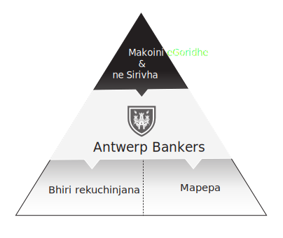

Mufananidzo 5

MuAntwerp, mubereko wemubereko arbitrageur wakanga wasvika. Arbitrage ndipo paunotenga maapuro ne$1 muguta rimwe nekuti unoziva kuti unogona kuatengesa muguta rinotevera nemadhora maviri. Unyanzvi hwokugadzirisa zvinhu hwakasakara sebhizimisi pacharo, uye vachinji vemari vomuMiddle Ages vaichinja mari imwe kuva imwe ivo vamene

vakabatikana muchimiro chayo. Asi arbitrage mikana haina kumbovapo mune yechipiri-layer mari kusvika iyo Antwerp Bourse. Sezvo vatengesi vaidzikisira uye vachitengesa mabhiri uye manotsi gore rose muBourse, mari yepepa yakawana kuvharika chero nguva, zvishoma nezvishoma ichibvisa hurongwa hwemari hwepasirese kubva pakunyanya kutsamira pasimbi. Chikamu chechipiri chemari pachacho chakava kirasi yeasset nemitengo yakataurwa nemapepanhau ekutanga emari enyika. Nzira yekuenzanisa midziyo yese yechipiri-yechipiri yakanga isiri maererano nemitengo yavo yega asi yakavakirwa pamubereko wemubereko waigona kuwana kubva pakubata bepa iro. Mari yemhindu yaiva nzira inowirirana yokuratidza mutengo wemari, uye imwe yaibvumira vatengesi kushandisa misiyano mukukosha kwepepa. Pepa rega rega

muBourse raive nereti yemubereko, richipa mikana yekusawirirana kune vemabhangi. Iyi yemazuva ano mune liquidity yakapedzisira yachinja maonero ekutanga emari kubva kusimbi kuenda pabepa. Simbi yakakosha yaisakwanisa kuzadzisa kuwanda kwezvivakwa zvakarairwa kubva kuhurongwa hwemari. Accounting, bepa, uye network yemabhangi aigona.

## Chitsauko 3: Kuisa mabhanga pakati

Mushure mechikamu chechipiri chemari chabuda, hurumende dzakasimuka kuti dzitore nzvimbo yakakosha pakati pekutanga neyechipiri. Muzana remakore rechigumi nemanomwe neregumi nemasere, Bhanga re Amsterdam neBhanga reEngland vakazvipinza mupiramidhi yemari, vachipa hurumende dzavo simba risati ramboonekwa pamusoro penyaya dzemari dzevanhu. Nokurayira kushandiswa kwemari dzadzo dzechikamu chechipiri, hurumende nebumbiro radzo idzva rebhanga guru rakabvisa kukwanisa kwevanhu kuva norusununguko rwesangano remari. Hurumende nemari dzakabatana nhasi nokuti hurumende dzakatanga kutonga pamari yechikamu chechipiri ndokuishandisa kuzvibatsira, kutanga neBhanga re Amsterdam muna 1609. semabhangi epakati, zvakakosha kuti titarise kuti hunyanzvi hwavo hwemari hwakashanda kusvika papi kusimudzira hurongwa hwehurumende dzavo. Mabhanga aya akatipawo kutarisa zvazvaireva kuburitsa iyo pasi rose yaitora semari yayo yekuchengetedza. Mabhangi eCentral, mari dzepasi rose, uye kusvika kwechitatu-layer mari zvichaongororwa zvakare muchitsauko chino.

### Kugadzirisa pakarepo

Bhangi reAmsterdam (BoA) rakangogadzirwa nekuda kwekambani yekutanga pasi rose yakabatana-stock, Dutch East India Kambani (Vereenigde Oostindische Compagnie, kana VOC). Ngano yeVOC inotanga muna 1585 apo maDutch akakurumidza kupedza chinzvimbo cheAntwerp sepakati pekutengeserana nedzimwe nyika nekuvhara rwizi Scheldt nekuvharira kupinda mugungwa. Kuvharidzirwa kwakaitika pakati peDutch Revolt, kurwira kwemakore makumi masere kwekusununguka kweDutch kubva kuhumambo hweSpain. Zvichikurudzirwa mune zvematongerwo enyika, Dutch Revolt inonzi yakakurudzira kusimuka kubva paumambo kuenda kune dzimwe nzira dzinomiririra hurumende muEngland, France, uye United States of America. Kumukira kwacho kwakaguma nokuumbwa kweUnited Provinces yeNetherlands, inowanzonzi Dutch Republic. Kuvambwa kweiyi republic nyowani kwakatangira hupfumi hwepakati hwakachinja chiso chemari nebhizinesi zvachose. Zana rinotevera remusika wemari uye yese yemari yakatarisana muAmsterdam.

Mukutanga kwezana ramakore rechigumi nenomwe, vatengesi vechiDutch vaitumira ngarava kuchitsuwa cheIndonesia cheJava kuti vatenge zvinonhuwira uye vagozvitengesa kuEurope nepurofiti yakanaka. Pundutso yakakwezva mamwe mabhizinesi, uye nenguva isipi boka revatengesi vepasi rese rakatanga kuzivana. Zvitsva zvakatevera zvesinamoni neginger zvakaita kuti pave nepurofiti yakadzama, uye munguva pfupi vatengesi ava vakaziva kuti kuedza kwavo kwaigona kuwanda zvikuru nekubatanidza masimba uye kukwezva capital semutumbi wakabatana. Mhedzisiro yacho yaive yekutanga kubatana-stock kambani yakaumbwa muna 1602, iyo VOC. Isu tinozvitora sezvisingakoshi nhasi, asi VOC yaive muenzaniso wekutanga wevatengesi vanopa mari mukutsinhana nechikamu chemuridzi nenzira yechitupa chepepa. Hurumende yeDutch yakapa VOC kutonga kwekutengeserana muAsia pamwe nemvumo yekuhaya mauto uye kurwa hondo pachinangwa chayo chekutora purofiti kubva kune dzimwe nyika. Kugona kwekambani kuunganidza capital kwaipa mukana wekuwedzera pakubudirira kwayo kwekutengesa. Migove muVOC yaive midziyo yakatsvakwa zvakanyanya. Sezvo migove yakawedzera mukukosha, vatengesi vepakutanga vaida kuona pfuma kuburikidza nekuitengesa nemari kune vatengesi vatsva, uye ndiyo nzira yekutanga yemusika wemari. Iyo Amsterdam Bourse, yakatumidzwa zita rekutanga muAntwerp, yakavambwa nguva pfupi mushure mekutanga zviratidzo zvemusika weVOC shares. Yakagadzirwa neVOC pachayo kuitira kuti ifambise kuchinjana kwemasheya ayo pamusika wechipiri, uye nayo kwakauya kugona kuongorora zvese zvekutengesa. Kugadzira Bourse kwakabvumira VOC kuona, pasi pedenga rayo, kutengeswa kwezvikamu zvayo.

Kutanga kwemusika wemasheya kwakakonzera kuwedzera kukuru kwekutengeserana kwemari, izvo zvaida nzira yekugadzirisa iri nani pane chero chaivepo. Sezvo kufarira kwakawanda muzvikamu zveVOC kwakawedzera, kutengesa kwakawedzera. Kutengeswa kwese kwemasheya kwaive kutengwa kwemari panguva imwe chete, asi imari ipi yaizogamuchira vagovani mukudzoka? Vaizoda mari, asi kubvuma bhegi rizere negoridhe nesirivheri zvisingaite zvaisaita shanduko inoshanda zvakanaka. Anosvika chiuru chemhando dzakasiyana dzemari dzakatenderedzwa munzvimbo itsva yekutengeserana yepasi rose yeAmsterdam, mamiriro emari akaomesera guta rine musika wekutanga wemasheya. Chishandiso chemari chaishuviwa zvikuru kuti chibhadhare uye chigadzirwe zvese izvi zvekutengesa. Muna 1609, Bhangi reAmsterdam, kana Wisselbank, rakavambwa sekufambira mberi kwehupenyu hwemasangano emari zvichitevera kusimuka kweAmsterdam Bourse; kufambiswa kwemasheya eVOC kwakada kufambiswa mberi mukugadziriswa kwemari. Ichishandisa iyo unit yeakaundi account, inonziwo Dutch florin, Bhangi reAmsterdam rakatanga chikuva

chemahara uye nekukasira kugadzirisa kune vese vanoisa mari. Ichangobva kuumbwa Dutch Republic yaida mari yayo pachayo-yechipiri kuti itsigire basa rayo rehukoloni raibudirira.

BoA yekutanga hurongwa hwebhizinesi yaive yekurambidza vanotora mari nemanotsi avo uye kurayira mari yese yegoridhe neyesirivha muguta rese kuti iiswe kubhanga. Vanochengeta mari, kutozosvikira mibato yavo yaitwa isiri yapamutemo, ndivo vaichinja mari veAmsterdam. Vaichengeta mari dzegoridhe nesirivha uye vakapa mapepa ekuzvipikisa. Vabati vemari ndivo vaive vatambi vakuru pakati pemareya ekutanga-nechipiri emari muAmsterdam, saka kuitira kuti BoA ikwezve mari yekutanga bhizinesi, yaifanira kuzviita nechirevo. Vese vanoita mari vakamanikidzwa kupa simbi inokosha kuBhanga reAmsterdam uye vakapihwa madhipoziti eBoA semubhadharo. Vemari vakabvumidzwa kuvhurazve bhizinesi makore mushure mekurambidzwa kwavo asi vaingobvumidzwa kuva nemari yezuva rimwe chete vasati vanzi vaise kuBhanga reAmsterdam. BoA yakakwanisa kubudirira kutonga kuburitswa kwechipiri-layer mari nekubvisa kuwanikwa kweveruzhinji kune reya rekutanga remari.

Iyo BoA's deposits yakava mari inofarirwa muEurope yese, kunyanya nekuda kwechimiro cheAmsterdam senzvimbo yepasirese yekutengeserana. Kukunda kwemidziyo yeVOC muAsia uye mukurumbira wakatevera wemubatanidzwa wakaunza mafashama makuru muguta. Izvi zvakagonesa kuti igamuchirike neBhangi reAmsterdam: kugona kwayo kuita nekukurumidza kutamiswa pakati pevanoisa mari. Kune mari dzidiki dzaichinjanwa uye huru, kuchinjirwa pakati pevaishandisa BoA depositors kwakavakwakareruka. Kuti uwedzere mukana wekushandiswa, BoA haina kubhadhara mari yekufambisa kwemukati. Zvekuchinjisa zvaisadawo kuchinjana kwemari kana bepa. Izvi zvese zvaireva kuti nenhamba iri kukura yevanyoreri vemasangano kubva mukati nekunze kweNetherlands, kutamisa mari kwakava nyore zvisingafungidzirwe kana zvichienzaniswa nekushandisa mari kana kunyange mapepa. Nekuda kwekuvandudzwa kwekugadzirisa nekukurumidza pachikamu chechipiri chemari, Bhangi reAmsterdam raive rekutanga bhangi repakati, nekuti nemutemo bhangi raive pakati pekuita kwese mari. Basa rekubvisa, kana kugadzirisa mari pakati pevanoisa mari, ndiyo yaive hwaro hwebhanga guru. Bhanga reAmsterdam raive danho rekugadzirisa kutengeserana kwemasheya uye nzira yekuti hurumende itarise kutengeserana kwega kwega kuri kuitika pakati pevanoisa mari. Yakanga iine mhedziso yekuongorora kwemari pamusoro pehupfumi nekuti yaifambisa zvese zvekutengeserana kwayo uye yakawana tarisiro muhukama hwemari pakati pevatengi vayo.

Kudiwa kwesangano reBoA kwakakura kubva kumativi eEurope ukuwo Amsterdam yakasimudza chinzvimbo chayo semushonga mukuru wekondinendi. Guilder yaionekwa semari yakachengetwa pasi rose mukati mezana ramakore rechigumi nenomwe nekuti vatengesi nevemabhizinesi kubva kuEurope yese vaiichengeta yakachengetwa nekuda kwekuvimba kusingakanganisi kune wairipa. Chimiro chayo semari yekuchengetedza pasi rose yakagara kusvika muzana ramakore regumi nemasere

.

### Kukweretesa Kwakaropafadzwa

PaBhanga reAmsterdam's chinangwa chaive chinopfuura kungoita zvisvinu mukugadzirisa kwemari. Kunyatsoongorora kunoratidza kuti VOC yakazvimisa pamusoro pepiramidhi yemari kuitira kuti ibvise simba nezviwanikwa. Nguva pfupi yatangwa, Bhangi reAmsterdam rakakweretesa mari kuVOC uye rakaisa zvikwereti semidziyo pabalance sheet, inojairwa kaviri-yekupinda accounting maitiro. BoA yakatenda VOC nemadhipoziti, ichigadzira mari uye ichipa kune anokwereta rombo. Zvikwereti izvi zvakamhara padivi pemari yegoridhe neyesirivha pachikamu chekutanga chemari. Kukweretwa kweVOC kwaivepo padanho resimbi yakakosha pachayo. Mari yakagadzirwa pachikamu chechipiri yakachengeterwa zvishoma nekuti inowirirana yekutanga-layer asset yaive chikwereti kuVOC pachinzvimbo chesimbi yakakosha yakaiswa kuBhangi reAmsterdam. Mumufananidzo 6, tarisa piramidhi yemari pasi pesimba reBhange reAmsterdam, ichiratidza zvikwereti kuVOC pane yekutanga mari. Iyi yaive nguva yakakosha yekushanduka kwemari yakaturikidzana; kekutanga, simbi dzinokosha dzakanga dzisiri dzoga pamusoro pepiramidhi yemari.

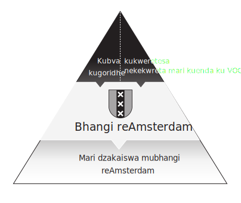

Mufananidzo 6

Nekugadziriswa kwechikamu chechipiri, BoA yakazobvisa kugona kubvisa simbi yakakosha zvachose asi yakakwanisa kuchengetedza kuvimba kweveruzhinji mumari yayo yechipiri. Kukosha kweizvi hakugone kuwedzeredzwa. Nekumisa kuchinjika kune yekutanga-layer mari, Bhangi reAmsterdam rakaratidza kuti simbi yakakosha yaisafanira kudikanwa kushandisa mari nehurongwa hwemari. Izvo zvaienderana nekumanikidzwa kwayo kwekurangwa kuti igare yakachengetwa zvakakwana, uye zvakanyanya kukosha zvaienderana nekuvimba kwevanhu mukuranga ikoko. Vanhu vekuEurope vaivimba kuti Bhangi reAmsterdam rakachengetwa zvakafanira uye harina kubudisa madhipoziti mune yakawandisa yaibata simbi inokosha, uye kuvimba uku kwakatsigira kudiwa kwemari dzaiiswa muBoA semari.

Bhanga reAmsterdam rakakwanisa kumisa shanduko kuburikidza nekugadzira chimwe chiratidzo chemazuva ano chepakati chebhangi chinonzi open market operations, zviitiko zvemusika neBoA kuti ive nechokwadi chemusika wakafanana uye wemvura wemadhipoziti ayo. Nekuchengetedza musika une hutano pakati pemadhipoziti ayo uye mamwe emhando yepamusoro mafomu emari, BoA yakakwanisa kutsigira kukosha kwezvikwereti zvayo pasina kumbosiya simbi yakakosha. Uku kusanganiswa kwakasimba uye kusati kwamboitika kwekugadzirisa nekukasira, kukweretesa kwakasarudzika, uye kumiswa kwekuchinja kwakave nemhedzisiro yezvemuchadenga kune ramangwana rezvemari uye kwakapesvedzera zvakananga kusikwa kwemutsivi weBhange reAmsterdam semuparidzi wemari yenyika, Bhangi reEngland.

### Bhangi re England

Kumwe kumukira humambo husina kufarirwa kwakatangira kugadzirwa kweBhange reEngland. Kumukira Kunoshamisa kwa1688 kwakatsiva mambo weKaturike James II nomwanasikana wake wePurotesitendi Mary nomurume wake wechiDutch, William wokuOrange. Kunyangwe isiri shanduko izere kubva kuhumambo kuenda kuRepublic senge muNetherlands, Iyo Glorious Revolution muEngland yakabvisa zvakanyanya simba kubva muumambo kuenda kuParamende. Godo reChirungu uye kuyemurwa kwehurumende inomiririra yeDutch uye kugona kwemari zvakakonzera kugadziridzwa kwakadzama, kuvandudzwa, uye kumisa pakati pehurongwa hwemari hweChirungu.

Hapana nezvemusika wemari waive pakati peEngland mumazuva iwayo. Vapfuri vegoridhe vakazadzisa mabasa ese makuru ekubhanga uye vakaratidzira zvakawanda zvezviitwa zvevashambadzi vekutanga vemusika wemari muAntwerp. Vapfuri vegoridhe vechiRungu vakaburitsa madhipoziti, zvinyorwa zvakatenderedza, uye mabhiri akaderedzwa. Kudiwa kwekubhadhara hondo kwakazoita kuti korona yechirungu itsive sisitimu yekuchengeta mari wega nekutora basa remutambi wega pakati pekutanga neyechipiri danho remari.

Mauto emugungwa eChirungu akanga achangobva kukundwa zvakaipisisa nevaFrench uye mukuedza kwawo kuvakazve, hurumende yakakwereta mari nokuburitsa chikwereti. Muna 1694, Bhangi reEngland (BoE) rakagadzirwa nechinangwa chekutenga aya mabhondi ehurumende matsva, uye bhangi guru rinotevera rakazvarwa. Hurumende neBoE zvakatora kubva mugwaro rekukweretesa rakatarwa neVOC neBhangi reAmsterdam ndokushandisa kupihwa kwemari yechipiri.

Bhanga reEngland rakapihwawo basa rekuchengetedza simbi yakakosha, kubudisa madhipoziti, kuita mari pakati pevanoisa mari, uye kutenderera manotsi semari. Kunyanya kukosha, iyo BoE yakaderedzwa mabhiri ekuchinjana uye yakawedzera kushanda kwemari muLondon mari yemusika. Kusiyana nekutonga kweAmsterdam pamari yechipiri, London yaive nehushamwari kumakwikwi emari yemapepa, uye kuda kweBoE uye kugona kudzikisa mabhiri kana mari yaidiwa zvakanyanya yaizopedzisira yaisa parutivi seyakanyanya kubhengi repakati nhasi.

### Zvinotarisirwa kugoridhe

Pound sterling ranga riri sangano remari yeEngland kubvira 1158 apo Mambo Henry akaunza mari yesirivha ye92.5% kuchena. Mari iyi yaimiririra huremu hwesirivha kutozosvikira England yatanga kugadzira mari yegoridhe muna 1663 yainzi guinea, iyo yakatumidzwa zita rechikamu cheWest Africa kwaicherwa goridhe racho. Dzakaisa pondo kumatambudziko anotyisa apo guinea neyeSirivheri yechiRungu inonzi shilling zvaiita mapondo. Asi nguva pfupi mushure mekusikwa kweBank of England, nyanzvi yemasvomhu yeChirungu uye nyanzvi yefizikisi Sir Isaac Newton saTenzi weMint akashandura zvachose nzira yebimetallism pasi rose nekuisa mwero mutsva wekuchinjana pakati pegoridhe guineas nesirivheri muna 1717. Newton akadzidza nezve kuyerera kwegoridhe nesirivha muEurope yose uye mitengo yekuchinjana yakatarwa mune dzimwe nyika bimetallic standards, kunyanya France, Netherlands, neGermany. Akashandisa zvaakawana kuti aone mwero mutsva wekuchinja pakati pegoridhe nesirivha waaifunga kuti wainyanya kumiririra kukosha kwesimbi imwe neimwe. Mutengo mutsva wekuchinjana wakaita kuti zvibatsire kune vanotengesa zvisiri pamutemo kuti kutengesa sirivha uye kunze kwenyika goridhe, uye pasina nguva refu sirivheri yakamira kushandiswa semari muEngland. Kushandurwa kwaNewton, kungave kwakafanorongwa kana netsaona, kwakazoita kuti pasi rose rive pasi pepiramidhi remari riine goridhe chete kumusoro.

Kunyangwe sirivheri yakadzingwa kubva mukushandiswa muEngland nguva pfupi yadarika mushure mekushandurwa kwaNewton, zvakatora makore anopfuura zana kuti pave nechiyero chakazara chegoridhe, icho pondo yakave yakakosha mugoridhe chete, kuti ive mutemo. Muyero wegoridhe weEngland wakadzokororwa pasi rose uye pakupedzisira wakakwevera mari yenyika huru muchikamu chimwe chete. Mufananidzo 7 unoratidza dudziro yakamisikidzwa yechiyero chegoridhe repasi rose kutenderera kwekutanga kwezana ramakore rechimakumi maviri.

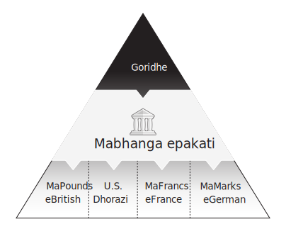

Mufananidzo 7

### Chikamu chechitatu chemari

Kusvika ikozvino, takaongorora zvakanyanya hukama pakati pekutanga uye yechipiri chikamu chemari nevatambi vezvemari vakapinda pakati pavo, asi ikozvino tinofanira kuwedzera imwe nhanho kuhurongwa hwedu hwekunzwisisa masisitimu emari. Mabhiri ekutsinhana, kubva kumienzaniso yepakutanga yemapiramidhi emari, aive echipiri-chikamu zvemari zviridzwa izvo zvaive zvivimbiso zvekubhadhara goridhe rekutanga. Mukati menguva Bhanga re England, zvisinei, mabhiri akanga ari vimbiso yokusabhadhara ndarama asi kubhadhara pondo uye naizvozvo akanga aripo pachikamu chechitatu chemari. Mubhuku rino tichashandisa izwi rekuti "private sector" zvichireva avovanoita mabhizinise pasina hurumende kutsanangura mabhanga, mabhizinesi, nevemabhizinesi asiri ehurumende. Mumufananidzo 8, tinogona kuona nyaya dzepachivande dzinovimbisa kubhadhara mari yechipiri-yechipiri, ichiisa iyo imwe pasi pasi peBhange reEngland muhutungamiri hwemabhadharo. Zvikwereti zvebazi rakazvimiririra zviripo pachikamu chechitatu chemari. Mumufananidzo 9, iyo yechinyakare chiyero chepepa chinomiririra inosanganisirwa zvakare kukutungamira kune iyo itsva-matatu modhi. Reya rechitatu remari harifanirwe kuve pasi pekushungurudzwa kwakawanda kupfuura reya rechipiri remari, asi ichokwadi riri kure nekuchengetedzeka kweimwe-mari yegoridhe. Somuenzaniso, kana mumwe mukadzi wechiRungu aityira kuti bhangi rake richava mungozi yemari uye achida mari yendarama panzvimbo pedhipoziti yechitatu mubhangi, aizoda kutengeserana kuviri. Aifanira kushandura mari yake kuita manotsi eBoE asati ashandura manotsi iwayo kuita goridhe. Dai aive nerechipiri BoE manotsi, aingochinja kamwe chete kuchengetedza mari yegoridhe yaidiwa.

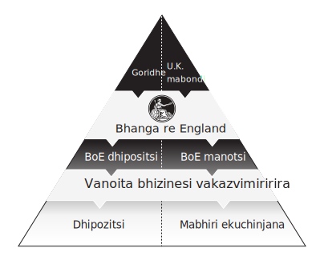

Mufananidzo 8

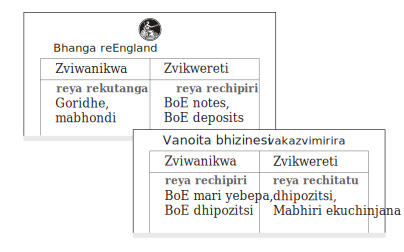

Mufananidzo 9

Kunyangwe hazvo Bhangi hwebhangi repakati, Bhangi reEngland raizopedzisira ragadzira iyo yepakati pebhangi modhi yepasirese. Hazvina kuuya nyore kana kubva pakutanga. Gwaro rekutanga reBoE, rakapihwa muna 1694, rakangovimbisa hupenyu hwemakore gumi nerimwe. Kana gwaro rega rega rapera, nhaurirano dzakaitwa pakati peBoE nehurumende. Munhaurirano, hurumende yainyanya kunetseka nguva dzose yaiva yekubhadhara mari yayo, uye kukurudzira kweBoE kwaiva kuwedzera mutengo wayo wemugove nekuda kwekuti yakanga ine vagoveri vega vanokurudzirwa nepurofiti. Migove yeBoE yaiwanzoongwa zvakanyanya mushure mekuvandudzwa kwechata, sezvo imwe neimwe yaipa kuwedzera kwesimba remari.

Mukuvandudzwa kwechata ye1742, BoE yakasimbisa hutongi hwayo kunyanya pamusoro pekuburitswa kwenoti muEngland. Bazi rakazvimiririra rakanga risisabvumidzwe kuburitsa matsamba echipiri ayo akavimbisa kubhadhara mutakuri wegoridhe paanenge achida, achiisa masangano akazvimirira zvachose kune chikamu chechitatu chemari. BoE yakatarisana nemamwe machata ekuvandudzwa uye shanduko yemitemo isati yawana chimiro chechigarire muna 1844.

### Kuwanda nekudakubatwa zvakanaka

Ngationei kuti elasticity yemari inowedzera sei patinofamba takaderera mumatanho. Pachikamu chechipiri chemari, manotsi eBank of England ane elastic nekuti akachengetwa zvishoma; anopihwa kudarika goridhe rakachengetwa muBoE vault. Uku kunyungudika kunowedzerwa kana bazi rakazvimirira rinoburitsa madhipoziti anovimbisa kubhadhara BoE manotsi, uye iwo madhipoziti pachawo anongochengetedzwa zvishoma nezvakataurwa. Sezvo piramidhi remari rinokura, zvidimbu zvepasi mupiramidhi zvine kusimba kwakanyanya asiwo kusasimba kwakanyanya sechigadzirwa. Nekumashure kwekusimba kwemari, tinogona kutarisa kuti Bhangi reEngland rakaita sei nekuvhunduka kwemari, kana chiitiko chevanhu vachikwenya piramidhi yemari kuti vawane mamwe marudzi emari.

### Mukweretesi weLast Resort

Manotsi eBanga re England aidiwa semari nekuda kwekushandurwa kwawo kumari yegoridhe uye kukweretwa kwachangamire. Zvakangodaro, zvinyorwa zvaive zvichiri zvechipiri-layer mari, uye musiyano pakati peBoE manotsi negoridhe wakawedzera panguva yeimwe dambudziko remari. Kuvhundutsa kwemuna 1796, kwakakonzerwa nekuputika kwebubble renyika mhiri kweAtlantic muUnited States of America yakanga ichangobva kuumbwa, yakakonzera kusakwana kweBritish uye pakupedzisira kumhanya paBank of England goridhe. Uku kubuda kwemari yechikamu

chechipiri kupinda mumari yegoridhe yekutanga kungadai kwakapedza zvachose Bank of England yegoridhe rayo dai zvisiri zveBank Restriction Act of 1797. Chiitiko ichi chakamisa kushandurwa kwegoridhe pamanotsi ese eBoE, kumiswa kwakagara kwenguva refu. anopfuura makumi maviri emakore. Kutya kwemari seuyu kwakavimbiswa mupiramidhi remari rakavakwa nekusimba uye nenzira yakachengetwa zvishoma. Asi Bhangi reEngland rakabvisa kuedza kwegoridhe kupa chirango uye rakatumira shoko rakasimba rekuti mari yaro yechipiri inogona kuzvimiririra. Ichokwadi chokuti zvikwereti zveBoE zvinogona kumira zvakasimba pasina kutendeuka zvinoreva kuti mumatambudziko, inogona kushandisa simba rayo kugadzira mari yechipiri pasina kukanganisa sangano remari kana njodzi yekurasikirwa nesimbi yakakosha.

Bhangi reEngland raive nenzira yekudzivirira kubata kwaro goridhe, asi raidawo nzira yekutarisana nematambudziko anotanga muchikamu chechitatu chemari, semuenzaniso kana mabhiri epachivande ekutsinhana akangoerekana arasikirwa nemari mumusika wemari. BoE yanga ichida uye ichikwanisa kupa mari kumusika wemabhiri nekudzikisira bepa raizonetsa kuwana pasi pemutengo mudambudziko. Mune chero kutya kwakadaro, yaifanira kuita seyekupedzisira kumashure mune elastic system kana sangano remari raizorarama.

Muna 1873, munyori weBritish ane mukurumbira uye muvambi wemagazini yeEconomist Walter Bagehot akanyora bhuku remasemina rainzi Lombard Street: Tsananguro yeMoney Market iyo yakabvisa mashandiro emusika wemabhiri, uye kuti Bhanga reEngland rinofanirwa kushanda sei kuitira kuti rive nechokwadi. inoderedza matambudziko. Bhuku raBagehot rinonyanya kutaurwa pakusarudza mabhanga makuru se "mukweretesi wekupedzisira sarudzo" mukati mehurongwa hwemari. Mhinduro yake yaive yekuti Bhangi reEngland rikweretese mari pachena kune zvikwereti zvine mubairo pamurango asi mubereko unonzwisisika:

> Mukuvhunduka, varidzi veiyo yekupedzisira Bank reserve vanofanirwa kukweretesa kune vese vanounza kuchengetedzwa kwakanaka nekukurumidza, pachena, uye zviri nyore.

Matambudziko emari panguva iyi aienderana nekukasira kwakawedzera kudiwa kwemari, apo avo vanoburitsa kana kubata mari yechitatu yaida yakawanda muchimiro chechipiri-chikamu cheBhanga reEngland manotsi. Apo kudiwa kwemari kwakawedzera, Bagehot akatsanangura kuti mari yechipiri inofanira kugadzirwa nebhanga guru kuitira kugutsa chido ichocho. Inofanirwa kuchinjisa simba rayo rekunyungudika ichiri kuchengetedza chirango kuitira kuti isakurudzire njodzi yehunhu, iyo inoitika kana sangano rezvemari rinopinda munjodzi yakawandisa nekuti rinotarisira kununurwa nehurumende kana bhanga guru kana chinzvimbo chayo chemari chakashata. BoE yaizopa mari nekudzikisa mabhiri avaiona sekuda kutsigirwa kwenguva pfupi, kwete mabhiri aifanirwa kugadzika zvisinei nemamiriro emari. Kana mamiriro emutengo asina kuchinjika pazvinenge zvichidikanwa, kudonha kwezvisizvo kwaigona kupinda muchikamu chechitatu chemari. Akagumisa kuti bhanga guru renyika rinofanirwa kupedzisira ragadzira mari-yechipiri-yakawanda kana sisitimu ichida zvakanyanya, ichitsigira mashandiro ebhanga guru kubva ipapo. Simba rekugadzira mari rakauya nemutoro, pazvinenge zvakakodzera, kuita chero zvaidiwa kuchengetedza sangano remari. Pondo sterling yakapedza zana regumi nepfumbamwe semari inochengeterwa pasi rose sezvo dzimwe nyika dzakaitenga semotokari yekuchengetedza nekuda kwehumiro uye kugadzikana kweHumambo hweBritain. Sezvo Humambo hwakawedzera kuvhara hafu yepasi pePasi, Bhangi reEngland rakatarisana nedambudziko rakakura rekuchengetedza dhinominesheni repamba rinoshandiswa nevatori vechikamu pasi rese. Pound sterling haingave iyo mari yekupedzisira kutambura neiyo conundrum. Mhiri kweAtlantic, iyo inotevera nyika yekuchengetedza mari yakanga yakamirira mumapapiro.

## Chitsauko 4: Sisitimu yemubatanidzwa yekuchengeta mari

> Goridhe ndiyo mari. Zvimwe zvese chikwereti.
> — J.P. Morgan to United States Congress in 1912

Mukutanga kwezana ramakore rechimakumi maviri, pondo yakaramba iri mari yakachengetwa pasi rose asi yakanga ichirasikirwa nedhora reUnited States. Munguva yekushanduka kwezvinhu, vashandi vemakambani Cornelius Vanderbilt,

John D. Rockefeller, Andrew Carnegie, JP Morgan, naHenry Ford vakavaka makambani aikwezva kudiwa kwemari yekuAmerica. Nyika yaida madhora kuti itenge zvinhu, mabasa, uye migove yemasangano matsva emakambani epamusoro. Munguva iyi, United States yakanga isina bhanga guru. Asi apo kudengenyeka kwenyika kukuru muSan Francisco kwakakonzera dambudziko rezvemari muna 1907, United States munguva pfupi yakatevera yaizotora peji kubva mubhuku raWalter Bagehot ndokuisa mukweretesi wezvekupedzisira kuita pakati pehurongwa hwayo hwemari. Sisitimu yekuchengeta mari zvemubatanidzwa, yakagara nhaka mari yatova munzira yayo kuenda kunzira yekuchengeta sepasi rose kamwe chete muna 1914. Yakagadzirisa hurongwa hwemari ine mativi matatu, nemabhanga akatemerwa akazvimirira ega akabvumirwa kugadzira midziyo yemari yechikamu chechitatu mubepa rekuenzanisa mari. Nhasi, iyo sisitimu yekuchengeta pamwe chete inoramba iri pamusoro pehutongi hwemari sezvo dhora richine korona yepasirese kunyangwe chinzvimbo chayo chave chidiki. Kunzwisisa mamiriro edhora akaoma ekutonga uye kusasimba kunogona kutsanangurwa zviri nyore nematemu edu akaturikidzana, nyaya inotamba muzvitsauko zvitatu zvinotevera. Muchitsauko chino, tichaputsa piramidhi yekuchengetwa zvine mubatanidzwa kwemadhora matatu. Zvadaro, tichaona kuti bazi rekuchengeta pamwe chete nehurumende yeUnited States dzakabvisa sei goridhe kubva pachikamu chekutanga chemari. Uye pakupedzisira, tichatarisa kuti hurongwa hwemari hwepasi rose hwakawira sei mukusagadzikana kutanga muna 2007, uye nei nekudaro kuchema kunowedzera gore rega rega kuti mari yepasi rose itangezve.

### Mari yekutanga yeAmerica

Munyika yose yeNyika Itsva makoroni, chimiro chemari chakasiyana zvakasiyana pakati pematunhu. Mari yesimbi yakanga isina kuwanda mumazuva ekutanga nekuti mint yekoloni yakanga isati yavapo uye mari dzeEurope dzakanga dzisati dzawanda kuti dzishandiswe nemunhu wese semari. Izvi zvakaita kuti vanhu vashandise mamwe marudzi emari emuno. MuNew York, mabhero ehoko regungwa anonzi wampum, aishandiswa semari nemarudzi mazhinji eNative America, akatenderedzwa sezvinyoro zviri pamutemo muzana ramakore rechigumi nenomwe. KuVirginia, fodya yakava hupfumi hwekutanga uye hwaro hwepiramidhi yemari yayo nekuda kwemukurumbira wepasi rose wechirimwa. Chikamu chefodya chakave chiyero cheakaunzi, uye zvinyorwa zvinovimbisa kuendeswa kwepondo dzefodya zvakapihwa naVirginia semari yechipiri-yechipiri iyo yakatenderera pakati peveruzhinji semari. Shell nefodya zvaikwana semari yedunhu nekuti chimwe nechimwe chairatidza mamwe, asi kwete ese, emari yemhando dzemari. Hapana akanga akakwana, asi mumwe nomumwe wavo akabudirira kushanda semari kwemakumi emakore akawanda. Ose ari maviri aipatsanurika, akaoma kufungidzira, asingafungidziriki, uye akasimba zvine mwero. Pakupedzisira, dzaizotsiviwa senzira dzekutsinhana uye zvikamu zveakaunti nemhando yepamusoro yemari yakaitika kare: mari yegoridhe nesirivha.

Nekufamba kwenguva, mari dzekunze dzegoridhe nesirivha dzakatanga kutenderera semari mumakoloni. Mari yainyanyozivikanwa pakati pevanhu yaive dhora resirivha rekuSpain. Muna 1784, Thomas Jefferson akabudisa zvinyorwa zvake pamusoro peKutangwa kwechikamu chemari, uye kwemakoini eUnited States, uye akapa nharo yedhora sechikwata chitsva chemari yeAmerica:

\[Dhora\] imari inozivikanwa, uye inonyanyozivikanwa kupfuura dzose mupfungwa dzevanhu. Yakatotorwa kubva kuMaodzanyemba kuenda kuMaodzanyemba; yaratidza mari yedu, uye nekudaro inozvipa nerufaro sechikamu chakatounzwa.

### Musanganiswa wemari

Makore gumi nematanhatu mushure meDeclaration of Independence, yechipiri Congress yeUnited States of America yakazopasa Coinage Act muna 1792 kuti imise dhora reUnited States sechikamu chepamutemo cheakaundi yenyika, ichitsanangura dhora rimwe semagiramu 1.6 egoridhe nemagiramu makumi maviri nemana yesirivha.

Kwemakore 108 akatevera, United States yakaedza hurumende shoma shoma dzakasiyana. Kugadziriswa kwekutanga kuchiyero chekuchinjana pakati pegoridhe nesirivheri kwakave nemhedzisiro yekugadziriswa kwaIsaac Newton saTenzi weMint uye akadzinga goridhe kusashandiswa kwemakumi emakore akati wandei.

Mabhangi maviri epakati akasiyana akagadzirwa muna 1791 uye 1812, asi rimwe nerimwe rakapera mushure memakore makumi maviri emakore. Vazhinji vekutanga vekuAmerica vaisavimba nemabhanga epakati kuti vape mari yavo. Mabhangi aivepo mukupokana nemaitiro mashoma ehurumende uye zvakakonzera kuwanda kwezvematongerwo enyika vitriol, izvo zvakadzivirira masangano kubva pakuvandudza charter. Panzvimbo pebhangi repakati rereya rechipiri remari, manotsi akabudiswa nemabhanga ega ega akashanda senzira inoshandika kwazvo yemari mukati mezana ramakore

rechigumi nepfumbamwe. Aya manotsi akachengetedzwa neUnited States Treasuries, zita rehurumende yeU.S. Heino muenzaniso wemutauro wepamutemo wakanyorwa pamari yakachengetedzwa (kana kutsigirwa) neU.S. Treasuries kubva 1902:

Mari yeNyika inochengetedzwa neUnited States Bonds yakaiswa kuna Treasurer weUnited States of America IAmerican National Bank yeSan Francisco ichabhadhara kune anotakura paanoda Madhora gumi.

Pamusoro pemapepa emabhengi ebazi rakazvimirira, zvitupa zvegoridhe zveU.S. zvakatendererawo semari. Uye pakupedzisira, chimbo chekubhadhara mari yeHondo yeVanhu uye mari yemapepa inonzi greenback, yaisakwanisa kudzikinurwa nesimbi yakakosha, yakatenderedzwa semari mukupera kwezana ramakore rechigumi nemapfumbamwe zvakare. Pamwe chete, United States yaive nemubatanidzwa wezvechipiri-chikamu zvemari zviri kutenderera nenyika yese. Miganho pakati pechipiri neyechitatu yakange yakaoma kutsanangura, kunyanya pasina bhanga guru uye hurongwa hwemari. Zvichakadaro, mwero wegoridhe wepasi rose wakatanga kuEngland wakatanga kutekeshera pasi rose sezvo dzimwe nyika dzemuEurope dzakatanga mari dzechikamu chechipiri dzine vimbiso yekushandurwa kuita mari yegoridhe, izvo zvakakonzera kutangazve kushandiswa kwegoridhe muUnited States. The Gold Standard Act ye1900 yakagumisa kumwe kusanzwisisika kwemari, kubvisa sirivha kubva pamari yayo uye yakamisa dhora rimwe pa1.5 magiramu egoridhe rakachena. Mutengo unowirirana wetroy ounce imwe chete yegoridhe wakamira pa$20.67—kwawakanga uripo kubvira muna 1834. Chiitiko chacho chakanga chiri chetsika sezvo maAmerica akanga atojoinha mwero wegoridhe wenyika mukuita, asi chaive chakakosha pakuiswa chiratidzo kwedhora. sangano. IUnited States yakanga zvino yakagadzirira kumwe kuedza kubhangi guru.

### Zvakachengetedzwa

Muna 1906, kudengenyeka kwepasi kwe7,9 magnitude kwakazunungusa San Francisco, California kuchikonzera kuparadza kukuru kwoupenyu nezvinhu; vanhu vanopfuura zviuru zvitatu vakafa uye mazhinjisa eguta akaparadzwa. Nenzira inotenderera, kudengenyeka kwenyika uku kwakakonzera kusikwa kweFederal Reserve System. Mumakore aya, zvakawanda zvezvivakwa zveSan Francisco zvakapihwa inishuwarenzi muLondon. Mainishuwarenzi ekuBritain akabhadhara chikamu chikuru cheSan Francisco's colossal insurance claims nekuda kwekudengenyeka kwenyika, uye mari yakawanda yakatumirwa kuCalifornia. Kuti vadzivirire pound-to-dollar exchange rate, Bhizinesi reEngland rakasimudza zvinoshamisa mitengo yezvibereko ne2.5% mukupera kwa1906 mukuedza kukwezva mari kubva padhora. Yakashanda, uye hupfumi hweAmerica hwakapinda munguva yechibvumirano, izvo zvakazokonzera dambudziko remari. Zvakazotevera kwaive kupokana kwese-kubvisa mari yechipiri neyechitatu-yechitatu yakapihwa nechero sangano rezvemari rekuAmerica iro rine kukweretwa kwakauya nemubvunzo. Sezvo vanhu vekuAmerica vakakwira piramidhi yemari muKutyisa kwe1907, vanoisa mari munyika yose vakabvisa mari yebhangi kutsvaga nzira dzepamusoro-soro yemari, semari yegoridhe kana US Treasuries. Kubviswa kwemari uku munyika yose kwakonzera kuti mabhanga ematunhu ashande mumabhanga eNew York. Sezvo dambudziko rakawedzera, mubhangi titan JP Morgan akapinda, akaronga ruponeso rwemari mumabhanga ari kuderera, uye akachengetedza hurongwa hwemari. Morgan akange asina sarudzo: bhangi repakati reUnited States uye mukweretesi wekupedzisira sarudzo akange asipo.

Gore rakatevera, Senator weUnited States, VaNelson Aldrich, vakaumba National Monetary Commission, basa rayo raive rekuongorora mashandisirwo emari emuEurope nekupa mazano ekugadzirisa nekuvandudza hurongwa hwemadhora hwakanga husina bhanga pasina bhanga guru. Pasina hurumende inotsigirwa nemukweretesi wekupedzisira sarudzo uye yakatsanangurwa zvakajeka piramidhi yemari, kutengeserana kwedhora kwakaramba kusinganzwisisike. Pashure pemakore ekudzidza, mishumo yakabudiswa, uye uchapupu hwekongiresi, Aldrich pakupedzisira akawana kutsvaka kwake bhangi guru apo Congress yakagadza kuva mutemo Federal Reserve System pana December 23, 1913.

Izwi rekuti reserve riri mumusoro weiyo institution pachayo, asi chii chaizvo zvakachengetwa, uye zvinopindirana sei murondedzero yemari yakaturikidzana? Shoko racho rinoreva nzira yekuchengeteka, chimwe chinhu chinobatsira kana paitika dambudziko. Chokwadi, Federal Reserve System (Fed) yakavambwa kurwisa matambudziko emari, uye yaizoita izvi nemari yechipiri inonzi reserves. Fed reserves ndiyo imwe nzira yekutaura madhipoziti, asi madhipoziti aya akapihwa neFed chete kumabhanga emakambani akazvimirira. Fed manotsi (kana kuti "dollar cash" yatinoziva nhasi), imwe yeFed yeimwe nzira yechipiri-layer mari, yaiwanikwa kuvanhu. Fed manotsi akabudiswa sechinhu chakanaka chevanhu vose, mari yepepa yakavimbika yaigona kushandiswa nyore nyore senzira yokutsinhana nayo. Asi matura ndicho chishandiso

chaicho icho Fed inoshandisa kushandisa simba rayo remari. Ndiwo magadzirirwo emari atinofanira kunzwisisa kududzira mutsauko uripo pakati pemari yeholesale nemari yekutengesa.

Wholesale money (Fed reserves) imari inoshandiswa nemabhanga, uye retail money (Fed notes) imari inoshandiswa nevanhu. Fed reserves madhipoziti emabhangi chete uye haana chero nzvimbo yekutengesa: hapana munhu anogona kuvhura account ega ega kubazi ravo reFederal Reserve ozvitora. Musiyano pakati peholesero nekutengesa mari inova yakakosha pakukurukura nezveramangwana repakati pebhangi, asi munhoroondo yenhoroondo, Fed's mandate yaive yekupa mari yakawanda, kana mari yebhangi system, apo kusagadzikana kwechikwereti kwakakonzera kusagadzikana kwemari. Zita rakataura zvese; iyo Federal Reserve system yaive yakarongedzerwa kuve nzira yekununura yakakura yezvipo.

### Fed

The Federal Reserve Act zita rakazara ndeiyi:

Chiitiko chekupa kugadzwa kweFederal reserve mabhanga, kupa mari yakanyungudika, kuwana nzira dzekudzoreredza bepa rekutengesa, kumisikidza tarisiro inoshanda yemabhangi muUnited States, uye nezvimwe zvinangwa.

Chinangwa chekutanga chakataurwa, "kupa kugadzwa kweFederal reserve mabhanga," pakarepo inogadzika mari yakabatana uye inogamuchirwa yechipiri-yechipiri, "matura," inokonzeresa zvese zviitiko zvebhangi muUnited States. Mabhanga anochengeterwa aizotsiva musanganiswa uripo wemari yechikamu chechipiri uye kumisa kugona kwemabhanga emakambani akazvimirira kuiburitsa. Mutemo wakatonga chikamu chechipiri chemari muUnited States pasi peFed, uye yakaisa zvakasimba mari yose yakazvimiririra yekupa pachikamu chechitatu.

Chechipiri chakataurwa chinangwa cheMutemo, "kupa mari yakasununguka," yakasimbisa kuti Fed yaizova nekwanisi yekubudisa mari nenzira yakachengetwa uye inobvumira mabhanga mukati mehurongwa hwayo kuita zvakafanana.

Chinangwa chechitatu cheMutemo chaive gadziriro yaWalter Bagehot, ichipa Fed "nzira dzekudzoreredza bepa rekutengesa." Bepa rekutengesa rinoreva chikwereti chenguva pfupi chakapihwa nemabhanga nemakambani. Izvi zvakabvumira kuti Fed iite semukweretesi wekupedzisira sarudzo yehurongwa hwemari nekugadzira yechipiri-layer reserve balances kuitira kutenga zvinhu zvemari zvakashungurudzika.

Chinangwa chekupedzisira chikuru chakataurwa cheMutemo chaive "kumisa hutongi hunobudirira hwebhangi muUnited States," mukuyedza kugadzirisa nekusagadzikana kwemari kwezuva, kumisa kuongororwa kwemari kweFed paindasitiri yemabhangi, uye kupa Fed chete simba rekuburitsa mabhangi charter akauya nekugona kugadzira yechitatu-layer mari.

Pakupedzisira, Mutemo wakatema kuti Fed ichengetedze chiyero chegoridhe-chekuvhara chiyero cheinenge 35% pamusoro pezvikwereti zvayakapa pachikamu chechipiri, zvichireva kuti 35% yezvinhu zveFed zvinofanira kuchengetwa negoridhe. Muchokwadi, goridhe raimiririra 84% yezvinhu zveFederal Reserve payakavambwa, nhamba yaizodonha zvakanyanya nekufamba kwenguva. Nhasi, sekutaura, goridhe inomiririra isingasviki 1% yezvinhu zveFed.

Pakutanga, Federal Reserve yakanga isiri yavo kana kuronga kuve neUS Treasuries pamari yayo. Kutanga kweHondo Yenyika Yekutanga muna 1914 kwakakurumidza kupedza chinangwa ichi chepakutanga, icho chakazova chisingakoshesi pamberi pemari yehondo. Makore maviri chete mushure mekutangwa kweFederal Reserve System muna 1916, Federal Reserve Act yakagadziridzwa kuti ibatsire hurumende yeUnited States mari yehondo yayo, uye Fed yakazogadzira matura akawanda kuti itenge U.S. Treasuries.

Maitiro ekuvaka chikamu chakakura chechikwereti chehurumende yeUS chaive nezvakakura papiramidhi yedhora. US Treasuries yakabatana negoridhe pachikamu chekutanga chemari nekuda kwekuumbwa kwezvinhu zvitsva zveFed: pakazopera Hondo Yenyika I muna 1918, chiyero chekufukidzwa kwegoridhe cheFed chakadonha kubva pa84% kusvika pasi pe40%. akanga zvino akabatwa mumabhondi ehurumende yeUnited States. Yakanga iri chiratidzo chekutanga chekuti U.S. Treasuries yaizopedzisira yatsiva goridhe zvachose sedhora piramidhi ndiro rekutanga-layer asset. Mufananidzo 10 unoratidza piramidhi yemadhora matatu makore mashoma mushure mekusikwa kweFed.

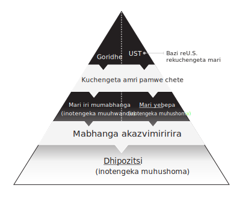

Mufananidzo 10

## Chitsauko 5: Kuregedza Goridhe

> Kune ese maEurodollar uye zvikwereti zveU.S. banks\[,\] . . . chitubu chavo chikuru chinyoreso chemutarisiri wemabhuku. 
> — Milton Friedman, Nobel Prize in Economics winner, 1976

Zvakangotora hafu yezana ramakore mushure mekupera kweHondo Yenyika I kuti United States isiye mwero wayo wegoridhe. Kuregererwa kwegoridhe kubva kuhurongwa hwedu hwemari hwepamutemo kunogona kurondwa kune zvakatevedzana zvezviitiko zvinotanga nekuparara kukuru kweWall Street muna 1929. Ma1920, aiwanzozivikanwa semakore makumi maviri anotinhira, aive makore gumi anotsanangurwa nekutanga kwekutengesa: kushandisa mari. mari senzira yehupenyu. Chikwereti chakave chinowanikwa zvakanyanya kune avhareji yeAmerica, asi pachinzvimbo chekuyera huwandu hwekukura kwayo, zvinonyanya kufadza kutarisa rudzi rwechikwereti rwaipihwa. Zvitoro zvemadhipatimendi zvakatanga kupa makadhi echikwereti kuvatengi vakapfuma kekutanga, makambani emafuta akatanga zvirongwa zvekuvimbika kwekadhi rechikwereti, uye mabhanga akakuchidzira fungidziro mumusika wemasheya nekukweretesa inosvika 90% yemari inodiwa kutenga migove. New York yakanga yava musimboti wezvemari dzepasi rose. Zvikamu zvemakambani akarongwa paNew York Stock Exchange zvakafashukira nokudiwa, uye mari yakadururirwa muUnited States. Izvi zvakasimbisa zvakanyanya kudiwa kwemadhora pasi rose uye zvakasimbisa mari yekuAmerica kune pasi rose reserve currency echelon. Kuwanda kwemari kusikwa kwakaitika mukati memakore makumi maviri kwakapokana nechirango chegoridhe pakusimba kwemari uye zvakaburitsa pachena kudiwa kwenharaunda kuti dhora ribviswe kubva kugoridhe. Sezvineiwo, pakanga pasina goridhe rakakwana raive rakabatwa nehurumende yeUnited States kuti ripe mari yayakanga yavimbisa mukugadzwa kwayo. Humbowo hweizvi hwakauya mushure mekuparara kwenhoroondo yemusika wemasheya.

Apo mitengo yemasheya yakawana simba rinokwevera zvinhu pasi muna Gumiguru 1929, Fed yaifanira kupindura kune dambudziko guru rezvemari nemoyo wose kwekutanga. Nehuwandu hwakatarwa hwematura egoridhe uye inosunga zviri pamutemo 35% yegoridhe-yekuvhara reshiyo, iyo Federal Reserve haina kukwanisa kugadzira iyo yaidiwa mari yechikamu chechipiri kudzivirira kuderera kwehupfumi. Zviuru zvakawanda zvebhanga zvakakundikana mukutanga kwema1930, zvichitsvaira mabhiriyoni emadhora emabhengi eAmerica. Kuderera kwehupfumi kwakabatana nechokwadi chakakasharara chekuti mari yechitatu inogona kunyangarika nechinguva chidiki. Hapana mambure ekuchengetedza kana inishuwarenzi yaivepo kugadzirisa kurasikirwa kwakadaro. Fed yakaedza "kupa mari yakanyungudika" uye kuve mukweretesi wekupedzisira kuita nepese paaigona napo, asi hazvina kukwana kukurira mhedzisiro yechitatu-layer mari contraction yakakonzerwa nechishuwo cheveruzhinji kutiza zvine njodzi. deposits. Iyo Federal Reserve yakasungwa nemutemo wepasirese goridhe-kuvhara iyo yakaganhura huwandu hwechikwereti iyo Fed yakaitwa kuti iwanikwe kuhurongwa. Kurangwa kweGoridhe kwakagamuchira kuchema kwemhosva yekutadza kwehupfumi kusimuka uye zvakakonzera shanduko inoshamisa uye yakatsvaira papiramidhi yedhora muma1930s. Zviitiko izvi zvinofanirwa kuonekwa sechikonzero chikuru chakatanga kusimuka kwegoridhe kubva kumamiriro emari enyika.

### Hapana Goridhe Kwauri

Mutungamiri Franklin Roosevelt vakapa Executive Order 6102 muna Kubvumbi 5, 1933 iyo yakaraira ese "mari yegoridhe, bullion yegoridhe, uye zvitupa kuti zviunzwe kuhurumende." Kurongeka kwacho kwakave kutengeswa kwekumanikidzirwa kwegoridhe mukutsinhana neFederal Reserve manotsi (cash) nevagari vese vemuUnited States uye zvakabvisa zvachose kuwanikwa kwevanhu kune yekutanga-layer mari. Ichi chiziviso chemhangura chakaita kuti kutora uye kutengeswa kwemari yekutanga zvisiri pamutemo uye kurangwa anosvika makore gumi mutirongo, zvichiyeuchidza danho reBhange reAmsterdam rekuti vese vanotora mari vape mari yesimbi yakakosha vachitsinhana neBoA deposits pakusikwa kwayo muna 1609. .

Gore rakatevera, United States yakapasisa Gold Reserve Act ya1934, iyo yakaderedza dhora pairi nendarama nekuwedzera mutengo wegoridhe kubva pa$20,67 kusvika pa$35 paaundi. Uku kudzikisira kukuru kwaive kuramwa kwekuvhiyiwa muhondo yepasi rose yepasi rose umo nyika dzakaedza kudzikisa mari yadzo nepamusoro pevadzinotengeserana navo. Vavariro yavo yakanga iri yokukwezva kudiwa kwedzimwe nyika nokuva nemitengo yakachipa. United States yaingotevedzera zvaiitwa nedzimwe nyika dzese: kupa chero munhu ane goridhe simba rekutenga rekutenga zvinhu zveAmerica nemasevhisi. Nehurombo kune veruzhinji vekuAmerica, kuwedzera kwemutengo wegoridhe kwakauya mushure mekutora, zvichireva kuti vanhu vekuAmerica havana kubatsirwa nazvo. Mutemo uyu wakaendesa zviri pamutemo huridzi hwegoridhe rose reFederal Reserve kuUnited States Treasury uye wakatangira kufamba kwegoridhe kubva kuNew York kuenda kuUnited States Army kuFort Knox kuKentucky.

### Dhipoziti Inishuwarenzi

Mutemo weBanking wa1935 wakagadzika zvachose iyo Federal Deposit Insurance Corporation (FDIC), ichiisa bhengi inishuwarenzi yedhipoziti yeavhareji mhuri yeAmerica. Muchirevo chemari yakavharwa, FDIC inishuwarenzi ndeye federally yakavimbiswa inishuwarenzi pane ese matatu-layer bank deposits. FDIC vimbiso yakaderedza kutya kweveruzhinji kwechitatu-layer mari vaporising sezvayakaita panguva yekuvharwa kwe4,000 mabhanga muna 1933 chete. Muhuwandu, kukanganisa kwekusikwa kweFDIC kwaive kudiki: mari yeinishuwarenzi kune yega yega depositor yaingova 5,000 madhora. Asi kubva pamaonero epfungwa, kukanganisa kwacho kwaive kwakakura. Vanhu vaisazotiza madhipoziti echitatu-chikamu vachifarira mari-yechipiri kana vaiziva kuti madhipoziti avo akaiswa inishuwarenzi nehurumende yemubatanidzwa. Pasina goridhe semotokari yekuchengetera iripo, federal deposit inishuwarenzi yaive kuyedza kwehurumende kuvimbisa vagari kuti mari yavo yekuchengetedza dhora yaizodzivirirwa kunyangwe ikachengetwa nemabhanga emakambani akazvimirira ane njodzi. Panguva imwe cheteyo, Federal Reserve yakazochengetedza hutongi hwayo pamusoro pekupihwa kwenoti mushure mekunge U.S. Treasury yabhadhara mabhondi ekupedzisira anokodzera serutsigiro rwemanotsi akavanzika. Piramidhi yedhora yaimbova isinganzwisisike yakaerekana yatanga kutariswa: hurongwa hwemari hwakanga huripo pakati pechikamu chechipiri nerechitatu chemari, uye kusungirirwa kwegoridhe pazvikamu zvakaderera kwakaderedzwa nezviito zvehurumende pakati pa1933 na1935. US dhora kuti rimire roga, risina goridhe.

### Mambo Dhora

Mukati mehondo yemari yepasi rose, dhora rakabuda sehembe rakasviba rakachena mukugezeswa kwemari dzepasi rose. Kunyange zvazvo dhora rakaderera maringe negoridhe, dzimwe nyika dzanga dzichiita izvi nenzira yakatokura. Pound sterling yakasiya mwero wegoridhe muna 1931 uye yakagumisa zviri pamutemo hutongi hwayo semari yekuchengetedza pasi rose. Chipo chakazadzwa nemari yesimba idzva repasi rose: United States of America.

Muna 1944, vatungamiri venyika vakaungana pahotera muBretton Woods, New Hampshire uye vakagadzira kuti mari dzose kunze kwedhora dzaive mafomu emari yechitatu mukati mepiramidhi yedhora. Chibvumirano cheBretton Woods chaizosvika pakuzivikanwa sedhora repasi rose rekuchengetedza mari. Chibvumirano ichi hachina kukanganisa hukama pakati pekutanga neyechipiri zvidimbu zvemari neimwe nzira: zvinyorwa zveFederal Reserve zvichiri kuvimbisa mutakuri wemari yegoridhe pakudiwa pamadhora makumi matatu nemashanu paawanzi. Zvakanga zvine chekuita, zvisinei, nehukama pakati pedhora nedzimwe mari. Mari ingadai yakagadzirisa mitengo yekutsinhana nedhora uye yaisazodzikinurwa pagoridhe. Dhora chete ndiro raichengeta link pakati paro negoridhe. Dhora rakanga rava musungo wemasangano akasiyana siyana enyika. Hurumende nemabhanga epakati pasi rose vakamanikidzwa kushandura dhinominesheni yezvakachengetwa zvavo, zvibatiso, uye masaramusi kumadhora eU.S. (USD).

Chibvumirano chakaunza musiyano unokosha muhukama pakati pezvikamu zvemari. Mari dzekune dzimwe nyika dzaive pachikamu chechitatu chemari, panguva ino kwete nekuda kwebalance sheet kwayakavepo, asi nekuda kwehukama hwemutengo kune madhora. Mumufananidzo 11, tinoratidza USD padanho riri pamusoro pedzimwe mari dzakadai seGBP (British pound sterling) uye CHF (Swiss franc). Pondo nefranc zviri pasi pedhora muzvikamu zvemari nekuti mutengo wazvo unoyerwa nemadhora. Izvi zvinoreva kuti kuenda kumberi, pane hukama huviri hunobvira pakati pemidziyo yemari mukati meiyo yakaturikidzana: chiyero cheshizha rekutonga uye mutengo wepamusoro.

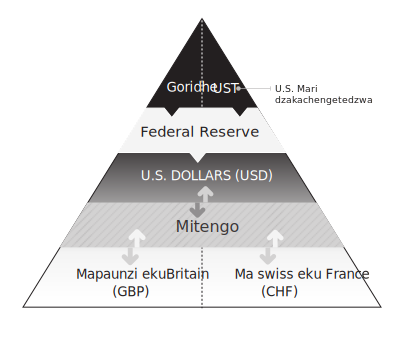

Mufananidzo 11

### Zvakatemerwa Kukundikana

Nehurombo kuhurongwa hwemari hwepasi rose, chibvumirano cheBretton Woods chakaparara. Anonyanya kufunga nezvemutoro wemari dzepasi rose panguva ino ndiRobert Triffin, nyanzvi yezvehupfumi yakaberekerwa kuBelgian yakaita tsvakiridzo kuFederal Reserve neInternational Monetary Fund mumakore ayo ekutanga. Triffin akafanotaura nemazvo kupera kwechibvumirano cheBretton Woods kwemakore gumi chisati chadonha. Kunyange zvazvo vagari veUnited States vakarambidzwa kuva negoridhe, nyika dzekunze dzakanga dzichiri kubvumirwa kushandura madhora avo akaunganidzwa kuita simbi. Triffin akafanotaura kuti nyika idzi dzaizopedzisira dzapedza mari yegoridhe yeUnited States, zvichiita kuti mutengo wakatemerwa wemadhora makumi matatu nemashanu paawandi yegoridhe isingakwanise kuchengetedza. Akayambira kuti kushandurwa kwegoridhe hakugone kurarama pasina kugadziridzwa kuhurongwa hwakaitwa nechibvumirano cheBretton Woods. Chakanyanya kukosha, akaziva kuti kuve mari yekuchengetedza pasi rose waive mutoro, kwete chikomborero. Nyika dzekunze dzaizounganidza madhora nekuda kwechimiro chayo chekuchengetedza. Izvi zvaizosimbisa dhora uye zvokonzera kusaenzana kwekutengeserana uko kwaisazovepo pasina iyi imwe sosi yepasirese reserve currency inoda. Mhinduro yaTriffin yakarongwa kudambudziko remari yenyika imwe inoshanda sesangano renyika dzepasi rose rezvemari kwaiva kubatana kwezvematongerwo enyika pakati pemasimba makuru ehupfumi. Muuchapupu kuUS Congress muna 1959, akabvuma kuti mhinduro yake yakaramba isina kujeka, dambudziko rakafambisa kudiwa kwegoridhe semari isina kwayakarerekera pasirese, zvisinei nekuti pfungwa yacho ingave isina musoro sei:

Mhinduro ine musoro yedambudziko... ingadai yakawanwa kare kudai kwakanga kusiri nokuda kwezvinetso zvikuru zvinobatanidzwa mu... kusvika pachibvumirano nenyika dzakati wandei pamativi akawanda ehurongwa hune musoro hwemari yepasi rose nekugadzira zvikwereti. Izvi, hongu, ndiyo chete tsananguro yekupona kwegoridhe pachayo. Hapana munhu angadai akafunga nezvekuraswa kusinganzwisisike kwezviwanikwa zvevanhu pane kuchera goridhe kumakona ari kure ePasi nechinangwa chega chekuitakura nekuiviga zvakare ipapo mune mamwe makomba akadzika, kunyanya akacherwa kuti agamuchire uye akachengetedzwa zvakanyanya kudzivirira. it. Nhoroondo yezvido zvevanhu, zvisinei, ine pfungwa yayo pachayo.

### Offshore Dhorazi

Iyo nyaya yeEurodollar isingatauriki zvishoma. Zvakakosha kuti tinzwisise kuti dhora rose rakakandwa sei munyonganyonga panguva yedambudziko remari ra2007-2009, nei hurongwa hwemari hwepasi rose hwakaramba huri muhurombo kubvira ipapo, uye zvakakosha kuti sei nyika iri kuziya nenzara yekugadzirisa mari.

Izvo zvese zvakatanga mushure meHondo Yenyika II mushure mekunge dhora reUnited States rave riine hukasha hwemari yenyika uye apo Europe yaive ichivaka patsva, yakapihwa mari muUSD. Munguva yeBretton Woods nguva, dhora rakatanga kutonga sangano rekutengeserana kwenyika. Mafemu kubva kupasi rose akakwevera kune madhora edhinomineti emabalance sheet. Vakabhadhara mabasa avo nemadhora pachinzvimbo chemari yemuno nekuda kwemusika wedhora wakadzama. Kudiwa kwemadhora kunze kweUnited States kwakawedzera zvikuru, uye mabhangi muLondon, Paris, uye Zurich akanga aripo kuti aite basa iroro. Aya mabhanga eEurope akakwanisa kupa mari inoyevedza yedhipoziti kupfuura vamwe vavo vekuUS nekuda kwekusiyana kwemitemo. Izvi zvakaita kuti vanhu vapinde muEuropean-domiciled dollar deposits. Aya madhipoziti emadhora ekumhiri kwemakungwa akapihwa nemabhanga eEuropean mabviro akasvika pakunzi Eurodollar (izwi rekuti Eurodollar harina hukama chero nemari yeEuro, iyo yakanga

isipo kusvika 2001). Mabhanga epasi rese akange awana nzira, pasina kukumbira mvumo kune chero ani zvake, yekugadzira madhora kure nekutarisa kweFederal Reserve. Aya mabhangi epasi rose (mabhangi ekumahombekombe) aive kunze kwesimba reUnited States uye nekudaro aisafanirwa kutevedzera chero yegoridhe-yekuvhara uye chengetedzo ratios yakatemwa neFed nehurumende yeUS.

Imwe idiosyncratic inoda yaivepo yeEurodollars: kuvanzika kwemari kubva kuUnited States. Ma1950 akatsanangurwa nekutanga kweCold War pakati pe capitalism necommunism. Pasinei nekuparadzana kwezvematongerwo enyika, veSoviet vakanga vasingakwanisi kudzivisa zvachose dhora remasimba ose nokuti vaida madhora kubhadhara zvinhu zvose zvinotengeswa kunze kwenyika uye zvinhu zvaidiwa kuwedzera humambo hwavo. Kupihwa kwemadhora kwakamanikidzwa uye kwakatariswa neFederal Reserve System, saka pachinzvimbo chekuvimba nemabhanga eNew York kuti abate madhora avo, madhora eSoviet akaiswa kumabhanga eLondon panzvimbo. Nekuita izvi, mari yavo yakadzivirira kutonga kweFederal Reserve System uye hurumende yeUnited States. Hurumende yemakominisiti yeSoviet yakanga ine simba rakasimba rekudzivisa kuongorora kwezvemari uye kuzviisa pasi kune mumwe wayo we capitalist. VaSoviet vakasarudza mari yebhangi yeEurope pamusoro pemari yebhangi yeAmerica kunyange zvazvo mari yavo yakaitwa mumadhora eUnited States.

Pakazosvika 1957, madhipoziti matsva aya ekumhiri kwemakungwa akatanga kutengeserana pamwe chete nezvimwe zviridzwa zvemusika wemari wekuEurope muGuta reLondon, zvichiratidza kubuda kwemusika weEurodollar. IEurodollar yaizoratidza kuti haisi imwe dhora-mhando, asi kuti gangaidzo yehurongwa hwemari hwepasi rose uye chinokonzeresa kushanduka kwayo. Aimbove nhengo yebhodhi reFederal Reserve uye munyori ane ruzivo nezvehupfumi hwemari Charles Kindleberger akatsanangura maEurodollar sechigadzirwa chekudiwa kwechisikigo chekuyerera kwemahara kwemari kutenderera pasirese. Muna 1970, akaona kuti maEurodollar akabuda kunze kwekudikanwa nekuti Federal Reserve System uye mabhanga eUS akazvimirira ega haana kugadzira akakwana kechipiri- kana yechitatu-layer madhora kune vashandisi vepasirese:

Iko kushanduka kwemusika weEurodollar kuita muzinda wepasi rose, wakavharwa kubva kudhora munzvimbo uye kubva kuEurope mumari. . . chibereko chisiri chekuronga nenyanzvi dzehupfumi asi chemhindumupindu. Izvi zvinoratidza kuti masimba ekubatanidzwa munyika, emisika yezvakanaka, kana misika yevanhu, uye yemisika yemari yakasimba kupfuura miganhu yezvematongerwo enyika inoparadzanisa nyika.

Madhora aidiwa kunze kweUnited States kuitira kuti atore chikamu muhupfumi hwepasi rose huri kuwedzera madhora. Mumwe munhu aifanira kuvapa kwavaidiwa, kunyangwe madhora aingove akateedzerwa akapihwa neFederal Reserve neAmerican banking system. Nekupa maEurodollar, mabhanga eEurope aipindura kudiwa kwemadhora pasi rose.

Dhora rakanga radzika midzi sesangano rehupfumi hwenyika: madhiramu emafuta aitengwa nemadhora, zvibvumirano zvekutengeserana zvakarohwa nemadhora, uye mabhangi epasi rose akaiswa mumadhora. Nekuda kwekuuya kweEurodollar, piramidhi yemari yedhora yakashanduka. Neiyo Fed isingakwanise kuziva, kuongorora, kana kutonga nyika yemabhangi epasi rose uye maEurodollar, hazvina kujeka kuti ndeipi chikamu chemari maEurodollar aivepo. Vaive fomu rechitatu-layer mari pasi peFederal Reserve manotsi? Vaive mari yechipiri-pasi pasi pezvipi zvehurumende mabhondi uye akasiyana kiredhiti chiridzwa chaaive nacho? Kana kuti raive piramidhi idzva, rakasunungurwa kune dhora raivepo? Iyi mibvunzo yaisazopindurwa zvizere kusvika dambudziko guru rezvemari ra2007–2009. Mumufananidzo 12, tinoratidza Eurodollar system ine mubvunzo wemubvunzo pamusoro pepiramidhi kuratidza kusanzwisisika kwemari yemabhanga epasi rose anoburitsa USD.

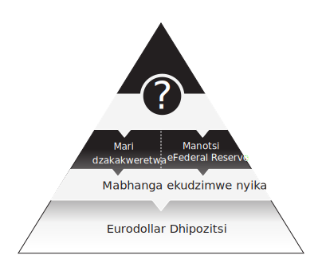

Mufananidzo 12

### Kuzoregedzwa kwegoridhe

Muna 1961, zviratidzo zvekutanga zveyambiro zvakapenya kuti kushandurwa kwedhora kuenda kugoridhe kwaive munjodzi huru. Sezvo yambiro yaRobert Triffin yainzwika zvakanyanya munzeve dzevagadziri vemitemo, United States, United Kingdom, nevamwe vakaungana kuti vagadzire Goridhe Pool, umo mabhanga epakati akatengesa simbi inokosha mumusika kuchengetedza chivharo pamutengo wayo pamadhora makumi matatu nemashanu paawanzi imwe. Nyika dzekunze dzakaunganidza madhora nekuda kwemamiriro ayo emari pasi rose uye dzakazotanga kushandura madhora aya kuita goridhe. Zvikumbiro zvekudzikinura zvakange zvave kutanga kuvaka kudzvanywa pamutengo wegoridhe wakatarwa. Dziva reGoridhe rakadonha makore manomwe gare gare apo mutengo wakapfuura zviri pamutemo madhora makumi matatu nemashanu mumisika yeEurope. Mumakore mashoma akatevera, goridhe rakazvibvisa nenyasha kubva pachikamu chekutanga chepiramidhi yedhora, ichirasikirwa nemamiriro ayo emari. Muna 1971, United States yakamisa kushandurwa kwegoridhe padhora; kumiswa kwekutanga kwaifanirwa kunge kuri kwechinguva, asi dhora harina kuzodzokera kune chero linkage nechinhu. Makore maviri gare gare, nguva yemazuva ano yemahara-inoyangarara mari yakatanga, ichigumisa zviri pamutemo chibvumirano cheBretton Woods. Ndarama yakachinjirwa kuita basa risiri pamutemo remari isina kwayakarerekera, ichiri kubatwa nanhasi nehurumende nemabhanga epakati pasirese seyekutanga-layer, mari isina bato.

## Chitsauko 6: Kusagadzikana kwedhora

Nhasi, hurongwa hwedu hwemari hwaparara. Inoshanda, asi kuputsika mukati kunoita kuti ive nyore kuputika. Yakapotsa yaparara muna 2008 uye zvakare muna 2020. The Federal Reserve yakaita basa rayo semukweretesi wekupedzisira sarudzo mumamiriro ega ega uye yakachengetedza hurongwa hwemari huri mhenyu, asi munhu wese zvino anonzwisisa kuti Fed ndiyo chete pasi rose tsime rechokwadi remvura, uye pasina tsigira sisitimu haina kukwanisa kuzvimiririra. Kubva pamaonero emari, hapana nzvimbo dzakawanda mupiramidhi yedhora dzisina vimbiso yakajeka kana yakajeka yekudzokera kumashure kubva kuFederal Reserve nhasi. Piramidhi yedhora yakazvityoka munzvimbo dzakawanda kubva muna 2007, zvekuti Federal Reserve yanga isisina sarudzo kunze kwekuisa mabhandeji padivi pese pese. Ichi chitsauko chinotaurira nhoroondo yekuti Federal Reserve yakava sei mukweretesi wepasirese wenzvimbo chete.

### Chinyoreso cheMutariri Wemabhuku

Pasina goridhe, US Treasuries yakamira yega pamusoro pepiramidhi yedhora semari yekutanga chete. Pfuma pachayo imhando yechikwereti, uye kukweretwa kwavo kunobva kuzvinhu zvehurumende yeUnited States uye simba rekuunganidza mutero kubva kuvagari vayo. Aya mabhondi ehurumende akave nzira yepamusoro-soro yekuchengetedza madhora uye zvichiri nhasi. Mukushaikwa kwegoridhe, iyo Fed's balance sheet yakashandisa US Treasuries sechinhu chayo chikuru, uye bazi rakazvimirira rakavashandisa senzira ine simba rese yekubatisa mari. Kumabhanga, varidzi vemabhondi ehurumende aya vakashandisa simba rekugadzira imwe mhando yedhora inonzi Treasury Repo dollars.

Munguva yeHondo Yenyika Yechipiri, United States Treasury yakamisa rusununguko rweFederal Reserve maererano nemutemo wezvemari uye yakamanikidza Fed kuti iwane mari yehondo. Iyo Fed yakatenga huwandu hukuru hweUS Treasuries nemitengo yakasarudzika semubereko, uye kuda kwehurumende yeUnited States kwehutongi hwezvematongerwo enyika kwakatsiva mutemo wezvemari wakazvimirira weFed mune zvematongerwo enyika. Makore mashoma mushure mekunge hondo yapera, Treasury-Fed Accord yakadzoreredza rusununguko kuFed, asi zvakatonyanya kukosha, yakashandura chikamu chikuru cheTreasury mumaoko emabhanga evatengesi, ane chekuita nekushanda kwakanaka kwemusika wePfuma uye kubata kwePfuma. Mabhanga evatengesi aya aive nesimba rekubvisa mari kubva mumidziyo yavo yeTreasury vachishandisa musika wekukwereta kwechibatiso unonzi musika weTreasury Repurchase (Repo). MuTreasury Repo transaction, bhanga rine mari yechibatiso yeTreasury rinogona kuivimbisa sechibatiso uye rokwereta mari pairi, sezvakangoita muchitoro chepawn. Kusikwa kweTreasury Repo dhora kwakaitika kuburikidza nenzira imwecheteyo yepepa remari inoshandiswa pakusikwa kweEurodollar: chinyoreso chemubhuku. Mabhanga aikwanisa kushandisa mari yaainge akwereta mumusika weTreasury Repo mukugadzirisa dhora remabhanga, nokudaro mahomwe avo eTreasury akanga ari mabviro matsva emari. Pakazosvika 1979, Federal Reserve yakapedzisa mune imwe ongororo kuti kuputika kweTreasury Repo transactions kwaitokonzera kuwedzera kwese kwekuyerwa kwemadhora uye yakabvuma kusakwanisa kuita chiyero ichocho nemazvo. Pakazosvika 1982, Federal Reserve yakakanda mapfumo pasi pakugadzirisa kugoverwa kwemadhora nokuti vakanga varasikirwa zvechokwadi nekukwanisa kuzvichengeta; pakati pekuputika kweEurodollars neTreasury Repo madhora, mari yedhora yakanga yarasikirwa pasina mubvunzo. Pane kudaro, iyo Fed yakachinjika kuhurongwa hwemari hwakanangana nekutonga mibairo yenguva pfupi.

### Iyo referensi yemadhora

Mareferensi mareferensi akakosha pakunzwisisa kuti dhora rakaparara sei muna 2007. Chiyero chereferensi imari yechimbadzo yechishandiso chechikwereti chinoonekwa chisina njodzi mukati medzidziso yezvemari. Dzidziso yezvemari inoshandisa pfungwa ye "risk-free rate" senzvimbo yereferensi yekuyera njodzi yekudyara. Asi kiredhiti zviridzwa, netsanangudzo, zvine ngozi yevamwe; hapana chinhu chakadaro chinogona kunge chisina njodzi zvachose. Chero mukwereti, kunyangwe ane simba rakadii, anogona ne theoretically default. Muchokwadi, zvakadaro, sangano rakaita seUnited States Treasury harina kumbobvira rakanganisa zvikwereti zvaro uye rine bhanga rayo repakati rekudzosera zvachose chero uye zvese zvayakapa. Iyo Fed ndiyo yakakura inobata Treasuries munyika; zvinokwanisika kuvatenga ad infinitum nekuti kutenga kweTreasuries ndiyo nzira iyo Fed inogadzira yechipiri layer reserves musystem. Uyewo yeuka kuti munguva yakapfuura, Fed yakatemerwa mutemo kutenga US Treasuries kuitira kubatsira nemari yehondo.

Pfuma inotorwa sechinhu chisina njodzi muzvidzidzo nekuti mhando dzemari uye mafomula ekukoshera zvinoda mwero wemhindu wekutanga kunongedzera. Huwandu hwese hwekukweretesa kwemari, kubva kuchikwereti chekambani, kusvika kuzvikwereti zvembanje yekugara, kumakadhi echikwereti evatengi anoshandisa mareferenzi kuseta hwaro. Pamusoro pazvo, hapana mukweretesi angachaja mhuri mubereko wakaderera wokukwereta kupfuura yaizochaja hurumende yeUnited States. Kubva pamaonero emari, zviridzwa zvinogara zvichitarisa chikamu chimwe kana maviri kumusoro kune yavo yereferensi. Kazhinji, izvi zvinogara paTreasuries sechinhu chakanyanya kukweretwa mukati memadhora. Uye chaizvoizvo, ndizvo. Hapana rimwe mubatanidzwa, rakazvimirira, kana sangano rakazvimirira rine rekodhi uye nerutsigiro rwakajeka rwebhangi repakati rine simba sehurumende yeUnited States, inotora korona isina njodzi paTreasuries. Zvisinei, US Treasury interest rates handiyo chete mareferensi emitengo mumadhora ese.

Kutanga, ngatitarisei musiyano pakati pePfuma pachayo. Ichangobva kupihwa Treasury securities inotangira pamwedzi mumwe kusvika pamakore makumi matatu mukukura, zvichitungamira kune huwandu hwenjodzi pakati pePfuma. Nepo mapfupi-kukura Treasury Bills (T-Bills) ane kushoma kwemitengo kusiyana mukati mehupenyu hwavo, kwenguva refu Treasury Bonds ine mutengo wakanyanya kunzwisiswa kune shanduko mumitengo yemubereko. Uku kunzwisiswa, kunodaidzwa kunzi nguva, kunopa yakare-kare yeUS Treasuries yakasarudzika uye yakasarudzika yakasarudzika nhoroondo yengozi inoenderana nehama dzavo dzemari, T-Bills. T-Mabhiri haana chero nguva yakareba uye anoonekwa seyepamusoro mhando, yakawanda yemvura chiridzwa chemari chinogona kuve nacho mukati medhora redhinominesheni. Chiyero chemubereko paT-Bills saka ndeimwe yeanonyanya kutaurwa mareferensi mumusika wemari.

Iyo Federal Reserve inotarisa mubereko wenguva pfupi sechikamu chemutemo wayo wemari unonzi Federal Funds Rate (Fed Funds), muyero wekukweretesa weinterbank wechipiri-layer reserve deposits inobatwa kuFed. Fed Funds yakakosha yereferensi chiyero nekuti ndiwo mutengo unodiwa weFed wekukweretesa kwenguva pfupi mukati meUS yemumba yemabhangi system.

Muna 1986, mitero yezvikwereti paEurodollar deposits muLondon yakagadziridzwa muchiyero chinonzi LIBOR, iyo yaizoratidza chiyero chepakati apo mabhanga eLondon akakweretesa Eurodollars kune mumwe nemumwe. Madhora aya akange asina chinongedzo kuFed yechipiri-layer reserves kana yechitatu-layer dollar deposits insured neFDIC. Zvakadaro, LIBOR yakamisikidza Fed Funds; nyika yekudyara haina kuraira chero mutsauko wakakura wemutengo wemari yepakati pebhangi mungave muNew York kana muLondon.

Muna 1998, iyo Fixed Income Clearing Corporation yakaunza mubereko unonzi General Collateral Financing kuratidza mwero wepakati wekukweretesa wekukweretesa weTreasury Repo. Pfungwa yeGeneral Collateral (GC) yakatanga nekuti mazana akasiyana ezvibatiso zveTreasury anogona kuvapo chero nguva, uye saka kuyera mubereko weTreasury Repo kunofanirwa kuitwa neavhareji yeinterbank Treasury Repo transaction.

Mari dzemubereko dzeT-Bills, Fed Funds, LIBOR, uye GC zvese zvakaratidzirana, zvichireva kuti hurongwa hwemari hwakaona aya mana emari-akawanda kana mashoma akafanana. Iwo mana mareferensi emitengo ese akabatana muCongress kusvika Nyamavhuvhu 9, 2007, apo kuwirirana kwakashanduka kuita kusawirirana. Tisati tarondedzera zuva rakashata, tinofanira kutanga nekutarisa kuwana mari kunoitwa nemusika wemari.

### Mari yemusika wemari

Vanhu vazhinji havadi ngozi. Ivo vanowanzo dzivirira kupokana, kana mune zvemari, ivo vanoshuvira mari dzepamusoro-soro dzisingaite. Muzvishoma zvishoma, FDIC insured yechitatu-layer bank deposits inokwana. Mune yakawanda, inowedzera kuoma. Ngatidzosei muenzaniso weVOC, migove yayo, uye kusikwa kweBhangi reAmsterdam kuratidza mamiriro emari nhasi, maererano nekudyara. MuAmsterdam, migove yeVOC yaive yekufungidzira asi ichipa mubayiro kune vekutanga vatengesi. Kana vatengesi vaida kubvisa mari, vaida mari yemhando yepamusoro kune yegoridhe neyesirivha yakaputirwa musutukesi. Bhangi reAmsterdam rakapa iyo mari-mhando mumhando yeBoA deposits, iyo yakarairwa kushandiswa kwakava nzira iri nyore yekuchinjana pakati pekudyara nemari. Pakanga pari panguva iyi iyo mari yakashandurwa kuita izwi rinoshandiswa kutsanangura imwe nzira yekudyara nenjodzi. Cash ikozvino inoreva kurongeka kwepamusoro kwemari maererano nematokisi nemabhondi, kwete chete kumari yemapepa. Muchokwadi, hapana mutengi mukuru anogona chaizvo kushandisa mari yepepa nechero chinhu: iyo mhando yemari haina basa kana uchibata nemari yakawanda. Cash nhasi inoreva maturusi emari akachengeteka hukama kune mamwe ese mainvestimenti ane njodzi. Izvi zvinotisvitsa mukuwana mari kunoita Musika wemari.

Ngatiti iwe unohwina bhiriyoni-madhora lottery. Nehurombo iwe, hurumende yako inoshandisa 99.99% mutero welottery pane zvese zvakahwina, zvichikusiya iwe uine mutero wemutero unodarika madhora mazana mapfumbamwe nemakumi mapfumbamwe emadhora. Muteresi haagamuchiri mari yako kwemwedzi. Unochengeta sei mari iri mumari? Nzira yakachengeteka ndeyekutenga T-Bhiri inokura pazuva rako remutero. Nenzira iyo, mari yako inosungirirwa mune yakachengeteka inokwanisika asset kusvika mutero wako wemutero wasvika. Chechipiri-chechipiri mari haisi sarudzo kwauri: hapana bhangi rinokwanisa kuwana kana kugona kuchengeta iyo yakawanda mari yemapepa, uye iwe semunhu haugone kuwana mari yeFed. Iwe unogona kuichengeta padhipoziti kubhangi rako, asi iyo yechitatu-layer mari inodarika iyo FDIC insured mari, saka inotakura njodzi yekutadza nebhangi. Kana bhangi rine hutano, izvi hazvifaniri kuva dambudziko, asi iwe unoda kuisa mazai ako ose mubhasiki rimwe chete uye kuvimba nebhangi rimwe chete nemabhiriyoni emadhora? Pane imwe sarudzo, zvisinei, inosanganisa Treasuries, madhipoziti ekubhangi, uye zvimwe midziyo yemari kuita migove yeMoney Market Fund (MMF shares): chiridzwa chemari chakarongeka chinoshandira kudiwa kwepasirese kwemari yakachengeteka munyika ine njodzi. Yako yakanakisa sarudzo yekuchengetedza yako lottery winnings ndeyekudyara mumusika wemari.

Mari yemusika wemari yakave yakakurumbira muma1970s padivi peiyo boom muTreasury Repo supply. Migove yeMMF yaive chigadzirwa chaidiwa chekudyara: nzira yekusiyanisa kubva kune yakaomeswa nenjodzi yekubhanga panguva imwe chete yakabata chiridzwa chemari semari. Idzi mari dzakanga dzine chimiro chakasimba zvikuru chinobvira chemari; migove yavo yaibata kukosha kwepari kune mamwe emhando yepamusoro yechipiri-neyechitatu-layer mari-mhando. Izvi zvinoreva kuti dhora rakaiswa muzvikamu zveMMF rinogona kugara richidzikinurwa nedhora. MMFs yakadyara muT-Bills, mamwe maU.S. Treasury, Treasury Repo kukweretesa, bepa rekutengesa, uye nhevedzano yezvikwereti zvebhangi.

Mari yemusika wemari migove, zvichienderana nekuumbwa chaiko kwezviridzwa zvemari, yakava yechipiri- uye yechitatu-yechitatu-mhando yemari-mhando ivo pachavo. Kudiwa kwemigove yeMMF kwakaramba kuchienderera sezvo vaibvumira nzira isina kuoma yekuve nemusanganiswa wemidziyo yemari mune imwe chengetedzo. Mari yakawandisa inobatwa nemamaneja ekudyara kubva pasirese yakatsvaira mari masikati ega ega mumaMMF ayo aizotengawo mari. Izvi zvakashandura dhamu remari repasi rose kuita nzira yekuwana mari kumakambani emunyika dzakawanda akatanga kutsamira pamari yemapepa ekutengeserana emashandiro awo. Kana, nekuda kwechimwe chikonzero, vane mari vakafunga kutengesa zvikamu zveMMF zvezvishandiso zvemari zvepamusoro-soro, mabhanga nemakambani vachivimba nekugara vachidiwa kwezvisungo zvavo zvenguva pfupi vaizosangana nedambudziko rekushaikwa kwemari. Naizvozvo, kubudirira kweMoney Market Funds kwakaunzawo hutete hwakakura kuhurongwa hwemari. Mufananidzo 13 unoratidza kuti piramidhi yedhora yakaita sei sezvataienda kuzana remakore rechimakumi maviri nerimwe uye kuti zvikamu zveMMF zvakava sei nzira huru yemari yekutengesa. Kune mapiramidhi maviri, rimwe rekumiririra hurongwa hwemadhora ekuAmerica uye rimwe rekumiririra hurongwa hwemadhora ekuAmerica.

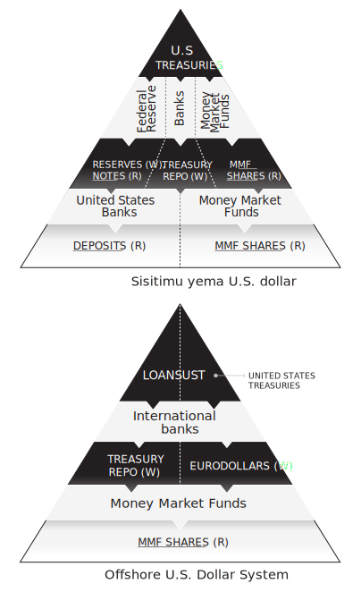

Mufananidzo 13

### Apo Interbank Trust Yakundikana

Long Term Capital Management (LTCM) yaive homwe yehedge yakavambwa muna 1994 ine fambiro mberi huru. Shamwari dzayo dzakapenda mufananidzo wekukwana nerekodhi yavo. Vakarumbidza kubva kubhangi guru reSalomon Brothers rekudyara, iyo Federal Reserve, uye vaisanganisira vaviri veNobel Prize vakahwina economists. Hunyanzvi hwavo hwaive hwekupokana, hwakafanana nekutanga kudzikisa mabhiri ezana ramakore regumi nematanhatu Antwerp pakavakirwa misika yemari. LTCM's yemakwikwi mukana wakasanganiswa mubereko arbitrage, huwandu hukuru hwekuwedzera, uye carte blanche kubva kumabhanga anotungamira ekudyara pasirese. Nekudaro, zvese zvakaguma zvaparara mushure mekunge homwe yacho yakundikana zvinoshamisa mushure memakore mana chete iripo. Mutori wenhau wezvemari wekuAmerica Robert Lowenstein akatumidza bhuku rake nezve kudonha kwekupedzisira kweLTCM muna 1998 Apo Genius Yakakundikana muchidimbu chakakwana. Kuti hedge fund yakatora njodzi yakakura uye yakaenda insolvent chaive chisiri chinhu chitsva, asi kutenderera kwakajairwa kweboom, hype, uye bust. Iyo riveting yakazarurwa kubva mukudonha kweLTCM yaivewo pfuti yekuputa iyo yairatidza zviitiko zve2007 nekupfuura zvaive zvisingadzivisike. Nguva pfupi yapfuura mushure mekunge Federal Reserve yabvisa LTCM bhengi rekudyara mari pamwe nekusunungurwa kweiyo ine mukurumbira wakashata hedge fund pachayo, sachigaro weFederal Reserve Alan Greenspan akaratidzira kubvisirwa sekwakakosha nekuda kwetarisiro yekudonha kwehurongwa hwese hwemari muuchapupu kuUS. Congress:

Nyaya yakanga iri, mukutonga kwedu kwose, kuti mukana \[wokuputsika kwenhevedzano\] wakanga wakakura zvakakwana kutiita kuti tisanzwe takasununguka pamusoro pokusaita chinhu... Kufungidzira kwangu ndekwekuti mukana wacho waive pasi pe50 muzana, asi uchiri wakakura zvekuti unonetsa.

Nekufamba kwenguva uye zviito zvechimbichimbi zvakazotevera zveFederal Reserve ndipo pakatanga kunyura kweGreenspan. Sei?

Mhinduro iri mune zvakatorwa. Kubva pazvibvumirano zvemari zvisingatariswe securities. (Zvichengetedzo zvinotsanangura masheya nemabhondi semuenzaniso, uye zvinobva kune zvinotsanangudza sarudzo dzemasheya, zvibvumirano zveramangwana, nekuchinjana kwemitengo.) Zvigadzirwa zvakatumbuka muma1990s senzira yekuburitsa pachena portfolio kune akatevedzana emhedzisiro, kazhinji kushanduka kwemitengo yemhindu. . Vakanga vari zvikwereti zvebhangi mune imwe nzira itsva, iyo yakanga yakaoma kune vatongi vezvemari kana kunyange hurongwa hwebhangi rose kuti vanzwisise zvizere. Sezvinei kufananidzira zvakadaro, zvakabva pazvisungo zvaivepo sedandemutande rezvisungo zvemari mukati mehurongwa hwebhanga, zvichiisa njodzi muhukama pakati pemabhanga mashoma muUnited States neEurope. Kushevedzera kukuru kwemari kubva kubhangi rekudyara uye mubatanidzwa mukuru weLTCM Bear Stearns munaGunyana 1998 zvakaita kuti pave neruzivo rwekuti zvakabva kuhedge fund zvine simba rekudzikisa imba yese yenjodzi yeinterbank.

Panguva yekubhadhara mari yeLTCM, kukosha kwemusika kwese kwese kwepasi rose kunosanganisira kuchinja kwechimbadzo, kiredhiti default swaps, uye kuchinjanisa mari yekunze yaive madhora mabhiriyoni matatu. Kuenzanisa, huwandu hwese hweUS Treasuries hwaive zvakare madhora matatu emadhora. Pakazosvika 2007, huwandu hwehupfumi hweUnited States hwakawedzera kusvika ku $ 4 trillion asi kukosha kwemusika kwezvinobva kune zvakakosha kwakawedzera kusvika ku $ 11 trillion. Nepo madhora matiririyoni mana ari muTreasuries akamira pamusoro pechinyakare chemakore maviri ekukwereteswa, ukuwo, iyo $11 trillion yakanyura zvisingaite pawaya dzakatetepa uye dziri kupera dzeinterbank trust.

### Kupinda mukusagadzikana

Pasinei nekutsemuka kwehwaro hwepiramidhi yedhora yakaitika mushure mekuregererwa kweLTCM, mibairo yemusika wemari yakaratidza facade yakasimba. US Treasury Bills, Fed Funds, Eurodollar LIBOR, uye Treasury Repo GC mareti ese akateedzana kwemakore. Kusiyanisa kudiki kwaizoitika asi kwaigara kuchiratidzwa semhedzisiro yemwaka kana idiosyncratic zvinhu. Izvo zvese zvaizochinja kutanga muna Nyamavhuvhu 9, 2007. Pazuva iro, LIBOR yakakwira neinogona kuita seyakaomesesa 0.12% maererano nemhuri yese yemitengo yemusika wemari, asi kwaive kutanga kwechimwe chinhu chinoshamisa. Husiku hwapfuura, bhanga reFrance BNP Paribas rakanga risingade kukoshesa zvimwe zvakabva uye kumisa mari yese yaibviswa pamari yaive nemidziyo yezvemari ine chekuita nevakwereta vekuAmerica vane njodzi. Kusavimbika kwakangoerekana kwabata musika weinterbank fund mumavhiki aitevera. Mabhangi aitya kukweretesana mari mune chero nzira nekuti vaive vasina chokwadi chekuti ndeapi mabhanga aizotadza kuvhura zuva raitevera. Nguva yezvisingaperi, inenge isina hanya-yemahara interbank kuratidzwa yakanga yapera, yakatsiviwa nekuchenjerera kwakanyanya uye kutya. Kukwidza piramidhi yedhora kwakanga kwatanga.

Musi waDecember 12, 2007, Federal Reserve yakazomanikidzwa kugadzirisa nzou yegargantuan muimba, iyo yaiva iyo yeEuropean interbank trust uye "peni yebhuku" nzira dzekubhadhara mari yeEurodollar dzakanga dzaputsika. Kupesana muEuropean interbank trust, kunoratidzwa neLIBOR iri kuramba ichikwira, kwaive kukonzeresa piramidhi yese yedhora kutinhira sekudengenyeka kwenyika. Fed yakatanga mitsetse yekuchinjanisa mari yekunze kuEuropean Central Bank neSwiss National Bank kuitira kuti ipe mari kumabhanga ekunze kwenyika, ichifanira kufuratira tsika yekugadzira zvikwereti zvemadhora kunze kweiyo Fed. Basa reFed semukweretesi wezvekupedzisira rakawedzera kupfuura miganhu yayo nekuda kwekuoma kweshanduko yehurongwa hwemari yepasi rose, kwete nekuti basa rayo rakangoerekana rachinja kubva kudzimba kuenda kumutemo wezvemari wepasi rose. Gakava iri harina kunzvenga kana kukwikwidzwa panhaurirano tichifunga kuti hurongwa hwemari hwepasi rose hwakanga huchitsamira paFederal Reserve semukweretesi wekungotora nzvimbo. Idzi shanduko dzekuchinjana dzekunze dzakagadzira imwezve rudzi rwechipiri-layer mari yakaitwa kuti iwanikwe neFederal Reserve chete kune mamwe mabhanga epakati akasarudzwa.

Mukati mekushomeka kwemari yemba yeAmerica muna 2008, dandemutande rakatadza kutorwa rembareti rakatanga kuita kuti zvidimbu zvedhora piramidhi zvipunzike nemhedzisiro isingaperi. Apo bhanga repamusoro rekudyara mari reLehman Brothers rakakundikana musi waGunyana 15, 2008, homwe yemusika wemari inonzi Reserve Primary Fund ine mukurumbira "yakatyora mari" payakaisa mutengo we$0.97 nekuti yaive nemari yakanaka yebepa rekutengesa reLehman Brothers richangobva kupera. Uku kudonha kwemasendi matatu chete kubva par kwakakonzera kushushikana kwemari kwese uko kwakakonzera zviito zvechimbichimbi zvisati zvamboitika kubva kumabhanga makuru nehurumende pasi rese. Chikonzero chekuvhunduka kwaisava kudonha kwemasendi matatu, asi kutya kuti kana Lehman Brothers bepa rekutengesa rinogona kukundikana, uye zvikamu zveReserve Primary Fund hazvina kukosha dhora rose, hapana chaigona kuvimbwa nacho. Ese marudzi ezvikwereti zvebhanga akarasikirwa nemari, uye hurongwa hwemari hwakamira. Nguva yakamira, sezvo pasina aiziva kana mabhanga aizovhura zuva raitevera.

Iyo Fed yakazadzisa basa rayo semukweretesi wekungotora nzvimbo chete nekutanga ruzhinji rwekununura rwakateedzana kudzivirira kudonha kwehurongwa. Hofori hofori yeinishuwarenzi American International Group (AIG) yakagamuchira Fed lifeline musi waGunyana 16 nekuti yakanga yanyora inishuwarenzi panjodzi dzemortgage securities dzakangoerekana dzatadza. Iyo yose yeMoney Market Fund complex yakagamuchira vimbiso kubva kuFed musi waSeptember 19 kuti mitengo yaro yemugove yaizotsigirwa kudzivirira kubvisa kutya. Goldman Sachs naMorgan Stanley vakagamuchira hupenyu hwavo musi waGunyana 22nd mushure mekubvumidzwa kushandura kubva kumabhanga ekudyara kuita makambani ane mabhangi ayo akavapa mukana wakananga kukweretesa yeFed. Saizvozvo, iyo Fed yaive ichiwedzera liquidity kugona kumabhanga makuru epakati pasirese zuva nezuva. Yakanga iri-yese-yekunze capitulation kubva kuFed kudzivirira systemic kudonha.

Kunyangwe iyo Fed ichidzosera imwe neimwe nzira yemari yayaigona, kubviswa kuri kuita zvinhu zvakaderera uye kukwidza piramidhi yedhora kwakaramba kuchienderera. Chinangwa chekutanga cheFederal Reserve System chaive chekupa chikamu chechipiri chemari yakanyungudika kuti ikwanise kumira nekuvhunduka kuhurongwa hwakafanana neiyi. Musi wa25 Mbudzi, iyo Federal Reserve yakange isina imwe sarudzo kunze kwekuzadza hurongwa nematura nekutenga maUS Treasuries, mazhinji awo akange achangobva kupihwa kuitira kuti iwane mari yakashomeka nekuda kwekuderera kwehupfumi, kushaikwa kwemitero, uye kubhadhariswa mari kwemakambani. Kuwedzerwa kukuru kwechipiri-chechipiri mari neFed kwaiva mhinduro kune imwe nzvimbo muhurongwa; yaifanira kusangana nekuparara

kweinterbank trust uye liquidity ine yayo yakavimbika liquidity. Iyo Fed yakaidaidza kuti Quantitative Easing (QE), asi isu tinogona kuidaidza sechipiri-layer kugadzira mari.

Interbank trust yakangoora mumakore mushure medambudziko remari ra2007-2009. Mabhangi akatanga kudzoreredza kuratidzwa kwavo kune mumwe nemumwe mukati mechikamu chechina chegore rega rega kugadzirira kutora kwekupedzisira kwegore. Kusiyanisa mumusika wemari mubereko wemari inopararira-sepaya LIBOR yakapatsanurwa kubva kuFed Funds nemamwe muna Nyamavhuvhu 2007-yakaitika kakawanda, kunyanya pazviitiko zvekarenda sekupera kwekota yega yega uye nguva dzemitero yeUnited States. Kubviswa zvachose kwaizoitika, zvichiratidza kuti mari yaidiwa pane dzimwe nguva mukati megore yakanga isingawanikwi hazvo kune vaya vaiida zvikuru. Liquidity yaive yakarongeka, kutaura zvishoma. Iyo Fed yakanga yadzikisa mutengo wemari uye yakanangana nemhindu ye0%, yakadzora isingazivikanwe yemhando yeEurodollar musika, uye yakagadzira matiririyoni emadhora ematura ekusimbisa mabhengi ekuAmerica, asi chii? Apo Fed yakazoedza kusunungura zviito zvayo zvechimbichimbi makore gare gare, haina kukwanisa kukwidza mhindu pamusoro pe2% pasina kutya kwezvemari kwenguva pfupi kusimudza musoro wayo wakashata zvakare. Iyo Fed yakakurumidza kudzoreredza kosi pakuziva zvakare kusasimba kwedhora. Kudzokera kumisika yemari ine rugare kwakange kusingasvikike, sezvo Fed yakanga yabvisa kuwanikwa kwemitengo kubva muhurongwa nekurambidza akawanda-mhando dzechitatu-mari-mhando kubva pakuona magumo avo.

### Mukweretesi umwe chete

Zvakawanda sezvizhinji zvekubviswa kwemusika wemari muna 2010s, mhosva yekutanga yedambudziko reTreasury Repo munaGunyana 2019 yakaverengerwa kuUnited States mutero wekambani. Rondedzero yenhau dzezvemari yaiti: Migove yeMMF yakatengeswa nemakambani kuitira kuti vabhadhare zvisungo zvavo zvemutero izvo zvaibva zvabvisa Treasury Repo yekukweretesa, asi iyo Treasury Repo liquidity yaizodzoka nekukasira senge mumazuva anotevera zvimwe zviitiko zvekarenda. Musi waGunyana 16, kupararira kweGeneral Collateral kuFed Funds kwakawedzera ne0.10%, asi hapana akabwaira ziso. Mafambiro ehukuru uhu akange ave akajairika mumakore kubva pazuva rine mukurumbira waNyamavhuvhu 2007 apo LIBOR yakave isina kubatana kubva kune yese musika wemari.

Mangwana acho, zvakadaro, aizogara muTreasury Repo mukurumbira. Pakazosvika nguva yemangwanani, Treasury Repo GC mwero wakanyoreswa zvinokatyamadza 8% kupfuura Fed Funds, zvichiratidza kuti bhanga rimwe chete rakabata US Treasury harina kukwanisa kuwana mumwe wekukweretesa mari pachibvumirano chayo cheTreasury. Iyo Federal Reserve yakapindura nechimbichimbi Treasury Repo mari yekuvhiya gare gare zuva iroro, zvichinyatso kudzosera musika wese weTreasury-collateralized kukweretesa. Matanho acho aifanirwa kunge ari echinguvana sezvo mwaka zvinhu zvaive zvechokwadi mhosva, asi hazvina kuita sekudaro. Iyo Fed yakawedzera kuzvipira kwayo kumusika unoshanda weTreasury Repo nekusimbisa chido chayo chekukweretesa pachena kubva kuChibatiso chePfuma kuitira kuti zvakaitika munaGunyana 17, 2019 zvisazoitika zvakare. Mushure mekuchengetedza Eurodollar muna Zvita 2007, Fed yakanga yasunungura imwezve dhora muTreasury Repo ikaita muitiro kubva mukugadzira dhora-mhando dzakarasika. Iyo Fed yakaramba ichitsvaga nzira nyowani dzekugadzira maholesese yechipiri-layer mari kuitira kurwisa kusagadzikana.

Munguva yedenda-rakakonzera dambudziko rezvemari repasi rose raKurume 2020, Federal Reserve yakazivisa dzimwe nzvimbo dzekukweretesa kuti dzienderere mberi kumisa musika weTreasury Repo, Mari yemusika Mari, uye mamwe gumi neshanu ekuwedzera mabhanga ekunze. Kuchengetedza hurongwa kubva kunze kwekubviswa kweUS Treasuries, Fed yakatanga nzvimbo yekukweretesa mari mumusika weTreasury Repo kune masangano ekunze akatenderwa kuitira kuti hurumende idzi nemabhanga epakati asakanganise musika wePfuma kana vakamboda mari: vaigona. tumira Treasuries yavo sechibatiso chakananga kuFed's pawn shop. Kunyangwe hazvo mitengo yePfuma yakakwira mumazuva mashoma ekutanga kwedenda sekuda kusingagumi kwakabuda kwemidziyo yakachengeteka pasirese pakati pekudonha kwemitengo yemasheya nemabhondi emakambani, havana kuramba vasina simba. U.S. Treasuries ine maturities akareba (makore gumi kusvika makumi matatu) akangoerekana arasikirwa nebhidhi kunyangwe yavo yakajairika nzvimbo yekuchengetedzeka nekuda kwemhirizhonga yese mumisika. Nhengo dzeFed dzakatya: musika usiri kushanda wePfuma yaive nzira yenjodzi. Zvakazotevera kwaive kuwanda kwekutenga kweUS Treasury uye kuchengetedza kusikwa neFed izvo zvakaita kuti 2008-2010 Quantitative Easing zvirongwa zvitaridzike senge tsika inomhanya. Fed yakaungana mukupera kwesvondo uye yakazivisa chirongwa chitsva, chisina muganho cheQE chekutenga Treasury pasina chero chakatsanangurwa kuti igadzirise zvese zvinonetsa kuti Fed inogona kurega iyo yakakosha musika wekuchengetedza musika kuwana chero mhirizhonga inogara iripo.

Mari-marudzi pasi rose akanga achirasikirwa nekukwanisa kwavo kurarama vakazvimiririra kubva kuFederal Reserve. Kunyange zvazvo isina kumborasikirwa nechinzvimbo chayo pamusoro pepiramidhi yemari yedhora, Fed ine imwe nhanho yekubudirira yakakwanisa kuvhara simba pamusoro pezvikamu zvaimbova kunze kwekutsvaga kwayo, kunyanya nekuda kwekuti sezvo imwe neimwe yemari-mhando yakapotsa yakundikana, Fed yakapfuura. mukuchengetedza zuva. Hurongwa hwese hwave hunoonekwa zvachose pakutsigirwa kwayo. Asi zvisinei nekusasimba kwehurongwa hwemadhora hwakafumurwa mumakore gumi nemaviri apfuura, dhora rakadzika midzi zvakanyanya sekusimba kwehurongwa hwemari hwepasirese kupfuura nakare kose. Nyika yave kuita kunge yakavharirwa mudhora uye iri kutarisira kuvandudzwa kwemari. Dambudziko rega rega rinoita serikurumidza kupera kupfuura rakamboitika sezvo hurongwa uhu hunoramba husina kusimba.

Tichidzokera kumashure, isu tinofanirwa kunzwisisa kuti sei Fed iri kugadzira iyi yese yechipiri-layer mari muchimiro chekuchengetedza, Treasury Repo kukweretesa, kukweretesa mari yekunze, uye dzimwe nzira dzekubvisa. Inoita izvi nekuti Fed imari yekutengesa mari yakawanda. Kunze kwekunge ichibhururuka boka rezvikopokopo pamusoro pemaguta eAmerica uye inoburitsa makrete echipiri-layer retail money (Fed notes kana cash), haina nzira yekupa mari mukutengesa kwekutengesa kune vanhu. Nzira chete iyo Fed inogona kupa kukurudzira kwemari ndeyekupa mari yehosese painodiwa zvakanyanya mukati mehurongwa hwemari. Iyo Federal Reserve inofanirwa kupa matura, uye parizvino haina mvumo yezvematongerwo enyika yekuburitsa mari yekutengesa mari. Izvi zvinogona kuchinja mune ramangwana uye zvichakurukurwa muChitsauko 9.

Ngano dzekuparara kwedhora hadzina nguva. Nepo nharo dzavo dziine masvomhu merit yakapihwa kuti imarii yakagadzirwa neFed, vanoshaya kubatana kana vachifunga dzimwe nzira. Idhora richiri mari isingaverengeki pasi rose. Hafu yemainvoice ese epasirese akaitwa muUSD kunyangwe hupfumi hweAmerica huchingori gumi neshanu muzana rehupfumi hwenyika. Zvisinei nekutsoropodza kwese kwakakodzera nezve Federal Reserve inoita kunge isingaperi dhora kusikwa, chimiro chedhora sesangano reakaunzi, nzira inosarudzika yekubhadhara kune kutengeserana kwenyika dzese, uye mari yemusika mukuru yemari haina kupfupika pane inotonga. Hutongi hwayo hahukwanisi kupera mumakore akawanda anotevera. U.S. Treasury inoramba iri iyo chete midziyo ine yakasimbiswa musika liquidity uye kudzika kunodiwa kupa zita rengozi-isina asset. Dhora rave remusikirwo zvekuti nzira chete yekuchengeta madhora zvechokwadi nekufamba kwenguva ndeyekuva nehofisi yeU.S Treasuries. Ndosaka madhora achifamba-famba pachikamu chechipiri nechechitatu chemari, asi US Treasury chete inogona kuzvidaidza kuti mari yekutanga mupiramidhi yedhora. Hudzamu uye hupfumi hwemusika weUS Treasury hautarisi danho rekuchengetedza mari mudhora redhinominesheni, ndicho chinhu chega chinoibata pamwe chete nekuda kwekusavimbika kunobva pakuva nemari yakapihwa nebhanga yechitatu.

## Chitsauko 7: Kudzorerwa Kwemari

Mazuva makumi mana nematanhatu mushure mekudonha kweLehman Brothers muna 2008 uye pakati pekuona kwepasirese kwemamiriro ehurongwa hwedhora, bepa jena rine nguva yakatarwa rakatumirwa kunharaunda diki yepamhepo inonzi Cryptography Mailing List. Iro bepa rakanyorerwa nhengo dzeiyo cryptography chirango, kwete iyo yemari, uye saka haina kana kunyoresa seyakakosha kune mari kumashure. Tichitarisa kumashure, zvisinei, isu tinofanira nechiremera kuisa zuva ranhasi, Gumiguru 31, 2008 uye kusikwa kweBitcoin mune rekodhi repamutemo rekushanduka kwemari. Zuva rakakosha kwete chete nekuti bepa rakakurudzira imwe nzira kune yedu yazvino hupfumi hwehupfumi, asiwo nekuda kwezvakazoitika. Bitcoin, chimbo chemari, chave kuwanikwa neinosvika 1% yehuwandu hwepasirese, kana vanhu vangangosvika zana remamiriyoni. Kutsoropodza kwakasimba kwekusimuka kweBitcoin kubva kune vezvematongerwo enyika, vemabhanga, uye nhepfenyuro yezvemari yakaitika pamwe nekuwedzera kwekuwedzera kwevashandisi vayo uye kukosha kwemusika. Kusvika kweBitcoin, kukura, uye simba rekugara zvino kunopa maonero akatendeseka, akanyatsoongororwa, uye akazara eiyi tekinoroji nyowani yemari. Panzvimbo yekudzinga Bitcoin semari isingadzorerwe uye isina kutsigirwa, isu tinofanirwa kuedza kunzwisisa kuti nei chaizvo Bitcoin yakaunganidza nzvimbo yakadaro yekutarisisa uye kukosha kwemusika. Mumakore gumi nemaviri chete, yakatotora inenge 6% yegoridhe rose kukosha kwemusika kunyangwe goridhe rakati wandei-makore kutanga musoro.

Munzvimbo yesainzi yemari, Bitcoin mupambi wekunze. Izvo hazvifananidzi chero chinhu chakauya pamberi payo nekuti inovimba zvakanyanya nehunyanzvi hwekuvandudza tekinoroji yehafu yezana ramakore rapfuura. Nzvimbo yesainzi yekombuta inonzi applied cryptography yakapinda muhurongwa hwemari ichibva yavhundutsa. Kupinda uku kunoramba kuchidzoka negore rega rega rekukura kweBitcoin mupfungwa. Kana tikatarisa kumashure kwakabva Bitcoin kuburikidza nelenzi yebhuku iri, tinogona kuona kuti mari nyowani yekutanga-yakatanga kugadzirwa uye kuti mari necryptography sainzi dzakabatana. Kubatana kwangove iko zvino, makore gumi nemaviri mushure mekusikwa kweBitcoin, kugamuchirwa sechirango chemari. Tisati tafungidzira kuti ichaita sei, tinofanira kunzwisisa kwakabva Bitcoin, nhoroondo yekutanga, uye kushanduka kwepiramidhi yemari yayo.

### Satoshi Nakamoto ne Bitcoin Bepa Jena

Pepa rakabudiswa muna Gumiguru 31, 2008 rakashandura nyika yemari zvachose rakanyorwa naSatoshi Nakamoto. Kusazivikanwa uye zvakavanzika zvakatenderedza Satoshi persona uye zvake, iye, kana zvinyorwa zvavo. Musiki anoramba asingazivikanwe kunyangwe izvozvi, chimwe chinhu chinosimbisa kusarerekera kweBitcoin, sezvo pasina mutungamiriri aripo ane simba rakawandisa, anogona kumanikidzwa kana kuvharirwa, kana kuedza kushandura mitemo yeBitcoin. Kukosha kwekuzivikanwa kwemugadziri iko zvino hahuna maturo, asi hachiri kuderedza kunyengedza kwekusava nechiso; Satoshi aizotumira tsamba yake yekupedzisira inozivikanwa muna Kubvumbi 2011 uye akanyangarika kubva paInternet zvachose. Ngano uye ngano yaSatoshi ichaita firimu rinokatyamadza rimwe zuva, asi software yaakagadzira yakashandura zvachose pfungwa yemari. Mutsara wekutanga wepepa raSatoshi Nakamoto "Bitcoin: Peer-to-Peer Electronic Cash System" yakaverenga:

Kungofanana nevezera-kune-vezera vhezheni yemari yemagetsi yaizobvumira kubhadhara kwepamhepo kuti kutumirwe zvakananga kubva kune rimwe bato kuenda kune rimwe pasina kuenda kuburikidza nesangano rezvemari.

Mari inofambiswa yepamhepo pasina masangano emari yaireva kurongeka, asi sei, uye nemitemo ipi? Mari chete inogamuchirwa pasi rose uye isina kwayakarerekera isingavimbi nesangano rezvemari igoridhe. Chinhu chinonyanya kufadza chekugadzira kwaSatoshi kweBitcoin chaive chinangwa chake chekuti itevedzere goridhe seyekutanga-layer, mari isina bato. Uye izvo zvaireva kugovera kusingabvi kubva pabharanzi. Bepa raSatoshi rakavakirwa pahwaro uye neakawanda anogamuchirwa cryptography zvidhinha zvinove zviri pamutemo pfungwa yake pakati pedzimwe nhengo dzeCryptography Mailing List.

### Kutsanangura Bitcoin

Izwi rekuti "Bitcoin" rinoreva zviri pamutemo zvinhu zviviri, (1) Bitcoin software protocol uye (2) chikamu chemari mukati meiyo software. Mubhuku rino, tichanongedzera kuchikamu chemari seBTC mumutsauko kubva kune software pachayo. Bitcoin, iyo software protocol, seti yemitemo. Inoshandisa mauto-giredhi encryption algorithm inonzi Secure Hash Algorithm 2 (SHA2), yakatanga kubudiswa neU.S. bazi rehungwaru muna 2001. Kushandiswa kweSHA2 kunoonekwa kwakachengeteka zvekuti inonyatso kudiwa nemutemo mukati menzvimbo dzehurumende dzinobata ruzivo rwakanyanya. Dhizaini yeBitcoin inosanganisa SHA2 nemitemo ine hungwaru inoyevedza zvekuti inokwanisa kubatanidza zvivakwa zvemari zvegoridhe munyika yedhijitari. Pazasi, iyo cryptography yakashandiswa naSatoshi yakaratidza uye yakachengeteka. Iyi mitemo yehungwaru yakavaka nzira yekubatanidza yaakadana kuti "cheni yezvivharo," asi nyika yaizosvika pakuidaidza kuti Bitcoin's blockchain.

### Saenzi dzemaComputer

Tisati tanyura mune chaiyo hunyanzvi hutsva hweBitcoin's blockchain yakaita kuti ive yakabudirira mari yedhijitari, isu tinofanirwa kubvuma kuti kunzwisisa Bitcoin padanho rehunyanzvi kunoda hunyanzvi hwesainzi yekombuta. Mabhuku ezvinyorwa akanyorwa paBitcoin software, izere nehurongwa hwedanho-danho pane ese makuru makuru eBitcoin anosanganisira makiyi, kero, wallet, kutengeserana, uye migodhi. Muzvitsauko zviviri zvinotevera, tichakurukura uye kutsanangura zvikamu izvi, asi kune avo vanoda ruzivo rwakanyanya mune inopenya cryptography kuseri kweBitcoin software, tanga ne "Mastering Bitcoin" naAndreas Antonopoulos. Yakanyorwa nenzira inosvikika kunyange kune avo vasina simba rakasimba resayenzi yekombiyuta asi vanoda kuziva nezvemitemo inoita kuti Bitcoin ishande. Kune vamwe vese, nzwisisa kuti mitemo yeBitcoin inoita kuti ive mari yedhijitari yakavimbika zvakanyanya nenzira imwechete iyo vanhu vanovimba neemail yekukurukurirana kwedhijitari. Vanogona kunge vasingazive kuti zvinoshanda sei, asi zvinoita.

### Inobatsira hurongwa hwe Bitcoin

Ngatitangei tiongorore matatu ekutanga madimikira eBitcoin: goridhe, nyika, uye email.

BTC igoridhe redhijitari. Icho chimiro chemari. Vanhu vanovimba neBTC nekuti vanotenda kuti isingawanzo uye yakakosha nenzira yakafanana nenzira iyo vanhu kwemireniyumu vakaisa kutenda kwavo mugoridhe. Ine mutengo mumazana emari dzakasiyana, sezvinoita goridhe. Uye zvinotonyanya kukosha, hazvibvi pachiyero chesangano rezvemari, sezvinoita goridhe risingaiti. Goridhe neBTC ese ari maviri-emahara midziyo. Tichava nemukana wekukwevera kuenzanisa kwakanyanya kune goridhe mukati mebhuku rose.

BTC inyika yedhijitari. Kune chete 57 miriyoni masikweya mamaira epasi paNyika. Saizvozvowo, pachava nemamiriyoni makumi maviri nemaviri eBTC chete. Nechemumoyo, iyi nyika yedhijitari inopatsanurwa kuita diki diki repasuru. Mark Twain akamboti "tenga ivhu, havasi kuzozviita" kuti vatsigire mari mune zveimba, uye BTC inogona kufungidzirwa nenzira imwecheteyo. BTC ishoma, zvakangofanana nehuwandu hwepasi paNyika. Tichaongorora kuti rinowana sei kushomeka munguva pfupi, asi sezvo vanhu vazhinji vachifamba kubva pamapaundi eBritish, yen yeJapan, nemadhora ekuU.S. kuenda kunyika yeBitcoin, iyi nyika yedhijitari inozongooma kuwana nemitengo iripo. Tinogona kufananidza kukwira kwemutengo weBTC nekutora ivhu uye kutsanangura kuwedzera kwayo kwekuwedzera kwemutengo wemusika uye kugamuchirwa segirazi reInternet muma1990s. Mutengo wechidimbu cheBitcoin pie wakakwira zvishoma nezvishoma pamusoro penguva refu nekuti vanhu vari kuiita senge prime real estate. Iko hakuna muchengeti wegedhi muBitcoin realm, zvichiita kuti munhu wese ave muridzi wezvivakwa. Huridzi huchawedzera kudhura sezvo nyika yayo inowedzera kuwanda; kana vanhu vachinge vanzwisisa kuvandudzwa kwemari kuri kuitika, kutya kwekupotsa kunenge kwanyanya.

Pakupedzisira, Bitcoin inoshanda zvakafanana kune email. Iwe unogona kusanzwisisa komputa sainzi kuseri kwemashandiro ayo, asi chiitiko chekutanga chekutumira uye kugamuchira email chiitiko chepasirese. Kero dzeemail dzinogona kugovaniswa chero ani zvake, asi chete ane password anogona kuwana mameseji anogamuchirwa. Bitcoin inoshanda nenzira yakafanana. Unogona kugovera kero yako yeBitcoin nemunhu wese anokutumira mari, asi chete nepassword yako, inonzi kiyi yakavanzika, unogona kuipedza. Email iprotocol yekutumira uye kugamuchira data; zita rayo repamutemo iSimple Mail Transfer Protocol (SMTP). Bitcoin zvakare iprotocol, asi kutumira uye kugamuchira kukosha panzvimbo yedata.

### Blockchain ne Bitcoin Mining

Chii chinoita kuti Bitcoin ifanane negoridhe, hupfumi hwevanhu hunonyanya kuratidzwa mari? Mhinduro iri mumitemo yeBitcoin protocol.

Iyo Bitcoin blockchain inonyanya kutsanangura rekodhi yekutengeserana panguva imwe chete inochengetwa nevezera vese mune network. Kuti tinyatso kutsanangura mabhuroko nemaketani, ngatitangei tinyure zvishoma muizwi peer. Mumashoko eBitcoin, chero munhu anogona kuve wezera rake nekushandisa Bitcoin node, inova mudziyo wekombuta unomhanyisa Bitcoin software. Vaya chete vanoshanda neBitcoin node ndivo vari kuishandisa nenzira isingavimbike zvachose, zvichireva kuti vari kungovimba nesoftware yavo kuti vaone kugadzirisa kweBTC transactions (kusavimbika kunogona kunzi kwakapesana ne "kuva nenjodzi yevamwe"). Ivo havasi kupa kune chero bhangi, shanduko, kana software kambani. Mashiripiti eBitcoin nderekuti munhu wese ari munyika anogona kuve wezera uye oshandisa software inobvumira kutora chikamu mune yepasi rose mari network. Vanhu vazhinji vanovimba neimwe nzira yemupi wekudyidzana neBitcoin zvisinei, senge smartphone zvikumbiro zvewallet uye kuchinjana kwekutengesa uye kuchengetwa. Wallet uye kuchinjana kwakafanana nemabhanga eBitcoin indasitiri; sezvo vanhu vanoverenga mabhanga kuti vabatane neUSD yavo kana mari yepamba, vanhu vanovimba nemakambani echikwama uye kugoverana kuti vabatane neBTC yavo. Asi ivo havafanirwe kudaro, uye ndizvo zvinoita kuti Bitcoin ive nesimba. Chero ani ane komputa neInternet anogona kutengeserana pasi rose pasina kutsamira kune chero kambani, hurumende, kana mubatanidzwa. Kushandisa Bitcoin software kunofanira kuitwa chete nevanhu vane hunyanzvi hwepamusoro, uye saka vazhinji vanovimba nevega vega kune iyo hunyanzvi.

Iye zvino tinogona kutsanangura mabhuroko. Chivharo seti yedata inosanganisira iyo isina kugadzikana Bitcoin transaction iyo vanhu vari kuyedza kupedzisa. Izvi zvekutengeserana zvinogona kutorwa semaemail akatumirwa asi asati agamuchirwa, kana aripo chete mucyberspace. Mabhuroki anosungwa pamwe chete uye kutengeserana kusina kugadzikana kunosimbiswa kana chivharo chacherwa. Asi chii chaizvo chiri kuchera?

Sezvinongoita vacheri vegoridhe vanopedza simba rekuchera goridhe kubva muPasi, vashandi veBitcoin, vezera ravo vanokwikwidzana pamusoro pekupa kutsva kweBTC, vanoshandisa simba rinovapa mari mukati meBitcoin software. Bitcoin miners vanopihwa BTC pavanowana nhamba isina kurongeka; funga nezvayo serotari yekuverenga. Kuti vawane nhamba iyoyo, vanoita matiririyoni ekuverenga sekondi yega yega. Izvi zvinoita kuti Bitcoin migodhi ingangoita imwe hofori isingaverengeki-nhamba mutambo, uye chete anokurumidza uye ane simba makomputa anogona kukwikwidza mumutambo umo computational guessing inonyanya kukoshesa. Mumazuva ekutanga eBitcoin network, BTC yaigona kucherwa zvakabudirira nemunhu wese aishandisa avhareji laptop. Nhasi, ma supercomputers anoshanda zvakanyanya anonzi ASICs (application-specific integrated circuits) anodiwa kuti abudirire kuchera BTC. Unyanzvi hwehunyanzvi hahuna kufanirwa kupihwa; magetsi, maASIC, uye software zvinopa chero ani zvake mukana wekutora chikamu mukuita kweBTC yekusuma sumo. Vacheri vemigodhi vanokurudzirwa mune zvemari; vanopihwa BTC nekuda kwemabasa avo avanogona kuchengeta kana kuchinjana nemari yemuno. Ivo vanobatsira kuita kuti network yeBitcoin ive yakachengeteka nekutsaura mafungu esimba uye simba rekombuta pakuwedzera mabhuraki kumaketani. Aya mafungu emvura anowanzo kunzi hashpower, aine izwi rekuti "hash" rinobva kuSecure Hash Algorithm 2 (SHA2) inoshandiswa neBitcoin software yekunyorera. Kucherwa kweBitcoin kunonziwo kuita humbowo-hwebasa, hwakatangwa Bitcoin isati yatanga muna 2002 nemunyori wemifananidzo Adam Back, ane Ph.D. mune sainzi yekombuta kubva kuYunivhesiti yeExeter. Satoshi Nakamoto anotora Kare mubepa rake jena uye anogadzika kwakawanda kwekuvimbika kweBitcoin pakushandisa humbowo-hwe-basa, tekinoroji yakapupurirwa ne2008. Humbowo-hwebasa muBitcoin hwakafanana nekuchera goridhe sezvakataurwa muBitcoin bepa chena:

Kuwedzerwa kwakasimba kwehuwandu hunogara huchiitwa hwemari itsva kwakafanana nevacheri vegoridhe vari kushandisa zviwanikwa kuwedzera goridhe kutenderera.

Usaite chikanganiso, ichi hachisi chekufananidza. Satoshi Nakamoto aive nemaune zvakanyanya mukugadzirwa kweBitcoin; yaiitirwa kutevedzera goridhe nekuti goridhe ndiyo nhoroondo inogara isingaite mari yepasirese. Kutsvaga goridhe hakuna kudhura kana nyore; inoda simba, sezvinoita kuwana BTC. Kamwe mucheri akabudirira kuchera bhuroko uye anohwina BTC somugumisiro, bhuroko rinova update kuBitcoin yakagovaniswa kutengeserana ledger kuitira kuti vezera rimwe nerimwe mumambure ane kunzwisisa ichangoburwa kuti Bitcoin kero akabatana chaizvo sei BTC.

Mabhuroki anosungwa pamwe chete panguva iyi yekusiya rekodhi rekodhi, iyo Bitcoin blockchain, kuti vese vezera vapupure. Izwi rekuti blockchain rakura mukuzivikanwa, asi yakagovaniswa ledger tekinoroji inzira iri nyore yekutsanangura chimiro chetiweki umo vese vezera vanochengeta ledger, kana rekodhi rekutengesa. Nechikonzero ichi, izwi rekuti Distributed Ledger Technology (DLT) rakagamuchirwa nemadhipatimendi epakati ekubhengi ekutsvagisa kutsanangura software inotevedzera Bitcoin yekutanga yakagoverwa ledger dhizaini.

Yakawanda sei BTC inopihwa nemugodhi paanobudirira kuchera bhuroko, uye ndiani akatsunga kupihwa kweBTC? Chikamu chinotevera chekugadzira kwakadzama kwaSatoshi chiri muBitcoin's monetary policy, kana mitemo yakapoteredza kupihwa kweBTC uye kuti inovapo sei. Haina kugadzwa nevanhu muboardroom yebhangi repakati, Bitcoin's monetary policy is algorithm yakarongwa naSatoshi muna 2008 kuti ijekese hurongwa hwayo hwekuburitsa kusvika nekusingaperi. Mitemo yekupa yaive yakabatana, yakanaka, uye yakarurama. Vainzwa zvakanaka kune vekutanga vatori vechikamu mumambure. Kwekutanga 210,000 zvidhinha (kana makore angangoita mana) ekuvapo kweBitcoin, 50 BTC yakapihwa kune akabudirira mugodhi webhuroko rega rega. Pamabhuraki e210,000 anotevera, mubairo wakawira ku25 BTC per block. Imwe neimwe inopfuura 210,000 zvidhinha, mubairo wemigodhi unodzikira zvakare. Imwe neimwe yenguva idzi, kana nguva yenguva yekupedzisa chikamu chega chega cheBitcoin chekuburitsa (210,000 blocks kana ~ 4 makore), ratidza kuti mutemo weBitcoin wemari wakaiswa sei mudombo, kwete kukwikwidza mumahoro uye teleconferences emabhangi epakati. Bitcoin parizvino iri muchikamu chechina nemubairo wemigodhi wakamira pa6.25 BTC pabhuroka, iyo inokosheswa kupfuura $200,000 nhasi. Satoshi akaronga hurongwa hwekugovera nzira yose kusvika mubairo wekupedzisira weblock unofungidzirwa kuitika kwezana remakore kubva zvino muna 2140. Sei akasarudza mamiriyoni makumi maviri nerimwe seBTC yekupedzisira kana 210,000 block epochs zvichida zvicharamba zvisinganzwisisike, asi chimwe chinhu pamusoro pemasvomhu chaiwo. zvese izvi zvaikwezva vanhu zvakanyanya. Iko kushomeka chaiko kwakatsanangurwa pakutanga kwekuvapo kweBitcoin hakungove chinhu chinokatyamadza. Chinofadza ndechekuti wese anotora chikamu munetiweki akabatana akaitenderedza uye inosanganisirwa hurongwa hwekugovera mitemo kugadzira kubvumirana kwechokwadi nezveBitcoin. Kushaikwa kwayo uye mitemo yakaichengetedza haina kungoramba ichienderera mberi, asi yakakurumidza kunyorwa mumatombo.

The Bitcoin protocol mandates kuti zvidhinha kuitika paavhareji maminitsi gumi kure, asi nguva chaiyo pakati zvidhinha anogona kutora masekonzi kana maawa zvichienderana sei zvinotora mugodhi kuhwina imwe neimwe tsumo BTC rotari. Iyo algorithm inogadzirisa iyo computational lottery mavhiki maviri ega ega kuita kuti zvivharo zviitike paavhareji maminetsi gumi zvakaparadzana, inonzi kuomerwa kwekugadzirisa, yakagadzirwa naSatoshi Nakamoto uye yave ichishanda sewachi yekuvapo kwese kweBitcoin. Hapana wezera rimwe chete ane simba pamusoro peiyo automated yakaoma kugadzirisa. Iyo yakaoma kugadzirisa algorithm inoonekwa isingabatike nevashandisi veBitcoin uye vanogadzira software nhasi nekuti ndiyo imwe yezvivakwa zveBitcoin zvinoita kuti ive isina kwayakarerekera uye inopokana nekutonga kwepakati. Iine epamusoro migodhi ASICs, mucheri anogona kuhwina chikamu chekunze chemubairo weblock, asi pakupedzisira Bitcoin inozvidzivirira pakuvandudzwa kwesimba rekugadzirisa komputa nekudzikisa zvishoma nezvishoma zvakanakira kure. Kuwedzera nguva dzose mukuita basa rekuomerwa kwemigodhi seimwe yeBitcoin yekuchengetedza nzira, kudzivirira makombiyuta emazuva ano anokurumidza kutiza ne block mibairo uye kutyaira hunyanzvi mukugadzira komputa chip. Mitemo yakatenderedza kupihwa kweBitcoin yave tamper-proof, isingaori, uye chiyero chitsva chegoridhe chekushomeka kwemari. Mhedzisiro yeBitcoin yakasarudzika uye inopenya yekutonga seti inyaya yemhando yemari. Nerazor chaiyo uye software yemahara, munhu anogona kuyera chaizvo kuti kashoma sei chibvumirano chake cheBTC chero nguva.

### Tumira uye Gamuchira

Iyo yekupedzisira tekinoroji chikamu chekunzwisisa nezveBitcoin hukama pakati pekiyi nemakero uye kuti vezera vanotumira nekugamuchira sei BTC. Kero, iyo inoshandiswa kugamuchira BTC, inogadzirwa kubva kunhamba dzinonzi private keys. Izvi zvinoreva kuti kuve neBTC pachayo ndiko kuve nenhamba. Makiyi epachivande ane 256-character binary tambo, seizvi:

```
11011010010001101011010101011001100100100001101100111110100101010101101110110001100100100101110010010 1100100101011000101110000111011001111010111001011111111110110111111001101110100011101101010000101100100 1011000011100111001110010110000000100111101101100101
```

Nhamba idzi dzinogona kuchengetwa mumashandisirwo e-smartphone anonzi wallet, pamidziyo yakatsaurwa yendangariro inonzi hardware wallet, inongonyorwa pasi pabepa, kana kutaura chokwadi munzira ipi neipi yaunogona kuchengeta nhamba. Makiyi epachivande anoburitsa kero inoshandiswa kugamuchira BTC, asi kero haigone kudzoserwa kumashure kuti iratidze kiyi yakavanzika kuseri kwayo, nekuda kweSHA2 encryption tekinoroji. Bitcoin kero dzinotaridzika seizvi:

32bp4f8zjbA8Bzm3TiAq5jav3DsU4LPSQR

Ndizvozvo: makiyi akavanzika (kutumira) uye kero (gamuchira). BTC inogona kutumirwa kutenderedza netiweki mushure mekucherwa pasina chero yepakati router kubvumidza kana kuongorora kutengeserana. Chero vezera mune network neBitcoin software vanogona kutumira, kugamuchira, uye kuongorora kutengeserana, asi hapana wezera rimwe chete anogona kudzivirira kuti zvisaitike. Ziva kuti vanhu vanoshandisa chikwama che smartphone havadi iyo yakazara Bitcoin software kuitira kuti iite muBTC; zvikwama zvinobvumira vanhu kuti vazvichengete vega BTC makiyi akavanzika asi vanovimba nevechitatu-bato node kudzorera kutengeserana kunetiweki kana isina kushandiswa tandem neBitcoin node.

### Sangano Idzva

Munzvimbo yedhijitari, software yeBitcoin inofambisa uye inobvisa zvese zvekutengesa mukati mesangano rayo. Inoshanda sebhangi repakati kubva pakuona kwekugadzirisa, chete panzvimbo yepakati, software iri chero kupi kweBitcoin nodes iripo. Kuvandudzwa kweBitcoin kwakagadzira dhinominesheni nyowani uye zvivakwa zvekubhadhara, zvinodzorwa nemunhu. Kubhadhara kwedhijitari kwakange kwatove kwose kwose ne2009 nekushandiswa kwakapararira kwekubhadhara kadhi rechikwereti yepamhepo, PayPal, uye mamwe maapplication ekubhadhara e-smartphone anoshandiswa kushandura madhipoziti ebhangi rechitatu. Asi kusvika Bitcoin, hapana munhu anga afunga nzira yekutevedzera mari uye kugadzirisa kwekupedzisira pane yekutanga chikamu chemari pasina kushandisa chepakati. Sezvo dhinomisheni yemari yeInternet, hurongwa hwekubhadhara, uye goridhe redhijitari zvese zvakakungurutswa kuita imwe, Bitcoin yakava simba rekuverengerwa pakutanga kwazvo kuvapo kwayo. Zviri pachena kuti ndiko kwaive kubudirira kwemari kwakakosha kubva pakaitwa goridhe makore anoda kusvika zviuru zvitatu zvapfuura: kushomeka, ane chokwadi nemasvomhu, akasununguka uye akavhurika kushandiswa, uye asinganetsi kukara.

Vagadziri vemitemo pasi rose vanofanirwa kuteerera chirevo chesangano idzva remari. United States of America inonyanya kudada nerusununguko rwayo rwekutaura, uye mabatiro ayo tekinoroji itsva iyi yemari haifanirwe kunge yakasiyana. Bitcoin imhando yekutaura: vanhu vanofanirwa kubvumidzwa kutumira meseji (kutumira BTC transaction) vakasununguka sezvavanokwanisa kutumira email. Bitcoin isoftware yenhamba, uye chero kuedza kurambidza kana kurambidza kushandiswa kweBitcoin nehurumende kungave kurambidzwa kana kurambidzwa pasvomhu pachadzo. IUnited States judicial system yakatogadzira chirevo chekuti kushandiswa kwekunyorera chinhu chinodiwa kuchengetedza kutaura kwemahara munguva yedhijitari, uye iwowo mazano anofanirwa kushandiswa kuBitcoin mumakona ese epasi anodada nerusununguko rwayo. vagari venyika. Heunoi mutongo wa1999 weUnited States Court of Appeals, Ninth Circuit (Bernstein v. United States), unosimbisa kuti encryption, semasvomhu, iratidzirwo yepfungwa dzesainzi uye naizvozvo chimiro chekutaura:

MaCryptographers anoshandisa kodhi kodhi kuratidza pfungwa dzavo dzesainzi nenzira imwechete iyo nyanzvi dzemasvomhu dzinoshandisa equation kana economists vanoshandisa magirafu. Ehe, ese ari maviri equation yemasvomhu uye magirafu anoshandiswa mune mamwe minda nekuda kwezvinangwa zvakawanda, kwete ese ayo anoratidza. Asi nyanzvi dzemasvomhu nenyanzvi dzezvehupfumi dzakatora nzira dzekutaura idzi kuitira kuti dzigone kugonesa kutaura chaiko uye kwakasimba kwepfungwa dzakaoma dzesainzi. Saizvozvo, iyo isingarambidzwe rekodhi pano inojekesa kuti cryptographers vanoshandisa kodhi kodhi nenzira imwecheteyo. Tichifunga nezveizvi, tinogumisa kuti encryption software, mune yayo kodhi kodhi fomu uye seyakashandiswa neavo vari mundima yecryptography, inofanirwa kutariswa seyakajeka kune yekutanga Amendment zvinangwa.

### Kutenga Kofi neBitcoin

Iyo Bitcoin transaction settlement process inoenderana panguva imwe chete uye haina kurongeka zvakanyanya. Ngatitarisei muenzaniso weumwe munhu ari kuedza kushandisa BTC kutenga. Mumwe mukadzi anopinda mucafe

kunotenga kapu yekofi. Iyo cafe inogamuchira BTC sekubhadhara uye inobhadharisa 15,000 sats (0.00015 BTC, kana inenge $5) yekofi. Mukadzi anobhadhara neBitcoin wallet pa smartphone yake, asi kutengeserana hakuna kusimbiswa kusvika yacherwa mubhuroko nemugodhi weBitcoin. Vashandi veparesitorendi vachaita kuti mukadzi amirire maminitsi gumi kusvikira vamupa kofi here? Ko kana, nekuti migodhi ingori nzira, iyo inotevera block haina kucherwa kweawa? Iyo cafe ine sarudzo mbiri. Inogona kubvuma kutengeserana kusina kusimbiswa kwemukadzi, asi hazvizokwanisi kuvimba nemari yaakagamuchira kusvikira chivharo chinotevera chichicherwa (Bitcoin's shared ledger haisati yavandudzwa nekofi yekutengesa). Kune rimwe divi, iyo cafe inogona kusimbirira kutengeserana kuwedzerwa kuBitcoin blockchain isati yapa mukombe wekofi. Iyi itarisiro isingagoneki zvachose uye yakatungamira kune kushandiswa zvakanyanya, kunyangwe zvisizvo, kushoropodzwa kweBitcoin: network inononoka kushanda nemazvo senge svikiro rekutengesa. Muchokwadi, yekutanga-layer Bitcoin transactions haina kugadzirirwa kutengeserana nekukurumidza; dzakagadzirirwa kuchengetedza network yese yepasirese yevezera muchibvumirano chisingaperi pane chimiro cheBitcoin ledger. Zvakangodaro, Bitcoin yaizopedzisira yadurura moniker yayo senge inononoka network makore gare gare nekuuya kwemheni Network, inokurukurwa muchitsauko chinotevera.

Kana Bitcoin isingashandiswe kutenga kofi, inonyanyo shandiswa chii? Bitcoin inonyanya kushandiswa zvakanyanya nevanhu vanofarira nzira isina kwayakarerekera, isina bato yekuchengetedza mari. Ngatipei muenzaniso wemunhu anonyanya kusimbaradzwa neBitcoin tekinoroji. Fungidzira mumwe mukadzi wechiduku muNigeria. Anogara kumaruwa uye ane tarenda remifananidzo. Kana akakwanisa kuwana basa rekuzvimiririra pamhepo, anogona kuwana mari kumhuri yake. Asi angashandisa sei nzira dzechinyakare dzokubhadhara kuti agamuchire mari? Haakwanise kuwana akaundi yekubhangi uye haakwanise kugamuchira mari mutsamba inotumirwa nemutumwa wekune dzimwe nyika. Bitcoin ndiyo chaiyo sarudzo yake yakanakisa. Achishandisa smartphone wallet, anogona kuzvigadzirira kero yeBTC, oitumira kune mutengi muZurich, uye ogamuchira mubhadharo. Haana basa nazvo kuti kutengeserana kunotora maminitsi gumi maminitsi ekusimbisa; pasina Bitcoin haaizokwanisa kuwana zvachose. Nemuenzaniso wakaita seuyu, tinogona kuona chaizvo kupa simba tekinoroji Bitcoin chaizvo. Vanhu vekuUnited States neEurope vakatenga BTC zvakanyanya nekuda kwezvikonzero zvekufungidzira vangave vari kukonzera kutorwa kwepasi rose nekutsigira kukura kwemusika kukosha, asi vanhu vari muLatin America, Africa, uye Middle East vane mari dzemuno dzisina chokwadi uye maindasitiri asingavimbike emabhangi anotoda kuti pave nemutengo wakaderera. mari isina kwayakarerekera uye yedhijitari yakadai seBitcoin.

### Chinangwa chaSatoshi

Chii chaizvo chaiedza Satoshi Nakamoto kuzadzisa neBitcoin? Nekuda kweizvozvo, isu tinofanirwa kunyura mune zvinyorwa zvake uye netsamba mumazuva ekutanga eBitcoin network. Aive neshungu dzekupa imwe nzira kwete kumasangano emari chete, asiwo kune mari dzinowanzo deredzwa nehurumende nemabhanga epakati, chinangwa chiri pachena kubva kumaemail ake ekutanga uye maforamu. Musi waNdira 3, 2009, yekutanga Bitcoin block yakambocherwa naSatoshi pachake yaisanganisira meseji yakamisikidzwa pachinzvimbo chekutengeserana (sezvo pakanga pasati pavepo):

> The Times 03/Jan/2009 Chancellor ari kumucheto kwechipiri chekubhadhara mari kumabhanga

Satoshi akaisa musoro webepanhau reBritish nezvedambudziko remari ririkuenderera mberi rakananga murekodhi rekodhi. Nekumisikidza iyi meseji yakavanzika, akafungidzira kuti hurongwa hwake hwemari nekutengeserana hwakapa shanduko inodiwa uye mhinduro inogoneka kune bheilout-inotarirwa hurongwa hwebhanga hwepasirese.

Mushure mekunge Bitcoin yatanga uye ichimhanya kwemavhiki mashoma, Satoshi akapa rumwe ruzivo rwezvekurudziro yake yepurojekiti uye akaratidza ruzivo rwakadzama rwekusagadzikana kwemaitiro emari yechikwereti uye yakaderera, yakachengetwa zvikamu zvepiramidhi yemari:

Dambudziko remidzi nemari yakajairika kuvimba kwese kunodiwa kuti ishande. Bhangi repakati rinofanira kuvimbwa kuti risadzikisire mari, asi nhoroondo yefiat currencies izere nekutyorwa kwekuvimba ikoko. Mabhangi anofanirwa kuvimbwa kuti achabata mari yedu nekuiendesa nemagetsi, asi ivo vanoikweretesa mumafungu echikwereti mabhubhu asina chidimbu chakachengetwa.

Satoshi Nakamoto akaburitsa shuviro yake yekuti BTC ivepo sesangano remari, kwete chete network yekubhadhara. Akataura fiat currencies kureva mari dzakaburitswa pachikamu chechipiri chemari nemabhanga epakati, zvisinei nekuti chii chiripo pane yekutanga; Shoko rokuti fiat pakutanga rinoreva "nechirevo" muchiLatin. Kushoropodza kwaSatoshi mari yefiat kwakaratidza kuziva kusamira zvakanaka kuri mukati mehurongwa hwedu hwakachengeterwa mari. Mukutarisa, kushoropodzwa kunoratidzika kunge kwakamukurudzira kugadzira Bitcoin. Zvichida mugadziri aida kupa nyika mari itsva-yekutanga iyo isina kubva mubhadhareti yebhangi guru.

### Zviratidzo zvekururikidzana kwe Bitcoin

Wekutanga mutsigiri weBitcoin mushure meSatoshi Nakamoto aive cryptographer Hal Finney. Pamberi pekusikwa kweBitcoin uye kuvaka pahwaro hwakaiswa naAdam Back, Finney akafambisa kushandiswa kwehumbowo-hwe-basa kuburikidza nekugadzira reusable proof-of-work system inoshandiswa naSatoshi Nakamoto mukugadzirwa kwepurogiramu yake; Mupiro waFinney kuBitcoin wakasimwa kunyange asati ava mushandisi weBitcoin. Finney aive wekutanga uye aifarira zvikuru Satoshi. Akanga ari mupi wekutanga kweBitcoin transaction, apo Satoshi akamutumira 10 BTC musi waJanuary 12, 2009. Bitcoin yaiva nemazuva mapfumbamwe, uye BTC yakanga isina mutengo kana kukosha kwemusika kutaura.

Muna 2010, Finney akapa tsananguro inonakidza yekuti mari yeBitcoin inogona kushanduka sei, fungidziro isati yasvika. Zvaakataura zvinoita sekunge yaive tsika yakanyorerwa bhuku iri:

Chaizvoizvo pane chikonzero chakanaka chekuti mabhangi anotsigirwa neBitcoin avepo, achiburitsa mari yavo yedhijitari, inogona kuregererwa kuma bitcoins. Bitcoin pachayo haigone kukwira kuita kuti kutengeserana kwese kwemari munyika kufambiswe kune wese munhu uye kusanganisirwa mu block chain. Panofanirwa kuve nedanho rechipiri rekubhadhara masisitimu ayo akareruka huremu uye anoshanda zvakanyanya. Saizvozvowo, nguva inodiwa kuti Bitcoin transactions ipere ichave isingashande kune yepakati kusvika kune yakakura kukosha kutenga.

Bitcoin-backed mabhanga achagadzirisa matambudziko aya. Vanogona kushanda sezvakaitwa nemabhanga kusati kwaitwa mari. Mabhangi akasiyana anogona kuve nematongerwo akasiyana, mamwe ane hukasha, mamwe anochengetedza. Mamwe angave ari mafractional reserve asi mamwe anogona kunge ari 100% Bitcoin inotsigirwa. Mari dzemhindu dzinogona kusiyana. Mari kubva kune mamwe mabhanga inogona kutengeserana nedhireziro kune iyo kubva kune vamwe.

Ndinotenda kuti iyi ndiyo ichave yekupedzisira magumo eBitcoin, kuve "yakanyanya-simba mari" iyo inoshanda semari yekuchengetedza yemabhangi anoburitsa yavo yedhijitari mari.

Ngatipfupise izvo Finney ari kuyedza kutaura mukati memamiriro emari akaiswa. BTC inononoka kufamba, yekutanga-layer mari. Zviuru zvishomanana zveBitcoin kutengeserana zvinosimbiswa mune imwe neimwe block, maminetsi gumi akaparadzana. Kana tichienzanisa, makambani makuru emakadhi echikwereti anogadzira zviuru zvekutengesa sekondi yega yega. Kuti ikurumidze kumhanya kweBitcoin, mabhanga anozoda kuve neBTC semari yekutanga-yekutanga uye kubudisa madhipoziti echipiri-anogona kufamba nekukurumidza kupfuura inobvumira blockchain yeBitcoin. Yechipiri-layer Bitcoin yaizobvumira chiitiko chehupfumi pasina kupokana. Fractionally reserved, masangano anopa zvikwereti achange aripo, uye musika uchatengesa imwe neimwe yemhando yechipiri BTC ine zvinoenderana nemubereko. Finney aive makore pamberi pekushanduka kweBitcoin nekufembera uku, imwe iyo nguva icharatidza kuve mazwi ekutanga anozikanwa akambonyorwa nezvayo. Bitcoin yaitsanangura mari uye yaizotora nzvimbo yayo pamusoro pepiramidhi remari rakasiyana. Hal Finney akashaya muna 2014, asi nzwisiso yake yepakutanga mukukwanisa kweBitcoin semari yepasirese inoungira nekusingaperi.

## Chitsauko 8: Yakarongeka Bitcoin

> Zvingave zvine musoro kungotora imwe kana ikabata. Kana vanhu vakakwana vachifunga nenzira imwe chete, iyo inova chiporofita chinozadzika.
> — Satoshi Nakamoto, January 16, 2009

Bitcoin yave yayo piramidhi yemari nekuda kwezvivakwa zvayo seyekutanga-layer mari. Iyo piramidhi inoyeuchidza mapiramidhi ane goridhe ekare, asi BTC haitore chimiro chayo chekutanga kubva pakuenzanisa nemadimikira; Satoshi akagadzira midziyo yedhijitari yainyatso kutevedzera simbi dzinokosha kuitira kukwezva kudiwa. Kuwedzera kwekuwedzera kwemutengo wemusika weBitcoin kunongosimbisa thesis yevatendi vayo vekutanga vakaita saHal Finney. Chechipiri-chitsauko BTC yakabuda nekuda kwezvikonzero zvakafanana-yechipiri-yegoridhe yakaita. Vanhu vanga vachida kubata zvikwereti paBTC sevanhu vaibata goridhe. Nyika iri kusimukira yemidziyo yedhijitari inotsigirwa neBTC nenzira yakafanana iyo hurongwa hwemari hwepasi rose hwakasimbiswa negoridhe, sezvakatsanangurwa muzvitsauko zvishanu zvekutanga zvebhuku rino. BTC haina kwayakarerekera, isina bato mari segoridhe iyo vanhu vanovimba nayo senzira yekupedzisira kugadzirisa. Chitsauko ichi chiri pamusoro peiyo BTC-denominated monetary system uye kuti BTC ine simba sei pamusoro penzvimbo yese yemidziyo yedhijitari.

### Kuva Nenyama

Avo vanoyedza kuve varidzi vemari yekutanga vanowanzo shandisa mutsara wekuti "kuva nenyama" kutsanangura chiitiko chekuva nesimbi yakakosha muchimiro chemuviri pachinzvimbo chechitupa chegoridhe chechipiri, migove, kana chero chipi nechipi chivimbiso chekubhadhara goridhe. Vanonyatsoziva musiyano uripo pakati pegoridhe rekutanga nerechipiri uye vanosarudza kuva nesimbi dzenyama nebullion pachinzvimbo chegoridhe. Zvinouya pasi pakuvimba: ivo vanovimba chete nemuviri nekuti zvemuviri zvinoreva counterparty-isina. Bitcoin ine kusarerekera kune dzimwe nyika kumwechete kune goridhe; hazvinei nevanhu chaivo, makambani, kana nyika kuti irarame. Asi Bitcoin ine zvimwe zvakanakira goridhe munguva yemazuva ano. Inowanikwa pamakomputa chero kupi uye kwese kwese. Izvo hazvidi kutakurwa kutenderera pasirese nemarori ane zvombo, ngarava, uye ndege. Izvo zvakare hazvidaidzire kuchena kuyedzwa iyo inonyorera inodhura michina, chete Bitcoin node.

Piramidhi yeBitcoin inotsigirwa nemuridzi wenyama weBTC, iyo inotanga nekutonga kweBitcoin zvakavanzika makiyi. Zvakawanda semuridzi wegoridhe remuviri rinotsamira zvakanyanya pavault uye tekinoroji yekuchengetedza, Bitcoin zvakavanzika makiyi anoda kuchengetedzeka chaiko kudzivirira kurasikirwa uye kuba. Iyo yakachengeteka uye isina kuchengetedzwa kwekuchengetedza kweBTC inonzi inotonhora kuchengetedza; zvichireva kuti makiyi epachivande haana kugadzirwa kana kuchengetwa online mumawallet anopisa.

Kuchengetera kutonhora ibhizimusi riri kusimukira. Fidelity Investments, imwe yemasangano makuru emari epasirese ane mari inopfuura madhora matatu emadhora muzvinhu zviri pasi pemanejimendi, yakatanga imwe yayo inotonhora yekuchengetedza inonzi Fidelity Digital Assets muna 2018 kubata BTC pachinzvimbo chevatengi vakakura. Bitcoin haisi kungobatanidza mari uye cryptography sciences; iri kubatanidza maindasitiri emari uye anoshandiswa cryptography.

Tinofanira kucherechedza kuti nekuiswa kwevakuru veBTC vatariri, vatengi vavo havazove vekutanga-layer BTC. Vatengi vanozove vechipiri-layer BTC nekuti havazove neBTC zvakavanzika makiyi; muchengeti achadaro. Sezvo chirevo chinoenda pakati penharaunda yeBitcoin, "kwete makiyi ako, kwete mari yako." Uye zvechokwadi, vachengeti vachave vari pasi pemutemo wehurumende mukati mehutongi hwavo. Dzimwe hurumende dzakaratidza hushamwari kuBitcoin setekinoroji nyowani yemari, asi chimiro ichi hachizonyatso kuratidzwa pasirese nekuda kwekugona kweBitcoin kutsiva mari dzehurumende dzisina kugadzikana.

### BTC/USD

Ikozvino kune huwandu hwakawanda hwechipiri-layer BTC mari-mhando. Zvimwe zviridzwa zvinoratidzira marongero emari ehurongwa hwemazuva ano hwemari, semadhipoziti. Zvimwe zvinyorwa uye zvinongogoneka kubva pakuvambwa kweBitcoin. Mienzaniso yekutanga yeBTC-yechipiri yaive madhipoziti akapihwa neinternet BTC/USD exchanges, sezvakaratidzwa mumufananidzo 14.

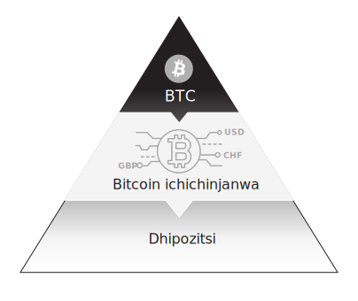

Mufananidzo 14

Muna 2010, kutanga kweBitcoin kuchinjana kwakaumbwa kuitira kufambisa kutengeserana pakati peBTC nemadhora ekuU.S. Vakaratidza chinhu chakakosha zvikuru pamusoro peBitcoin: musika unoshanda waivapo pakati pevanhu vaida kutengeserana pakati peBTC neUSD. Bitcoin yakagadzirwa semari uye yaishandiswa chaizvo sezvaidiwa pasina gore mushure mekutanga kwayo. Imwezve kutsoropodza kwakajairika kweBitcoin ndeyekuti haigone kushandiswa kutenga zvinhu kana masevhisi nekuti mabhizinesi mazhinji haagamuchiri BTC senzira yekubhadhara. Kupikisa uku kunopotsa pfungwa yokuti BTC inogona kushandiswa kutenga chinhu chinonyanya kukosha chezvose: mari. Pakuchinjana nhasi, BTC inotenga varidzi vayo USD, EUR, uye chero imwe mari huru yavangasarudza.

Mari yekuchinjana pakati peBTC neUSD yakavambwa muna 2010, iyo yakasimbisa hupfumi hweBTC uye maonero ayo seimwe nzira itsva yemari. Zviyero zvemutengi paBitcoin exchanges yaive yekutanga fomu yechipiri-layer BTC; zviyero zvaive zvichemo paBTC asi kwete muridzi wemakiyi ega ega. Kumwe kuchinjana kwaizovaka mbiri nekubvumira BTC kubviswa kwemahara pakukumbira uye kuve nezvakazara, kwete zvefractional, BTC reserves against all deposits. Vamwe vaizotadza kubhadhara zvikwereti zvevatengi sezvakangoita mabhanga akatadza kubhadhara mumazana emakore, kungave kwakakonzerwa necyberattack, kuba, kana zvidimbu zvakachengetwa. Pasinei nekutadza kwekutanga, kuvimba muBitcoin exchanges kwakagadziridzwa sechinhu chekona muBitcoin yemari chenji, uye pakare ipapo, kukosha kwenguva yeBTC kwakazviratidza: vatengi vane madhipoziti vanogona kukweretesa chibatiso chavo kune vamwe vatengesi pamwero wemhindu.

Legitimacy

Zvakangotora Bitcoin hafu yemakore gumi kuti vawane pamutemo semari itsva yepasi rose. Nenzira isingarambiki, yanga isiri iyo yaidiwa nehurumende kana indasitiri yezvemari nekuda kwekuvhiringidza uye kugarisa vanhu, asi yakawana kukosha kwemusika kwakakwana, kutariswa kwemari, uye mazita emutemo kuti auye nayo muhurukuro huru. Pakazosvika 2014, Bitcoin yakanga yava simba rezvematongerwo enyika. Sezvo network ichikura, yakakwezva kukosha, kudzidza, nekudyara, izvo zvakazokwezva kukosha kwakawanda. Munguva iyi, vemabhizinesi vakatanga kuvaka hupfumi hwese uye indasitiri yakatenderedza Bitcoin nekuti yaive yave kugamuchirwa pasi rose semari isingakanganwike yedhijitari. Zviitiko munhoroondo yekutanga yeBitcoin zvinorondedzera kuda kwayo kuve simba rezvisikwa uye chimiro chisingachinjiki munyika yemari.

Mugore rayo rekutanga, Bitcoin yakanga isina kukosha kwairi. Yakanga isina mutengo, asi yakanga iine vanhu vaitenda mupurojekiti uye kuti BTC yakanga yakakosha magetsi, simba rekombiyuta, uye simba rakaiswa kuti riwane. Izvi zvakaita kuti ive nemari kare, sezvo yaive nzira yekuchengetedza basa rakanga raitwa; humbowo-hwe-basa uye Bitcoin migodhi inogona kufungidzirwa semhando yebasa. Iyo yakashambadzirwa zvakanyanya, yekutanga Bitcoin transaction yakaitika muna Chivabvu 2010, mumwe mugadziri weBitcoin software akabhadhara waanozivana naye pamhepo zviuru gumi zveBTC pamadhora makumi maviri nemashanu epizza odha yaPapa John, yakaenzana nemutengo weBTC/USD wemadhora 0,0025. Kutengeserana kwakakoshesa kukosha kwemusika weBTC kune inenge 7,000 $.

Musi waKukadzi 10, 2011, iyo tekinoroji blog Slashdot yakatumira chinyorwa chakanzi "Pamhepo-Chete Mari Bitcoin Inosvika kuDollar Parity." Nekuda kwekukurumbira kwaSlashdot pakati peinjiniya dzesoftware, vazhinji vekutanga Bitcoin vanotora vanonongedzera ichi chinyorwa senguva yavakatanga kunzwa nezveBitcoin. Mushure meichi chidimbu

chekutanga chekushambadzira internet, pasina makore maviri mupurojekiti, Bitcoin yakatanga kuwana mukurumbira wakakomba uye kutariswa. Nharaunda iri kukura yevashandisi vese vakatenda mune iyi fomu remari uye vakabvuma kuti iyo yakafanotemerwa hurongwa hwekugovera hwaikodzera kuchengetedzwa. Nenguva isipi, vanogadzira vakakwana uye pfungwa dzinogovana zvakabatanidzwa padhuze netiweki, uye Satoshi anokumbira adieu. Nezvekunyora uku, inofungidzirwa miriyoni imwe yeBTC yaakachera mukati megore rekutanga rekuvapo kweBitcoin haina kumbobvira yaitwa.

Kukosha kwemusika weBTC kwakapfuura $100 miriyoni muna June 2011 panguva imwe chete iyo webhusaiti Gawker yakabudisa nyaya yakanzi "The Underground Website Kwaunogona Kutenga Chero Mushonga Unofungidzira." Silk Road yaive musika mutema wepamhepo, wainyanya kushandiswa kutenga nekutengesa zvinodhaka zvisiri pamutemo paInternet. Semari itsva, yepamhepo, yakatemerwa dhijitari isati yave pa radar yemutemo, BTC yaive mari yakakwana yevashandisi veSilk Road. MuBitcoin, pakanga pasina bhangi raigona mureza kutengeserana kufungidzira, pasina mari yaifanira kutumirwa kuburikidza netsamba kana kuchinjana mumunhu, uye zviri nyore hapana mutemo wekutarisa iyo Bitcoin ledger yekutengeserana. Pasina ani zvake anotarisa, Bitcoin transactions inogona kunge isingazivikanwe. Chinyorwa cheGawker chakatsanangura kuti munhu anofanira kutanga aenda kuBitcoin exchange kunotenga BTC kuitira kuti atore chikamu mumusika uyu wepamhepo:

> Kana zviri zvekutengeserana, Silk Road haigamuchire makadhi echikwereti, PayPal, kana chero imwe nzira yekubhadhara inogona kuteverwa kana kuvharwa. Mari chete yakanaka pano iBitcoins.

Federal Bureau of Investigations yakazovhura ongororo ichibva yavhara Silk Road. FBI yakabata BTC panguva yekushanda kwayo uye yakatarisana nechokwadi chitsva pamusoro pemari munguva yedhijitari. Kubva panguva iyoyo zvichienda mberi, vezvemitemo kubva kumativi ese enyika vakatanga kutarisa Bitcoin's ledger yezviitiko zvekufungira kuitira kuvhima matsotsi. Vemutemo vakagadzira nzira dzekubatanidza Bitcoin transaction neinternet data data kuitira kuita izvi. Mushure mekunge vezvemitemo vatanga kutarisa Bitcoin ledger, Bitcoin yakanga isisiri iyo mari yakakodzera yekuita zvehutsotsi, kure nayo. Uku kuparadzaniswa kwakasimudzira kuve pamutemo kweBitcoin munzira yakakosha.

Musi waNovember 28, 2012, chiitiko chekutanga cheBitcoin chehafu chakaitika mushure mekunge 210,000th block yakacherwa uye mubairo wemigodhi webhuroko rimwe nerimwe "nehafu" kubva ku50 BTC kusvika ku25 BTC. Nepo iyo nguva yakapfuura pasina chero flare kana mutambo kubva pa blockchain maonero, yaive yakakosha kubva kune yemari. Satoshi paakagadzira yekutanga vhezheni yeBitcoin software code, akatsanangura mutemo wezvemari wakatambanudzwa kwezana ramakore mune ramangwana. Zvino mushure memakore mana aripo, network yeBitcoin yakaona kugadziriswa kwayo kwekutanga pasina mutambo, makaro, kana kupokana kubva kune chero vatori vechikamu. The kufanorongerwa kugovera purogiramu, chidimbu chekushandisa mushure menguva yega yega, uye huwandu hwehuwandu hwehuwandu hwemamiriyoni makumi maviri nerimwe eBTC zvose zvakange zvakatemerwa netiweki zvakaonekwa, kwete kubvunzwa. Satoshi akange agadzira isiri-discretionary mari mutemo umo kungwara kwevanhu kwaisambogona kushandura algorithm yekugovera yeBitcoin. Kuziva kwekugadzirwa uku kunotyisa uye simba rekubvumirana kwakafambisa thesis yekudyara kweBitcoin; yakanga iri mari yaisakwanisa kuwedzerwa mukupihwa kana kudzikiswa. Bitcoin yakanga yasvika segoridhe redhijitari.

Muna 2013, mutengo weBTC / USD wakaputika, uchikwira pamusoro pe $ 1,000 uye uchipa mambure chiyero chemusika we $ 10 bhiriyoni. The Financial Times, Wall Street Journal, uye Bloomberg vakatanga kutsikisa zvinyorwa nezveBitcoin uye indasitiri iri kukura yecryptocurrency nekugara, uye mhando yeBitcoin yakatanga kuzivikanwa. Vakuru vehurumende vangangove vakazvidza zano reiyo cryptocurrency yakaderedzwa nekuti kushaikwa kweBitcoin kweanopa pakati kwakasimudza nhaurirano nezvekuparadzaniswa kwemari nehurumende.

Bitcoin yakawana kuzivikanwa zviri pamutemo mumaziso ehurumende yeUnited States muna 2014, ichifambira mberi ichienda kune pamutemo uye yakapfuura mabhurashi akashata akasiiwa nenguva yeSilk Road. IRS yakasarudza kuti muridzi weBTC aifanira kubatwa semidziyo uye kuti mibairo inowanikwa muUSD yaienderana nemitero yekuwana mari. Uku kwaive kubvumwa nehurumende yeUS kuti kuva neBTC yaive nzira isingakanganisike yemidziyo yakaita sereal estate kana goridhe chairo uye inofanira kubhadhariswa mutero wakadaro.

Pamusoro pezvo, mukuru weU.S. commodity future regulator akatonga kuti Bitcoin yaive chinhu chekutengesa kwete mari. Yakaenzanisa Bitcoin negoridhe mukutsvagisa kwayo uye yakagumisa kuti muridzi weBTC kuve nenhamba yezvigadzirwa nekuda kwekutsamira kwesoftware pamakiyi akavanzika. Bitcoin yanga ichitanga kuita morph mukirasi yayo yeasset, kunyangwe ichinetsa kutsanangura mumamiriro echinyakare nekuda kwehunhu hwayo.

Pakazosvika 2014, kunyange hurumende yeUnited States yakanga ichinyatsoziva nezvekushanduka kwemari kuri kuitika. Bitcoin yakakwezva vachengeti munyika dzine hutongi husina kugadzikana uye kodzero yezvivakwa vaida mari isina muganho, isingatore kubvutwa. Yakakwezva vachengeti mukati medhora redhinominesheni rakanga rarasikirwa nekutenda muFederal Reserve senzvimbo yekuranga mari. Bona fide yekuda kweBitcoin yaivepo mumakona ese epasi. Muna 2017, kukosha kwemusika kweBitcoin kwakaputika zvakapfuura mabhiriyoni zana emadhora mukuwedzera kwemutengo kunoshamisa. Kukura kwakanyanya kweBitcoin kwakange kusingarambike.

### Tulips

Munguva yezana ramakore rechigumi nenomwe uye makumi mashoma emakore mushure mekuvambwa kweBhangi reAmsterdam, fungidziro yemutengo bubble yakaitika muDutch tulip bulbs. Sechinhu chakanaka cheumbozha, tulips yakava hasha dzese muNetherlands sezvo munhu wese aida chidimbu chechinhu chaishuviwa zvikuru. Mitengo yemagirobhu yakaputika ichibva yadonha nguva pfupi yadarika, semafuro efungidziro anoita. Izwi rokuti bubble raizoshandiswa munhoroondo yose kutsanangura kuwedzera kwemutengo wechinhu chaiita sechisinganzwisisike kune vakawanda, kuwedzera uko kwaizoguma pasina mubvunzo uye kunoramba kuchiguma mukuderera kunoparadza. Ehe, vazhinji vakaedza zvisina zvibereko kubatanidza izwi bubble neBitcoin.

Kukwira kwemutengo weBitcoin kubva pakuzvarwa kwayo kunoramba kuchiunza kuchema kwebubble uye kuenzanisa neDutch tulips kunyangwe yanyatsopora kubva mukutyisidzira 80% mutengo unodzikira zvino pazviitiko zvitatu zvakasiyana. Mutengo weBTC/USD uri kushanduka zvinokatyamadza, kuchinjika kwemitengo kuri kure kwatinowanzo kuona kune mamwe makirasi easset. Kusagadzikana kwayo, zvisinei, hakusi kuratidzwa kwemhando yeasset kana kunaka. Kana Bitcoin ichida kukura kubva pavechiri kuyaruka mari network kusvika pahwaro hwehurongwa hwemari hwepasirese, chokwadi makwikwi nekudzika kuri munzira inoteedzera rollercoaster inotyisa. Kana mutengo wemusika weBTC waizoenzana nemutengo wemusika wegoridhe rose renyika, mutengo weBTC/USD waizosvika madhora mazana mashanu. Zvakachengeteka kufunga kuti rwendo kubva pasi pe $1 kusvika $500,000 ruchauya nechikamu chayo chakanaka chekushanduka kwemitengo, kumusoro nekudzika. Aya mavacillations akarovererwa mukukura kweBitcoin uye achaparadzanisa vanotanga kutora kubva kune avo vanozomirira kuti mutengo ugadzikane muUSD mazwi. Hapana chekusagadzikana uku, zvisinei, chinodzivisa BTC kubva pakuva chitoro chekukosha uye imwe nzira kune mari inoenderana nekuchembera archetypes.

Muchokwadi, Bitcoin haina kufanana neDutch tulip mania. Mabubbles haapamuke katatu mumakore gumi uye anodzoka akasimba pese panotangazve, uye veruzhinji vanodyara vanopedzisira vamuka kune ichi chokwadi. Muna 2020, vamwe vevanonyanya kuita mukurumbira hedge fund vechizvarwa chino, Paul Tudor Jones naStanley Druckenmiller, vakabvuma varidzi veBTC. Investment manejimendi masimba akadai seAllianceBernstein, Blackrock, uye Fidelity Investments yakakurudzira veruzhinji kuti vatengi vave neBTC mumapotfolio avo seruzhowa kurwisa kuderedzwa kana kupera kwemari yehurumende. PayPal, iyo huru yepamhepo yepamhepo processor, yakapa vatengi vayo 300 miriyoni pasi rose kugona kutenga BTC pachikuva chayo. Zvakatanga kujeka kunharaunda yekudyara kuti kuramba nzvimbo yeBitcoin mune ramangwana remari kwakafanana nekuramba nzvimbo yeInternet mune ramangwana rekutengeserana muna 1999. Internet stocks inogona kunge yakasangana nemutengo wekufungidzira pakupera kwezana ramakore rechimakumi maviri nerimwe. , asi makambani makuru ari kutengeswa pachena pasi rose nhasi iMicrosoft, Apple, Amazon, Alphabet (Google), uye Facebook, ayo aburitsa mabhiriyoni emadhora mukukosha kwemusika nekuda kweInternet.

Kuwanda kwezvibvumirano zvakatangira mutengo weBTC/USD uchisvika padanho repamusoro-soro pakutanga kwa2021 sezvo kukosha kwemusika kwakawedzera madhora mazana matanhatu emadhora. Chii chaimbove chiratidzo chedhijitari chakanamirwa kune hobbyist software inokosha isingasviki peni muna 2010 chakange chave chinhu chemadhora makumi matatu nemana makore gumi chete gare gare. Iyo yakakurumbira $25 Papa John's pizza kutengeserana ingave yakakosha $340 miriyoni pazuva rekuzvarwa kweBitcoin, Ndira 3, 2021. Mufananidzo 15 unoratidza kukwira kwemeteoric mumutengo wemusika weBTC kubvira 2010.


Mufananidzo 15
### Kupenya kweNetiweki

Kupenya kwe Netiweki kunosimudzira tekinoroji kuBitcoin iyo inoishandura zvakanaka kubva kune inononoka-inofamba-famba segoridhe renyama kuenda pamari inofamba pamagetsi. Uye chinhu chakakosha cheMheni Network ndiyo yakangwara chibvumirano. Kazhinji, zvibvumirano zvakangwara zvibvumirano zvinorongwa zvinokwanisa kuita chero chinhu chinogona kuiswa musoftware. Nechinangwa cheBitcoin, zvibvumirano zvakangwara zvinonyanya kukosha zvinokwanisa kukwira uye kurongeka kwemapato akawanda. Zvibvumirano zvakangwara muMheni Network, Hashed TimeLock Contracts (HTLCs), zvakakwira Bitcoin kuita mari network inokwanisa kugadzirisa mamiriyoni ekutengeserana pasekondi. Ngatitarisei zvakanyanya kuti Mheni Network yakashanduka sei.

Mumakore mashoma ekutanga eBitcoin network, kamudiki kadiki kevanofarira Bitcoin vakapa mazano avo nekuvandudza kuchirongwa ichi. Vakagadzirisa humwe hurema hwakakomba hwaigona kunge hwakangoerekana hwapedza network isati yabata simba. Aya mainjiniya esoftware uye ma cryptographer akashanda paBitcoin nekuti vaive nekutenda mune tekinoroji, vaive neBTC, uye vaida kuti network ibudirire. Vakanga vasiri kuwana mari kubva kune chero mushandirwi; vakanga vachishanda nokuda kwokudavira kusangano idzva. Nekufamba kwemakore, vakapedza Bitcoin kubva kupurojekiti kuenda kune network yepamutemo yemari yepasirese.

Izvo zvakakosha zvakagadziridzwa zvakashandura Bitcoin kuenda kune smart contract platform yakaitika kubva 2015 kusvika 2017. Aya Bitcoin Improvement Proposals (BIPs) akashandura imwe-dimensional Bitcoin transactions kuita wildly customizable zvemari zvibvumirano, pasina kuchinja chero mitemo inokosha yeBitcoin.

Muna 2016, bepa kubva kune mainjiniya esoftware Joseph Poon naThaddeus Dryja rakadaidzwa kuti "The Bitcoin Lightning Network: Scalable Off-Chain Instant Payments" yakavakirwa pane ese smart contract innovation inoitika paBitcoin software. Pepa racho raive chirevo chemhando nyowani yeBitcoin smart kontrakiti (HTLCs) iyo yaigonesa kugadzirisa ipapo kubhadhara pasina kumirira kuti chivharo chinotevera chicherwa. Mheni Network haingowedzere kusingaperi kugona kweBitcoin senge nzira yekutsinhana asi inobvumirawo hunyanzvi hwakadai sekubhadhara kutenderera kwepamhepo nemillisecond. Uye muzera redhijitari rekutepfenyura zvese, nei mari isinga fambewo?

Mheni Network zvakare inounza hutsva hutsva kune kukosha kwenguva yeBTC. Vashandisi vanopa BTC sechibatiso kuMheni Network kuitira kufambisa kutengeserana vanogona kuwana mari kubva pakupa iyi liquidity. Iyi inzira yakare isati yamboitika yekuwana mari yekudzoka pamari pasina kumbosiya kuchengetwa kwayo nekuti vanopa zvibatiso havatombopatsanuri nzira neBTC yavo pakuitsaurira kuMheni Network. Mari yemubereko inotorwa kubva kurudzi urwu rwechiitiko inogona kushanda sereferensi yereferensi munyika yeBitcoin nekuda kwemheni Network yakasarudzika-yemahara hunhu. Iwo chaiwo pfungwa yekukosha kwenguva yemari iri kuchinja sezvo matekinoroji matsva aya anopinda mukati memamiriro emari.

### Dzimwe Cryptocurrencies

Vateedzeri veBitcoin zvakanga zvisingadzivisiki. Bitcoin ndeye yemahara uye yakavhurika-sosi software, zvinoreva kuti software yacho ndeyemahara kurodha uye kuvhurwa kuti ionekwe nemunhu wese. Kakawanda, Bitcoin yakaramba shanduko dzakakosha kubhuku rayo remitemo kubva kuvagadziri izvo zvaive kunze kwekubvumirana nevazhinji vevashandisi veBitcoin. Dzimwe shanduro dzecryptocurrency kuBitcoin dzakabuda, ingave yakakopwa zvakananga, yakakwenenzverwa, kana kufungidzira. Kana pfungwa dziri nani pane Bitcoin dziripo, capital yaizokwevera kune idzi dzimwe nzira uye kure neBitcoin. Parizvino, zvisinei, hapana cryptocurrency yakapokana neBTC pane chero nguva yakamira, yakayerwa mune zvese kukosha kwemusika uye hashpower. Alternative cryptocurrencies iripo pane yakaderera layer mukati meBTC mari piramidhi nekuda kwehukama hwemutengo, kufanana nemari yenyika yaivepo pane imwe pasi pedhora mushure mechibvumirano cheBretton Woods cha1944. Kufanana neUSD inoita semutengo wekutanga wemari kubva kumativi ese. nyika, BTC inoshanda semutengo wekutanga kune ese madhijitari mari.

BTC inoshandawo sechisungo chemari pazvikamu zvakaderera zvepiramidhi yayo nokuti haikanganwiki, asi izvi hazvidzivisi kubudiswa kwechipiri-layer BTC kana chero imwe digital asset. Ingave yakarongerwa semakopi kana kutora mari, gomo rinoputika rekriptovalty rakaputika mushure mekubudirira kwekutanga kweBitcoin. Kutsinhana kwakawedzera macryptocurrencies kumapuratifomu avo ainyanya kutengeserana neBTC, kwete USD, semari yavo yekutanga. A new asset class ye digital token-based currencies iri pano, uye BTC inoshanda senzira yekupedzisira yekugadzirisa mukati meiyo dhijitari.

BTC haizombovi yega sedhijitari asset; ichagara iine zvese zvekuwedzera uye zvekubatsira. Asi ndicho chikamu chimwe cheakaundi icho vamwe vari muchadenga chedhijitari vanogona kuvimba nacho pakusaora. Kutonga kweBitcoin protocol seyakanyanya kukosha-yekuchinjisa protocol yeInternet ingangogara kwemakumi emakore anouya, senge nzira iyo Transmission Control Protocol, Internet Protocol, uye Hypertext Transfer Protocol (TCP/IP/HTTP) inotonga kusangana kwedu kwedhijitari mazuva ese. patinobatana neIndaneti kana pawebhusaiti.

### Makoini akagadzikana

Chikamu chechipiri chiri kukurumidza kukura mukati mepiramidhi yemari yeBitcoin imhando itsva yeasset yedhijitari inonzi stablecoins. Stablecoins zvikwereti zvakapihwa nenzira yedhijitari tokens nemakambani akazvimirira ega. Aya ma makoini akagadzikana anofanirwa kutengesa kune "yakagadzikana" kukosha kune madhora, semuenzaniso. Iyo moniker ye "yakagadzika" ishoma yeoxymoron mune iyi kesi nekuti sezvatakadzidza, midziyo yemari pamatanho akaderera emari haawanzo kuve nekugadzikana. Makoini akagadzikana: mari yedhijitari yakatsiga kusvika isiri.

Koini idzi dzakagadzirwa nekuti kuchinjana kwaida nyore uye nekukurumidza nzira yekuti vatengi vatendeuke pakati peBTC neUSD. Muchidimbu, kuchinjana kunogadzira yavo mari yecrypto inomiririra USD muakaundi yebhangi asi inofambiswa nemakiyi epachivande nemakero seBitcoin.

Iyo inonyanya kuzivikanwa stablecoin ndiyo isati yatanga: Facebook's Diem (yakatanga ichinzi Libra). Chinangwa chayo ndechekutsigirwa neU.S. Treasury Bills nemamwe madhora-denominated mari zviridzwa. Kungave kana kusatangisa Diem, chiziviso cheFacebook che stablecoin muna 2019 chaive chiratidzo chikuru chemari yedhijitari. Nguva iyo Facebook yakaedza kupinda pasirese yemari ndiyo nguva iyo mabhanga epakati akaziva kuti aida mhinduro yakarongeka pakubatanidzwa kwemari uye cryptography. Mabhanga emakambani akazvimirira ari kutsvagawo kuita mari pakuda kwedhora-pegged, ledger-based digital tokens: JP Morgan yakatanga yayo stablecoin, inonzi JPM Coin, muna 2020.

Muna Ndira 2021, Treasure yeUS yakapa gwara rechokwadi pamusoro pemutemo wecryptocurrencies uye stablecoins mumushumo kubva kuHofisi yeMubatiri weMari (OCC). Nhungamiro inodudza ese ari maviri cryptocurrencies uye akagoverwa ledgers yakazvimirira node verification network (INVNs), inotsanangura zviri pamutemo izwi rekuti "stablecoin" sezvatinazvo muchikamu chino, uye inobvumira ese ari maviri kuti ashandiswe nemabhanga kudhijitari transact kukosha chero bedzi mitemo yemabhanga ichiripo. akatevera. Mutongo uyu waive humbowo hwekuti remangwana remari raizovakwa nemusana wecryptography:

Naizvozvo isu tinogumisa kuti bhangi rinogona kusimbisa, kuchengeta, uye kurekodha mabhadharo ekutengeserana nekushanda senode paINVN. Saizvozvo, bhangi rinogona kushandisa maINVN uye ane hukama stablecoins kuita mamwe mabasa anobvumidzwa ekubhadhara. Bhanga rinofanirwa kuita zviitiko izvi zvinoenderana nemutemo unoshanda uye zvakachengeteka uye zvine hungwaru maitiro ekubhanga.

### Ramangwana rezvekutengesa

Kunyangwe New York riri iro guta guru rebhangi reUnited States, Chicago yagara iri muzinda wayo wekutengesa zvinhu. Mukati mezana ramakore regumi nepfumbamwe, Chicago yakamisa nyika yezvibvumirano zvemberi neremangwana, zvichibvumira varimi kuti vatengese zvirimwa zvavo nechibvumirano zvisati zvakohwa. Muna 1898, kumira kwebhota nezai remangwana zvibvumirano zvakakonzera kuumbwa kweChicago Butter uye Egg Board, iyo yakatangira kuChicago Mercantile Exchange (CME), iyo nhasi ndiyo yakakura zvikuru kubva pasi rose kuchinjanisa. Iyo CME yaizowedzera zvingango fungirwa kune yayo mhando yezvigadzirwa zveramangwana mumakore apfuura, kubva kumombe mhenyu muna 1964, kusvika kune remangwana resirivheri muna 1969, kune ramangwana reBitcoin muna 2017.

Muna 2016, CME payakazivisa hurongwa hwekushambadza mutengo weBitcoin mukugadzirira kutangwa kweramangwana reBitcoin gore rinotevera, huremu hweChicago sechiremera chepasirese pazvinhu zvakakandwa kuseri kweBitcoin uye zvakanyanya kuwedzerwa kune kwayo pamutemo. CME Bitcoin remangwana rinobatsira vatori vechikamu vemusika wezvemari kushandura pakati peBTC neUSD, izvo zvichabatsira zvakananga kutorwa kweBitcoin. Mabhizinesi anogona kuita basa reBTC-denominated vachiziva kuti vanogona kushingaira kugadzirisa njodzi isingadikanwi yekutsinhana. Uyezve, remangwana reBitcoin rinopa BTC yechipiri kune vatori vechikamu vanoshanda chete mukati mepiramidhi yedhora uye vanongoda kuratidzwa kune shanduko mumutengo weBTC, kwete kuve neBitcoin zvakavanzika makiyi. Chigadzirwa cheCME chakaunza Bitcoin mberi munzira yayo yekubatanidzwa kuzere nehurongwa hwemari hwechinyakare.

### Yakarongedzwa Bitcoin

Sezvo pasi rose kutorwa kweBitcoin semari uye sepfungwa yezvemari ichienderera mberi, danho rechipiri reBitcoin riri kutumbuka nemhando dzakasiyana dzeBTC-based vimbiso, dzimwe cryptocurrencies, uye stablecoins. Mufananidzo 16 unoratidza kuti Bitcoin iri pamusoro peiyo piramidhi yerinovhero, iine imwe yechipiri-yechipiri mari kubva kumashizha ekuenzanisa uye mamwe kubva kuhukama hwemitengo.

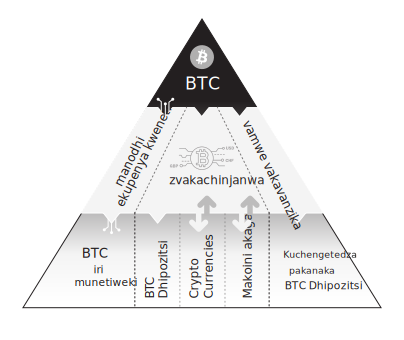

Mufananidzo 16

<!-- /\\

U.S. Treasuries

/ ^ \\

(Federal Reserve)

^

Zvakachengetedzwa (W), Manotsi (R), Fedkoini (R) -->

### BTC uye CBDC Hukama hwemutengo

Nheyo yezvinyorwa zvebhuku rino ndeyokuti BTC ichamira yega pane yekutanga-yemari mune ramangwana. Dai izwi rimwe chete nezveBitcoin ringashandiswa kutsanangura kuti sei, taizofanira kusarudza rakagadzirwa makore mashoma apfuura muna 2014 nemunyori uye muongorori wezvehupfumi Nassim Nicholas Taleb: antifragile. Heano maitiro Taleb akazvitsanangura:

Zvimwe zvinhu zvinobatsira kubva mukuvhunduka; vanokura uye vanokura kana vakaiswa mukusagadzikana, kusarongeka, kusagadzikana, uye zvinoshungurudza uye rudo rwekushanya, njodzi, uye kusava nechokwadi. Asi, pasinei nekuwanda kwechiitiko chacho, hapana shoko rinonyatsopesana nekuputsika. Ngatizviti antifragile. Antifragility inopfuura kusimba kana kusimba. Anoshingirira anopikisa zvinokatyamadza uye anoramba akadaro; iyo antifragile inova nani.

Bitcoin haina kusimba nekuti inobudirira kubva mukusagadzikana kwemari yepasi rose mukati mepiramidhi yedhora uye inoshingirira kutyisidzira, kunyomba, uye mutemo kubva kune anodzinga masangano ehurumende. Chokwadi chiri pachena nezveBitcoin ndechekuti hapana anoidzora. Yakave yekutanga-isina hurumende, inowanikwa pasi rose mari yedhijitari. Uye nekuda kwezvikonzero izvi, mari dzese dziri munzvimbo yedhijitari inotarisana nekuwanikwa kwemutengo mumashoko eBTC. Izvi zvinoreva kuti mari dzese dzedhijitari, kubva kumaricho kusvika kuCBDCs, dzichayerwa muBTC, sechibvumirano cheBretton Woods muna 1944 chakaraira kuti mari dzese dziyerwe neUSD. Mufananidzo 18 unojekesa ramangwana iro BTC ndiyo nyika yekuchengetedza mari uye chete yekutanga-layer mari.

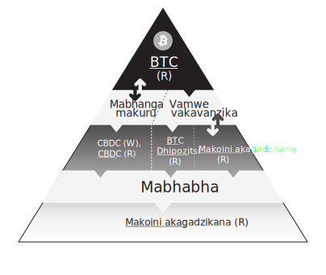

Mufananidzo 18

Kuti rudzi urwu rweBTC-denominated layered money system ishanduke, mashoma eruzivo rwetekinoroji anofanirwa kuwira munzvimbo angaite kunge ari kure asi atove mubudiriro mukati mebhanga guru nhasi. Iyo yekupedzisira chidimbu chepuzzle munzira inoenda kuBTC ichiva mari yekuchengetedza nyika ichave iyo atomiki shanduko.

### Atomic Swaps

Kunzwisisa kuchinja kweatomu nebasa rayo mune ramangwana remari kunoda kubatanidzwa kwezvinhu zvitatu zvinokurukurwa mubhuku rino: Lightning Network, Hashed TimeLock Contracts (HTLCs), uye Distributed Ledger Technology (DLT). Tichakurumidza kuongorora zvakakosha zvechimwe nechimwe, uye tobva taratidza kuti zvese zvinopindirana sei. Mheni Network itiweki yevashandisi veBTC vanogona kushandurana ipapo ipapo pane kumirira

maminetsi gumi kuti chivharo chinotevera chicherwe. Izvi zvinogoneka nekuda kwezvibvumirano zvakangwara zvinonzi HTLCs. Zvakaparadzana, Distributed Ledger Technology (DLT) ishoko rinoshandiswa nevakawanda academia nemadhipatimendi epakati ekutsvagisa bhanga kutsanangura Bitcoin-yakafuridzirwa software.

Zvino heino kuti mazwi ese akabatanidzwa sei. DLT software ine HTLCs inoenderana neBitcoin's Lightning Network ichashandiswa nemabhanga epakati kutanga maCBDCs avo. Kana zvibvumirano zvakangwara zvichienderana nemidziyo yedhijitari, zvinogonesa nyika yeatomu swaps.

Kuchinjanisa kweatomiki, pakati payo, kutengeserana. Icho chibvumirano chakangwara chinobvumira kutengeserana pakati pemari yedhijitari pasina kushandisa chechitatu-bato kuchinjanisa. Iyi ishanduko zvachose munyika yezvemari nekutengesa, uye ngatishandisei muenzaniso wekutenga migove yeApple kuratidza chikonzero nei. Iti iwe unoda kutenga 100 migove yeApple pamadhora zana imwe neimwe. Unoisa $10,000 mustock exchange. Vanoda kutengesa masheya avo vachaaisawo. Kutsinhana kunodiwa mumamiriro ezvinhu aya kuti ive nechokwadi chekuti mutengi nemutengesi vane mari uye midziyo inodiwa kuti vapedze kutengeserana. Pasina wechitatu, vatengesi vaizofanira kuvimbana pese pavaitengesa. Asi nekuchinjana, handizvo.

Atomic swaps inoshandura zvakanyanya aya mazano ekutanga ekutengesa. Ivo vakarongerwa kuita kutengeserana kwemapato ese ari maviri kana chero, kubvisa njodzi yevamwe, njodzi yekutsinhana, uye njodzi yekutadza zvachose. Zvakakosha kunzwisisa kuti atomic swaps inongoshanda pabhangi repakati pedhijitari mari inovakwa uchishandisa DLT software yakashongedzwa nemhando imwechete yezvibvumirano zvakangwara zviripo muBitcoin's Lightning Network. Nekudaro, izvi hazvireve hazvo kuti bhangi repakati rinopa CBDC pane yakagoverwa ledger rinosiya chero kutonga pamusoro pemari iri pasi.

Kuitwa kwakati wandei kweDLT kwatobvumira kuchinjika kweatomu. Heino muenzaniso chaiwo webasa ririkuitwa paatomically swappable central bank digital currencies. Muna 2019, iyo Monetary Authority yeSingapore, Bhangi reCanada, JP Morgan, uye Accenture vakazivisa kubudirira kwekuchinja kweatomu pakati peCanada madhora (CAD) neSingapore madhora (SGD) pamapuratifomu maviri akasiyana eDLT vachishandisa maHTLC "pasina kudiwa kwechetatu. bato rinovimbwa nematunhu ese ari maviri." Kugadziriswa kwekutengeserana kwacho kwakaomesesa zvakanyanya kubva pakurongwa kwesoftware uye sainzi yekombuta uye zvakatora nguva yakawanda uye hanya kuita, asi iyi ndiyo mhando yekutsvagisa zviremera zvezvemari pasirese zviri kuita izvozvi kuongorora ramangwana remari. Bhanga guru reCanada rakashandisa DLT inonzi Corda, uye bhanga repakati reSingapore rakashandisa DLT inonzi Quorum, mhinduro dzese dzakapihwa sezvigadzirwa nemabhizinesi akazvimirira. Iwo maviri maDLT ane akati wandei akasiyana asi anowirirana painoverengera: anotendera maHTLCs kune mumwe nemumwe. Mabhanga eCentral anozoda kuwedzera kukura-cryptographic contingent pakati pevakuru vavo kuitira kuti vatsigire zvese tekinoroji ruzivo kuCBDC kuita. Kunyangwe ivo vakafunga kushandisa yekubhengi software mhinduro, imwe cryptocurrency, kana Bitcoin pachayo, mabhanga epakati ane hurongwa hwesarudzo kana zvasvika pakuvhurwa kwavo kwekupedzisira kwemari yedhijitari. Kana mabhanga epakati achida kuti mari yavo yedhijitari ibudirire munguva yeBitcoin, vanozoburitsa maCBDC anoshandisa DLT software ine HTLC kugona kuti vajoine atomic swap club. NeBTC seyo chete yekutanga-yakapetwa mari yedhijitari, imwe neimwe mari yedhijitari, zvisinei nekuti mupi ane simba rakadii, anozoyerwa neBTC.

## Chitsauko 10: Rusununguko rweMari

Kubva pakusikwa kweBhangi reAmsterdam muzana ramakore rechigumi nemanomwe, zviridzwa zvemari nehurumende zvakabatanidzwa kune mumwe nemumwe. Asi muzera redhijitari, mari uye nyika hazvifanire kusanganisa. Kune vakawanda, iyo pfungwa yese yemari yehurumende yave kusashanda sezvo kusimuka kweBitcoin kubhero mukupikisa. Nekuti Bitcoin isoftware, masvomhu, uye kutaura, inofanirwa kutorwa sekodzero yemunhu. Bitcoin inomiririra rusununguko rwemari yedhinominesheni nekuti inopa vanhu kugona kunyoresa mihoro yavo uye mari kubva kusangano rehurumende. Kunyangwe vanhu vakachinja chikamu cheakaundi yavo kuenda kuBTC kubva kumari yavo yemuno nekuda kwezvinangwa zvezvematongerwo enyika, kuratidzira kusina mhirizhonga, kana kutenda kuti tekinoroji inogonesa rudzi rwemari, ivo vanongopihwa rusununguko rwekusarudza kuti zvibereko zvebasa ravo zvakadii. kuyerwa. Bitcoin inopa vanhu pasi rese yekutanga imwe yechokwadi kune yavo mari yenyika, maitiro asingagone kudzoka kumashure nekuti vanhu vanopfuura mamirioni e100 pasi rose.

### Chiratidzo Cheramangwana

Heino ratidziro yekuti ramangwana redu remari ringaite sei mumamiriro emari akaturikidzana. Nhasi, mabhanga epakati anoshandisa madhesiki ekutengesa kuti atenge uye atengese mari yavo mumusika wekunze kwenyika vachitarisira kuchengetedza kugadzikana kwechiyero chekuchinjana. Munguva pfupi iri kutevera, ivo vachawedzera BTC kutengeserana kugona kumabasa avo emusika wakavhurika vachitarisira kutungamira dhijitari yekuchinjana kwemari yavo mumashoko eBTC.

Bitcoin yakakonzera shanduko yekudengenyeka kwemari yesimba kubva kuhurumende, kunyange sepakati pebhangi mari yedhijitari yakamirira mumapapiro. China ichavhura CBDC yayo mukugadzirira 2022 Winter Olympics. IEuropean Central Bank, Federal Reserve, uye mamwe mabhanga makuru epakati achange achiyedza CBDCs panguva iyoyo uye anozotevera nekutanga kwavo.

Mabhangi anoburitsa stablecoins inopa mabhenefiti ekubata CBDCs, senge yakakwira mubereko kana mari-yekudzoserwa nhengo mabhenefiti. Kana kupokana kuri kushoma pakutengesa pakati pemari yedhijitari uye imwe nekuda kweatomic swaps, stablecoin universe inozobudirira senzvimbo yekukweretesa kwechikwereti, kana kukweretesa. Mabhangi anozoburitsa zvikwereti, ozvinyora semidziyo pabalance sheet, uye oburitsa stablecoins pachinzvimbo che deposits sezvikwereti. Mabhangi anogona kuwedzera kujeka uye kumutsidzira kuvimbika kuburikidza nekushandisa DLT, uye shanduko kuenda kune ine simba bhangi sheet inobvumira veruzhinji vanodyara mari kuti vaone mhenyu mhenyu pachinzvimbo chehunyoro-yakapfekwa static quarterly reporting. Kuti ubatanidze kurongeka kwemari yeramangwana, mabhanga anofanirwa kuburitsa stablecoins ayo anogona kuchinjaniswa neatomu nemamwe ma stablecoins, CBDCs, uye BTC. Mabhangi anozove masters ekuchinjanisa kweatomu, kugadzira misika pakati pemari yedhijitari kuitira kutsvaga arbitrage uye kugadzira purofiti. Neatomic swaps uye nekukasira kugadzirisa pakati pemari yedhijitari, nzira yekuenda mberi iripo yekuchinja kuenda kuBitcoin-anchored monetary system.

Hurumende nemakambani pasi rose vachatenga BTC voibata semari inochengeterwa mari nekuti inoderedza kuvimba nehurongwa hwemadhora huripo, zvichiratidza kuti nguva yedhinomisheni yedhora repasi rose iri kunyura munzira ye cryptocurrency, pachinzvimbo cheimwe mari yehurumende senge renminbi kana euro. Goridhe icharamba ichishanda semari inovimbwa nayo isina kwayakarerekera, asi haina hunyanzvi hwekugona kushanda senjanji yedhijitari yemari system. Izvi hazvisi zvekudzinga goridhe semhando yepamusoro yemari isina mubatanidzwa yakambozivikanwa nenyika: Bitcoin yakangotora 6% yegoridhe rose remusika wepasi rose. Uyezve, basa remari regoridhe repasi rose rakadzoka nekutsiva kubvira 2007; mabhanga epakati pasi rose akawedzera hupfumi hwegoridhe zvakanyanya seruzhowa rwekusagadzikana kwehurongwa hwemadhora uye kusasimba. Ndarama inoonekwa seinishuwarenzi padambudziko remari uye disarray, iyo inowanzoshanda zvakanyanya panguva yekudengenyeka kwenyika mupiramidhi yedhora. Asi chimiro chegoridhe chinodonha munyika yedhijitari umo Bitcoin inobudirira. Pakupedzisira, Bitcoin inogona kutsiva goridhe semari inodiwa kwazvo isina kwayakarerekera uye kuipfuura mukukosha kwemusika.

Kune veruzhinji, mari yese ichave yedhijitari tokens iyo ichabatwa mumadhijitari wallet. Vanhu vachabata panguva imwe chete mari yakawanda: BTC yekusarerekera, CBDCs yekubhadhara mutero uye kuunganidza mabhenefiti, uye stablecoins yekuwana mubereko. Vazhinji vanovimba neyechipiri-layer CBDCs uye vanobvisa yechitatu-layer bank deposits

zvachose. Huwandu huri kukura hwevanhu huchararama chete pane zvisiri zvehurumende cryptocurrencies seBTC uye havambozviisi panjodzi yevamwe.

Nyika yedu yakawanda iri kutsvaga kuzvarwa patsva kwemari, uye Bitcoin inopa izvo chaizvo. Nyika dzicharamba, uye vamwe vepakati mabhanga uye vezvematongerwo enyika vachabudirira kuchengetedza Bitcoin kunze kwenyika yavo nekuti inotyisidzira simba ravo. Asi rusununguko rwemari yesangano runozoguma rwabuda, rungava runobva kunzvimbo dzokubhanga muEurope, nzvimbo dzemari dziri mhiri kwegungwa muCaribbean, kana kuti United States of America pachayo. Kwapera mazuva apo munhu anongoshandisa mari yenyika yaanogara. Hapana mari iri munzvimbo yedhijitari ichazombokwanisa kuratidza kuti inoshingirira kuhuwori seBTC, umo kutengeserana kwakambosimbiswa hakugoneki kudarika, zvichiita kuti Bitcoin ive chishandiso chekupedzisira cherusununguko rwemari chero kupi zvako munyika. Bitcoin ndipo painodhumhana neInternet nemari kuunza shanduko nenzira imwe cheteyo yekusandura yayakaita pakutaurirana nekutengeserana.

Tichitarisa kumashure kwakabva Bitcoin kuburikidza nelenzi yakaturikidzana, tinogona kuona kuti mari nyowani yekutanga-yaive yagadzirwa. Chakanga chiri chimwe chinhu icho nyika yaida zvikuru, uye tiri kutotanga kunzwisisa kushanda kwayo. Mune ramangwana, mari yaunoshandisa haingoratidzi kwawakaberekerwa kana nyika yaunogara, asi zvaunofarira. Shandisa iyi mepu yemari yakaturikidzana kuti uzvisunungure kubva kumiganhu yemari yechinyakare uye uongorore nyika yemari pasina kusungwa kwenzvimbo. Revera iyo yakaturikidzana dhizaini kuti uone chaipo panowanikwa mari yako mumamiriro emari uye uzvipe simba kuti uwane rusununguko rwemari yedhinominesheni nekufamba uchienda kumari yako yesarudzo.

## Kutenda

Thank you to my wife Chandni for joining me in this journey. Thank you to my parents for always encouraging me to follow my dreams, and to Jay and Kashvi for their unwavering support. Thank you to my trusted team of editors/contributors for helping me make this book become a reality: my wife, my dad, “360”, Vikram Amritraj, Sarah Tsai, Stephen Cole, Jason Don, Nic Carter, Jeremy and Nikita McWells, and Prakash Amritraj. Thank you to my copyeditor and publishing consultant Cathy Suter for her invaluable contributions. Thank you to the talented Anton Khodakovsky for the book’s cover and graphics. Thank you to those who trusted me as a fiduciary and gave me the opportunity to trade the U.S. Treasury market at the highest level. Thank you to Professor Perry Mehrling for his paper The Inherent Hierarchy of Money upon which the Layered Money framework was built. Thank you to Zoltan Pozsar for his research on the “Money Matrix.” Thank you to Jeff Snider for his eye-opening research on Eurodollars. Thank you to Nas for inspiring me as a writer. And finally, thank you to everybody who read The Time Value of Bitcoin.

## References

Agueci, Paul, Leyla Alkan, Adam Copeland, Isaac Davis, Antoine Martin, Kate Pingitore, Caroline Prugar, Tyisha Rivas. “A Primer on the GCF Repo® Service,” Federal Reserve Bank of New York Staf Reports, no. 671, April 2014, revised May 2014. https://www.newyorkfed.org/medialibrary/media/research/staff\_reports/sr671.pdf 

Bagehot, Walter. Lombard Street: A Description of the Money Market. New York: Scribner, Armstrong & Co, 1873.

Bank of Canada and Monetary Authority of Singapore. Jasper–Ubin Design Paper, “Enabling Cross-Border High Value Transfer Using Distributed Ledger Technologies,” 2019.

https://www.accenture.com/\_acnmedia/PDF-99/Accenture-Cross-Border-Distributed-Ledger-Technologies.pdf 

Bank of International Settlements. “Central bank digital currencies: foundational principles and core features, Bank of Canada, European Central Bank, Bank of Japan, Sveriges Riksbank, Swiss National Bank, Bank of England.” Board of Governors Federal Reserve System, Bank for International Settlements. Report no. 1, 2020.

https://www.bis.org/publ/othp33.pdf 

Bao, Cecilia and Emma Paine. “Insights from the Federal Reserve’s Weekly Balance Sheet, 1942–1975,” Studies in Applied Economics, no.104, 2018. Johns Hopkins Institute for Applied Economics, Global Health, and the Study of Business Enterprise.

Bao, Cecilia, Justin Chen, Nicholas Fries, Andrew Gibson, Emma Paine and Kurt Schuler. “The Federal Reserve’s Weekly Balance Sheet since 1914,” Studies in Applied Economics, no.115, 2018. John’s Hopkins Institute for Applied Economics, Global Health, and the Study of Business Enterprise.

Blandin, Apolline, Dr. Gina Pieters, Yue Wu, Thomas Eisermann, Anton Dek, Sean Taylor, Damaris Njoki. “3rd Global Cryptoasset Benchmarking Study,” Cambridge Centre for Alternative Finance (CCAF) at the University of Cambridge Judge Business School, September 2020.

https://www.jbs.cam.ac.uk/wp-content/uploads/2020/09/2020-ccaf-3rd-global-cryptoasset-benchmarking-study.pdf?v=160 0941674 

Board of Governors Department of Securities and of the Treasury Exchange Commission Federal Reserve System. “Joint Report on the Government Securities Market,” January 1992.

https://www.treasury.gov/resource-center/fin-mkts/Documents/gsr92rpt.pdf 

Bordo, Michael D., and Robert N. McCauley. “Triffin: Dilemma or Myth?” BIS Working Papers, no. 684. Monetary and Economic Department, Bank of International Settlements, December 2017. https://www.bis.org/publ/work684.pdf 

Bowsher, Norman N. “Repurchase Agreements” Federal Reserve Bank of St. Louis. September 1979. https://files.stlouisfed.org/files/htdocs/publications/review/79/09/Repurchase\_Sep1979.pdf 

Broadbent, Ben (Deputy Governor for Monetary Policy, Bank of England). Speech on “Central Banks and Digital Currencies,” presented at the London School of Economics, March 2, 2016.

https://www.bankofengland.co.uk/speech/2016/central-banks-and-digital-currencies 

Carlos, Ann M. and Larry Neal. “Amsterdam and London as Financial Centers in the Eighteenth Century,” Financial History Review, vol. 18, issue 1, 2011.

Carney, Mark (Governor of the Bank of England). Speech on “The Growing Challenges for Monetary Policy in the Current International Monetary and Financial System,” Jackson Hole Symposium, August 23, 2019. https://www.bankofengland.co.uk/-/media/boe/files/speech/2019/the-growing-challenges-for-monetary-policy-speech-by mark-carney.pdf 

Chen, Justin and Andrew Gibson. “Insights from the Federal Reserve’s Weekly Balance Sheet, 1914–1941,” Studies in Applied Economics, no. 73, 2017. Johns Hopkins Institute for Applied Economics, Global Health, and Study of Business Enterprise.

Ehrenberg, Richard. Capital and Finance in the Age of the Renaissance, London: Jonathan Cape, 1928. Federal Reserve Act, H.R. 7837, 1913.

Federal Reserve Bank of Richmond. “The Gold Cover,” Monthly Review, The Federal National Mortgage Assn., Fifth District Ports-Virginia, The Fifth District, July 1968.

https://fraser.stlouisfed.org/files/docs/publications/frbrichreview/rev\_frbrich196807.pdf 

Ferguson, Niall. The Ascent of Money: A Financial History of the World. New York: Penguin Books, 2009.

Fleming, Michael J., and Klagge, Nicholas J. “The Federal Reserve’s Foreign Exchange Swap Lines,” in Economics and Finance, vol. 16, no. 4, April 2010. Federal Reserve Bank of New York.

https://www.newyorkfed.org/medialibrary/media/research/current\_issues/ci16-4.pdf 

Friedman, Milton. Money Mischief: Episodes in Monetary History. Houghton Mifflin Harcourt, 1994.

Friedman, Milton. “The Euro-dollar Market: Some First Principles.” Federal Reserve Bank of St Louis, July 1971. https://research.stlouisfed.org/publications/review/1971/07/01/the-euro-dollar-market-some-first-principles/ 

Fries, Nicholas. “Insights from the Federal Reserve’s Weekly Balance Sheet, 1976–2017.” Studies in Applied Economics, no. 114, 2018. Johns Hopkins Institute for Applied Economics, Global Health, and the Study of Business Enterprise.

Gleeson-White, Jane. Double Entry: How the Merchants of Venice Created Modern Finance. New York: W. W. Norton & Company, 2012.

Gold Coins of the Middle Ages. Deutsche Bundesbank Collection. Frankfurt, Germany.

https://www.bundesbank.de/resource/blob/607696/f54b6ee83efd2f79e35c9af6e9a3702d/mL/gold-coins-of-the-middle-age s-data.pdf 

Goldthwaite, Richard A. The Economy of Renaissance Florence. Maryland: Johns Hopkins University Press, 2009.

Grossman, Richard S. “The Origins of Banking,” in Unsettled Account: The Evolution of Banking in the Industrialized World since 1800. New Jersey: Princeton University Press, 2010. https://www.jstor.org/stable/j.ctt7sw7z.7 

Harari, Yuval N. Sapiens : A Brief History of Humankind. New York: Harper, 2015.

Harris, Everette B. (President, Chicago Mercantile Exchange). “History of the Chicago Mercantile Exchange.” 1970. https://legacy.farmdoc.illinois.edu/irwin/archive/books/Futrs\_Tradng\_in\_Livestck/Futures\_Trading\_in\_%20Livestock\_Par t%20I\_2.pdf

Hearing before the Committee on Banking and Financial Services U.S. House of Representatives, One Hundred Fifth, Second Session, October 1, 1998.

https://fraser.stlouisfed.org/title/policy-discussion-papers-federal-reserve-bank-cleveland-4514/lessons-rescue-long-term-c apital-management-495652/fulltext 

Hearings before the Joint Economic Committee Congress of the United States, Eighty-Sixth Congress, First Session, October 26-30, 1959.

https://www.jec.senate.gov/reports/86th%20Congress/Hearings/Constructive%20Suggestions%20for%20Reconciling%20 and%20Simultaneously%20Obtaining%20the%20Three%20Objectives%20%28130%29.pdf 

Jefferson, Thomas. “Notes on the Establishment of a Money Unit, and of a Coinage for the United States,” 1784. https://founders.archives.gov/documents/Jefferson/01-07-02-0151-0005 

Kindleberger, Charles P. “Power and Money.” The Politics of International Economics and the Economics of International Politics. New York: Macmillan, 1970.

Logan, Walter S. “Amendments to the Federal Reserve Act,” The Annals of the American Academy of Political and Social Science, vol. 99, Jan. 1922, The Federal Reserve System–Its Purpose and Work, Jan. 1922: 114–121. Sage Publications Inc., in association with the American Academy of Political and Social Science. http://www.jstor.com/stable/1014518 

McCusker, John J. “The Demise of Distance: The Business Press and the Origins of the Information Revolution in the Early Modern Atlantic World,” The American Historical Review, vol. 110, no. 2, 2005: 295–321. https://www.jstor.org/stable/10.1086/531316 

Mehrling, Perry. “The Inherent Hierarchy of Money,” January 25, 2012.

https://ieor.columbia.edu/files/seasdepts/industrial-engineering-operations-research/pdf-files/Mehrling\_P\_FESeminar\_Sp1 2-02.pdf 

Mehrling, Perry. The New Lombard Street: How the Fed Became the Dealer of Last Resort. New Jersey: Princeton University Press, 2010.

Murau, Steffen. “Offshore Dollar Creation and the Emergence of the Post-2008 International Monetary System,” IASS Discussion Paper, June 2018. Harvard University — Weatherhead Center for International Affairs; Institute for Advanced Sustainability Studies (IASS).

https://publications.iass-potsdam.de/rest/items/item\_3259914\_4/component/file\_3259926/content Nakamoto, Satoshi. “Bitcoin: A Peer-to-Peer Electronic Cash System.” https://bitcoin.org/bitcoin.pdf Nakamoto Institute. “The Complete Satoshi,” 2008-2012. https://satoshi.nakamotoinstitute.org/ 

Office of the Comptroller of the Currency. Interpretive Letter 1174, “OCC Chief Counsel’s Interpretation on National Bank and Federal Savings Association Authority to Use Independent Node Verification Networks and Stablecoins for Payment Activities,” January 2021. https://www2.occ.gov/news-issuances/news-releases/2021/nr-occ-2021-2a.pdf 

Odell, Kerry, and Marc D. Weidenmier (Working Paper). “Real Shock, Monetary Aftershock: The 1906 San Francisco Earthquake and the Panic of 1907,” Claremont Colleges Working Papers in Economics, no. 2001-07. https://www.jstor.org/stable/3874987

Padgett, John F. “Country as Global Market: Netherlands, Calvinism, and the Joint-Stock Company,” in The Emergence of Organizations and Markets Book, authors John F. Padgett, and Walter W. Powell, New Jersey: Princeton University Press, 2012. http://www.jstor.com/stable/j.ctt1r2fmz.15 

Pozsar, Zoltan. “Shadow Banking: The Money View,” Office of Financial Research, U.S. Treasury Department, 2014. https://www.financialresearch.gov/working-papers/files/OFRwp2014-04\_Pozsar\_ShadowBankingTheMoneyView.pdf 

Quinn, Stephen, and William Roberds. “The Bank of Amsterdam and the Leap to Central Bank Money,” The American Economic Review, vol. 97, no. 2, 2007: 262–265. https://www.jstor.org/stable/30034457 

Quinn, Stephen and William Roberds. “Death of a Reserve Currency,” Texas Christian University, Federal Reserve Bank of Atlanta. https://www.frbatlanta.org/-/media/documents/research/publications/wp/2014/wp1417.pdf 

Rickards, James. Currency Wars: The Making of the Next Global Crisis. Portfolio, 2012.

Roberds, William, and François R. Velde. “The Descent of Central Banks (1400–1815),” Federal Reserve Banks of Atlanta and Chicago, May 27, 2014.

Romer, Christina D. and David H. Romer. “A Rehabilitation of Monetary Policy in the 1950s, Working Paper 8800,” NBER Working Paper Series, National Bureau of Economic Research, 2002. http://www.nber.org/papers/w8800 

Rothbard, Murray N. History of Money and Banking in the United States: The Colonial Era to World War II. Ludwig von Mises Institute, 2010. 

Schubert, Eric S. “Innovations, Debts, and Bubbles: International Integration of Financial Markets in Western Europe, 1688-1720,” The Journal of Economic History, vol. 48, no. 2, 1988, The Tasks of Economic History June 1988: 299-306. Cambridge University Press on behalf of the Economic History Association. http://www.jstor.com/stable/2121172 

Slivinski, Stephen. “Too Interconnected to Fail?” The Rescue of Long-Term Capital Management, Region Focus, Federal Reserve Bank of Richmond, Summer 2009.

https://www.richmondfed.org/-/media/richmondfedorg/publications/research/econ\_focus/2009/summer/pdf/economic\_hist ory.pdf 

Steil, Benn. The Battle of Bretton Woods: John Maynard Keynes, Harry Dexter White, and the Making of a New World Order. Princeton University Press, 2014.

Szabo, Nick. “Shelling Out: The Origins of Money,” 2002. https://nakamotoinstitute.org/shelling-out/ Taleb, Nassim. Antifragile: Things That Gain from Disorder. Random House, 2012.

Triffin, Robert. “Gold and the Dollar Crisis: Yesterday and Tomorrow,” Essays in International Finance, no. 132, December 1978. https://ies.princeton.edu/pdf/E132.pdf 

United States Court of Appeals, Ninth Circuit. Daniel J. Bernstein v. United States Department of State et al, 1997. https://caselaw.findlaw.com/us-9th-circuit/1317290.html 

Weber, Warren E. “Government and Private E-Money-Like Systems: Federal Reserve Notes and National Bank Notes,” CenFIS Working Paper, 15-03, August 2015. Federal Reserve Bank of Atlanta.

https://www.frbatlanta.org/-/media/documents/cenfis/publications/wp/2015/1503.pdf

Wee, Herman Van der. “Globalization, Core, and Periphery in the World Economy in the Late Middle Ages and Early Modern Times,” in Cores, Peripheries, and Globalization, edited by Peter Hans Reill and Balázs A. Szelényi. Central European University Press, 2011. http://www.jstor.com/stable/10.7829/j.ctt1282x8.14 

Wee, Herman Van der. “International Business Finance and Monetary Policy in Western Europe, 1384-1410,” The Business History Review, vol. 43, no. 3, Autumn 1969: 372–380. http://www.jstor.com/stable/3112388 

World Economic Forum. “Insight Report, Central Bank Digital Currency Policy‐Maker Toolkit,” Centre for the Fourth Industrial Revolution, 2020. http://www3.weforum.org/docs/WEF\_CBDC\_Policymaker\_Toolkit.pdf

## Nezve Munyori

Nik Bhatia is a financial researcher, CFA charterholder, and Adjunct Professor of Finance and Business Economics at the University of Southern California Marshall School of Business where he teaches Applied Finance in Fixed Income Securities. Previously, Nik worked the US Treasuries trading desk for a large institutional asset manager and has extensive trading experience in money markets and interest rate futures. After starting his teaching career, Nik felt the urge to bring his research on both the international monetary system and Bitcoin together as one to write Layered Money: From Gold and Dollars to Bitcoin and Central Bank Digital Currencies. He has a BA in Social Sciences from University of Southern California and a Master in Finance from IE Business School in Madrid, Spain. Nik lives in Los Angeles, CA with his wife and young daughter.

LayeredMoney.com